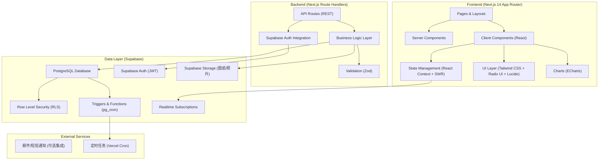
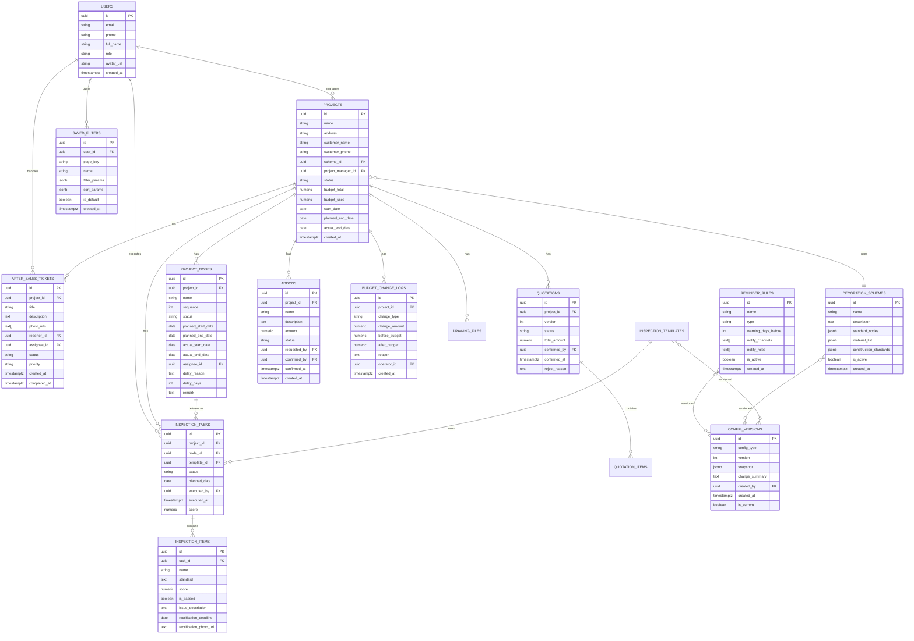

## 1. 架构设计



## 2. 技术描述

- **Frontend**：Next.js 14 (App Router) + React 18 + TypeScript + Tailwind CSS 3
- **UI 组件库**：Radix UI（基础组件）+ Lucide React（图标）+ ECharts（图表）
- **状态管理**：SWR（数据请求缓存）+ React Context（全局状态如筛选条件、用户信息）
- **数据校验**：Zod（前后端统一 Schema）
- **Backend**：Next.js Route Handlers（内置 API），无独立后端服务
- **Database**：PostgreSQL (Supabase 托管)，使用 RLS 做行级权限控制
- **Auth**：Supabase Auth（邮箱/手机号登录，JWT 鉴权）
- **Storage**：Supabase Storage（设计图纸、施工照片存储）
- **定时任务**：Vercel Cron / Supabase pg_cron（延期检查、巡检任务生成）
- **实时通知**：Supabase Realtime（延期预警、状态变更实时推送）
- **部署**：Vercel

## 3. 路由定义

| Route | 用途 | 权限 |
|-------|------|------|
| `/login` | 登录页 | 公开 |
| `/` | 进度看板首页（项目总览） | 管理员/项目经理 |
| `/projects/[id]` | 项目详情（节点/图纸/巡检） | 管理员/项目经理 |
| `/projects/[id]/quotation` | 报价确认页 | 客户/项目经理 |
| `/projects/[id]/addons` | 增项管理 | 客户/项目经理 |
| `/delays` | 延期节点维护 | 管理员/项目经理 |
| `/rules` | 提醒规则配置 | 管理员 |
| `/rules/versions` | 规则版本管理与回退 | 管理员 |
| `/schemes` | 装修方案库 | 管理员 |
| `/inspections` | 巡检任务中心 | 管理员/项目经理 |
| `/after-sales` | 售后报修工单 | 全部角色 |
| `/reports/monthly` | 月度复盘报表 | 管理员/项目经理 |
| `/settings` | 个人配置（筛选固化） | 全部登录用户 |
| `/portal/[projectId]` | 客户前台入口 | 客户 |

## 4. API 定义

### 4.1 项目模块

```typescript
// 类型定义
interface Project {
  id: string;
  name: string;
  address: string;
  customer_name: string;
  customer_phone: string;
  scheme_id: string | null;
  project_manager_id: string;
  status: 'pending' | 'in_progress' | 'completed' | 'suspended';
  budget_total: number;
  budget_used: number;
  start_date: string;
  planned_end_date: string;
  actual_end_date: string | null;
  created_at: string;
}

interface ProjectNode {
  id: string;
  project_id: string;
  name: string;
  sequence: number;
  status: 'not_started' | 'in_progress' | 'completed' | 'delayed';
  planned_start_date: string;
  planned_end_date: string;
  actual_start_date: string | null;
  actual_end_date: string | null;
  assignee_id: string | null;
  delay_reason: string | null;
  delay_days: number;
  remark: string | null;
}

// GET    /api/projects            项目列表（支持筛选、分页）
// GET    /api/projects/[id]       项目详情
// POST   /api/projects            创建项目
// PATCH  /api/projects/[id]       更新项目
// GET    /api/projects/[id]/nodes 节点列表
// PATCH  /api/nodes/[id]          更新节点状态/延期处理
```

### 4.2 报价与增项模块

```typescript
interface Quotation {
  id: string;
  project_id: string;
  version: number;
  status: 'draft' | 'pending_confirm' | 'confirmed' | 'rejected';
  total_amount: number;
  confirmed_by: string | null;
  confirmed_at: string | null;
  reject_reason: string | null;
  items: QuotationItem[];
}

interface QuotationItem {
  id: string;
  quotation_id: string;
  category: string;
  name: string;
  unit: string;
  quantity: number;
  unit_price: number;
  subtotal: number;
  remark: string | null;
}

interface Addon {
  id: string;
  project_id: string;
  name: string;
  description: string;
  amount: number;
  status: 'pending' | 'confirmed' | 'rejected';
  requested_by: string;
  confirmed_by: string | null;
  confirmed_at: string | null;
  created_at: string;
}

interface BudgetChangeLog {
  id: string;
  project_id: string;
  change_type: 'quotation' | 'addon' | 'adjustment';
  change_amount: number;
  before_budget: number;
  after_budget: number;
  reason: string;
  operator_id: string;
  created_at: string;
}

// POST   /api/projects/[id]/quotation/confirm    客户确认报价
// POST   /api/projects/[id]/quotation/reject     客户驳回报价
// POST   /api/projects/[id]/addons               发起增项
// POST   /api/addons/[id]/confirm                客户确认增项
// GET    /api/projects/[id]/budget-changes        预算变更历史
```

### 4.3 配置与规则模块

```typescript
interface ReminderRule {
  id: string;
  name: string;
  type: 'node_delay' | 'inspection_due' | 'warranty_expire';
  warning_days_before: number;
  notify_channels: ('email' | 'sms' | 'in_app')[];
  notify_roles: ('admin' | 'project_manager' | 'customer')[];
  is_active: boolean;
}

interface ConfigVersion {
  id: string;
  config_type: 'reminder_rules' | 'inspection_template' | 'scheme';
  version: number;
  snapshot: JSON;
  change_summary: string;
  created_by: string;
  created_at: string;
  is_current: boolean;
}

interface SavedFilter {
  id: string;
  user_id: string;
  page_key: string; // e.g. 'project_list', 'delay_list'
  name: string;
  filter_params: JSON;
  sort_params: JSON | null;
  is_default: boolean;
  created_at: string;
}

// GET    /api/rules                 规则列表
// POST   /api/rules                 创建/更新规则（自动生成版本）
// GET    /api/rules/versions        版本历史
// POST   /api/rules/versions/[id]/rollback  回退到指定版本
// GET    /api/saved-filters         获取用户保存的筛选
// POST   /api/saved-filters         保存筛选条件
// DELETE /api/saved-filters/[id]    删除筛选
```

### 4.4 巡检与售后模块

```typescript
interface InspectionTask {
  id: string;
  project_id: string;
  node_id: string | null;
  template_id: string;
  status: 'pending' | 'in_progress' | 'completed' | 'rectifying';
  planned_date: string;
  executed_by: string;
  executed_at: string | null;
  score: number | null;
  items: InspectionItem[];
}

interface InspectionItem {
  id: string;
  task_id: string;
  name: string;
  standard: string;
  score: number | null;
  is_passed: boolean | null;
  issue_description: string | null;
  rectification_deadline: string | null;
  rectification_photo_url: string | null;
}

interface AfterSalesTicket {
  id: string;
  project_id: string;
  title: string;
  description: string;
  photo_urls: string[];
  reporter_id: string;
  assignee_id: string | null;
  status: 'pending' | 'processing' | 'completed' | 'closed';
  priority: 'low' | 'medium' | 'high';
  created_at: string;
  completed_at: string | null;
}

// GET    /api/inspections           巡检任务列表
// POST   /api/inspections/[id]/submit  提交巡检结果
// POST   /api/inspections/[id]/rectify  提交整改凭证
// GET    /api/after-sales           售后工单列表
// POST   /api/after-sales           创建报修工单
// PATCH  /api/after-sales/[id]      更新工单状态/分配
```

## 5. 数据模型

### 5.1 ER 图



### 5.2 DDL 语句

```sql
-- 启用 UUID 扩展
CREATE EXTENSION IF NOT EXISTS "uuid-ossp";
CREATE EXTENSION IF NOT EXISTS "pg_cron";

-- 用户表（使用 Supabase Auth 的 users，这里是扩展 profile）
CREATE TABLE profiles (
    id UUID PRIMARY KEY REFERENCES auth.users(id) ON DELETE CASCADE,
    full_name TEXT,
    phone TEXT,
    role TEXT NOT NULL CHECK (role IN ('admin', 'project_manager', 'customer')),
    avatar_url TEXT,
    created_at TIMESTAMPTZ DEFAULT now()
);

-- 装修方案表
CREATE TABLE decoration_schemes (
    id UUID PRIMARY KEY DEFAULT uuid_generate_v4(),
    name TEXT NOT NULL,
    description TEXT,
    standard_nodes JSONB NOT NULL DEFAULT '[]',
    material_list JSONB NOT NULL DEFAULT '[]',
    construction_standards JSONB NOT NULL DEFAULT '{}',
    is_active BOOLEAN DEFAULT true,
    created_at TIMESTAMPTZ DEFAULT now()
);

-- 项目表
CREATE TABLE projects (
    id UUID PRIMARY KEY DEFAULT uuid_generate_v4(),
    name TEXT NOT NULL,
    address TEXT,
    customer_name TEXT,
    customer_phone TEXT,
    scheme_id UUID REFERENCES decoration_schemes(id),
    project_manager_id UUID REFERENCES profiles(id),
    status TEXT NOT NULL DEFAULT 'pending' CHECK (status IN ('pending', 'in_progress', 'completed', 'suspended')),
    budget_total NUMERIC(12, 2) DEFAULT 0,
    budget_used NUMERIC(12, 2) DEFAULT 0,
    start_date DATE,
    planned_end_date DATE,
    actual_end_date DATE,
    created_at TIMESTAMPTZ DEFAULT now()
);

-- 项目节点表
CREATE TABLE project_nodes (
    id UUID PRIMARY KEY DEFAULT uuid_generate_v4(),
    project_id UUID NOT NULL REFERENCES projects(id) ON DELETE CASCADE,
    name TEXT NOT NULL,
    sequence INTEGER NOT NULL,
    status TEXT NOT NULL DEFAULT 'not_started' CHECK (status IN ('not_started', 'in_progress', 'completed', 'delayed')),
    planned_start_date DATE,
    planned_end_date DATE,
    actual_start_date DATE,
    actual_end_date DATE,
    assignee_id UUID REFERENCES profiles(id),
    delay_reason TEXT,
    delay_days INTEGER DEFAULT 0,
    remark TEXT,
    created_at TIMESTAMPTZ DEFAULT now()
);
CREATE INDEX idx_project_nodes_project ON project_nodes(project_id);

-- 报价单表
CREATE TABLE quotations (
    id UUID PRIMARY KEY DEFAULT uuid_generate_v4(),
    project_id UUID NOT NULL REFERENCES projects(id) ON DELETE CASCADE,
    version INTEGER NOT NULL DEFAULT 1,
    status TEXT NOT NULL DEFAULT 'draft' CHECK (status IN ('draft', 'pending_confirm', 'confirmed', 'rejected')),
    total_amount NUMERIC(12, 2) DEFAULT 0,
    confirmed_by UUID REFERENCES profiles(id),
    confirmed_at TIMESTAMPTZ,
    reject_reason TEXT,
    created_at TIMESTAMPTZ DEFAULT now()
);

-- 报价明细
CREATE TABLE quotation_items (
    id UUID PRIMARY KEY DEFAULT uuid_generate_v4(),
    quotation_id UUID NOT NULL REFERENCES quotations(id) ON DELETE CASCADE,
    category TEXT,
    name TEXT NOT NULL,
    unit TEXT,
    quantity NUMERIC(10, 2) DEFAULT 0,
    unit_price NUMERIC(12, 2) DEFAULT 0,
    subtotal NUMERIC(12, 2) DEFAULT 0,
    remark TEXT
);

-- 增项表
CREATE TABLE addons (
    id UUID PRIMARY KEY DEFAULT uuid_generate_v4(),
    project_id UUID NOT NULL REFERENCES projects(id) ON DELETE CASCADE,
    name TEXT NOT NULL,
    description TEXT,
    amount NUMERIC(12, 2) NOT NULL,
    status TEXT NOT NULL DEFAULT 'pending' CHECK (status IN ('pending', 'confirmed', 'rejected')),
    requested_by UUID NOT NULL REFERENCES profiles(id),
    confirmed_by UUID REFERENCES profiles(id),
    confirmed_at TIMESTAMPTZ,
    created_at TIMESTAMPTZ DEFAULT now()
);

-- 预算变更日志
CREATE TABLE budget_change_logs (
    id UUID PRIMARY KEY DEFAULT uuid_generate_v4(),
    project_id UUID NOT NULL REFERENCES projects(id) ON DELETE CASCADE,
    change_type TEXT NOT NULL CHECK (change_type IN ('quotation', 'addon', 'adjustment')),
    change_amount NUMERIC(12, 2) NOT NULL,
    before_budget NUMERIC(12, 2) NOT NULL,
    after_budget NUMERIC(12, 2) NOT NULL,
    reason TEXT NOT NULL,
    operator_id UUID NOT NULL REFERENCES profiles(id),
    created_at TIMESTAMPTZ DEFAULT now()
);
CREATE INDEX idx_budget_logs_project ON budget_change_logs(project_id);

-- 巡检模板
CREATE TABLE inspection_templates (
    id UUID PRIMARY KEY DEFAULT uuid_generate_v4(),
    name TEXT NOT NULL,
    items JSONB NOT NULL DEFAULT '[]',
    is_active BOOLEAN DEFAULT true,
    created_at TIMESTAMPTZ DEFAULT now()
);

-- 巡检任务
CREATE TABLE inspection_tasks (
    id UUID PRIMARY KEY DEFAULT uuid_generate_v4(),
    project_id UUID NOT NULL REFERENCES projects(id) ON DELETE CASCADE,
    node_id UUID REFERENCES project_nodes(id),
    template_id UUID REFERENCES inspection_templates(id),
    status TEXT NOT NULL DEFAULT 'pending' CHECK (status IN ('pending', 'in_progress', 'completed', 'rectifying')),
    planned_date DATE,
    executed_by UUID REFERENCES profiles(id),
    executed_at TIMESTAMPTZ,
    score NUMERIC(5, 2),
    created_at TIMESTAMPTZ DEFAULT now()
);

-- 巡检项记录
CREATE TABLE inspection_items (
    id UUID PRIMARY KEY DEFAULT uuid_generate_v4(),
    task_id UUID NOT NULL REFERENCES inspection_tasks(id) ON DELETE CASCADE,
    name TEXT NOT NULL,
    standard TEXT,
    score NUMERIC(5, 2),
    is_passed BOOLEAN,
    issue_description TEXT,
    rectification_deadline DATE,
    rectification_photo_url TEXT
);

-- 售后工单
CREATE TABLE after_sales_tickets (
    id UUID PRIMARY KEY DEFAULT uuid_generate_v4(),
    project_id UUID NOT NULL REFERENCES projects(id) ON DELETE CASCADE,
    title TEXT NOT NULL,
    description TEXT,
    photo_urls TEXT[] DEFAULT '{}',
    reporter_id UUID NOT NULL REFERENCES profiles(id),
    assignee_id UUID REFERENCES profiles(id),
    status TEXT NOT NULL DEFAULT 'pending' CHECK (status IN ('pending', 'processing', 'completed', 'closed')),
    priority TEXT NOT NULL DEFAULT 'medium' CHECK (priority IN ('low', 'medium', 'high')),
    created_at TIMESTAMPTZ DEFAULT now(),
    completed_at TIMESTAMPTZ
);
CREATE INDEX idx_tickets_status ON after_sales_tickets(status);

-- 配置版本表（用于规则/方案/模板的版本管理与回退）
CREATE TABLE config_versions (
    id UUID PRIMARY KEY DEFAULT uuid_generate_v4(),
    config_type TEXT NOT NULL CHECK (config_type IN ('reminder_rules', 'inspection_template', 'scheme')),
    version INTEGER NOT NULL,
    snapshot JSONB NOT NULL,
    change_summary TEXT,
    created_by UUID NOT NULL REFERENCES profiles(id),
    created_at TIMESTAMPTZ DEFAULT now(),
    is_current BOOLEAN DEFAULT false,
    UNIQUE(config_type, version)
);

-- 提醒规则表
CREATE TABLE reminder_rules (
    id UUID PRIMARY KEY DEFAULT uuid_generate_v4(),
    name TEXT NOT NULL,
    type TEXT NOT NULL CHECK (type IN ('node_delay', 'inspection_due', 'warranty_expire')),
    warning_days_before INTEGER NOT NULL DEFAULT 3,
    notify_channels TEXT[] NOT NULL DEFAULT '{"in_app"}',
    notify_roles TEXT[] NOT NULL DEFAULT '{"project_manager"}',
    is_active BOOLEAN DEFAULT true,
    created_at TIMESTAMPTZ DEFAULT now()
);

-- 用户保存的筛选条件
CREATE TABLE saved_filters (
    id UUID PRIMARY KEY DEFAULT uuid_generate_v4(),
    user_id UUID NOT NULL REFERENCES profiles(id) ON DELETE CASCADE,
    page_key TEXT NOT NULL,
    name TEXT NOT NULL,
    filter_params JSONB NOT NULL DEFAULT '{}',
    sort_params JSONB,
    is_default BOOLEAN DEFAULT false,
    created_at TIMESTAMPTZ DEFAULT now()
);
CREATE UNIQUE INDEX idx_saved_filters_user_page_default ON saved_filters(user_id, page_key) WHERE is_default = true;

-- 图纸文件表
CREATE TABLE drawing_files (
    id UUID PRIMARY KEY DEFAULT uuid_generate_v4(),
    project_id UUID NOT NULL REFERENCES projects(id) ON DELETE CASCADE,
    version INTEGER NOT NULL DEFAULT 1,
    file_name TEXT NOT NULL,
    file_url TEXT NOT NULL,
    file_size BIGINT,
    uploaded_by UUID NOT NULL REFERENCES profiles(id),
    remark TEXT,
    created_at TIMESTAMPTZ DEFAULT now()
);

-- ================= RLS 行级安全策略 =================
ALTER TABLE profiles ENABLE ROW LEVEL SECURITY;
ALTER TABLE projects ENABLE ROW LEVEL SECURITY;
ALTER TABLE project_nodes ENABLE ROW LEVEL SECURITY;
ALTER TABLE quotations ENABLE ROW LEVEL SECURITY;
ALTER TABLE addons ENABLE ROW LEVEL SECURITY;
ALTER TABLE budget_change_logs ENABLE ROW LEVEL SECURITY;
ALTER TABLE inspection_tasks ENABLE ROW LEVEL SECURITY;
ALTER TABLE inspection_items ENABLE ROW LEVEL SECURITY;
ALTER TABLE after_sales_tickets ENABLE ROW LEVEL SECURITY;
ALTER TABLE saved_filters ENABLE ROW LEVEL SECURITY;
ALTER TABLE drawing_files ENABLE ROW LEVEL SECURITY;

-- 管理员查看所有
CREATE POLICY "Admin full access" ON projects FOR ALL USING (
    EXISTS (SELECT 1 FROM profiles WHERE id = auth.uid() AND role = 'admin')
);

-- 项目经理看自己的项目
CREATE POLICY "Project manager own projects" ON projects FOR ALL USING (
    EXISTS (SELECT 1 FROM profiles WHERE id = auth.uid() AND role = 'project_manager')
    AND project_manager_id = auth.uid()
);

-- 客户看自己关联的项目（通过手机号匹配）
CREATE POLICY "Customer view own projects" ON projects FOR SELECT USING (
    EXISTS (SELECT 1 FROM profiles WHERE id = auth.uid() AND role = 'customer')
    AND customer_phone IN (SELECT phone FROM profiles WHERE id = auth.uid())
);
```
