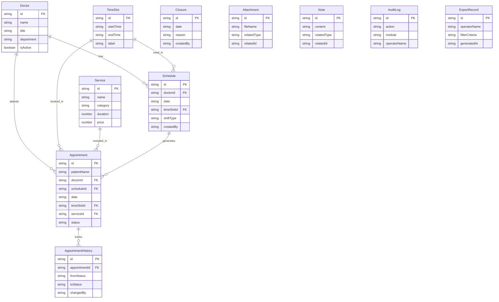

## 1. 架构设计

```mermaid
graph TB
    subgraph "前端层"
        "React + Vite + Tailwind"
    end
    subgraph "后端层"
        "Express + TypeScript"
    end
    subgraph "缓存层"
        "Redis"
    end
    subgraph "数据层"
        "MongoDB"
    end
    "React + Vite + Tailwind" --> "Express + TypeScript"
    "Express + TypeScript" --> "Redis"
    "Express + TypeScript" --> "MongoDB"
    "Redis" -.-> "缓存会话/排班热数据"
```

## 2. 技术说明

- 前端：React@18 + TailwindCSS@3 + Vite + Zustand（状态管理）
- 初始化工具：vite-init（react-express-ts 模板）
- 后端：Express@4 + TypeScript（ESM）
- 数据库：MongoDB（Mongoose ODM）
- 缓存：Redis（ioredis），缓存排班热数据、会话信息
- 图表：Recharts，用于复盘页统计可视化

## 3. 路由定义

| 路由 | 用途 |
|------|------|
| / | 首页仪表盘，概览排班与预约统计 |
| /scheduling | 排班管理页，医生选择与时段配置 |
| /appointments | 预约管理页，预约列表与转化追踪 |
| /review | 业务复盘页，排班回顾与爽约分析 |
| /export | 数据导出页，筛选与批量下载 |
| /audit-log | 操作留痕页，审计日志查看 |

## 4. API 定义

### 4.1 排班管理

| 方法 | 路径 | 说明 |
|------|------|------|
| GET | /api/doctors | 获取医生/技师列表 |
| GET | /api/schedules | 获取排班列表（支持日期、医生筛选） |
| POST | /api/schedules | 创建排班 |
| PUT | /api/schedules/:id | 更新排班 |
| DELETE | /api/schedules/:id | 删除排班 |
| POST | /api/schedules/batch | 批量排班 |
| GET | /api/time-slots | 获取时段配置 |
| POST | /api/closures | 创建临时关店 |
| GET | /api/closures | 获取临时关店列表 |

### 4.2 预约管理

| 方法 | 路径 | 说明 |
|------|------|------|
| GET | /api/appointments | 获取预约列表（支持日期、医生、状态筛选） |
| POST | /api/appointments | 创建预约 |
| PUT | /api/appointments/:id | 更新预约状态 |
| PUT | /api/appointments/:id/no-show | 标记爽约 |
| GET | /api/appointments/:id/history | 获取预约状态变更历史 |
| GET | /api/services | 获取服务项目列表 |

### 4.3 业务复盘

| 方法 | 路径 | 说明 |
|------|------|------|
| GET | /api/review/schedule | 排班回顾数据 |
| GET | /api/review/no-show | 爽约分析数据 |
| GET | /api/review/services | 服务项目汇总 |
| GET | /api/review/stats | 到店率等统计数据 |

### 4.4 数据导出

| 方法 | 路径 | 说明 |
|------|------|------|
| POST | /api/exports | 创建导出任务 |
| GET | /api/exports | 获取导出记录列表 |
| GET | /api/exports/:id/download | 下载导出文件 |

### 4.5 操作留痕

| 方法 | 路径 | 说明 |
|------|------|------|
| GET | /api/audit-logs | 获取审计日志（支持操作类型、时间筛选） |

### 4.6 附件备注

| 方法 | 路径 | 说明 |
|------|------|------|
| POST | /api/attachments | 上传附件 |
| GET | /api/attachments/:id | 获取附件 |
| DELETE | /api/attachments/:id | 删除附件 |
| POST | /api/notes | 添加备注 |
| PUT | /api/notes/:id | 更新备注 |
| DELETE | /api/notes/:id | 删除备注 |

### 4.7 TypeScript 类型定义

```typescript
interface Doctor {
  id: string;
  name: string;
  title: string;
  department: string;
  avatar?: string;
  isActive: boolean;
}

interface TimeSlot {
  id: string;
  startTime: string;
  endTime: string;
  label: string;
}

interface Schedule {
  id: string;
  doctorId: string;
  date: string;
  timeSlotId: string;
  shiftType: "morning" | "afternoon" | "full_day";
  createdBy: string;
  createdAt: string;
  updatedAt: string;
  attachments: string[];
  notes: Note[];
}

interface Appointment {
  id: string;
  patientName: string;
  patientPhone: string;
  doctorId: string;
  scheduleId: string;
  date: string;
  timeSlotId: string;
  serviceId: string;
  status: "pending" | "confirmed" | "arrived" | "completed" | "no_show" | "cancelled";
  noShowReason?: string;
  createdBy: string;
  createdAt: string;
  updatedAt: string;
  history: AppointmentHistory[];
  attachments: string[];
  notes: Note[];
}

interface AppointmentHistory {
  id: string;
  appointmentId: string;
  fromStatus: string;
  toStatus: string;
  changedBy: string;
  changedAt: string;
  remark?: string;
}

interface Service {
  id: string;
  name: string;
  category: string;
  duration: number;
  price: number;
}

interface Closure {
  id: string;
  date: string;
  startTime?: string;
  endTime?: string;
  reason: string;
  createdBy: string;
  createdAt: string;
  attachments: string[];
}

interface Note {
  id: string;
  content: string;
  createdBy: string;
  createdAt: string;
  updatedAt: string;
}

interface Attachment {
  id: string;
  fileName: string;
  fileType: string;
  fileSize: number;
  url: string;
  relatedType: "schedule" | "appointment" | "closure";
  relatedId: string;
  uploadedBy: string;
  uploadedAt: string;
}

interface AuditLog {
  id: string;
  action: string;
  module: string;
  operatorId: string;
  operatorName: string;
  targetId: string;
  targetType: string;
  detail: string;
  ipAddress: string;
  createdAt: string;
}

interface ExportRecord {
  id: string;
  operatorId: string;
  operatorName: string;
  filterCriteria: Record<string, unknown>;
  arrivalRate: number;
  closureCount: number;
  lastChangeAt: string;
  fileUrl: string;
  generatedAt: string;
}
```

## 5. 服务端架构图

```mermaid
graph LR
    "Controller" --> "Service"
    "Service" --> "Repository"
    "Repository" --> "MongoDB"
    "Service" --> "Redis Cache"
    "Middleware" --> "Controller"
    "Middleware" --> "AuditLogger"
    "AuditLogger" --> "MongoDB"
```

## 6. 数据模型

### 6.1 数据模型定义



### 6.2 MongoDB 集合与索引

```javascript
// doctors 集合
db.doctors.createIndex({ isActive: 1 })
db.doctors.createIndex({ department: 1 })

// schedules 集合
db.schedules.createIndex({ doctorId: 1, date: 1 })
db.schedules.createIndex({ date: 1, timeSlotId: 1 })

// appointments 集合
db.appointments.createIndex({ doctorId: 1, date: 1 })
db.appointments.createIndex({ status: 1 })
db.appointments.createIndex({ date: 1, timeSlotId: 1 })
db.appointments.createIndex({ scheduleId: 1 })

// closures 集合
db.closures.createIndex({ date: 1 })

// appointment_histories 集合
db.appointment_histories.createIndex({ appointmentId: 1, changedAt: -1 })

// attachments 集合
db.attachments.createIndex({ relatedType: 1, relatedId: 1 })

// notes 集合
db.notes.createIndex({ relatedType: 1, relatedId: 1 })

// audit_logs 集合
db.audit_logs.createIndex({ module: 1, createdAt: -1 })
db.audit_logs.createIndex({ operatorId: 1, createdAt: -1 })

// export_records 集合
db.export_records.createIndex({ operatorId: 1, generatedAt: -1 })

// services 集合
db.services.createIndex({ category: 1 })
```

### 6.3 Redis 缓存策略

- 排班热数据：`schedule:{date}:{doctorId}` TTL 5分钟
- 时段配置：`time_slots` TTL 1小时
- 会话信息：`session:{token}` TTL 24小时
