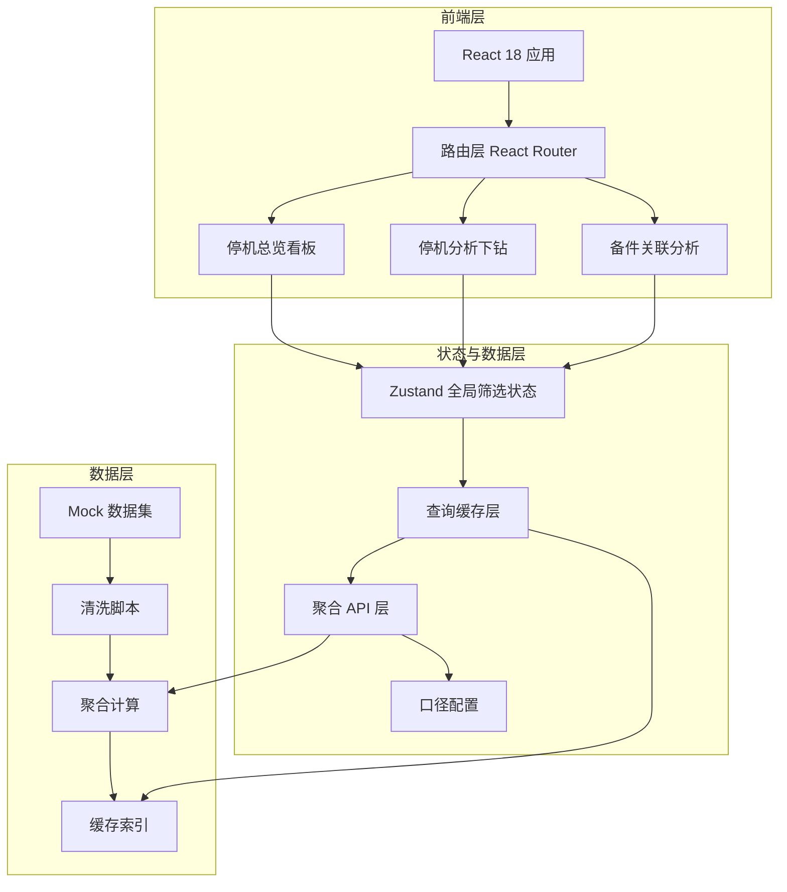
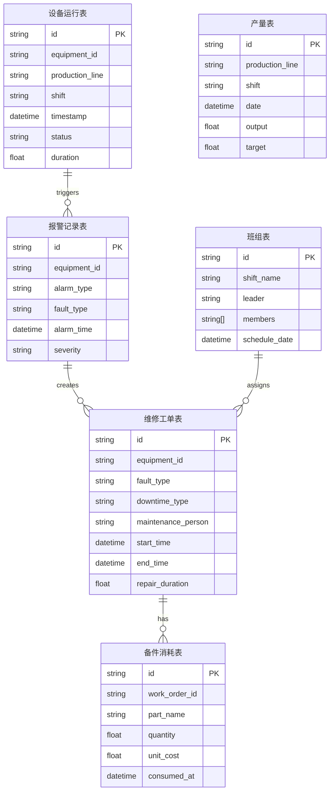

## 1. 架构设计



## 2. 技术说明

- 前端：React@18 + TypeScript + TailwindCSS@3 + Vite
- 图表库：ECharts@5（支持大数据量渲染和丰富的图表类型）
- 状态管理：Zustand（轻量级，筛选状态全局共享）
- 路由：React Router@6
- 初始化工具：Vite
- 后端：无独立后端，全部使用 Mock 数据 + 前端聚合
- 数据：内置 Mock 数据集模拟六大业务表数据

## 3. 路由定义

| 路由 | 用途 |
|------|------|
| `/` | 重定向到总览看板 |
| `/dashboard` | 停机总览看板，KPI + Pareto + 产线对比 + 趋势 |
| `/analysis` | 停机分析下钻，维修时长 + 故障下钻 + 维修人 + 注释 |
| `/spare-parts` | 备件关联分析，消耗排行 + 热力图 + 趋势 + 明细表 |

## 4. API 定义（前端聚合层）

### 4.1 数据口径配置

```typescript
interface MetricConfig {
  key: string
  label: string
  unit: string
  plannedOnly: boolean
  unplannedOnly: boolean
  aggregation: 'sum' | 'avg' | 'count' | 'max' | 'min'
  decimalPlaces: number
}

interface FilterState {
  equipmentIds: string[]
  productionLines: string[]
  shifts: string[]
  faultTypes: string[]
  maintenancePeople: string[]
  dateRange: [string, string]
  downtimeType: 'all' | 'planned' | 'unplanned'
}
```

### 4.2 聚合 API

```typescript
interface DowntimeRecord {
  id: string
  equipmentId: string
  equipmentName: string
  productionLine: string
  shift: string
  faultType: string
  downtimeType: 'planned' | 'unplanned'
  startTime: string
  endTime: string
  duration: number
  maintenancePerson: string
  maintenanceDuration: number
  spareParts: SparePartUsage[]
}

interface SparePartUsage {
  partId: string
  partName: string
  quantity: number
  unitCost: number
}

interface KPIMetrics {
  totalDowntime: number
  downtimeCount: number
  avgRepairDuration: number
  plannedRatio: number
  mtbf: number
  mttr: number
}

interface ParetoItem {
  faultType: string
  duration: number
  count: number
  cumulativePercent: number
  plannedDuration: number
  unplannedDuration: number
}

interface ProductionLineComparison {
  line: string
  plannedDuration: number
  unplannedDuration: number
  plannedCount: number
  unplannedCount: number
}

interface TrendPoint {
  date: string
  plannedDuration: number
  unplannedDuration: number
  annotations: Annotation[]
}

interface Annotation {
  id: string
  date: string
  content: string
  author: string
  createdAt: string
  tags: string[]
}

interface SparePartRanking {
  partName: string
  totalQuantity: number
  totalCost: number
  associatedDowntimeCount: number
}

interface SparePartFaultMatrix {
  partNames: string[]
  faultTypes: string[]
  values: number[][]
}

interface MaintenancePersonStats {
  person: string
  orderCount: number
  avgDuration: number
  avgResponseTime: number
  plannedCount: number
  unplannedCount: number
}
```

### 4.3 查询缓存

```typescript
interface CacheEntry<T> {
  data: T
  timestamp: number
  filterHash: string
  ttl: number
}

interface CacheManager {
  get<T>(key: string): CacheEntry<T> | null
  set<T>(key: string, data: T, ttl?: number): void
  invalidate(pattern?: string): void
  getLastUpdateTime(): string
}
```

## 5. 数据模型

### 5.1 数据模型定义



### 5.2 数据定义（Mock 数据结构）

```sql
CREATE TABLE equipment_runtime (
  id TEXT PRIMARY KEY,
  equipment_id TEXT NOT NULL,
  production_line TEXT NOT NULL,
  shift TEXT NOT NULL,
  timestamp DATETIME NOT NULL,
  status TEXT CHECK(status IN ('running','stopped','maintenance')),
  duration REAL NOT NULL
);

CREATE TABLE alarm_records (
  id TEXT PRIMARY KEY,
  equipment_id TEXT NOT NULL,
  alarm_type TEXT NOT NULL,
  fault_type TEXT NOT NULL,
  alarm_time DATETIME NOT NULL,
  severity TEXT CHECK(severity IN ('low','medium','high','critical'))
);

CREATE TABLE maintenance_orders (
  id TEXT PRIMARY KEY,
  equipment_id TEXT NOT NULL,
  fault_type TEXT NOT NULL,
  downtime_type TEXT CHECK(downtime_type IN ('planned','unplanned')),
  maintenance_person TEXT NOT NULL,
  start_time DATETIME NOT NULL,
  end_time DATETIME NOT NULL,
  repair_duration REAL NOT NULL
);

CREATE TABLE shift_groups (
  id TEXT PRIMARY KEY,
  shift_name TEXT NOT NULL,
  leader TEXT NOT NULL,
  schedule_date DATE NOT NULL
);

CREATE TABLE production_output (
  id TEXT PRIMARY KEY,
  production_line TEXT NOT NULL,
  shift TEXT NOT NULL,
  date DATE NOT NULL,
  output REAL NOT NULL,
  target REAL NOT NULL
);

CREATE TABLE spare_part_consumption (
  id TEXT PRIMARY KEY,
  work_order_id TEXT NOT NULL REFERENCES maintenance_orders(id),
  part_name TEXT NOT NULL,
  quantity REAL NOT NULL,
  unit_cost REAL NOT NULL,
  consumed_at DATETIME NOT NULL
);

CREATE TABLE annotations (
  id TEXT PRIMARY KEY,
  date TEXT NOT NULL,
  content TEXT NOT NULL,
  author TEXT NOT NULL,
  created_at DATETIME NOT NULL,
  tags TEXT NOT NULL
);
```
