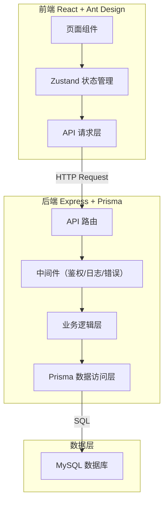
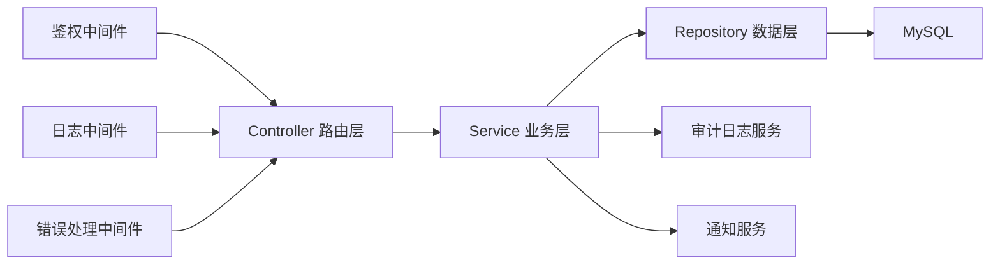
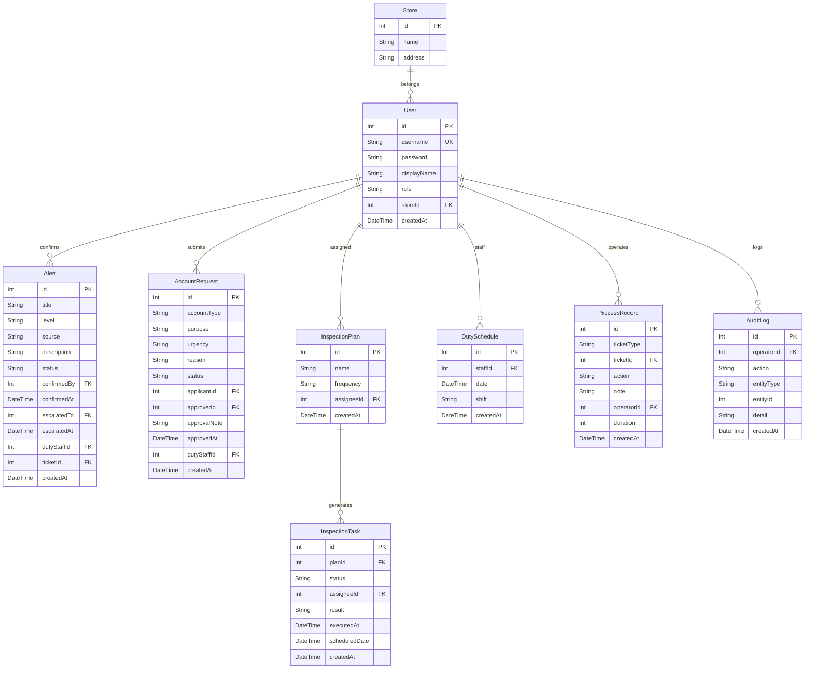

## 1. 架构设计



## 2. 技术说明

- 前端：React@18 + Ant Design@5 + Vite + TypeScript
- 初始化工具：vite-init（react-express-ts 模板）
- 后端：Express@4 + TypeScript（ESM 格式）
- 数据库：MySQL + Prisma ORM
- 状态管理：Zustand
- 认证：JWT Token
- 图表：@ant-design/charts

## 3. 路由定义

| 路由 | 用途 | 权限 |
|------|------|------|
| /login | 登录页面 | 公开 |
| / | 总览仪表盘 | 已登录 |
| /alerts | 告警确认列表 | 已登录 |
| /alerts/:id | 告警详情 | 已登录 |
| /account-requests | 账号申请列表 | 已登录 |
| /account-requests/new | 新建账号申请 | 已登录 |
| /account-requests/:id | 申请详情 | 已登录 |
| /inspections | 设备巡检 | 已登录 |
| /inspections/:id | 巡检任务详情 | 已登录 |
| /duty | 值班管理 | 管理员 |
| /records | 处理记录 | 已登录 |
| /reports | 时效报表 | 管理员 |
| /audit-logs | 审计日志 | 管理员 |

## 4. API 定义

### 4.1 认证

```typescript
POST /api/auth/login
  Request:  { username: string; password: string }
  Response: { token: string; user: { id, username, role, storeId } }

GET /api/auth/me
  Response: { id, username, role, storeId, displayName }
```

### 4.2 告警

```typescript
GET /api/alerts?page=1&pageSize=20&level=&status=
  Response: { list: Alert[]; total: number }

GET /api/alerts/:id
  Response: Alert & { timeline: AlertEvent[] }

POST /api/alerts/:id/confirm
  Request:  { dutyStaffId: number; note?: string }
  Response: Alert

POST /api/alerts/:id/escalate
  Request:  { targetAdminId: number; reason: string }
  Response: Alert

POST /api/alerts
  Request:  { title: string; level: "critical"|"warning"|"info"; source: string; description?: string }
  Response: Alert
```

### 4.3 账号申请

```typescript
GET /api/account-requests?page=1&pageSize=20&status=&applicantId=
  Response: { list: AccountRequest[]; total: number }

POST /api/account-requests
  Request:  { accountType: string; purpose: string; urgency: "high"|"medium"|"low"; reason?: string }
  Response: AccountRequest

PUT /api/account-requests/:id/approve
  Request:  { note?: string }
  Response: AccountRequest

PUT /api/account-requests/:id/reject
  Request:  { reason: string }
  Response: AccountRequest
```

### 4.4 设备巡检

```typescript
GET /api/inspection-plans?page=1&pageSize=20
  Response: { list: InspectionPlan[]; total: number }

POST /api/inspection-plans
  Request:  { name: string; deviceIds: number[]; frequency: "daily"|"weekly"|"monthly"; assigneeId: number }
  Response: InspectionPlan

PUT /api/inspection-plans/:id
  Request:  Partial<InspectionPlan>
  Response: InspectionPlan

GET /api/inspection-tasks?planId=&status=&assigneeId=&page=1&pageSize=20
  Response: { list: InspectionTask[]; total: number }

PUT /api/inspection-tasks/:id/execute
  Request:  { result: "normal"|"abnormal"; items: { itemId: number; status: "pass"|"fail"; note?: string }[] }
  Response: InspectionTask
```

### 4.5 值班管理

```typescript
GET /api/duty-schedules?month=&staffId=
  Response: DutySchedule[]

POST /api/duty-schedules
  Request:  { staffId: number; date: string; shift: "morning"|"afternoon"|"night" }
  Response: DutySchedule

PUT /api/duty-schedules/:id
  Request:  Partial<DutySchedule>
  Response: DutySchedule

DELETE /api/duty-schedules/:id
  Response: { success: boolean }
```

### 4.6 处理记录

```typescript
GET /api/records?ticketId=&type=&page=1&pageSize=20
  Response: { list: ProcessRecord[]; total: number }

GET /api/records/stats
  Response: { avgResponseTime: number; avgHandleTime: number; byType: { type: string; avgTime: number }[] }
```

### 4.7 时效报表

```typescript
GET /api/reports/sla?startDate=&endDate=
  Response: { totalTickets: number; slaMet: number; slaRate: number; byCategory: { category: string; total: number; met: number; rate: number }[] }

GET /api/reports/trend?startDate=&endDate&granularity="day"|"week"|"month"
  Response: { points: { date: string; avgResponseTime: number; avgHandleTime: number; ticketCount: number }[] }
```

### 4.8 审计日志

```typescript
GET /api/audit-logs?page=1&pageSize=20&operatorId=&action=&entityType=&startDate=&endDate=
  Response: { list: AuditLog[]; total: number }
```

### 4.9 通用错误响应

```typescript
{
  code: string;
  message: string;
  detail?: string;
}
```

- `AUTH_FAILED`：认证失败，请检查用户名和密码
- `TOKEN_EXPIRED`：登录已过期，请重新登录
- `FORBIDDEN`：您没有权限执行此操作
- `NOT_FOUND`：请求的资源不存在
- `VALIDATION_ERROR`：提交的数据格式有误（detail 字段说明具体字段）
- `DUPLICATE_ENTRY`：该记录已存在，请勿重复提交
- `INTERNAL_ERROR`：服务器内部错误，请稍后重试

## 5. 服务端架构图



## 6. 数据模型

### 6.1 数据模型定义



### 6.2 数据定义语言（Prisma Schema）

```prisma
model User {
  id          Int      @id @default(autoincrement())
  username    String   @unique
  password    String
  displayName String
  role        String   // admin | store_ops
  storeId     Int
  store       Store    @relation(fields: [storeId], references: [id])
  createdAt   DateTime @default(now())
}

model Store {
  id      Int    @id @default(autoincrement())
  name    String
  address String
  users   User[]
}

model Alert {
  id           Int       @id @default(autoincrement())
  title        String
  level        String    // critical | warning | info
  source       String
  description  String?
  status       String    @default("pending") // pending | confirmed | escalated | resolved
  confirmedBy  Int?
  confirmedAt  DateTime?
  escalatedTo  Int?
  escalatedAt  DateTime?
  dutyStaffId  Int?
  ticketId     Int?
  createdAt    DateTime  @default(now())
  confirmedByUser User?  @relation("ConfirmedAlerts", fields: [confirmedBy], references: [id])
  escalatedToUser User?  @relation("EscalatedAlerts", fields: [escalatedTo], references: [id])
  dutyStaff    User?     @relation("DutyAlerts", fields: [dutyStaffId], references: [id])
}

model AccountRequest {
  id           Int       @id @default(autoincrement())
  accountType  String
  purpose      String
  urgency      String    // high | medium | low
  reason       String?
  status       String    @default("pending") // pending | approved | rejected | completed
  applicantId  Int
  approverId   Int?
  approvalNote String?
  approvedAt   DateTime?
  dutyStaffId  Int?
  createdAt    DateTime  @default(now())
  applicant    User      @relation("SubmittedRequests", fields: [applicantId], references: [id])
  approver     User?     @relation("ApprovedRequests", fields: [approverId], references: [id])
  dutyStaff    User?     @relation("DutyRequests", fields: [dutyStaffId], references: [id])
}

model InspectionPlan {
  id         Int       @id @default(autoincrement())
  name       String
  frequency  String    // daily | weekly | monthly
  assigneeId Int
  assignee   User      @relation(fields: [assigneeId], references: [id])
  createdAt  DateTime  @default(now())
  tasks      InspectionTask[]
}

model InspectionTask {
  id            Int       @id @default(autoincrement())
  planId        Int
  status        String    @default("pending") // pending | completed | skipped
  assigneeId    Int
  result        String?   // normal | abnormal
  executedAt    DateTime?
  scheduledDate DateTime
  createdAt     DateTime  @default(now())
  plan          InspectionPlan @relation(fields: [planId], references: [id])
  assignee      User      @relation(fields: [assigneeId], references: [id])
}

model DutySchedule {
  id        Int       @id @default(autoincrement())
  staffId   Int
  date      DateTime
  shift     String    // morning | afternoon | night
  createdAt DateTime  @default(now())
  staff     User      @relation(fields: [staffId], references: [id])
}

model ProcessRecord {
  id         Int       @id @default(autoincrement())
  ticketType String    // alert | account_request | inspection
  ticketId   Int
  action     String
  note       String?
  operatorId Int
  duration   Int?      // minutes
  createdAt  DateTime  @default(now())
  operator   User      @relation(fields: [operatorId], references: [id])
}

model AuditLog {
  id         Int       @id @default(autoincrement())
  operatorId Int
  action     String
  entityType String
  entityId   Int
  detail     String?
  createdAt  DateTime  @default(now())
  operator   User      @relation(fields: [operatorId], references: [id])
}
```
