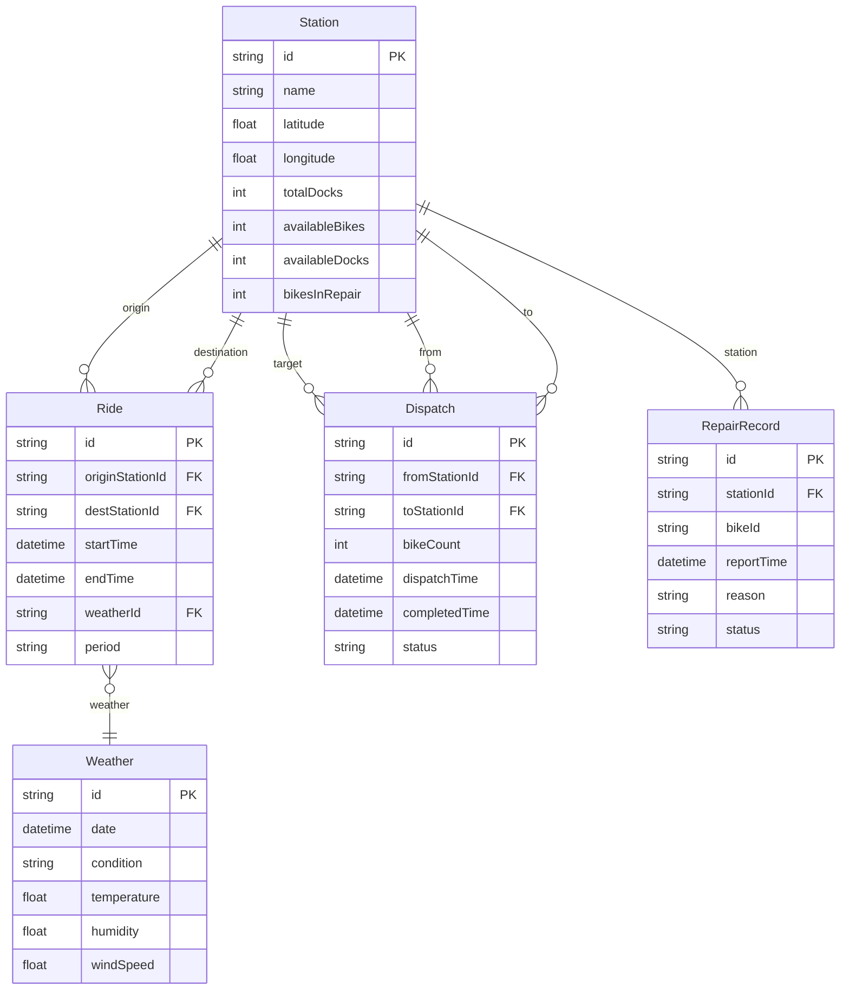

## 1. 架构设计

```mermaid
graph TB
    subgraph "前端层"
        "A[React 仪表盘应用]" --> "B[Zustand 全局状态"
        "A" --> "C[D3 图表引擎"
        "A" --> "D[Mapbox GL 地图"
        "A" --> "E[html2canvas + jsPDF 导出"
    end
    subgraph "数据管道层"
        "F[ETL 模块" --> "G[数据清洗与校验"
        "G" --> "H[维修车辆剔除"
        "H" --> "I[缓存层 (localStorage + 内存"
    end
    subgraph "数据源层"
        "J[Mock 骑行数据" --> "F"
        "K[Mock 站点数据" --> "F"
        "L[Mock 调度记录" --> "F"
        "M[Mock 天气数据" --> "F"
        "N[Mock 维修数据" --> "F"
    end
    "I" --> "B"
```

## 2. 技术说明

- **前端**：React@18 + TypeScript + TailwindCSS@3 + Vite
- **初始化工具**：vite-init（react-ts 模板）
- **后端**：无后端，纯前端应用，使用 Mock 数据
- **地图**：Mapbox GL JS（使用免费 token 或 mock tile）
- **图表**：D3.js@7
- **状态管理**：Zustand
- **路由**：react-router-dom@6
- **导出**：html2canvas + jsPDF
- **缓存**：内存缓存 + localStorage 持久化

## 3. 路由定义

| 路由 | 用途 |
|------|------|
| `/` | 重定向到仪表盘 |
| `/dashboard` | 调度分析仪表盘主页面 |
| `/report` | 周报中心页面 |

## 4. 数据模型

### 4.1 核心数据实体



### 4.2 ETL 管道定义

**Extract**：从 Mock JSON 数据源加载原始数据

**Transform**：
1. 空值处理：骑行记录缺少起终点则丢弃，站点余量缺失则标记为 -1 并在 UI 显示 "—"
2. 维修车辆剔除：`availableBikesForDispatch = availableBikes - bikesInRepair`，若结果 < 0 则置 0
3. 时间段标注：根据 startTime 自动标注 `morning_rush`（7-9）、`evening_rush`（17-19）、`normal`
4. 天气关联：将天气数据按日期关联到骑行记录

**Load**：转换后的数据写入 Zustand store，同时缓存到 localStorage（TTL 30分钟）

### 4.3 筛选器状态模型

```typescript
interface FilterState {
  stationIds: string[]
  routeIds: string[]
  timePeriod: 'morning_rush' | 'evening_rush' | 'all_day' | 'custom'
  customTimeRange: [Date, Date] | null
  vehicleStatus: 'dispatchable' | 'in_repair' | 'all'
  dispatchStatus: 'all' | 'completed' | 'pending' | 'in_progress'
  weatherConditions: string[]
}
```

### 4.4 缓存策略

| 数据类型 | 内存缓存 | localStorage 缓存 | TTL |
|----------|----------|-------------------|-----|
| 站点基础信息 | ✅ | ✅ | 30 分钟 |
| 骑行记录 | ✅ | ❌（数据量大） | 页面会话期间 |
| 聚合统计 | ✅ | ✅ | 15 分钟 |
| 筛选状态 | ✅ | ✅ | 持久化 |
| 周报数据 | ✅ | ✅ | 24 小时 |

### 4.5 导出处理规则

- **PDF 导出**：html2canvas 截图仪表盘/周报区域 → jsPDF 生成 A4 横向 PDF
- **PNG 导出**：html2canvas 截图指定区域 → 下载 PNG 文件
- **空值处理**：导出时空值字段以 "—" 标记，PDF 页脚注明 "本报告含 N 个空值字段"
- **筛选口径**：导出文件名包含筛选条件摘要，PDF 首页注明筛选口径
