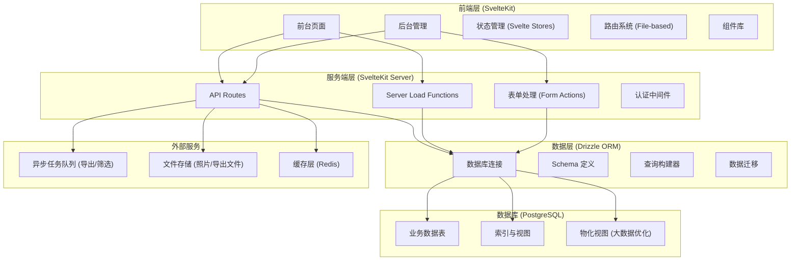
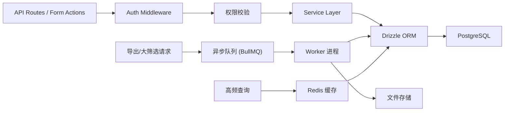
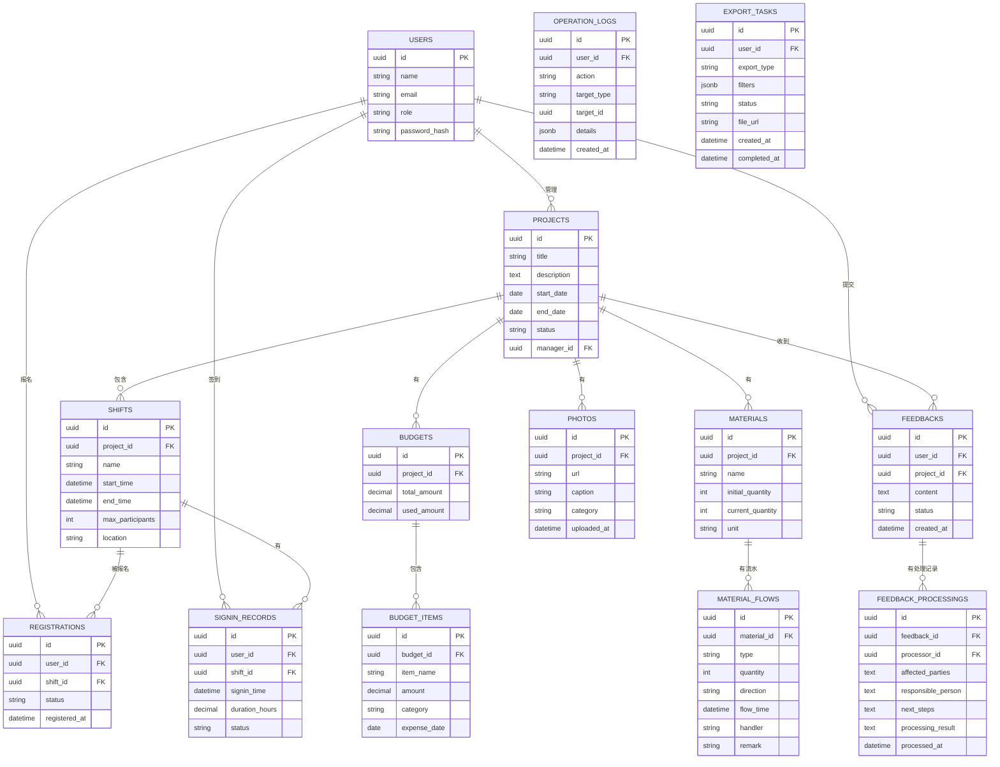

## 1. 架构设计



## 2. 技术描述

- **前端框架**：SvelteKit 2.0 + TypeScript
- **样式方案**：Tailwind CSS 3.4 + PostCSS
- **ORM**：Drizzle ORM 0.30
- **数据库**：PostgreSQL 16
- **包管理**：pnpm
- **异步处理**：BullMQ + Redis
- **图标库**：lucide-svelte
- **图表库**：Chart.js + svelte-chartjs
- **虚拟滚动**：svelte-virtual
- **日期处理**：date-fns

## 3. 目录结构

```
/
├── src/
│   ├── lib/
│   │   ├── components/          # 可复用组件
│   │   ├── server/              # 服务端专用代码
│   │   │   ├── db.ts            # 数据库连接
│   │   │   ├── schema.ts        # Drizzle Schema
│   │   │   └── services/        # 业务逻辑服务
│   │   ├── stores/              # Svelte Stores
│   │   ├── utils/               # 工具函数
│   │   └── types/               # TypeScript 类型定义
│   ├── routes/
│   │   ├── +layout.svelte       # 根布局
│   │   ├── +page.svelte         # 首页/项目列表
│   │   ├── projects/
│   │   │   └── [id]/
│   │   │       ├── +page.svelte # 项目详情
│   │   │       └── signin/+page.svelte  # 签到页
│   │   ├── my-records/
│   │   │   └── +page.svelte     # 我的服务记录
│   │   ├── admin/
│   │   │   ├── +layout.svelte   # 后台布局
│   │   │   ├── budget/+page.svelte    # 预算管理
│   │   │   ├── feedback/+page.svelte  # 反馈审核
│   │   │   ├── logs/+page.svelte      # 日志中心
│   │   │   └── export/+page.svelte    # 数据导出
│   │   └── api/                 # API 路由
│   └── app.css                  # 全局样式 + Tailwind
├── drizzle/                     # 数据库迁移
├── static/                      # 静态资源
├── svelte.config.js
├── tailwind.config.js
├── postcss.config.js
├── tsconfig.json
└── package.json
```

## 4. 路由定义

| 路由 | 用途 | 权限 |
|------|------|------|
| / | 项目公开列表页 | 公开 |
| /projects/[id] | 项目详情页（时长/物资/照片一站式查看） | 公开 |
| /projects/[id]/signin | 活动签到页 | 已报名用户 |
| /my-records | 我的服务记录 | 登录用户 |
| /admin | 后台管理首页 | 管理员/队长 |
| /admin/budget | 预算管理 | 管理员 |
| /admin/feedback | 反馈审核 | 管理员 |
| /admin/logs | 日志中心 | 管理员 |
| /admin/export | 数据导出中心 | 管理员 |
| /api/projects | 项目 CRUD API | 按权限 |
| /api/registrations | 报名 API | 登录用户 |
| /api/signin | 签到 API | 登录用户 |
| /api/export | 导出任务 API | 管理员 |

## 5. 服务端架构



## 6. 数据模型

### 6.1 ER 图



### 6.2 索引优化

```sql
-- 项目查询优化
CREATE INDEX idx_projects_status_date ON projects(status, start_date DESC);
CREATE INDEX idx_projects_manager ON projects(manager_id);

-- 签到记录优化（大数据量）
CREATE INDEX idx_signin_user_date ON signin_records(user_id, signin_time DESC);
CREATE INDEX idx_signin_shift ON signin_records(shift_id);
CREATE INDEX idx_signin_project ON signin_records(shift_id) INCLUDE (user_id, duration_hours);

-- 日志表分区（按月份）
CREATE TABLE operation_logs_partition OF operation_logs
PARTITION BY RANGE (created_at);

-- 物化视图：时长统计
CREATE MATERIALIZED VIEW mv_service_hours_summary AS
SELECT 
    user_id,
    project_id,
    SUM(duration_hours) as total_hours,
    COUNT(*) as times
FROM signin_records
WHERE status = 'confirmed'
GROUP BY user_id, project_id;

CREATE INDEX idx_mv_hours_user ON mv_service_hours_summary(user_id);
```

### 6.3 Drizzle Schema 定义

```typescript
// src/lib/server/schema.ts
import { pgTable, uuid, text, timestamp, integer, decimal, jsonb } from 'drizzle-orm/pg-core';
import { relations } from 'drizzle-orm';

export const users = pgTable('users', {
  id: uuid('id').primaryKey().defaultRandom(),
  name: text('name').notNull(),
  email: text('email').notNull().unique(),
  role: text('role').notNull().default('volunteer'),
  passwordHash: text('password_hash').notNull(),
  createdAt: timestamp('created_at').defaultNow(),
});

export const projects = pgTable('projects', {
  id: uuid('id').primaryKey().defaultRandom(),
  title: text('title').notNull(),
  description: text('description'),
  coverImage: text('cover_image'),
  startDate: timestamp('start_date').notNull(),
  endDate: timestamp('end_date').notNull(),
  status: text('status').notNull().default('draft'),
  managerId: uuid('manager_id').references(() => users.id),
  createdAt: timestamp('created_at').defaultNow(),
});

export const shifts = pgTable('shifts', {
  id: uuid('id').primaryKey().defaultRandom(),
  projectId: uuid('project_id').references(() => projects.id).notNull(),
  name: text('name').notNull(),
  startTime: timestamp('start_time').notNull(),
  endTime: timestamp('end_time').notNull(),
  maxParticipants: integer('max_participants').default(50),
  location: text('location'),
  createdAt: timestamp('created_at').defaultNow(),
});

export const registrations = pgTable('registrations', {
  id: uuid('id').primaryKey().defaultRandom(),
  userId: uuid('user_id').references(() => users.id).notNull(),
  shiftId: uuid('shift_id').references(() => shifts.id).notNull(),
  status: text('status').notNull().default('registered'),
  registeredAt: timestamp('registered_at').defaultNow(),
});

export const signinRecords = pgTable('signin_records', {
  id: uuid('id').primaryKey().defaultRandom(),
  userId: uuid('user_id').references(() => users.id).notNull(),
  shiftId: uuid('shift_id').references(() => shifts.id).notNull(),
  signinTime: timestamp('signin_time').defaultNow(),
  durationHours: decimal('duration_hours', { precision: 4, scale: 2 }),
  status: text('status').notNull().default('pending'),
  createdAt: timestamp('created_at').defaultNow(),
});

export const budgets = pgTable('budgets', {
  id: uuid('id').primaryKey().defaultRandom(),
  projectId: uuid('project_id').references(() => projects.id).notNull(),
  totalAmount: decimal('total_amount', { precision: 12, scale: 2 }).notNull(),
  usedAmount: decimal('used_amount', { precision: 12, scale: 2 }).default('0'),
  createdAt: timestamp('created_at').defaultNow(),
});

export const budgetItems = pgTable('budget_items', {
  id: uuid('id').primaryKey().defaultRandom(),
  budgetId: uuid('budget_id').references(() => budgets.id).notNull(),
  itemName: text('item_name').notNull(),
  amount: decimal('amount', { precision: 12, scale: 2 }).notNull(),
  category: text('category'),
  expenseDate: timestamp('expense_date'),
  createdAt: timestamp('created_at').defaultNow(),
});

export const materials = pgTable('materials', {
  id: uuid('id').primaryKey().defaultRandom(),
  projectId: uuid('project_id').references(() => projects.id).notNull(),
  name: text('name').notNull(),
  initialQuantity: integer('initial_quantity').notNull(),
  currentQuantity: integer('current_quantity').notNull(),
  unit: text('unit'),
  createdAt: timestamp('created_at').defaultNow(),
});

export const materialFlows = pgTable('material_flows', {
  id: uuid('id').primaryKey().defaultRandom(),
  materialId: uuid('material_id').references(() => materials.id).notNull(),
  type: text('type').notNull(),
  quantity: integer('quantity').notNull(),
  direction: text('direction').notNull(),
  flowTime: timestamp('flow_time').defaultNow(),
  handler: text('handler'),
  remark: text('remark'),
  createdAt: timestamp('created_at').defaultNow(),
});

export const photos = pgTable('photos', {
  id: uuid('id').primaryKey().defaultRandom(),
  projectId: uuid('project_id').references(() => projects.id).notNull(),
  url: text('url').notNull(),
  caption: text('caption'),
  category: text('category'),
  uploadedAt: timestamp('uploaded_at').defaultNow(),
});

export const feedbacks = pgTable('feedbacks', {
  id: uuid('id').primaryKey().defaultRandom(),
  userId: uuid('user_id').references(() => users.id).notNull(),
  projectId: uuid('project_id').references(() => projects.id).notNull(),
  content: text('content').notNull(),
  status: text('status').notNull().default('pending'),
  createdAt: timestamp('created_at').defaultNow(),
});

export const feedbackProcessings = pgTable('feedback_processings', {
  id: uuid('id').primaryKey().defaultRandom(),
  feedbackId: uuid('feedback_id').references(() => feedbacks.id).notNull(),
  processorId: uuid('processor_id').references(() => users.id).notNull(),
  affectedParties: text('affected_parties').notNull(),
  responsiblePerson: text('responsible_person').notNull(),
  nextSteps: text('next_steps').notNull(),
  processingResult: text('processing_result'),
  processedAt: timestamp('processed_at').defaultNow(),
});

export const operationLogs = pgTable('operation_logs', {
  id: uuid('id').primaryKey().defaultRandom(),
  userId: uuid('user_id').references(() => users.id),
  action: text('action').notNull(),
  targetType: text('target_type'),
  targetId: uuid('target_id'),
  details: jsonb('details'),
  createdAt: timestamp('created_at').defaultNow(),
});

export const exportTasks = pgTable('export_tasks', {
  id: uuid('id').primaryKey().defaultRandom(),
  userId: uuid('user_id').references(() => users.id).notNull(),
  exportType: text('export_type').notNull(),
  filters: jsonb('filters'),
  status: text('status').notNull().default('pending'),
  fileUrl: text('file_url'),
  createdAt: timestamp('created_at').defaultNow(),
  completedAt: timestamp('completed_at'),
});
```

## 7. 性能优化策略

### 7.1 大数据量处理
- **虚拟滚动**：日志列表、服务记录使用 `svelte-virtual`
- **分页查询**：使用 `limit/offset` + 游标分页，避免深分页问题
- **物化视图**：统计类查询预计算
- **查询批处理**：合并多次查询，减少数据库往返

### 7.2 导出异步化
- 导出请求入队列，返回任务 ID
- 后台 Worker 处理导出，生成 CSV/Excel
- 进度通过 SSE/WebSocket 推送
- 完成后存储到文件服务，发送通知

### 7.3 筛选优化
- 筛选条件使用索引覆盖查询
- 复杂筛选使用 CTE 或临时表
- 高频筛选结果缓存 Redis
- 筛选和导出接口分离，避免互相影响

### 7.4 前端优化
- 路由级代码分割
- 图片懒加载 + WebP 格式
- 组件按需导入
- 使用 Svelte Stores 管理共享状态
- 防抖处理搜索和筛选输入
