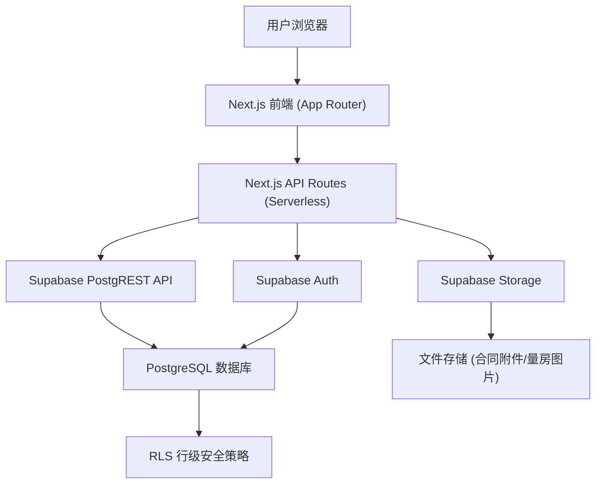
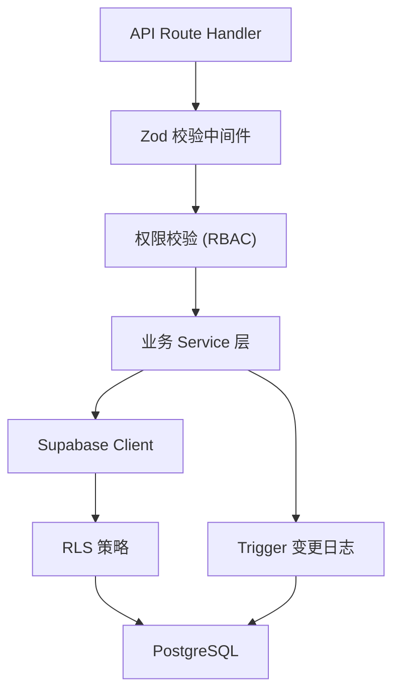
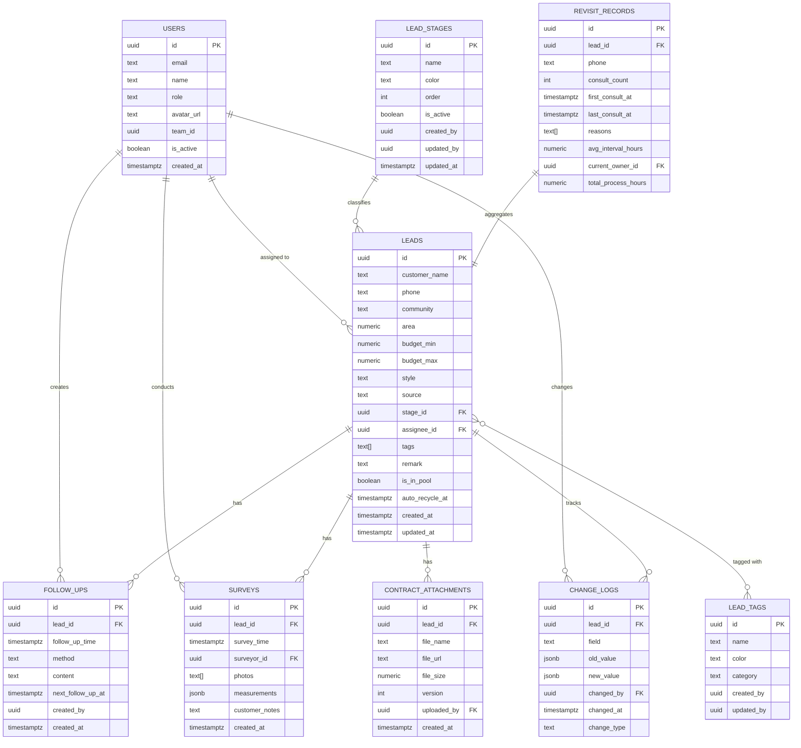

## 1. 架构设计



### 架构说明
- **前端层**：Next.js 14 App Router，服务端渲染(SSR) + 客户端交互组件，Tailwind CSS 样式
- **认证层**：Supabase Auth，基于 JWT 的角色权限控制
- **API 层**：Next.js API Routes 封装业务逻辑，调用 Supabase SDK
- **数据层**：PostgreSQL，启用 RLS 行级安全，保证多角色数据隔离
- **存储层**：Supabase Storage，合同附件和量房图片存储

## 2. 技术选型说明

| 技术 | 版本 | 用途 |
|------|------|------|
| Next.js | 14.x | React 全栈框架，App Router，Server Components |
| React | 18.x | UI 组件库 |
| TypeScript | 5.x | 类型安全 |
| Tailwind CSS | 3.x | 原子化 CSS 框架 |
| Supabase | latest | BaaS（Auth + Postgres + Storage） |
| PostgreSQL | 15.x | 关系型数据库 |
| @supabase/supabase-js | latest | Supabase JS SDK |
| @supabase/ssr | latest | Supabase 服务端渲染支持 |
| lucide-react | latest | 线性图标库 |
| recharts | latest | 数据可视化图表库 |
| zod | latest | 表单校验 Schema |
| react-hook-form | latest | 表单状态管理 |
| clsx + tailwind-merge | latest | 动态 className 合并 |
| date-fns | latest | 日期时间处理 |

## 3. 路由定义

| 路由 | 页面名称 | 权限 | 说明 |
|------|----------|------|------|
| `/login` | 登录页 | 公开 | 账号密码登录 |
| `/` | 工作台仪表盘 | 全部已登录用户 | 数据概览 + 待办 |
| `/pipeline` | 线索管道看板 | 销售经理/顾问 | Kanban 视图，拖拽移动 |
| `/pipeline/list` | 线索列表 | 销售经理/顾问 | 列表视图 + 高级筛选 |
| `/leads/[id]` | 线索详情 | 相关负责人 + 经理 | 需求/量房/跟进/合同/变更 |
| `/pool` | 公海池 | 销售经理/管理员 | 未分配线索，分配操作 |
| `/analytics/prediction` | 成交预测看板 | 经理/管理员/分析师 | 销售漏斗 + 业绩预测 |
| `/analytics/revisit` | 回访频次报表 | 经理/管理员/分析师 | 重复咨询 + 耗时统计 |
| `/settings/stages` | 跟进阶段设置 | 管理员 | 阶段配置，修改人记录 |
| `/settings/tags` | 客户标签设置 | 管理员 | 标签增删改 |
| `/settings/rules` | 校验规则设置 | 管理员 | 表单校验规则 |
| `/settings/attachments` | 合同附件模板 | 管理员 | 附件模板管理 |
| `/admin/users` | 用户管理 | 管理员 | 账号角色管理 |
| `/admin/roles` | 角色权限管理 | 超级管理员 | 权限配置 |
| `/timeline/[id]` | 变更时间轴 | 相关人员 | 线索全流程操作记录 |

## 4. API 定义（Next.js API Routes）

### 4.1 类型定义

```typescript
type UserRole = 'super_admin' | 'sales_manager' | 'sales_consultant' | 'analyst';

interface User {
  id: string;
  email: string;
  name: string;
  role: UserRole;
  avatar_url?: string;
  team_id?: string;
  is_active: boolean;
  created_at: string;
}

interface LeadStage {
  id: string;
  name: string;
  color: string;
  order: number;
  is_active: boolean;
  created_by: string;
  updated_by: string;
  updated_at: string;
}

interface LeadTag {
  id: string;
  name: string;
  color: string;
  category: string;
  created_by: string;
  updated_by: string;
}

interface Lead {
  id: string;
  customer_name: string;
  phone: string;
  community: string;
  area: number;
  budget_min: number;
  budget_max: number;
  style: string;
  source: string;
  stage_id: string;
  assignee_id?: string;
  tags: string[];
  remark?: string;
  is_in_pool: boolean;
  auto_recycle_at?: string;
  created_at: string;
  updated_at: string;
}

interface SurveyRecord {
  id: string;
  lead_id: string;
  survey_time: string;
  surveyor_id: string;
  photos: string[];
  measurements: Record<string, number>;
  customer_notes?: string;
  created_at: string;
}

interface FollowUpRecord {
  id: string;
  lead_id: string;
  follow_up_time: string;
  method: 'phone' | 'wechat' | 'visit' | 'other';
  content: string;
  next_follow_up_at?: string;
  created_by: string;
}

interface ContractAttachment {
  id: string;
  lead_id: string;
  file_name: string;
  file_url: string;
  file_size: number;
  version: number;
  uploaded_by: string;
  created_at: string;
}

interface ChangeLog {
  id: string;
  lead_id: string;
  field: string;
  old_value: any;
  new_value: any;
  changed_by: string;
  changed_at: string;
  change_type: 'create' | 'update' | 'stage_change' | 'assign' | 'recycle';
}

interface RevisitRecord {
  id: string;
  lead_id: string;
  phone: string;
  consult_count: number;
  first_consult_at: string;
  last_consult_at: string;
  reasons: string[];
  avg_interval_hours: number;
  current_owner_id?: string;
  total_process_hours: number;
}
```

### 4.2 API 端点

| 方法 | 路由 | 说明 |
|------|------|------|
| POST | `/api/auth/login` | 登录验证 |
| POST | `/api/auth/logout` | 登出 |
| GET | `/api/leads` | 获取线索列表（支持筛选/分页） |
| GET | `/api/leads/:id` | 获取线索详情 |
| POST | `/api/leads` | 创建线索 |
| PATCH | `/api/leads/:id` | 更新线索信息 |
| PATCH | `/api/leads/:id/stage` | 更新线索阶段 |
| PATCH | `/api/leads/:id/assign` | 分配线索负责人 |
| POST | `/api/leads/:id/recycle` | 回收线索到公海 |
| POST | `/api/pool/assign` | 批量分配公海线索 |
| GET | `/api/pool` | 获取公海线索列表 |
| GET | `/api/leads/:id/surveys` | 获取量房记录 |
| POST | `/api/leads/:id/surveys` | 新增量房记录 |
| GET | `/api/leads/:id/followups` | 获取跟进记录 |
| POST | `/api/leads/:id/followups` | 新增跟进记录 |
| GET | `/api/leads/:id/attachments` | 获取合同附件 |
| POST | `/api/leads/:id/attachments` | 上传合同附件 |
| GET | `/api/leads/:id/changelog` | 获取变更历史 |
| GET | `/api/stages` | 获取跟进阶段配置 |
| POST | `/api/stages` | 新增跟进阶段 |
| PATCH | `/api/stages/:id` | 更新跟进阶段 |
| DELETE | `/api/stages/:id` | 删除跟进阶段 |
| GET | `/api/tags` | 获取客户标签 |
| POST | `/api/tags` | 新增客户标签 |
| PATCH | `/api/tags/:id` | 更新客户标签 |
| DELETE | `/api/tags/:id` | 删除客户标签 |
| GET | `/api/analytics/prediction` | 成交预测数据 |
| GET | `/api/analytics/revisit` | 回访频次报表数据 |
| GET | `/api/admin/users` | 用户列表 |
| POST | `/api/admin/users` | 创建用户 |
| PATCH | `/api/admin/users/:id` | 更新用户 |
| GET | `/api/admin/roles` | 角色权限列表 |

## 5. 服务端架构



- **Handler 层**：Next.js Route Handler，处理 HTTP 请求/响应
- **校验层**：Zod Schema 校验请求参数
- **权限层**：基于用户角色 + 数据归属（assignee_id）的 RBAC
- **Service 层**：业务逻辑封装，事务处理
- **持久层**：Supabase SDK 调用，PostgreSQL RLS 保证数据安全
- **Trigger 层**：PG Trigger 自动记录变更历史（changelog 表）

## 6. 数据模型

### 6.1 ER 图



### 6.2 DDL 语句

```sql
-- 扩展
create extension if not exists "uuid-ossp";

-- 用户表
create table users (
  id uuid primary key default uuid_generate_v4(),
  email text unique not null,
  name text not null,
  role text not null check (role in ('super_admin', 'sales_manager', 'sales_consultant', 'analyst')),
  avatar_url text,
  team_id uuid,
  is_active boolean default true,
  created_at timestamptz default now()
);

-- 跟进阶段表
create table lead_stages (
  id uuid primary key default uuid_generate_v4(),
  name text not null,
  color text not null default '#6B7280',
  "order" int not null default 0,
  is_active boolean default true,
  created_by uuid references users(id),
  updated_by uuid references users(id),
  updated_at timestamptz default now()
);

-- 客户标签表
create table lead_tags (
  id uuid primary key default uuid_generate_v4(),
  name text not null,
  color text not null default '#6B7280',
  category text default 'default',
  created_by uuid references users(id),
  updated_by uuid references users(id)
);

-- 线索主表
create table leads (
  id uuid primary key default uuid_generate_v4(),
  customer_name text not null,
  phone text not null,
  community text,
  area numeric(10,2),
  budget_min numeric(12,2),
  budget_max numeric(12,2),
  style text,
  source text,
  stage_id uuid references lead_stages(id),
  assignee_id uuid references users(id),
  tags text[] default '{}',
  remark text,
  is_in_pool boolean default true,
  auto_recycle_at timestamptz,
  created_at timestamptz default now(),
  updated_at timestamptz default now()
);

-- 跟进记录表
create table follow_ups (
  id uuid primary key default uuid_generate_v4(),
  lead_id uuid references leads(id) on delete cascade,
  follow_up_time timestamptz not null,
  method text check (method in ('phone', 'wechat', 'visit', 'other')) not null,
  content text not null,
  next_follow_up_at timestamptz,
  created_by uuid references users(id),
  created_at timestamptz default now()
);

-- 量房记录表
create table surveys (
  id uuid primary key default uuid_generate_v4(),
  lead_id uuid references leads(id) on delete cascade,
  survey_time timestamptz not null,
  surveyor_id uuid references users(id),
  photos text[] default '{}',
  measurements jsonb default '{}',
  customer_notes text,
  created_at timestamptz default now()
);

-- 合同附件表
create table contract_attachments (
  id uuid primary key default uuid_generate_v4(),
  lead_id uuid references leads(id) on delete cascade,
  file_name text not null,
  file_url text not null,
  file_size numeric not null,
  version int default 1,
  uploaded_by uuid references users(id),
  created_at timestamptz default now()
);

-- 变更日志表
create table change_logs (
  id uuid primary key default uuid_generate_v4(),
  lead_id uuid references leads(id) on delete cascade,
  field text,
  old_value jsonb,
  new_value jsonb,
  changed_by uuid references users(id),
  changed_at timestamptz default now(),
  change_type text not null check (change_type in ('create', 'update', 'stage_change', 'assign', 'recycle'))
);

-- 回访记录聚合表
create table revisit_records (
  id uuid primary key default uuid_generate_v4(),
  lead_id uuid references leads(id),
  phone text not null,
  consult_count int default 1,
  first_consult_at timestamptz default now(),
  last_consult_at timestamptz default now(),
  reasons text[] default '{}',
  avg_interval_hours numeric(10,2),
  current_owner_id uuid references users(id),
  total_process_hours numeric(12,2) default 0
);

-- 索引
create index idx_leads_stage on leads(stage_id);
create index idx_leads_assignee on leads(assignee_id);
create index idx_leads_pool on leads(is_in_pool) where is_in_pool = true;
create index idx_leads_phone on leads(phone);
create index idx_follow_ups_lead on follow_ups(lead_id);
create index idx_changelogs_lead on change_logs(lead_id);
create index idx_surveys_lead on surveys(lead_id);
create index idx_revisits_phone on revisit_records(phone);

-- 变更日志触发器函数
create or replace function log_lead_change() returns trigger as $$
declare
  rec record;
  field_name text;
  old_val jsonb;
  new_val jsonb;
  change_type_text text;
begin
  if TG_OP = 'INSERT' then
    change_type_text := 'create';
    insert into change_logs(lead_id, field, old_value, new_value, changed_by, change_type)
    values (new.id, null, null, to_jsonb(new), new.assignee_id, change_type_text);
    return new;
  end if;

  if TG_OP = 'UPDATE' then
    if old.stage_id <> new.stage_id then
      change_type_text := 'stage_change';
      insert into change_logs(lead_id, field, old_value, new_value, changed_by, change_type)
      values (new.id, 'stage_id', to_jsonb(old.stage_id), to_jsonb(new.stage_id), new.assignee_id, change_type_text);
    end if;

    if old.assignee_id is distinct from new.assignee_id then
      change_type_text := 'assign';
      insert into change_logs(lead_id, field, old_value, new_value, changed_by, change_type)
      values (new.id, 'assignee_id', to_jsonb(old.assignee_id), to_jsonb(new.assignee_id), new.assignee_id, change_type_text);
    end if;

    for rec in select * from jsonb_each(to_jsonb(new)) loop
      field_name := rec.key;
      new_val := rec.value;
      old_val := to_jsonb(old) -> field_name;
      if field_name not in ('stage_id', 'assignee_id', 'updated_at') 
         and old_val is distinct from new_val then
        insert into change_logs(lead_id, field, old_value, new_value, changed_by, change_type)
        values (new.id, field_name, old_val, new_val, new.assignee_id, 'update');
      end if;
    end loop;
  end if;

  if TG_OP = 'DELETE' then
    change_type_text := 'recycle';
    insert into change_logs(lead_id, field, old_value, new_value, changed_by, change_type)
    values (old.id, null, to_jsonb(old), null, old.assignee_id, change_type_text);
    return old;
  end if;

  return new;
end;
$$ language plpgsql;

create trigger trigger_log_lead_change
after insert or update or delete on leads
for each row execute function log_lead_change();

-- RLS 启用
alter table users enable row level security;
alter table leads enable row level security;
alter table follow_ups enable row level security;
alter table surveys enable row level security;
alter table contract_attachments enable row level security;
alter table change_logs enable row level security;

-- 策略：管理员查看全部
create policy "管理员查看全部线索" on leads
  for all using (
    exists (select 1 from users where id = auth.uid() and role in ('super_admin', 'sales_manager'))
  );

-- 策略：销售顾问只看分配给自己的
create policy "顾问看自己的线索" on leads
  for select using (
    assignee_id = auth.uid() or is_in_pool = true
  );

-- 初始阶段数据
insert into lead_stages(name, color, "order") values
  ('公海池', '#9CA3AF', 0),
  ('待分配', '#F59E0B', 1),
  ('跟进中', '#3B82F6', 2),
  ('已量房', '#8B5CF6', 3),
  ('报价中', '#EC4899', 4),
  ('签约中', '#10B981', 5),
  ('已成交', '#059669', 6),
  ('已流失', '#EF4444', 7);
```

## 7. 目录结构

```
.
├── app/
│   ├── (auth)/
│   │   └── login/
│   │       └── page.tsx
│   ├── (dashboard)/
│   │   ├── layout.tsx
│   │   ├── page.tsx                    # 工作台
│   │   ├── pipeline/
│   │   │   ├── page.tsx                # 管道看板
│   │   │   └── list/
│   │   │       └── page.tsx            # 线索列表
│   │   ├── leads/
│   │   │   └── [id]/
│   │   │       └── page.tsx            # 线索详情
│   │   ├── pool/
│   │   │   └── page.tsx                # 公海池
│   │   ├── analytics/
│   │   │   ├── prediction/
│   │   │   │   └── page.tsx            # 成交预测
│   │   │   └── revisit/
│   │   │       └── page.tsx            # 回访报表
│   │   ├── settings/
│   │   │   ├── stages/
│   │   │   │   └── page.tsx            # 跟进阶段
│   │   │   ├── tags/
│   │   │   │   └── page.tsx            # 客户标签
│   │   │   ├── rules/
│   │   │   │   └── page.tsx            # 校验规则
│   │   │   └── attachments/
│   │   │       └── page.tsx            # 合同附件
│   │   ├── admin/
│   │   │   ├── users/
│   │   │   │   └── page.tsx            # 用户管理
│   │   │   └── roles/
│   │   │       └── page.tsx            # 角色权限
│   │   └── timeline/
│   │       └── [id]/
│   │           └── page.tsx            # 变更时间轴
│   ├── api/
│   │   ├── auth/
│   │   ├── leads/
│   │   ├── pool/
│   │   ├── stages/
│   │   ├── tags/
│   │   ├── analytics/
│   │   └── admin/
│   └── globals.css
├── components/
│   ├── layout/
│   │   ├── Sidebar.tsx
│   │   ├── Topbar.tsx
│   │   └── ProtectedLayout.tsx
│   ├── pipeline/
│   │   ├── KanbanBoard.tsx
│   │   ├── LeadCard.tsx
│   │   └── PipelineFilters.tsx
│   ├── leads/
│   │   ├── LeadInfo.tsx
│   │   ├── SurveySection.tsx
│   │   ├── FollowUpTimeline.tsx
│   │   ├── AttachmentList.tsx
│   │   └── ChangeHistory.tsx
│   ├── analytics/
│   │   ├── SalesFunnel.tsx
│   │   ├── PredictionMetrics.tsx
│   │   └── RevisitTable.tsx
│   ├── settings/
│   │   ├── StageManager.tsx
│   │   └── TagManager.tsx
│   └── ui/                    # 通用组件
│       ├── Button.tsx
│       ├── Modal.tsx
│       ├── Table.tsx
│       ├── Badge.tsx
│       ├── Card.tsx
│       ├── Input.tsx
│       ├── Select.tsx
│       └── Tabs.tsx
├── lib/
│   ├── supabase/
│   │   ├── client.ts
│   │   ├── server.ts
│   │   └── middleware.ts
│   ├── types.ts
│   ├── utils.ts
│   ├── validators.ts
│   └── constants.ts
├── middleware.ts
├── tailwind.config.ts
├── next.config.ts
└── tsconfig.json
```
