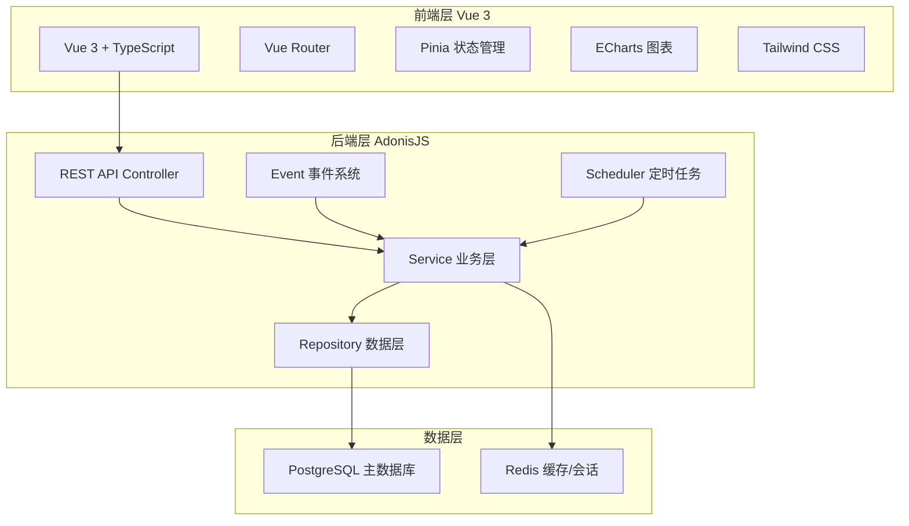
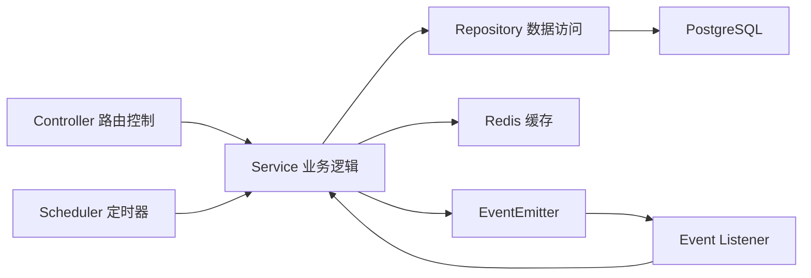
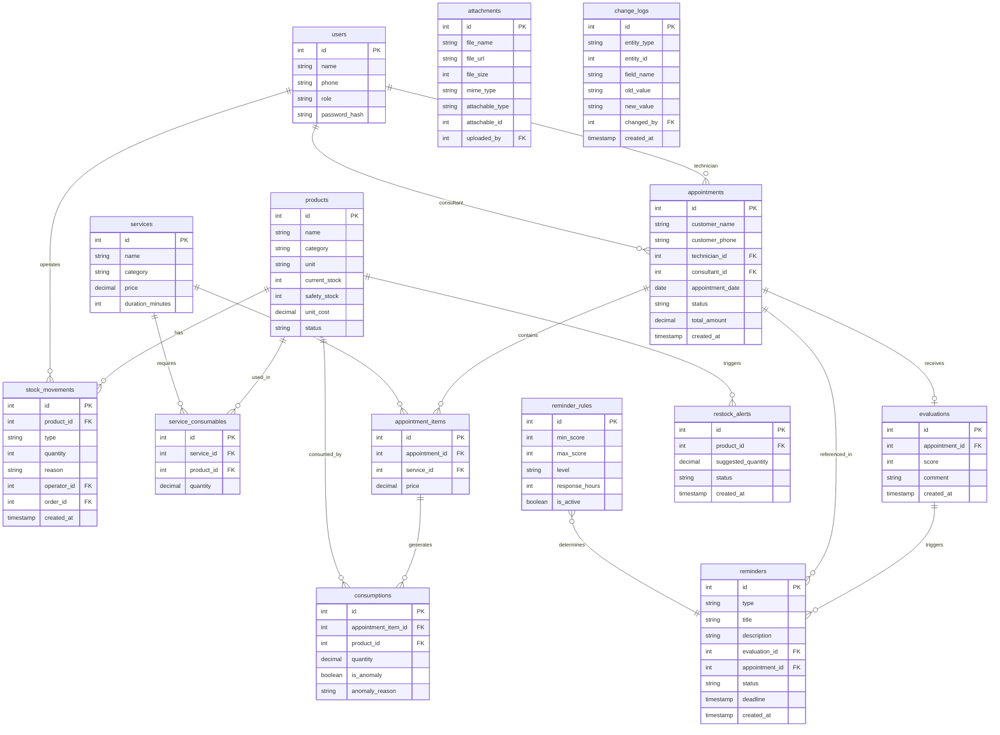

## 1. 架构设计



## 2. 技术说明

- **前端**：Vue 3 + TypeScript + Vite + Tailwind CSS + Pinia + Vue Router + ECharts
- **初始化工具**：Vite
- **后端**：AdonisJS 6 + TypeScript
- **数据库**：PostgreSQL（主存储），Redis（缓存/会话/锁）
- **图标**：Lucide Vue Next
- **HTTP 客户端**：Axios
- **环境隔离**：通过 `.env` 配置 `NODE_ENV` 区分生产/测试数据

## 3. 路由定义

| 路由 | 用途 |
|------|------|
| `/` | 生产看板（首页） |
| `/inventory` | 耗材管理（库存列表） |
| `/inventory/records` | 入库/出库记录 |
| `/inventory/damage` | 报损登记 |
| `/inventory/restock` | 补货提醒 |
| `/appointments` | 预约订单列表 |
| `/appointments/:id` | 订单详情 |
| `/analytics` | 消耗分析总览 |
| `/analytics/commissions` | 顾问提成表 |
| `/analytics/pricing` | 项目价格分析 |
| `/analytics/consumption` | 耗材消耗排行 |
| `/analytics/anomaly` | 异常追溯 |
| `/reminders` | 评价提醒列表 |
| `/reminders/rules` | 提醒规则配置 |
| `/records/:type/:id` | 通用记录详情页 |

## 4. API 定义

### 4.1 耗材相关

```typescript
interface Product {
  id: number
  name: string
  category: string
  unit: string
  current_stock: number
  safety_stock: number
  unit_cost: number
  status: 'normal' | 'low' | 'out_of_stock'
  created_at: string
  updated_at: string
}

interface StockMovement {
  id: number
  product_id: number
  type: 'in' | 'out' | 'damage' | 'adjustment'
  quantity: number
  reason: string
  operator_id: number
  order_id?: number
  attachments: Attachment[]
  created_at: string
}

// GET /api/products - 产品库存列表
// POST /api/products - 创建产品
// PUT /api/products/:id - 更新产品
// GET /api/stock-movements - 入库/出库记录
// POST /api/stock-movements - 新增入库/出库/报损
// GET /api/restock-alerts - 补货提醒列表
// POST /api/restock-alerts/:id/confirm - 确认补货
```

### 4.2 预约订单相关

```typescript
interface Appointment {
  id: number
  customer_name: string
  customer_phone: string
  technician_id: number
  consultant_id: number
  appointment_date: string
  status: 'pending' | 'confirmed' | 'in_progress' | 'completed' | 'no_show' | 'cancelled'
  total_amount: number
  items: AppointmentItem[]
  evaluation?: Evaluation
  created_at: string
  updated_at: string
}

interface AppointmentItem {
  id: number
  appointment_id: number
  service_id: number
  service_name: string
  price: number
  consumptions: Consumption[]
}

interface Consumption {
  id: number
  product_id: number
  product_name: string
  quantity: number
  is_anomaly: boolean
  anomaly_reason?: string
}

// GET /api/appointments - 预约列表
// POST /api/appointments - 创建预约（锁定库存）
// PUT /api/appointments/:id/start - 开始服务（正式扣减）
// PUT /api/appointments/:id/complete - 完成服务
// PUT /api/appointments/:id/no-show - 标记未到
// GET /api/appointments/:id - 订单详情
```

### 4.3 统计分析相关

```typescript
interface ConsultantCommission {
  consultant_id: number
  consultant_name: string
  completed_count: number
  commission_amount: number
  consumable_cost: number
  profit: number
}

interface ServicePriceAnalysis {
  service_id: number
  service_name: string
  price: number
  avg_consumable_cost: number
  gross_margin: number
  gross_margin_rate: number
}

interface ConsumptionRanking {
  product_id: number
  product_name: string
  total_consumed: number
  related_orders: number
  anomaly_count: number
}

// GET /api/analytics/commissions - 顾问提成
// GET /api/analytics/pricing - 项目价格分析
// GET /api/analytics/consumption - 耗材消耗排行
// GET /api/analytics/anomaly - 异常追溯
// GET /api/analytics/visit-rate - 到店率
// GET /api/analytics/dashboard - 看板数据
```

### 4.4 提醒相关

```typescript
interface Reminder {
  id: number
  type: 'normal' | 'urgent' | 'escalation'
  title: string
  description: string
  evaluation_id?: number
  appointment_id?: number
  status: 'pending' | 'processing' | 'resolved'
  deadline: string
  created_at: string
}

interface ReminderRule {
  id: number
  min_score: number
  max_score: number
  level: 'normal' | 'urgent' | 'escalation'
  response_hours: number
  is_active: boolean
}

// GET /api/reminders - 提醒列表
// PUT /api/reminders/:id/process - 开始处理
// PUT /api/reminders/:id/resolve - 解决
// GET /api/reminder-rules - 提醒规则列表
// POST /api/reminder-rules - 创建规则
// PUT /api/reminder-rules/:id - 更新规则
```

### 4.5 修改历史与附件

```typescript
interface Attachment {
  id: number
  file_name: string
  file_url: string
  file_size: number
  mime_type: string
  attachable_type: string
  attachable_id: number
  uploaded_by: number
  created_at: string
}

interface ChangeLog {
  id: number
  entity_type: string
  entity_id: number
  field_name: string
  old_value: string
  new_value: string
  changed_by: number
  created_at: string
}

// POST /api/attachments - 上传附件
// DELETE /api/attachments/:id - 删除附件
// GET /api/change-logs - 修改历史（按实体类型和ID筛选）
```

## 5. 服务端架构图



## 6. 数据模型

### 6.1 数据模型定义



### 6.2 数据定义语言

```sql
CREATE TABLE users (
  id SERIAL PRIMARY KEY,
  name VARCHAR(100) NOT NULL,
  phone VARCHAR(20),
  role VARCHAR(20) NOT NULL CHECK (role IN ('admin', 'consultant', 'technician')),
  password_hash VARCHAR(255) NOT NULL,
  is_active BOOLEAN DEFAULT true,
  created_at TIMESTAMP DEFAULT CURRENT_TIMESTAMP,
  updated_at TIMESTAMP DEFAULT CURRENT_TIMESTAMP
);

CREATE TABLE products (
  id SERIAL PRIMARY KEY,
  name VARCHAR(200) NOT NULL,
  category VARCHAR(50) NOT NULL,
  unit VARCHAR(20) NOT NULL,
  current_stock INTEGER NOT NULL DEFAULT 0,
  safety_stock INTEGER NOT NULL DEFAULT 0,
  unit_cost DECIMAL(10,2) NOT NULL DEFAULT 0,
  status VARCHAR(20) NOT NULL DEFAULT 'normal' CHECK (status IN ('normal', 'low', 'out_of_stock')),
  created_at TIMESTAMP DEFAULT CURRENT_TIMESTAMP,
  updated_at TIMESTAMP DEFAULT CURRENT_TIMESTAMP
);

CREATE TABLE stock_movements (
  id SERIAL PRIMARY KEY,
  product_id INTEGER NOT NULL REFERENCES products(id),
  type VARCHAR(20) NOT NULL CHECK (type IN ('in', 'out', 'damage', 'adjustment')),
  quantity INTEGER NOT NULL,
  reason TEXT,
  operator_id INTEGER NOT NULL REFERENCES users(id),
  order_id INTEGER,
  created_at TIMESTAMP DEFAULT CURRENT_TIMESTAMP
);

CREATE TABLE services (
  id SERIAL PRIMARY KEY,
  name VARCHAR(200) NOT NULL,
  category VARCHAR(50) NOT NULL,
  price DECIMAL(10,2) NOT NULL,
  duration_minutes INTEGER NOT NULL DEFAULT 60,
  is_active BOOLEAN DEFAULT true,
  created_at TIMESTAMP DEFAULT CURRENT_TIMESTAMP,
  updated_at TIMESTAMP DEFAULT CURRENT_TIMESTAMP
);

CREATE TABLE service_consumables (
  id SERIAL PRIMARY KEY,
  service_id INTEGER NOT NULL REFERENCES services(id),
  product_id INTEGER NOT NULL REFERENCES products(id),
  quantity DECIMAL(10,3) NOT NULL,
  created_at TIMESTAMP DEFAULT CURRENT_TIMESTAMP
);

CREATE TABLE appointments (
  id SERIAL PRIMARY KEY,
  customer_name VARCHAR(100) NOT NULL,
  customer_phone VARCHAR(20),
  technician_id INTEGER NOT NULL REFERENCES users(id),
  consultant_id INTEGER REFERENCES users(id),
  appointment_date DATE NOT NULL,
  status VARCHAR(20) NOT NULL DEFAULT 'pending' CHECK (status IN ('pending', 'confirmed', 'in_progress', 'completed', 'no_show', 'cancelled')),
  total_amount DECIMAL(10,2) NOT NULL DEFAULT 0,
  notes TEXT,
  created_at TIMESTAMP DEFAULT CURRENT_TIMESTAMP,
  updated_at TIMESTAMP DEFAULT CURRENT_TIMESTAMP
);

CREATE TABLE appointment_items (
  id SERIAL PRIMARY KEY,
  appointment_id INTEGER NOT NULL REFERENCES appointments(id) ON DELETE CASCADE,
  service_id INTEGER NOT NULL REFERENCES services(id),
  price DECIMAL(10,2) NOT NULL,
  created_at TIMESTAMP DEFAULT CURRENT_TIMESTAMP
);

CREATE TABLE consumptions (
  id SERIAL PRIMARY KEY,
  appointment_item_id INTEGER NOT NULL REFERENCES appointment_items(id),
  product_id INTEGER NOT NULL REFERENCES products(id),
  quantity DECIMAL(10,3) NOT NULL,
  is_anomaly BOOLEAN DEFAULT false,
  anomaly_reason TEXT,
  created_at TIMESTAMP DEFAULT CURRENT_TIMESTAMP
);

CREATE TABLE evaluations (
  id SERIAL PRIMARY KEY,
  appointment_id INTEGER NOT NULL REFERENCES appointments(id),
  score INTEGER NOT NULL CHECK (score BETWEEN 1 AND 5),
  comment TEXT,
  created_at TIMESTAMP DEFAULT CURRENT_TIMESTAMP
);

CREATE TABLE reminder_rules (
  id SERIAL PRIMARY KEY,
  min_score INTEGER NOT NULL,
  max_score INTEGER NOT NULL,
  level VARCHAR(20) NOT NULL CHECK (level IN ('normal', 'urgent', 'escalation')),
  response_hours INTEGER NOT NULL,
  is_active BOOLEAN DEFAULT true,
  created_at TIMESTAMP DEFAULT CURRENT_TIMESTAMP,
  updated_at TIMESTAMP DEFAULT CURRENT_TIMESTAMP
);

CREATE TABLE reminders (
  id SERIAL PRIMARY KEY,
  type VARCHAR(20) NOT NULL CHECK (type IN ('normal', 'urgent', 'escalation')),
  title VARCHAR(255) NOT NULL,
  description TEXT,
  evaluation_id INTEGER REFERENCES evaluations(id),
  appointment_id INTEGER REFERENCES appointments(id),
  status VARCHAR(20) NOT NULL DEFAULT 'pending' CHECK (status IN ('pending', 'processing', 'resolved')),
  deadline TIMESTAMP NOT NULL,
  created_at TIMESTAMP DEFAULT CURRENT_TIMESTAMP,
  updated_at TIMESTAMP DEFAULT CURRENT_TIMESTAMP
);

CREATE TABLE restock_alerts (
  id SERIAL PRIMARY KEY,
  product_id INTEGER NOT NULL REFERENCES products(id),
  suggested_quantity DECIMAL(10,2) NOT NULL,
  status VARCHAR(20) NOT NULL DEFAULT 'pending' CHECK (status IN ('pending', 'confirmed', 'completed', 'dismissed')),
  created_at TIMESTAMP DEFAULT CURRENT_TIMESTAMP,
  updated_at TIMESTAMP DEFAULT CURRENT_TIMESTAMP
);

CREATE TABLE attachments (
  id SERIAL PRIMARY KEY,
  file_name VARCHAR(255) NOT NULL,
  file_url VARCHAR(500) NOT NULL,
  file_size INTEGER NOT NULL,
  mime_type VARCHAR(100) NOT NULL,
  attachable_type VARCHAR(50) NOT NULL,
  attachable_id INTEGER NOT NULL,
  uploaded_by INTEGER NOT NULL REFERENCES users(id),
  created_at TIMESTAMP DEFAULT CURRENT_TIMESTAMP
);

CREATE TABLE change_logs (
  id SERIAL PRIMARY KEY,
  entity_type VARCHAR(50) NOT NULL,
  entity_id INTEGER NOT NULL,
  field_name VARCHAR(100) NOT NULL,
  old_value TEXT,
  new_value TEXT,
  changed_by INTEGER NOT NULL REFERENCES users(id),
  created_at TIMESTAMP DEFAULT CURRENT_TIMESTAMP
);

-- 索引
CREATE INDEX idx_stock_movements_product ON stock_movements(product_id);
CREATE INDEX idx_stock_movements_type ON stock_movements(type);
CREATE INDEX idx_appointments_date ON appointments(appointment_date);
CREATE INDEX idx_appointments_status ON appointments(status);
CREATE INDEX idx_appointments_technician ON appointments(technician_id);
CREATE INDEX idx_consumptions_product ON consumptions(product_id);
CREATE INDEX idx_consumptions_anomaly ON consumptions(is_anomaly);
CREATE INDEX idx_reminders_status ON reminders(status);
CREATE INDEX idx_reminders_deadline ON reminders(deadline);
CREATE INDEX idx_change_logs_entity ON change_logs(entity_type, entity_id);
CREATE INDEX idx_attachments_entity ON attachments(attachable_type, attachable_id);

-- 初始提醒规则
INSERT INTO reminder_rules (min_score, max_score, level, response_hours) VALUES
  (3, 4, 'normal', 48),
  (1, 2, 'urgent', 24);

-- 初始管理员
INSERT INTO users (name, phone, role, password_hash) VALUES
  ('管理员', '13800000000', 'admin', '$hashed_password');
```
