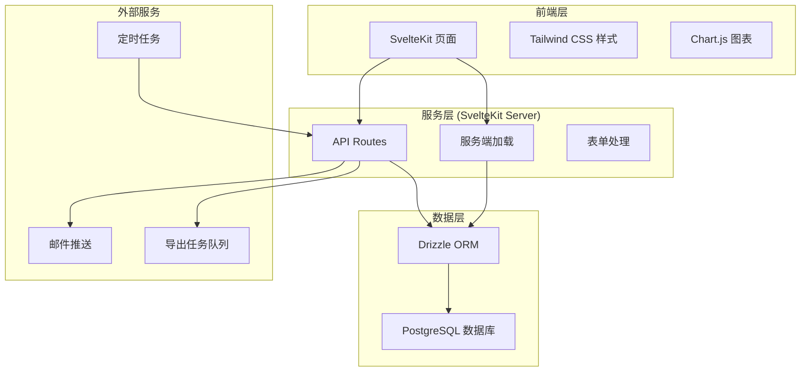
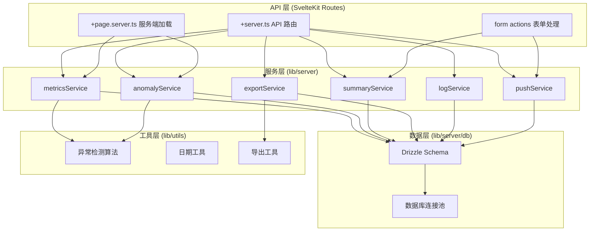
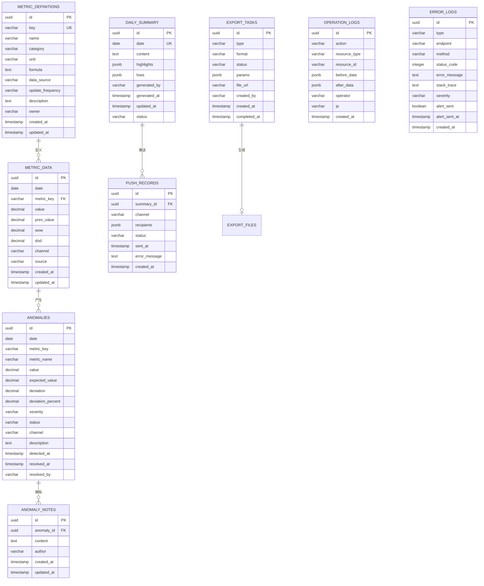

## 1. 架构设计



## 2. 技术描述

- **前端框架**：SvelteKit (全栈框架，SSR + 客户端导航)
- **样式方案**：Tailwind CSS 3.x
- **ORM**：Drizzle ORM
- **数据库**：PostgreSQL 15+
- **图表库**：Chart.js / svelte-chartjs
- **图标库**：lucide-svelte
- **日期处理**：date-fns
- **导出功能**：CSV 导出（流式），Excel 导出预留
- **包管理器**：pnpm
- **语言**：TypeScript

## 3. 路由定义

| 路由 | 用途 | 类型 |
|------|------|------|
| / | 指标看板首页 | 页面 |
| /anomalies/[id] | 异常详情页 | 页面 |
| /monthly | 月报复盘页 | 页面 |
| /admin | 后台管理首页 | 页面 |
| /admin/data | 指标数据管理 | 页面 |
| /admin/metrics | 指标口径维护 | 页面 |
| /admin/summary | 摘要生成与推送 | 页面 |
| /admin/logs | 日志中心 | 页面 |
| /api/metrics | 指标数据查询 | API |
| /api/metrics/[id] | 单指标详情 | API |
| /api/anomalies | 异常记录列表 | API |
| /api/anomalies/[id] | 异常详情与备注 | API |
| /api/anomalies/[id]/notes | 异常备注 | API |
| /api/export | 创建导出任务 | API |
| /api/export/[id] | 导出任务状态/下载 | API |
| /api/summary | 日报摘要 CRUD | API |
| /api/push | 推送配置与记录 | API |
| /api/logs/operation | 操作日志 | API |
| /api/logs/error | 错误日志 | API |
| /api/metrics-definition | 指标口径 CRUD | API |

## 4. API 定义

### 4.1 类型定义

```typescript
// 指标数据
interface MetricData {
  id: string;
  date: string;
  metricKey: string;
  metricName: string;
  value: number;
  prevValue: number;
  weekOverWeek: number;
  dayOverDay: number;
  channel?: string;
  source: string;
  createdAt: string;
  updatedAt: string;
}

// 异常记录
interface AnomalyRecord {
  id: string;
  date: string;
  metricKey: string;
  metricName: string;
  value: number;
  expectedValue: number;
  deviation: number;
  deviationPercent: number;
  severity: 'low' | 'medium' | 'high' | 'critical';
  status: 'open' | 'investigating' | 'resolved' | 'ignored';
  channel?: string;
  detectedAt: string;
  resolvedAt?: string;
  resolvedBy?: string;
  description?: string;
}

// 异常备注
interface AnomalyNote {
  id: string;
  anomalyId: string;
  content: string;
  author: string;
  createdAt: string;
  updatedAt: string;
}

// 指标口径定义
interface MetricDefinition {
  id: string;
  key: string;
  name: string;
  category: string;
  unit: string;
  formula: string;
  dataSource: string;
  updateFrequency: string;
  description: string;
  owner: string;
  createdAt: string;
  updatedAt: string;
}

// 日报摘要
interface DailySummary {
  id: string;
  date: string;
  content: string;
  highlights: string[];
  lows: string[];
  generatedBy: string;
  generatedAt: string;
  updatedAt: string;
  status: 'draft' | 'published';
}

// 推送记录
interface PushRecord {
  id: string;
  summaryId: string;
  channel: 'email' | 'wework' | 'dingtalk';
  recipients: string[];
  status: 'pending' | 'sent' | 'failed';
  sentAt?: string;
  errorMessage?: string;
  createdAt: string;
}

// 导出任务
interface ExportTask {
  id: string;
  type: 'metrics' | 'anomalies' | 'summary';
  format: 'csv' | 'excel';
  status: 'pending' | 'processing' | 'completed' | 'failed';
  params: Record<string, any>;
  fileUrl?: string;
  createdAt: string;
  completedAt?: string;
  createdBy: string;
}

// 操作日志
interface OperationLog {
  id: string;
  action: string;
  resourceType: string;
  resourceId: string;
  beforeData?: any;
  afterData?: any;
  operator: string;
  ip?: string;
  createdAt: string;
}

// 错误日志
interface ErrorLog {
  id: string;
  type: 'api' | 'system' | 'push';
  endpoint?: string;
  method?: string;
  statusCode?: number;
  errorMessage: string;
  stackTrace?: string;
  severity: 'warning' | 'error' | 'critical';
  alertSent: boolean;
  alertSentAt?: string;
  createdAt: string;
}

// 分页参数
interface PaginationParams {
  page: number;
  pageSize: number;
}

// 分页结果
interface PaginatedResult<T> {
  data: T[];
  total: number;
  page: number;
  pageSize: number;
  totalPages: number;
}
```

## 5. 服务端架构图



## 6. 数据模型

### 6.1 数据模型 ER 图



### 6.2 索引设计

| 表名 | 索引字段 | 类型 | 用途 |
|------|----------|------|------|
| metric_data | (date, metric_key) | 复合唯一 | 按日期和指标查询 |
| metric_data | (metric_key, date) | 复合索引 | 按指标查询时间序列 |
| metric_data | (channel) | 普通索引 | 按渠道筛选 |
| anomalies | (date, severity) | 复合索引 | 当日异常列表 |
| anomalies | (status) | 普通索引 | 按状态筛选 |
| anomaly_notes | (anomaly_id) | 普通索引 | 异常备注查询 |
| daily_summary | (date) | 唯一索引 | 按日期查询摘要 |
| push_records | (summary_id) | 普通索引 | 摘要推送记录 |
| push_records | (status, created_at) | 复合索引 | 推送状态查询 |
| export_tasks | (status, created_at) | 复合索引 | 导出任务队列 |
| operation_logs | (resource_type, resource_id) | 复合索引 | 资源操作历史 |
| operation_logs | (operator, created_at) | 复合索引 | 操作人日志 |
| error_logs | (type, severity, created_at) | 复合索引 | 错误日志查询 |
| error_logs | (alert_sent) | 普通索引 | 待告警错误 |

### 6.3 初始数据

- 预置 6-8 个常用用户增长指标定义（日活、新增用户、次日留存、7日留存、转化率、付费用户数、ARPU、GMV）
- 预置最近 30 天的模拟指标数据
- 预置 5-10 条异常记录及备注
- 预置 1 条日报摘要示例
- 预置 2-3 条推送记录
- 预置若干操作日志和错误日志
