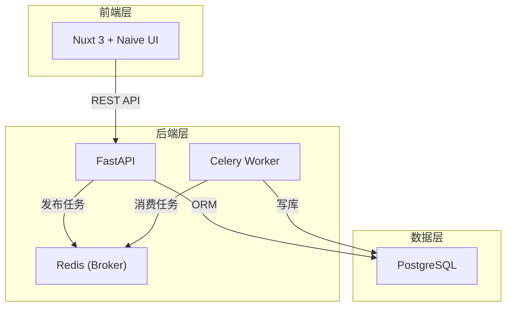
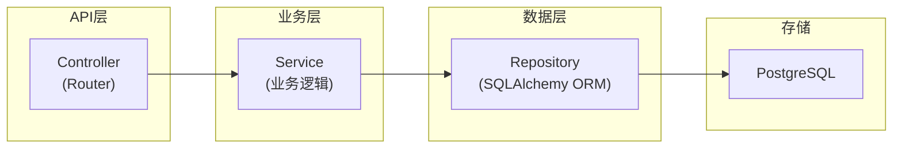
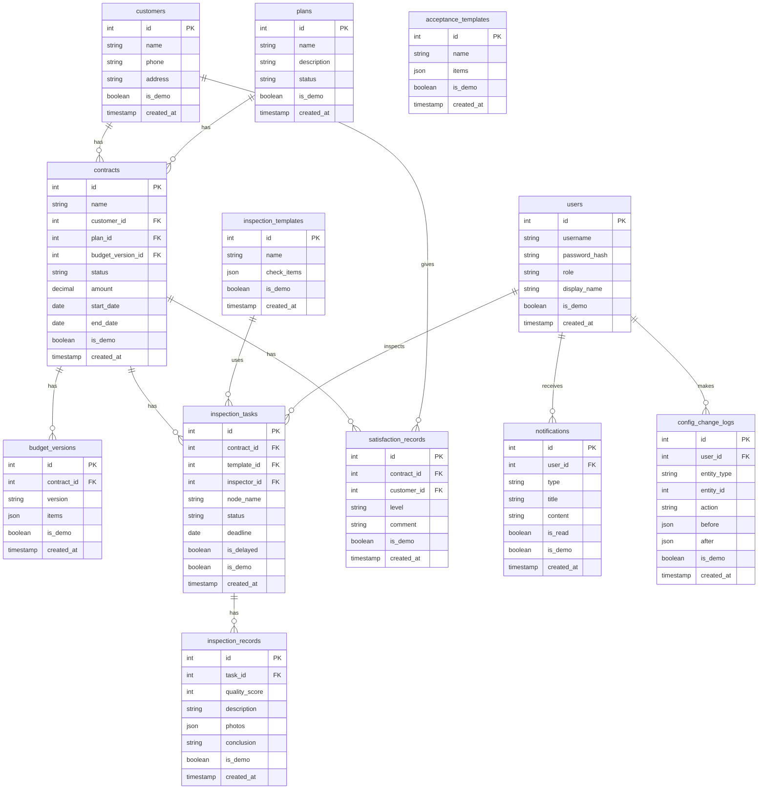

## 1. 架构设计



## 2. 技术说明

- 前端：Nuxt 3 + Naive UI + Pinia + TypeScript
- 初始化工具：npx nuxi@latest init
- 后端：FastAPI + SQLAlchemy + Alembic
- 任务队列：Celery + Redis
- 数据库：PostgreSQL 15
- API 风格：RESTful JSON

## 3. 路由定义

| 路由 | 用途 |
|------|------|
| `/login` | 登录页 |
| `/` | 工作台仪表盘 |
| `/plans` | 方案列表 |
| `/plans/:id` | 方案详情 |
| `/contracts` | 合同管理 |
| `/contracts/:id` | 合同详情/编辑 |
| `/inspections` | 巡检任务看板 |
| `/inspections/:id` | 巡检任务详情 |
| `/satisfaction` | 满意度看板 |
| `/config/acceptance` | 验收反馈模板配置 |
| `/config/budget` | 预算版本配置 |
| `/config/templates` | 巡检任务模板配置 |
| `/reports` | 质量报表 |
| `/notifications` | 提醒中心 |
| `/demo` | 演示数据管理 |

## 4. API 定义

### 4.1 认证模块

```typescript
POST /api/auth/login
  Request: { username: string; password: string }
  Response: { access_token: string; token_type: string; role: string }

GET /api/auth/me
  Response: { id: number; username: string; role: string; display_name: string }
```

### 4.2 合同模块

```typescript
GET    /api/contracts?page=&size=&status=
  Response: { items: Contract[]; total: number }

POST   /api/contracts
  Request: { name: string; customer_id: number; plan_id: number; budget_version_id: number; start_date: string; end_date: string; amount: number; is_demo: boolean }
  Response: Contract

GET    /api/contracts/:id
  Response: Contract

PUT    /api/contracts/:id
  Request: Partial<Contract>
  Response: Contract

DELETE /api/contracts/:id
  Response: { ok: boolean }
```

### 4.3 巡检任务模块

```typescript
GET    /api/inspections?status=&inspector_id=&contract_id=
  Response: { items: InspectionTask[]; total: number }

POST   /api/inspections
  Request: { contract_id: number; template_id: number; inspector_id: number; node_name: string; deadline: string; is_demo: boolean }
  Response: InspectionTask

PUT    /api/inspections/:id/status
  Request: { status: string }
  Response: InspectionTask

POST   /api/inspections/:id/record
  Request: { quality_score: number; description: string; photos: string[]; conclusion: string }
  Response: InspectionRecord
```

### 4.4 满意度模块

```typescript
GET    /api/satisfaction?contract_id=
  Response: SatisfactionRecord[]

PUT    /api/satisfaction/:id
  Request: { level: string; comment: string }
  Response: SatisfactionRecord

POST   /api/satisfaction/:id/remind
  Response: { ok: boolean }
```

### 4.5 配置模块

```typescript
GET    /api/config/acceptance-templates
  Response: AcceptanceTemplate[]

POST   /api/config/acceptance-templates
  Request: { name: string; items: string[] }
  Response: AcceptanceTemplate

GET    /api/config/budget-versions?contract_id=
  Response: BudgetVersion[]

POST   /api/config/budget-versions
  Request: { contract_id: number; version: string; items: BudgetItem[] }
  Response: BudgetVersion

GET    /api/config/inspection-templates
  Response: InspectionTemplate[]

POST   /api/config/inspection-templates
  Request: { name: string; check_items: string[] }
  Response: InspectionTemplate

GET    /api/config/changelog?entity_type=&entity_id=
  Response: ConfigChangeLog[]
```

### 4.6 报表模块

```typescript
GET    /api/reports/quality?year=&month=
  Response: { avg_score: number; issue_count: number; delay_count: number; details: QualityDetail[] }

GET    /api/reports/delay?year=&month=
  Response: { total: number; by_reason: Record<string, number>; items: DelayItem[] }
```

### 4.7 提醒模块

```typescript
GET    /api/notifications?status=&type=
  Response: { items: Notification[]; total: number }

PUT    /api/notifications/:id/read
  Response: { ok: boolean }
```

### 4.8 演示数据模块

```typescript
POST   /api/demo/seed
  Response: { ok: boolean; count: number }

DELETE /api/demo/clear
  Response: { ok: boolean; deleted: { contracts: number; inspections: number; records: number } }
```

## 5. 服务架构图



## 6. 数据模型

### 6.1 数据模型定义



### 6.2 数据定义语言

```sql
CREATE TABLE users (
    id SERIAL PRIMARY KEY,
    username VARCHAR(64) NOT NULL UNIQUE,
    password_hash VARCHAR(256) NOT NULL,
    role VARCHAR(20) NOT NULL DEFAULT 'inspector',
    display_name VARCHAR(64) NOT NULL,
    is_demo BOOLEAN NOT NULL DEFAULT FALSE,
    created_at TIMESTAMP NOT NULL DEFAULT NOW()
);

CREATE TABLE customers (
    id SERIAL PRIMARY KEY,
    name VARCHAR(128) NOT NULL,
    phone VARCHAR(20),
    address VARCHAR(256),
    is_demo BOOLEAN NOT NULL DEFAULT FALSE,
    created_at TIMESTAMP NOT NULL DEFAULT NOW()
);

CREATE TABLE plans (
    id SERIAL PRIMARY KEY,
    name VARCHAR(128) NOT NULL,
    description TEXT,
    status VARCHAR(20) NOT NULL DEFAULT 'draft',
    is_demo BOOLEAN NOT NULL DEFAULT FALSE,
    created_at TIMESTAMP NOT NULL DEFAULT NOW()
);

CREATE TABLE contracts (
    id SERIAL PRIMARY KEY,
    name VARCHAR(128) NOT NULL,
    customer_id INTEGER NOT NULL REFERENCES customers(id),
    plan_id INTEGER NOT NULL REFERENCES plans(id),
    budget_version_id INTEGER REFERENCES budget_versions(id),
    status VARCHAR(20) NOT NULL DEFAULT 'draft',
    amount DECIMAL(12,2) NOT NULL DEFAULT 0,
    start_date DATE,
    end_date DATE,
    is_demo BOOLEAN NOT NULL DEFAULT FALSE,
    created_at TIMESTAMP NOT NULL DEFAULT NOW()
);

CREATE TABLE budget_versions (
    id SERIAL PRIMARY KEY,
    contract_id INTEGER NOT NULL REFERENCES contracts(id),
    version VARCHAR(32) NOT NULL,
    items JSONB NOT NULL DEFAULT '[]',
    is_demo BOOLEAN NOT NULL DEFAULT FALSE,
    created_at TIMESTAMP NOT NULL DEFAULT NOW()
);

CREATE TABLE acceptance_templates (
    id SERIAL PRIMARY KEY,
    name VARCHAR(128) NOT NULL,
    items JSONB NOT NULL DEFAULT '[]',
    is_demo BOOLEAN NOT NULL DEFAULT FALSE,
    created_at TIMESTAMP NOT NULL DEFAULT NOW()
);

CREATE TABLE inspection_templates (
    id SERIAL PRIMARY KEY,
    name VARCHAR(128) NOT NULL,
    check_items JSONB NOT NULL DEFAULT '[]',
    is_demo BOOLEAN NOT NULL DEFAULT FALSE,
    created_at TIMESTAMP NOT NULL DEFAULT NOW()
);

CREATE TABLE inspection_tasks (
    id SERIAL PRIMARY KEY,
    contract_id INTEGER NOT NULL REFERENCES contracts(id),
    template_id INTEGER REFERENCES inspection_templates(id),
    inspector_id INTEGER NOT NULL REFERENCES users(id),
    node_name VARCHAR(128) NOT NULL,
    status VARCHAR(20) NOT NULL DEFAULT 'pending',
    deadline DATE NOT NULL,
    is_delayed BOOLEAN NOT NULL DEFAULT FALSE,
    is_demo BOOLEAN NOT NULL DEFAULT FALSE,
    created_at TIMESTAMP NOT NULL DEFAULT NOW()
);

CREATE TABLE inspection_records (
    id SERIAL PRIMARY KEY,
    task_id INTEGER NOT NULL REFERENCES inspection_tasks(id),
    quality_score INTEGER NOT NULL DEFAULT 0,
    description TEXT,
    photos JSONB NOT NULL DEFAULT '[]',
    conclusion VARCHAR(32),
    is_demo BOOLEAN NOT NULL DEFAULT FALSE,
    created_at TIMESTAMP NOT NULL DEFAULT NOW()
);

CREATE TABLE satisfaction_records (
    id SERIAL PRIMARY KEY,
    contract_id INTEGER NOT NULL REFERENCES contracts(id),
    customer_id INTEGER NOT NULL REFERENCES customers(id),
    level VARCHAR(20) NOT NULL DEFAULT 'pending',
    comment TEXT,
    is_demo BOOLEAN NOT NULL DEFAULT FALSE,
    created_at TIMESTAMP NOT NULL DEFAULT NOW()
);

CREATE TABLE notifications (
    id SERIAL PRIMARY KEY,
    user_id INTEGER NOT NULL REFERENCES users(id),
    type VARCHAR(32) NOT NULL,
    title VARCHAR(256) NOT NULL,
    content TEXT,
    is_read BOOLEAN NOT NULL DEFAULT FALSE,
    is_demo BOOLEAN NOT NULL DEFAULT FALSE,
    created_at TIMESTAMP NOT NULL DEFAULT NOW()
);

CREATE TABLE config_change_logs (
    id SERIAL PRIMARY KEY,
    user_id INTEGER NOT NULL REFERENCES users(id),
    entity_type VARCHAR(64) NOT NULL,
    entity_id INTEGER NOT NULL,
    action VARCHAR(20) NOT NULL,
    before_data JSONB,
    after_data JSONB,
    is_demo BOOLEAN NOT NULL DEFAULT FALSE,
    created_at TIMESTAMP NOT NULL DEFAULT NOW()
);

CREATE INDEX idx_contracts_customer ON contracts(customer_id);
CREATE INDEX idx_contracts_status ON contracts(status);
CREATE INDEX idx_inspection_tasks_contract ON inspection_tasks(contract_id);
CREATE INDEX idx_inspection_tasks_inspector ON inspection_tasks(inspector_id);
CREATE INDEX idx_inspection_tasks_status ON inspection_tasks(status);
CREATE INDEX idx_inspection_tasks_deadline ON inspection_tasks(deadline);
CREATE INDEX idx_notifications_user ON notifications(user_id);
CREATE INDEX idx_notifications_read ON notifications(is_read);
CREATE INDEX idx_config_logs_entity ON config_change_logs(entity_type, entity_id);
CREATE INDEX idx_is_demo ON contracts(is_demo);
CREATE INDEX idx_is_demo_inspections ON inspection_tasks(is_demo);
```
