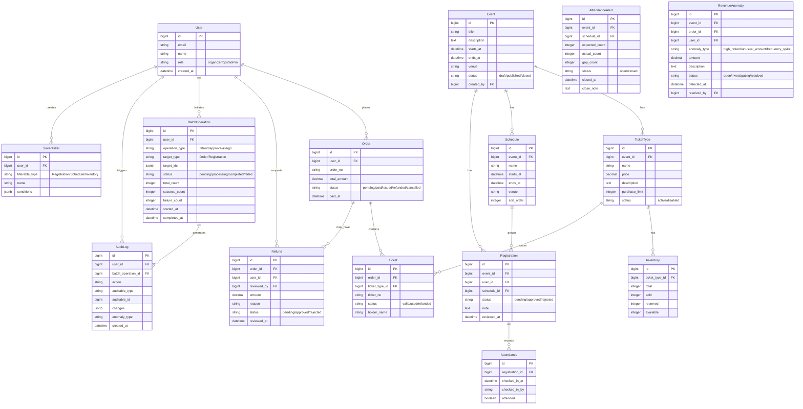

## 1. 架构设计

```mermaid
graph TB
    subgraph "前端层"
        "Hotwire Turbo + Stimulus"
        "Tailwind CSS"
    end
    subgraph "应用层 - Ruby on Rails 7"
        "Controllers"
        "Models"
        "Services"
        "Jobs"
    end
    subgraph "后台任务 - Sidekiq"
        "AttendanceAlertJob"
        "BatchProcessJob"
        "RevenueAnomalyJob"
        "InventorySyncJob"
    end
    subgraph "数据层"
        "PostgreSQL"
        "Redis"
    end
    "Hotwire Turbo + Stimulus" --> "Controllers"
    "Controllers" --> "Services"
    "Services" --> "Models"
    "Models" --> "PostgreSQL"
    "Services" --> "Jobs"
    "Jobs" --> "Sidekiq"
    "Sidekiq" --> "Redis"
    "Jobs" --> "Models"
    "Models" --> "PostgreSQL"
```

## 2. 技术说明

- **前端**：Hotwire (Turbo + Stimulus) + Tailwind CSS
- **后端**：Ruby on Rails 7.1+
- **数据库**：PostgreSQL 16
- **缓存/队列**：Redis 7
- **后台任务**：Sidekiq 7
- **初始化工具**：rails new

## 3. 路由定义

| 路由 | 用途 |
|------|------|
| / | 仪表盘首页 |
| /events | 演出大厅 |
| /events/:id | 演出详情与购票 |
| /orders | 订单列表 |
| /orders/:id | 订单详情 |
| /refunds | 退票列表 |
| /refunds/new | 新建退票申请 |
| /admin/ticket_types | 票种管理 |
| /admin/inventories | 库存管理 |
| /admin/registrations | 报名审核 |
| /admin/schedules | 分组赛程 |
| /admin/revenue | 收入分析 |
| /admin/attendance | 到场管理 |
| /admin/batch_operations | 批量操作 |
| /admin/saved_filters | 保存的筛选 |
| /admin/audit_logs | 操作追溯日志 |

## 4. API 定义

### 4.1 演出与购票

```
GET    /events              # 演出列表
GET    /events/:id          # 演出详情（含票种）
POST   /orders              # 创建订单
PATCH  /orders/:id/pay      # 模拟支付
GET    /orders              # 我的订单
GET    /orders/:id          # 订单详情
```

### 4.2 退票

```
POST   /refunds             # 提交退票申请
PATCH  /refunds/:id/approve # 审核通过
PATCH  /refunds/:id/reject  # 审核拒绝
GET    /refunds             # 退票列表
```

### 4.3 管理后台

```
GET/POST/PUT/DELETE /admin/ticket_types     # 票种 CRUD
GET/PUT             /admin/inventories/:id   # 库存管理
GET/PATCH           /admin/registrations     # 报名审核
GET/PUT             /admin/schedules         # 分组赛程
POST                /admin/batch_operations   # 批量操作
GET                 /admin/revenue            # 收入分析
GET/PATCH           /admin/attendance         # 到场管理
POST/GET/DELETE     /admin/saved_filters      # 保存筛选 CRUD
GET                 /admin/audit_logs         # 操作追溯
```

## 5. 服务架构图

```mermaid
graph LR
    "EventService" --> "TicketTypeService"
    "EventService" --> "OrderService"
    "OrderService" --> "InventoryService"
    "OrderService" --> "PaymentService"
    "RefundService" --> "InventoryService"
    "RefundService" --> "RevenueService"
    "RevenueService" --> "AnomalyDetector"
    "AnomalyDetector" --> "AuditLogService"
    "AttendanceService" --> "AlertService"
    "BatchOperationService" --> "AuditLogService"
    "SavedFilterService" --> "PostgreSQL"
```

## 6. 数据模型

### 6.1 数据模型定义



### 6.2 数据定义语言

```sql
CREATE TABLE users (
  id BIGSERIAL PRIMARY KEY,
  email VARCHAR(255) NOT NULL UNIQUE,
  name VARCHAR(100) NOT NULL,
  role VARCHAR(20) NOT NULL DEFAULT 'organizer',
  password_digest VARCHAR(255) NOT NULL,
  created_at TIMESTAMP NOT NULL DEFAULT NOW(),
  updated_at TIMESTAMP NOT NULL DEFAULT NOW()
);

CREATE TABLE events (
  id BIGSERIAL PRIMARY KEY,
  title VARCHAR(255) NOT NULL,
  description TEXT,
  starts_at TIMESTAMP NOT NULL,
  ends_at TIMESTAMP NOT NULL,
  venue VARCHAR(255),
  status VARCHAR(20) NOT NULL DEFAULT 'draft',
  created_by BIGINT REFERENCES users(id),
  created_at TIMESTAMP NOT NULL DEFAULT NOW(),
  updated_at TIMESTAMP NOT NULL DEFAULT NOW()
);

CREATE TABLE ticket_types (
  id BIGSERIAL PRIMARY KEY,
  event_id BIGINT NOT NULL REFERENCES events(id) ON DELETE CASCADE,
  name VARCHAR(100) NOT NULL,
  price DECIMAL(10,2) NOT NULL,
  description TEXT,
  purchase_limit INTEGER DEFAULT 10,
  status VARCHAR(20) NOT NULL DEFAULT 'active',
  created_at TIMESTAMP NOT NULL DEFAULT NOW(),
  updated_at TIMESTAMP NOT NULL DEFAULT NOW()
);

CREATE TABLE inventories (
  id BIGSERIAL PRIMARY KEY,
  ticket_type_id BIGINT NOT NULL REFERENCES ticket_types(id) ON DELETE CASCADE,
  total INTEGER NOT NULL DEFAULT 0,
  sold INTEGER NOT NULL DEFAULT 0,
  reserved INTEGER NOT NULL DEFAULT 0,
  available INTEGER NOT NULL DEFAULT 0,
  created_at TIMESTAMP NOT NULL DEFAULT NOW(),
  updated_at TIMESTAMP NOT NULL DEFAULT NOW()
);

CREATE TABLE orders (
  id BIGSERIAL PRIMARY KEY,
  user_id BIGINT NOT NULL REFERENCES users(id),
  order_no VARCHAR(50) NOT NULL UNIQUE,
  total_amount DECIMAL(10,2) NOT NULL,
  status VARCHAR(20) NOT NULL DEFAULT 'pending',
  paid_at TIMESTAMP,
  created_at TIMESTAMP NOT NULL DEFAULT NOW(),
  updated_at TIMESTAMP NOT NULL DEFAULT NOW()
);

CREATE TABLE tickets (
  id BIGSERIAL PRIMARY KEY,
  order_id BIGINT NOT NULL REFERENCES orders(id),
  ticket_type_id BIGINT NOT NULL REFERENCES ticket_types(id),
  ticket_no VARCHAR(50) NOT NULL UNIQUE,
  status VARCHAR(20) NOT NULL DEFAULT 'valid',
  holder_name VARCHAR(100),
  created_at TIMESTAMP NOT NULL DEFAULT NOW(),
  updated_at TIMESTAMP NOT NULL DEFAULT NOW()
);

CREATE TABLE refunds (
  id BIGSERIAL PRIMARY KEY,
  order_id BIGINT NOT NULL REFERENCES orders(id),
  user_id BIGINT NOT NULL REFERENCES users(id),
  reviewed_by BIGINT REFERENCES users(id),
  amount DECIMAL(10,2) NOT NULL,
  reason TEXT,
  status VARCHAR(20) NOT NULL DEFAULT 'pending',
  reviewed_at TIMESTAMP,
  created_at TIMESTAMP NOT NULL DEFAULT NOW(),
  updated_at TIMESTAMP NOT NULL DEFAULT NOW()
);

CREATE TABLE schedules (
  id BIGSERIAL PRIMARY KEY,
  event_id BIGINT NOT NULL REFERENCES events(id) ON DELETE CASCADE,
  name VARCHAR(255) NOT NULL,
  starts_at TIMESTAMP NOT NULL,
  ends_at TIMESTAMP NOT NULL,
  venue VARCHAR(255),
  sort_order INTEGER DEFAULT 0,
  created_at TIMESTAMP NOT NULL DEFAULT NOW(),
  updated_at TIMESTAMP NOT NULL DEFAULT NOW()
);

CREATE TABLE registrations (
  id BIGSERIAL PRIMARY KEY,
  event_id BIGINT NOT NULL REFERENCES events(id),
  user_id BIGINT NOT NULL REFERENCES users(id),
  schedule_id BIGINT REFERENCES schedules(id),
  status VARCHAR(20) NOT NULL DEFAULT 'pending',
  note TEXT,
  reviewed_at TIMESTAMP,
  created_at TIMESTAMP NOT NULL DEFAULT NOW(),
  updated_at TIMESTAMP NOT NULL DEFAULT NOW()
);

CREATE TABLE attendances (
  id BIGSERIAL PRIMARY KEY,
  registration_id BIGINT NOT NULL REFERENCES registrations(id),
  checked_in_at TIMESTAMP,
  checked_in_by VARCHAR(100),
  attended BOOLEAN NOT NULL DEFAULT FALSE,
  created_at TIMESTAMP NOT NULL DEFAULT NOW(),
  updated_at TIMESTAMP NOT NULL DEFAULT NOW()
);

CREATE TABLE attendance_alerts (
  id BIGSERIAL PRIMARY KEY,
  event_id BIGINT NOT NULL REFERENCES events(id),
  schedule_id BIGINT REFERENCES schedules(id),
  expected_count INTEGER NOT NULL DEFAULT 0,
  actual_count INTEGER NOT NULL DEFAULT 0,
  gap_count INTEGER NOT NULL DEFAULT 0,
  status VARCHAR(20) NOT NULL DEFAULT 'open',
  closed_at TIMESTAMP,
  close_note TEXT,
  created_at TIMESTAMP NOT NULL DEFAULT NOW(),
  updated_at TIMESTAMP NOT NULL DEFAULT NOW()
);

CREATE TABLE saved_filters (
  id BIGSERIAL PRIMARY KEY,
  user_id BIGINT NOT NULL REFERENCES users(id),
  filterable_type VARCHAR(50) NOT NULL,
  name VARCHAR(100) NOT NULL,
  conditions JSONB NOT NULL DEFAULT '{}',
  created_at TIMESTAMP NOT NULL DEFAULT NOW(),
  updated_at TIMESTAMP NOT NULL DEFAULT NOW()
);

CREATE TABLE batch_operations (
  id BIGSERIAL PRIMARY KEY,
  user_id BIGINT NOT NULL REFERENCES users(id),
  operation_type VARCHAR(50) NOT NULL,
  target_type VARCHAR(50) NOT NULL,
  target_ids JSONB NOT NULL DEFAULT '[]',
  status VARCHAR(20) NOT NULL DEFAULT 'pending',
  total_count INTEGER DEFAULT 0,
  success_count INTEGER DEFAULT 0,
  failure_count INTEGER DEFAULT 0,
  started_at TIMESTAMP,
  completed_at TIMESTAMP,
  created_at TIMESTAMP NOT NULL DEFAULT NOW(),
  updated_at TIMESTAMP NOT NULL DEFAULT NOW()
);

CREATE TABLE audit_logs (
  id BIGSERIAL PRIMARY KEY,
  user_id BIGINT REFERENCES users(id),
  batch_operation_id BIGINT REFERENCES batch_operations(id),
  action VARCHAR(100) NOT NULL,
  auditable_type VARCHAR(50),
  auditable_id BIGINT,
  changes JSONB DEFAULT '{}',
  anomaly_type VARCHAR(50),
  created_at TIMESTAMP NOT NULL DEFAULT NOW()
);

CREATE TABLE revenue_anomalies (
  id BIGSERIAL PRIMARY KEY,
  event_id BIGINT NOT NULL REFERENCES events(id),
  order_id BIGINT REFERENCES orders(id),
  user_id BIGINT REFERENCES users(id),
  anomaly_type VARCHAR(50) NOT NULL,
  amount DECIMAL(10,2),
  description TEXT,
  status VARCHAR(20) NOT NULL DEFAULT 'open',
  detected_at TIMESTAMP NOT NULL DEFAULT NOW(),
  resolved_by BIGINT REFERENCES users(id),
  resolved_at TIMESTAMP,
  created_at TIMESTAMP NOT NULL DEFAULT NOW(),
  updated_at TIMESTAMP NOT NULL DEFAULT NOW()
);

-- 索引
CREATE INDEX idx_orders_user_id ON orders(user_id);
CREATE INDEX idx_orders_status ON orders(status);
CREATE INDEX idx_orders_created_at ON orders(created_at);
CREATE INDEX idx_tickets_order_id ON tickets(order_id);
CREATE INDEX idx_tickets_ticket_type_id ON tickets(ticket_type_id);
CREATE INDEX idx_refunds_order_id ON refunds(order_id);
CREATE INDEX idx_refunds_status ON refunds(status);
CREATE INDEX idx_registrations_event_id ON registrations(event_id);
CREATE INDEX idx_registrations_status ON registrations(status);
CREATE INDEX idx_attendances_registration_id ON attendances(registration_id);
CREATE INDEX idx_attendance_alerts_event_id ON attendance_alerts(event_id);
CREATE INDEX idx_attendance_alerts_status ON attendance_alerts(status);
CREATE INDEX idx_saved_filters_user_type ON saved_filters(user_id, filterable_type);
CREATE INDEX idx_batch_operations_user_id ON batch_operations(user_id);
CREATE INDEX idx_batch_operations_status ON batch_operations(status);
CREATE INDEX idx_audit_logs_user_id ON audit_logs(user_id);
CREATE INDEX idx_audit_logs_auditable ON audit_logs(auditable_type, auditable_id);
CREATE INDEX idx_audit_logs_created_at ON audit_logs(created_at);
CREATE INDEX idx_revenue_anomalies_event_id ON revenue_anomalies(event_id);
CREATE INDEX idx_revenue_anomalies_status ON revenue_anomalies(status);
CREATE INDEX idx_inventories_ticket_type_id ON inventories(ticket_type_id);
```
