## 1. 架构设计

```mermaid
graph TB
    subgraph "前端层"
        "Nuxt 3 页面" --> "Vue 组件"
        "Vue 组件" --> "Pinia 状态管理"
        "Pinia 状态管理" --> "useFetch API调用"
    end
    subgraph "服务端层 - Nitro"
        "API Routes" --> "Service 层"
        "Service 层" --> "Prisma ORM"
        "Service 层" --> "Redis 缓存"
    end
    subgraph "数据层"
        "Prisma ORM" --> "MySQL"
        "Redis 缓存" --> "Redis"
    end
    "useFetch API调用" --> "API Routes"
```

## 2. 技术说明
- 前端：Nuxt 3 + Vue 3 + Tailwind CSS + Pinia
- 初始化工具：npx nuxi init
- 服务端：Nitro（Nuxt 3 内置）
- ORM：Prisma
- 数据库：MySQL
- 缓存：Redis（ioredis）
- 图表：Chart.js / vue-chartjs

## 3. 路由定义
| 路由 | 用途 |
|------|------|
| / | 经营看板首页，展示概览指标和预警 |
| /appointments | 预约管理页，预约列表与CRUD |
| /payments | 支付管理页，收银单列表与详情 |
| /tasks | 待办处理页，待办列表与处理视图 |
| /statistics | 运营统计页，收入/客流/转化/配件报表 |

## 4. API定义

### 4.1 预约服务 API
```typescript
// GET /api/appointments - 获取预约列表
interface GetAppointmentsQuery {
  status?: 'PENDING' | 'CONFIRMED' | 'IN_PROGRESS' | 'COMPLETED' | 'CANCELLED'
  dateFrom?: string
  dateTo?: string
  assigneeId?: string
  page?: number
  pageSize?: number
}
interface AppointmentListResponse {
  items: Appointment[]
  total: number
  page: number
  pageSize: number
}

// POST /api/appointments - 创建预约
interface CreateAppointmentBody {
  customerName: string
  customerPhone: string
  vehicleId: string
  serviceType: 'WASH' | 'MAINTENANCE' | 'TEST_DRIVE'
  scheduledAt: string
  assigneeId: string
  notes?: string
}

// PUT /api/appointments/:id - 更新预约
interface UpdateAppointmentBody {
  status?: string
  scheduledAt?: string
  assigneeId?: string
  notes?: string
}

// GET /api/appointments/:id - 获取预约详情
```

### 4.2 支付管理 API
```typescript
// GET /api/payments - 获取收银单列表
interface GetPaymentsQuery {
  status?: 'PENDING' | 'PAID' | 'REFUNDED'
  dateFrom?: string
  dateTo?: string
  page?: number
  pageSize?: number
}

// POST /api/payments - 创建收银单
interface CreatePaymentBody {
  appointmentId: string
  amount: number
  items: PaymentItem[]
  method: 'CASH' | 'WECHAT' | 'ALIPAY' | 'CARD'
}

// PUT /api/payments/:id/status - 更新支付状态
```

### 4.3 待办处理 API
```typescript
// GET /api/tasks - 获取待办列表
interface GetTasksQuery {
  status?: 'PENDING' | 'IN_PROGRESS' | 'COMPLETED'
  dateFrom?: string
  dateTo?: string
  assigneeId?: string
  page?: number
  pageSize?: number
}

// POST /api/tasks/:id/process - 处理待办
interface ProcessTaskBody {
  action: string
  notes?: string
  linkedTemplateId?: string
  linkedPaymentId?: string
  linkedVehicleId?: string
}

// GET /api/tasks/:id/timeline - 获取待办处理时间轴
```

### 4.4 统计 API
```typescript
// GET /api/statistics/dashboard - 看板概览数据
interface DashboardResponse {
  todayAppointments: number
  todayRevenue: number
  todayFootTraffic: number
  conversionRate: number
  conversionAlert: boolean
  alertMessage?: string
  pendingTasks: number
}

// GET /api/statistics/revenue - 收入统计
interface RevenueQuery {
  period: 'day' | 'week' | 'month'
  dateFrom: string
  dateTo: string
}

// GET /api/statistics/traffic - 客流统计
// GET /api/statistics/conversion - 到店转化率
// GET /api/statistics/parts-turnover - 配件周转报表
```

### 4.5 基础数据 API
```typescript
// GET /api/vehicles - 车辆档案列表
// GET /api/vehicles/:id - 车辆档案详情
// GET /api/templates - 检测模板列表
// GET /api/templates/:id - 检测模板详情
// GET /api/users - 用户(负责人)列表
```

## 5. 服务端架构图

```mermaid
graph LR
    "Controller(Nitro API Routes)" --> "Service(业务逻辑层)"
    "Service(业务逻辑层)" --> "Repository(Prisma数据访问)"
    "Repository(Prisma数据访问)" --> "MySQL"
    "Service(业务逻辑层)" --> "Redis Cache(缓存层)"
    "Redis Cache(缓存层)" --> "Redis"
```

## 6. 数据模型

### 6.1 数据模型定义

```mermaid
erDiagram
    "Store" {
        String id PK
        String name
        String address
        String phone
        DateTime createdAt
    }
    "User" {
        String id PK
        String name
        String role
        String phone
        String storeId FK
    }
    "Vehicle" {
        String id PK
        String plateNumber
        String brand
        String model
        String color
        String ownerName
        String ownerPhone
        DateTime createdAt
    }
    "Appointment" {
        String id PK
        String customerName
        String customerPhone
        String vehicleId FK
        String serviceType
        String status
        DateTime scheduledAt
        String assigneeId FK
        String storeId FK
        String notes
        DateTime createdAt
        DateTime updatedAt
    }
    "Payment" {
        String id PK
        String appointmentId FK
        Decimal amount
        String method
        String status
        DateTime paidAt
        DateTime createdAt
    }
    "PaymentItem" {
        String id PK
        String paymentId FK
        String name
        Decimal price
        Int quantity
    }
    "InspectionTemplate" {
        String id PK
        String name
        String category
        String content
        DateTime createdAt
    }
    "Task" {
        String id PK
        String title
        String description
        String status
        String priority
        String assigneeId FK
        String storeId FK
        String vehicleId FK
        String appointmentId FK
        DateTime dueDate
        DateTime createdAt
        DateTime updatedAt
    }
    "TaskProcessLog" {
        String id PK
        String taskId FK
        String action
        String notes
        String operatorId FK
        String linkedTemplateId FK
        String linkedPaymentId FK
        String linkedVehicleId FK
        DateTime createdAt
    }
    "PartsTurnover" {
        String id PK
        String partName
        String partCode
        Int stockQuantity
        Int usedQuantity
        Decimal turnoverRate
        String storeId FK
        DateTime period
        DateTime updatedAt
    }
    "ConversionAlert" {
        String id PK
        String storeId FK
        Decimal conversionRate
        Decimal threshold
        String alertLevel
        String message
        Boolean resolved
        DateTime createdAt
    }

    "Store" ||--o{ "User" : "employs"
    "Store" ||--o{ "Appointment" : "receives"
    "Store" ||--o{ "Task" : "has"
    "Store" ||--o{ "PartsTurnover" : "tracks"
    "Store" ||--o{ "ConversionAlert" : "monitors"
    "Vehicle" ||--o{ "Appointment" : "served by"
    "User" ||--o{ "Appointment" : "assigned to"
    "User" ||--o{ "Task" : "assigned to"
    "Appointment" ||--o| "Payment" : "generates"
    "Payment" ||--o{ "PaymentItem" : "contains"
    "Task" ||--o{ "TaskProcessLog" : "has"
    "InspectionTemplate" ||--o{ "TaskProcessLog" : "referenced in"
    "Payment" ||--o{ "TaskProcessLog" : "linked in"
    "Vehicle" ||--o{ "Task" : "related to"
    "Vehicle" ||--o{ "TaskProcessLog" : "referenced in"
    "User" ||--o{ "TaskProcessLog" : "operates"
```



### 6.2 数据定义语言

```sql
CREATE TABLE Store (
  id VARCHAR(36) PRIMARY KEY,
  name VARCHAR(100) NOT NULL,
  address VARCHAR(255),
  phone VARCHAR(20),
  createdAt DATETIME DEFAULT CURRENT_TIMESTAMP
);

CREATE TABLE User (
  id VARCHAR(36) PRIMARY KEY,
  name VARCHAR(50) NOT NULL,
  role ENUM('MANAGER','OPERATOR') NOT NULL,
  phone VARCHAR(20),
  storeId VARCHAR(36) NOT NULL,
  createdAt DATETIME DEFAULT CURRENT_TIMESTAMP,
  FOREIGN KEY (storeId) REFERENCES Store(id)
);

CREATE TABLE Vehicle (
  id VARCHAR(36) PRIMARY KEY,
  plateNumber VARCHAR(20) NOT NULL UNIQUE,
  brand VARCHAR(50),
  model VARCHAR(50),
  color VARCHAR(20),
  ownerName VARCHAR(50),
  ownerPhone VARCHAR(20),
  createdAt DATETIME DEFAULT CURRENT_TIMESTAMP
);

CREATE TABLE Appointment (
  id VARCHAR(36) PRIMARY KEY,
  customerName VARCHAR(50) NOT NULL,
  customerPhone VARCHAR(20),
  vehicleId VARCHAR(36) NOT NULL,
  serviceType ENUM('WASH','MAINTENANCE','TEST_DRIVE') NOT NULL,
  status ENUM('PENDING','CONFIRMED','IN_PROGRESS','COMPLETED','CANCELLED') DEFAULT 'PENDING',
  scheduledAt DATETIME NOT NULL,
  assigneeId VARCHAR(36) NOT NULL,
  storeId VARCHAR(36) NOT NULL,
  notes TEXT,
  createdAt DATETIME DEFAULT CURRENT_TIMESTAMP,
  updatedAt DATETIME DEFAULT CURRENT_TIMESTAMP ON UPDATE CURRENT_TIMESTAMP,
  FOREIGN KEY (vehicleId) REFERENCES Vehicle(id),
  FOREIGN KEY (assigneeId) REFERENCES User(id),
  FOREIGN KEY (storeId) REFERENCES Store(id),
  INDEX idx_appointment_status (status),
  INDEX idx_appointment_date (scheduledAt),
  INDEX idx_appointment_assignee (assigneeId)
);

CREATE TABLE Payment (
  id VARCHAR(36) PRIMARY KEY,
  appointmentId VARCHAR(36) NOT NULL,
  amount DECIMAL(10,2) NOT NULL,
  method ENUM('CASH','WECHAT','ALIPAY','CARD') NOT NULL,
  status ENUM('PENDING','PAID','REFUNDED') DEFAULT 'PENDING',
  paidAt DATETIME,
  createdAt DATETIME DEFAULT CURRENT_TIMESTAMP,
  FOREIGN KEY (appointmentId) REFERENCES Appointment(id),
  INDEX idx_payment_status (status),
  INDEX idx_payment_date (createdAt)
);

CREATE TABLE PaymentItem (
  id VARCHAR(36) PRIMARY KEY,
  paymentId VARCHAR(36) NOT NULL,
  name VARCHAR(100) NOT NULL,
  price DECIMAL(10,2) NOT NULL,
  quantity INT NOT NULL DEFAULT 1,
  FOREIGN KEY (paymentId) REFERENCES Payment(id)
);

CREATE TABLE InspectionTemplate (
  id VARCHAR(36) PRIMARY KEY,
  name VARCHAR(100) NOT NULL,
  category VARCHAR(50),
  content JSON NOT NULL,
  createdAt DATETIME DEFAULT CURRENT_TIMESTAMP
);

CREATE TABLE Task (
  id VARCHAR(36) PRIMARY KEY,
  title VARCHAR(200) NOT NULL,
  description TEXT,
  status ENUM('PENDING','IN_PROGRESS','COMPLETED') DEFAULT 'PENDING',
  priority ENUM('LOW','MEDIUM','HIGH','URGENT') DEFAULT 'MEDIUM',
  assigneeId VARCHAR(36) NOT NULL,
  storeId VARCHAR(36) NOT NULL,
  vehicleId VARCHAR(36),
  appointmentId VARCHAR(36),
  dueDate DATETIME,
  createdAt DATETIME DEFAULT CURRENT_TIMESTAMP,
  updatedAt DATETIME DEFAULT CURRENT_TIMESTAMP ON UPDATE CURRENT_TIMESTAMP,
  FOREIGN KEY (assigneeId) REFERENCES User(id),
  FOREIGN KEY (storeId) REFERENCES Store(id),
  FOREIGN KEY (vehicleId) REFERENCES Vehicle(id),
  FOREIGN KEY (appointmentId) REFERENCES Appointment(id),
  INDEX idx_task_status (status),
  INDEX idx_task_date (dueDate),
  INDEX idx_task_assignee (assigneeId)
);

CREATE TABLE TaskProcessLog (
  id VARCHAR(36) PRIMARY KEY,
  taskId VARCHAR(36) NOT NULL,
  action VARCHAR(100) NOT NULL,
  notes TEXT,
  operatorId VARCHAR(36) NOT NULL,
  linkedTemplateId VARCHAR(36),
  linkedPaymentId VARCHAR(36),
  linkedVehicleId VARCHAR(36),
  createdAt DATETIME DEFAULT CURRENT_TIMESTAMP,
  FOREIGN KEY (taskId) REFERENCES Task(id),
  FOREIGN KEY (operatorId) REFERENCES User(id),
  FOREIGN KEY (linkedTemplateId) REFERENCES InspectionTemplate(id),
  FOREIGN KEY (linkedPaymentId) REFERENCES Payment(id),
  FOREIGN KEY (linkedVehicleId) REFERENCES Vehicle(id),
  INDEX idx_processlog_task (taskId)
);

CREATE TABLE PartsTurnover (
  id VARCHAR(36) PRIMARY KEY,
  partName VARCHAR(100) NOT NULL,
  partCode VARCHAR(50) NOT NULL,
  stockQuantity INT NOT NULL DEFAULT 0,
  usedQuantity INT NOT NULL DEFAULT 0,
  turnoverRate DECIMAL(5,2) DEFAULT 0,
  storeId VARCHAR(36) NOT NULL,
  period DATETIME NOT NULL,
  updatedAt DATETIME DEFAULT CURRENT_TIMESTAMP ON UPDATE CURRENT_TIMESTAMP,
  FOREIGN KEY (storeId) REFERENCES Store(id),
  INDEX idx_parts_store (storeId),
  INDEX idx_parts_period (period)
);

CREATE TABLE ConversionAlert (
  id VARCHAR(36) PRIMARY KEY,
  storeId VARCHAR(36) NOT NULL,
  conversionRate DECIMAL(5,2) NOT NULL,
  threshold DECIMAL(5,2) NOT NULL DEFAULT 60.00,
  alertLevel ENUM('WARNING','CRITICAL') NOT NULL,
  message TEXT,
  resolved BOOLEAN DEFAULT FALSE,
  createdAt DATETIME DEFAULT CURRENT_TIMESTAMP,
  FOREIGN KEY (storeId) REFERENCES Store(id),
  INDEX idx_alert_store (storeId),
  INDEX idx_alert_resolved (resolved)
);
```
