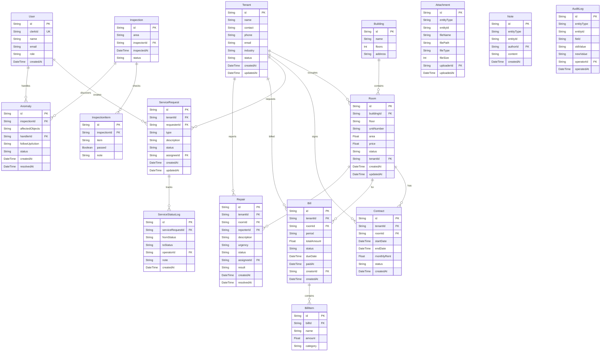

## 1. 架构设计

```mermaid
graph TB
    subgraph "前端层"
        "Next.js App Router" --> "React 组件"
        "React 组件" --> "tRPC Client"
    end

    subgraph "后端层"
        "tRPC Server" --> "Router: tenant"
        "tRPC Server" --> "Router: room"
        "tRPC Server" --> "Router: service"
        "tRPC Server" --> "Router: bill"
        "tRPC Server" --> "Router: repair"
        "tRPC Server" --> "Router: inspection"
        "tRPC Server" --> "Router: auditLog"
    end

    subgraph "数据层"
        "Prisma ORM" --> "PostgreSQL"
    end

    subgraph "外部服务"
        "Clerk Auth" --> "认证中间件"
        "S3/本地存储" --> "附件上传"
    end

    "tRPC Client" --> "tRPC Server"
    "Router: tenant" --> "Prisma ORM"
    "Router: room" --> "Prisma ORM"
    "Router: service" --> "Prisma ORM"
    "Router: bill" --> "Prisma ORM"
    "Router: repair" --> "Prisma ORM"
    "Router: inspection" --> "Prisma ORM"
    "Router: auditLog" --> "Prisma ORM"
    "认证中间件" --> "tRPC Server"
```

## 2. 技术说明

- **前端**：Next.js 14 (App Router) + React 18 + Tailwind CSS 3
- **初始化工具**：create-next-app
- **后端**：tRPC v11 (Next.js 集成)
- **数据库**：PostgreSQL + Prisma ORM
- **认证**：Clerk（提供用户管理、角色、组织）
- **附件存储**：本地文件系统 /public/uploads（可扩展 S3）
- **UI 组件库**：shadcn/ui + Radix UI 原语

## 3. 路由定义

| 路由 | 用途 |
|------|------|
| / | 工作台首页，关键指标与待办 |
| /tenants | 租户档案列表 |
| /tenants/[id] | 租户详情（基本信息/合同/房间/附件/备注） |
| /rooms | 房态看板与价格管理 |
| /services | 服务申请列表 |
| /services/new | 新建服务申请 |
| /services/[id] | 服务申请详情与流转 |
| /bills | 费用账单列表 |
| /bills/new | 生成新账单 |
| /bills/[id] | 账单详情与附件 |
| /repairs | 工程报修列表 |
| /repairs/new | 新建报修工单 |
| /repairs/[id] | 报修详情 |
| /inspections | 巡检管理列表 |
| /inspections/[id] | 巡检记录与异常登记 |
| /audit-logs | 变更记录审计日志 |

## 4. API 定义

### 4.1 tRPC Router 结构

```typescript
// router 根
export const appRouter = router({
  tenant: tenantRouter,
  room: roomRouter,
  service: serviceRouter,
  bill: billRouter,
  repair: repairRouter,
  inspection: inspectionRouter,
  auditLog: auditLogRouter,
  dashboard: dashboardRouter,
});
```

### 4.2 核心 Procedure 签名

```typescript
// tenantRouter
list:   protectedProcedure.input(z.object({ search: z.string().optional(), buildingId: z.string().optional() })).query(...)
get:    protectedProcedure.input(z.object({ id: z.string() })).query(...)
create: protectedProcedure.input(z.object({ name: z.string(), contact: z.string(), phone: z.string(), industry: z.string().optional() })).mutation(...)
update: protectedProcedure.input(z.object({ id: z.string(), ...partialTenant })).mutation(...)

// roomRouter
list:       protectedProcedure.input(z.object({ buildingId: z.string().optional(), status: z.enum(["VACANT","OCCUPIED","MAINTENANCE"]).optional() })).query(...)
updatePrice: protectedProcedure.input(z.object({ id: z.string(), price: z.number() })).mutation(...)

// serviceRouter
list:    protectedProcedure.input(z.object({ status: z.string().optional(), timeRange: z.object({ from: z.date(), to: z.date() }).optional() })).query(...)
create:  protectedProcedure.input(z.object({ tenantId: z.string(), type: z.string(), description: z.string(), attachments: z.array(z.string()).optional() })).mutation(...)
approve: protectedProcedure.input(z.object({ id: z.string(), assigneeId: z.string().optional() })).mutation(...)
reject:  protectedProcedure.input(z.object({ id: z.string(), reason: z.string() })).mutation(...)
complete: protectedProcedure.input(z.object({ id: z.string(), result: z.string() })).mutation(...)

// billRouter
list:    protectedProcedure.input(z.object({ tenantId: z.string().optional(), status: z.string().optional(), month: z.string().optional() })).query(...)
create:  protectedProcedure.input(z.object({ tenantId: z.string(), roomId: z.string(), items: z.array(z.object({ name: z.string(), amount: z.number() })), attachments: z.array(z.string()).optional() })).mutation(...)
markPaid: protectedProcedure.input(z.object({ id: z.string(), paidAt: z.date() })).mutation(...)

// repairRouter
list:     protectedProcedure.input(z.object({ status: z.string().optional(), urgency: z.enum(["HIGH","MEDIUM","LOW"]).optional() })).query(...)
create:   protectedProcedure.input(z.object({ tenantId: z.string(), roomId: z.string(), description: z.string(), urgency: z.enum(["HIGH","MEDIUM","LOW"]), attachments: z.array(z.string()).optional() })).mutation(...)
resolve:  protectedProcedure.input(z.object({ id: z.string(), result: z.string(), attachments: z.array(z.string()).optional() })).mutation(...)

// inspectionRouter
list:        protectedProcedure.input(z.object({ date: z.string().optional(), area: z.string().optional() })).query(...)
create:      protectedProcedure.input(z.object({ area: z.string(), checklist: z.array(z.object({ item: z.string(), passed: z.boolean() })) })).mutation(...)
reportAnomaly: protectedProcedure.input(z.object({ inspectionId: z.string(), affectedObjects: z.array(z.string()), handlerId: z.string(), followUpAction: z.string() })).mutation(...)

// auditLogRouter
list: protectedProcedure.input(z.object({ entity: z.string().optional(), field: z.string().optional(), operatorId: z.string().optional(), timeRange: z.object({ from: z.date(), to: z.date() }).optional() })).query(...)

// dashboardRouter
stats: protectedProcedure.query(...)
todos: protectedProcedure.query(...)
activities: protectedProcedure.input(z.object({ limit: z.number().default(20) })).query(...)
```

## 5. 服务端架构图

```mermaid
graph LR
    "Next.js API Route" --> "tRPC Context (Clerk Auth)"
    "tRPC Context (Clerk Auth)" --> "Router Layer"
    "Router Layer" --> "Service Layer"
    "Service Layer" --> "Prisma Client"
    "Prisma Client" --> "PostgreSQL"
    "Service Layer" --> "Audit Logger"
    "Audit Logger" --> "Prisma Client"
```

## 6. 数据模型

### 6.1 数据模型定义



### 6.2 数据定义语言（Prisma Schema 核心表）

```prisma
model User {
  id        String   @id @default(cuid())
  clerkId   String   @unique
  name      String
  email     String
  role      String   // ADMIN | OPERATOR | TENANT

  serviceRequests ServiceRequest[]  @relation("Requester")
  assignedServices ServiceRequest[] @relation("Assignee")
  assignedRepairs Repair[]          @relation("RepairAssignee")
  inspections     Inspection[]
  handledAnomalies Anomaly[]
  attachments     Attachment[]
  notes           Note[]
  auditLogs       AuditLog[]

  createdAt DateTime @default(now())
}

model Building {
  id      String @id @default(cuid())
  name    String
  floors  Int
  address String?
  rooms   Room[]
}

model Room {
  id           String   @id @default(cuid())
  buildingId   String
  building     Building @relation(fields: [buildingId], references: [id])
  floor        String
  unitNumber   String
  area         Float
  price        Float
  status       String   @default("VACANT") // VACANT | OCCUPIED | MAINTENANCE
  tenantId     String?
  tenant       Tenant?  @relation(fields: [tenantId], references: [id])

  contracts    Contract[]
  bills        Bill[]
  repairs      Repair[]

  createdAt    DateTime @default(now())
  updatedAt    DateTime @updatedAt
}

model Tenant {
  id        String   @id @default(cuid())
  name      String
  contact   String
  phone     String
  email     String?
  industry  String?
  status    String   @default("ACTIVE") // ACTIVE | INACTIVE

  rooms     Room[]
  contracts Contract[]
  serviceRequests ServiceRequest[]
  bills     Bill[]
  repairs   Repair[]

  createdAt DateTime @default(now())
  updatedAt DateTime @updatedAt
}

model AuditLog {
  id          String   @id @default(cuid())
  entityType  String
  entityId    String
  field       String
  oldValue    String?
  newValue    String?
  operatorId  String
  operator    User     @relation(fields: [operatorId], references: [id])
  operatedAt  DateTime @default(now())

  @@index([entityType, entityId])
  @@index([field])
  @@index([operatorId])
  @@index([operatedAt])
}
```
