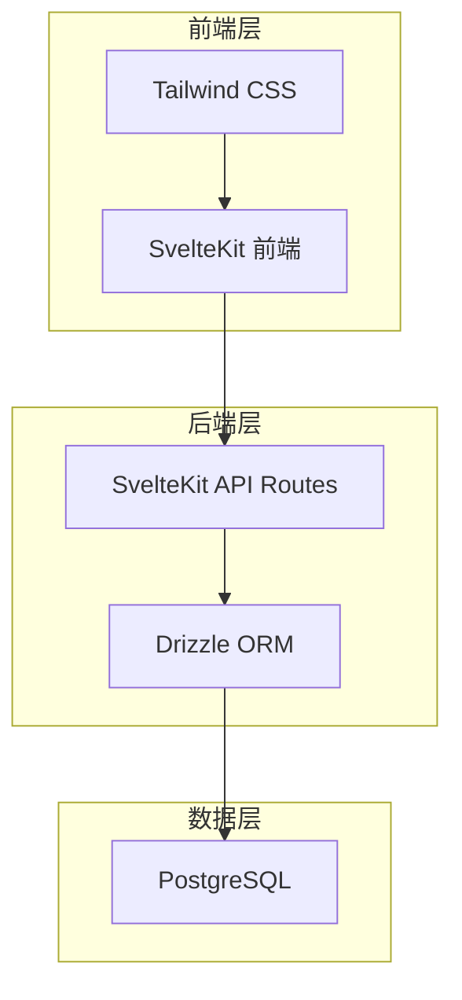
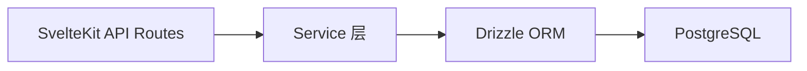
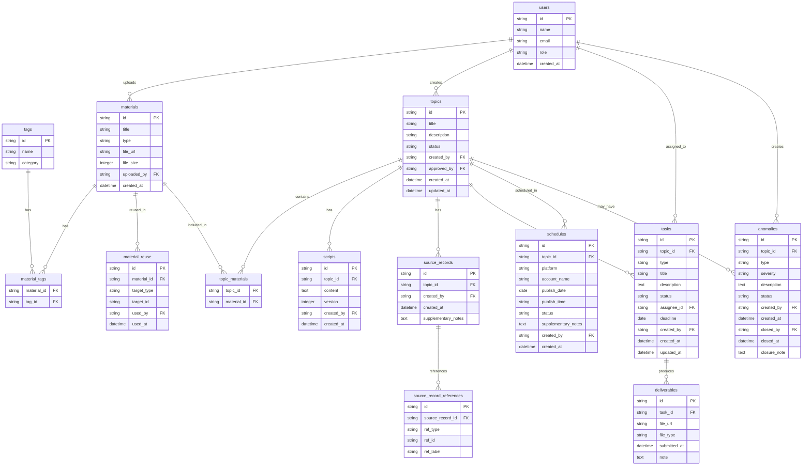

## 1. 架构设计



## 2. 技术说明

- **前端**: SvelteKit + Tailwind CSS + svelte-stores 状态管理
- **初始化工具**: SvelteKit CLI (`npx sv create`)
- **后端**: SvelteKit Server Routes (API Routes)
- **ORM**: Drizzle ORM + drizzle-kit 迁移工具
- **数据库**: PostgreSQL
- **图标**: lucide-svelte

## 3. 路由定义

| 路由 | 用途 |
|------|------|
| `/` | 仪表盘，选题概览、任务进度、异常提醒 |
| `/materials` | 素材库，上传、打标签、筛选、复用记录 |
| `/materials/[id]` | 素材详情与复用溯源 |
| `/topics` | 选题列表，按状态/日期/标签筛选 |
| `/topics/[id]` | 选题详情，脚本编辑、素材关联、来源记录 |
| `/tasks` | 任务列表，按类型/状态/执行人筛选 |
| `/tasks/[id]` | 任务详情，进度跟踪、提交记录 |
| `/schedule` | 发布排期日历视图 |
| `/schedule/[id]` | 排期详情，来源记录与补充说明 |
| `/anomalies` | 异常清单，版本混乱类异常列表 |
| `/anomalies/[id]` | 异常详情与关闭处理 |

## 4. API 定义

### 4.1 素材相关

```typescript
interface Material {
  id: string;
  title: string;
  type: "image" | "video" | "document" | "audio";
  fileUrl: string;
  fileSize: number;
  uploadedBy: string;
  createdAt: Date;
  tags: Tag[];
  reuseCount: number;
}

// POST /api/materials - 上传素材
// GET  /api/materials - 素材列表（支持标签/类型/关键词筛选）
// GET  /api/materials/:id - 素材详情
// PUT  /api/materials/:id - 更新素材信息
// POST /api/materials/:id/tags - 为素材添加标签
// DELETE /api/materials/:id/tags/:tagId - 移除标签
// GET  /api/materials/:id/reuse - 复用记录
```

### 4.2 选题相关

```typescript
interface Topic {
  id: string;
  title: string;
  description: string;
  status: "draft" | "pending_approval" | "approved" | "in_production" | "published" | "archived";
  createdBy: string;
  approvedBy: string | null;
  createdAt: Date;
  updatedAt: Date;
  materials: Material[];
  scripts: Script[];
  sourceRecord: SourceRecord;
}

interface Script {
  id: string;
  topicId: string;
  content: string;
  version: number;
  createdBy: string;
  createdAt: Date;
}

interface SourceRecord {
  id: string;
  topicId: string;
  createdBy: string;
  createdAt: Date;
  supplementaryNotes: string;
  references: { type: "material" | "task" | "schedule"; id: string; label: string }[];
}

// POST /api/topics - 创建选题
// GET  /api/topics - 选题列表
// GET  /api/topics/:id - 选题详情
// PUT  /api/topics/:id - 更新选题
// PUT  /api/topics/:id/status - 选题状态流转
// POST /api/topics/:id/scripts - 添加脚本版本
// GET  /api/topics/:id/scripts - 脚本版本列表
// PUT  /api/topics/:id/materials - 关联素材
```

### 4.3 任务相关

```typescript
interface Task {
  id: string;
  topicId: string;
  type: "shooting" | "editing";
  title: string;
  description: string;
  status: "assigned" | "in_progress" | "submitted" | "reviewing" | "completed";
  assigneeId: string;
  deadline: Date;
  createdBy: string;
  createdAt: Date;
  updatedAt: Date;
  deliverables: Deliverable[];
}

interface Deliverable {
  id: string;
  taskId: string;
  fileUrl: string;
  fileType: string;
  submittedAt: Date;
  note: string;
}

// POST /api/tasks - 创建任务
// GET  /api/tasks - 任务列表
// GET  /api/tasks/:id - 任务详情
// PUT  /api/tasks/:id - 更新任务
// PUT  /api/tasks/:id/status - 任务状态流转
// POST /api/tasks/:id/deliverables - 提交产出
```

### 4.4 排期相关

```typescript
interface Schedule {
  id: string;
  topicId: string;
  platform: string;
  accountName: string;
  publishDate: Date;
  publishTime: string;
  status: "scheduled" | "published" | "cancelled";
  sourceRecord: SourceRecord;
  supplementaryNotes: string;
  createdBy: string;
  createdAt: Date;
}

// POST /api/schedules - 创建排期
// GET  /api/schedules - 排期列表（支持月份筛选）
// GET  /api/schedules/:id - 排期详情
// PUT  /api/schedules/:id - 更新排期
// PUT  /api/schedules/:id/notes - 更新补充说明
```

### 4.5 异常相关

```typescript
interface Anomaly {
  id: string;
  topicId: string;
  type: "version_conflict";
  severity: "low" | "medium" | "high";
  description: string;
  status: "open" | "investigating" | "resolving" | "closed";
  createdBy: string;
  createdAt: Date;
  closedBy: string | null;
  closedAt: Date | null;
  closureNote: string;
}

// POST /api/anomalies - 创建异常
// GET  /api/anomalies - 异常列表
// GET  /api/anomalies/:id - 异常详情
// PUT  /api/anomalies/:id - 更新异常
// PUT  /api/anomalies/:id/close - 关闭异常（必填closureNote）
```

## 5. 服务端架构图



## 6. 数据模型

### 6.1 数据模型定义



### 6.2 数据定义语言

```sql
CREATE TABLE users (
  id UUID PRIMARY KEY DEFAULT gen_random_uuid(),
  name VARCHAR(100) NOT NULL,
  email VARCHAR(255) UNIQUE NOT NULL,
  role VARCHAR(20) NOT NULL CHECK (role IN ('supervisor', 'editor', 'shooter', 'cutter')),
  created_at TIMESTAMPTZ NOT NULL DEFAULT NOW()
);

CREATE TABLE tags (
  id UUID PRIMARY KEY DEFAULT gen_random_uuid(),
  name VARCHAR(50) NOT NULL,
  category VARCHAR(50) NOT NULL DEFAULT 'general'
);

CREATE TABLE materials (
  id UUID PRIMARY KEY DEFAULT gen_random_uuid(),
  title VARCHAR(255) NOT NULL,
  type VARCHAR(20) NOT NULL CHECK (type IN ('image', 'video', 'document', 'audio')),
  file_url TEXT NOT NULL,
  file_size INTEGER NOT NULL DEFAULT 0,
  uploaded_by UUID NOT NULL REFERENCES users(id),
  created_at TIMESTAMPTZ NOT NULL DEFAULT NOW()
);

CREATE TABLE material_tags (
  material_id UUID NOT NULL REFERENCES materials(id) ON DELETE CASCADE,
  tag_id UUID NOT NULL REFERENCES tags(id) ON DELETE CASCADE,
  PRIMARY KEY (material_id, tag_id)
);

CREATE TABLE material_reuse (
  id UUID PRIMARY KEY DEFAULT gen_random_uuid(),
  material_id UUID NOT NULL REFERENCES materials(id) ON DELETE CASCADE,
  target_type VARCHAR(20) NOT NULL CHECK (target_type IN ('topic', 'task', 'schedule')),
  target_id UUID NOT NULL,
  used_by UUID NOT NULL REFERENCES users(id),
  used_at TIMESTAMPTZ NOT NULL DEFAULT NOW()
);

CREATE TABLE topics (
  id UUID PRIMARY KEY DEFAULT gen_random_uuid(),
  title VARCHAR(255) NOT NULL,
  description TEXT,
  status VARCHAR(30) NOT NULL DEFAULT 'draft' CHECK (status IN ('draft', 'pending_approval', 'approved', 'in_production', 'published', 'archived')),
  created_by UUID NOT NULL REFERENCES users(id),
  approved_by UUID REFERENCES users(id),
  created_at TIMESTAMPTZ NOT NULL DEFAULT NOW(),
  updated_at TIMESTAMPTZ NOT NULL DEFAULT NOW()
);

CREATE TABLE topic_materials (
  topic_id UUID NOT NULL REFERENCES topics(id) ON DELETE CASCADE,
  material_id UUID NOT NULL REFERENCES materials(id) ON DELETE CASCADE,
  PRIMARY KEY (topic_id, material_id)
);

CREATE TABLE scripts (
  id UUID PRIMARY KEY DEFAULT gen_random_uuid(),
  topic_id UUID NOT NULL REFERENCES topics(id) ON DELETE CASCADE,
  content TEXT NOT NULL,
  version INTEGER NOT NULL DEFAULT 1,
  created_by UUID NOT NULL REFERENCES users(id),
  created_at TIMESTAMPTZ NOT NULL DEFAULT NOW()
);

CREATE TABLE source_records (
  id UUID PRIMARY KEY DEFAULT gen_random_uuid(),
  topic_id UUID NOT NULL REFERENCES topics(id) ON DELETE CASCADE,
  created_by UUID NOT NULL REFERENCES users(id),
  created_at TIMESTAMPTZ NOT NULL DEFAULT NOW(),
  supplementary_notes TEXT NOT NULL DEFAULT ''
);

CREATE TABLE source_record_references (
  id UUID PRIMARY KEY DEFAULT gen_random_uuid(),
  source_record_id UUID NOT NULL REFERENCES source_records(id) ON DELETE CASCADE,
  ref_type VARCHAR(20) NOT NULL CHECK (ref_type IN ('material', 'task', 'schedule')),
  ref_id UUID NOT NULL,
  ref_label VARCHAR(255) NOT NULL
);

CREATE TABLE tasks (
  id UUID PRIMARY KEY DEFAULT gen_random_uuid(),
  topic_id UUID NOT NULL REFERENCES topics(id) ON DELETE CASCADE,
  type VARCHAR(20) NOT NULL CHECK (type IN ('shooting', 'editing')),
  title VARCHAR(255) NOT NULL,
  description TEXT,
  status VARCHAR(20) NOT NULL DEFAULT 'assigned' CHECK (status IN ('assigned', 'in_progress', 'submitted', 'reviewing', 'completed')),
  assignee_id UUID NOT NULL REFERENCES users(id),
  deadline DATE NOT NULL,
  created_by UUID NOT NULL REFERENCES users(id),
  created_at TIMESTAMPTZ NOT NULL DEFAULT NOW(),
  updated_at TIMESTAMPTZ NOT NULL DEFAULT NOW()
);

CREATE TABLE deliverables (
  id UUID PRIMARY KEY DEFAULT gen_random_uuid(),
  task_id UUID NOT NULL REFERENCES tasks(id) ON DELETE CASCADE,
  file_url TEXT NOT NULL,
  file_type VARCHAR(20) NOT NULL,
  submitted_at TIMESTAMPTZ NOT NULL DEFAULT NOW(),
  note TEXT NOT NULL DEFAULT ''
);

CREATE TABLE schedules (
  id UUID PRIMARY KEY DEFAULT gen_random_uuid(),
  topic_id UUID NOT NULL REFERENCES topics(id) ON DELETE CASCADE,
  platform VARCHAR(50) NOT NULL,
  account_name VARCHAR(100) NOT NULL,
  publish_date DATE NOT NULL,
  publish_time VARCHAR(10) NOT NULL DEFAULT '09:00',
  status VARCHAR(20) NOT NULL DEFAULT 'scheduled' CHECK (status IN ('scheduled', 'published', 'cancelled')),
  supplementary_notes TEXT NOT NULL DEFAULT '',
  created_by UUID NOT NULL REFERENCES users(id),
  created_at TIMESTAMPTZ NOT NULL DEFAULT NOW()
);

CREATE TABLE anomalies (
  id UUID PRIMARY KEY DEFAULT gen_random_uuid(),
  topic_id UUID NOT NULL REFERENCES topics(id) ON DELETE CASCADE,
  type VARCHAR(30) NOT NULL DEFAULT 'version_conflict',
  severity VARCHAR(10) NOT NULL DEFAULT 'medium' CHECK (severity IN ('low', 'medium', 'high')),
  description TEXT NOT NULL,
  status VARCHAR(20) NOT NULL DEFAULT 'open' CHECK (status IN ('open', 'investigating', 'resolving', 'closed')),
  created_by UUID NOT NULL REFERENCES users(id),
  created_at TIMESTAMPTZ NOT NULL DEFAULT NOW(),
  closed_by UUID REFERENCES users(id),
  closed_at TIMESTAMPTZ,
  closure_note TEXT NOT NULL DEFAULT ''
);

CREATE INDEX idx_materials_type ON materials(type);
CREATE INDEX idx_materials_uploaded_by ON materials(uploaded_by);
CREATE INDEX idx_topics_status ON topics(status);
CREATE INDEX idx_topics_created_by ON topics(created_by);
CREATE INDEX idx_tasks_topic_id ON tasks(topic_id);
CREATE INDEX idx_tasks_assignee_id ON tasks(assignee_id);
CREATE INDEX idx_tasks_status ON tasks(status);
CREATE INDEX idx_tasks_type ON tasks(type);
CREATE INDEX idx_schedules_topic_id ON schedules(topic_id);
CREATE INDEX idx_schedules_publish_date ON schedules(publish_date);
CREATE INDEX idx_anomalies_topic_id ON anomalies(topic_id);
CREATE INDEX idx_anomalies_status ON anomalies(status);
CREATE INDEX idx_scripts_topic_id ON scripts(topic_id);
CREATE INDEX idx_material_reuse_material_id ON material_reuse(material_id);
CREATE INDEX idx_source_records_topic_id ON source_records(topic_id);
```
