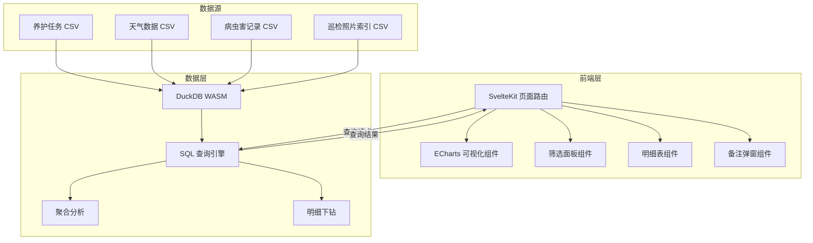
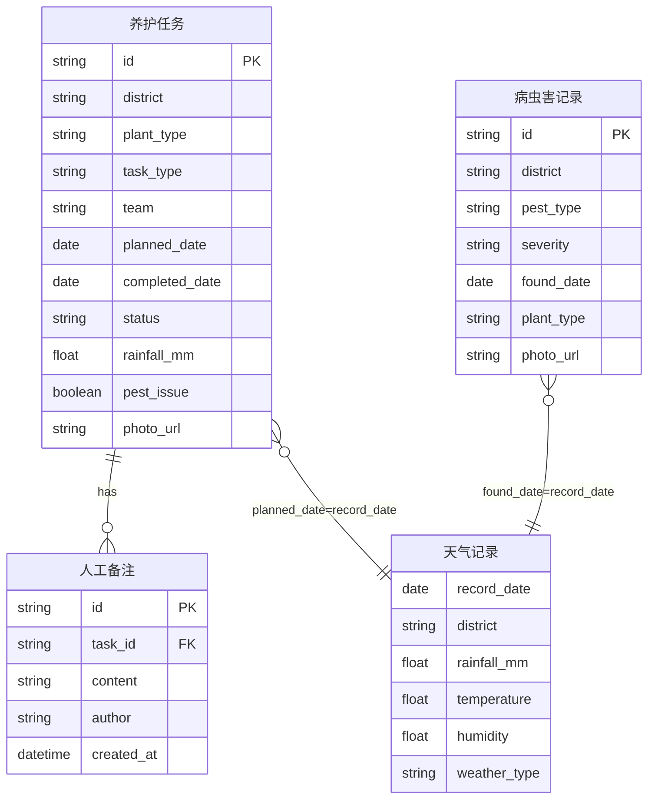

## 1. 架构设计



## 2. 技术说明

- **前端框架**：SvelteKit（Svelte 5 + SvelteKit 2）
- **可视化**：ECharts 5（通过 echarts 包直接集成）
- **数据引擎**：DuckDB WASM（@duckdb/duckdb-wasm），浏览器端 OLAP 分析
- **样式**：TailwindCSS 4
- **图标**：lucide-svelte
- **初始化工具**：SvelteKit CLI（npx sv create）
- **后端**：无独立后端，SvelteKit 服务端加载用于初始数据注入
- **数据库**：DuckDB WASM 内存数据库，CSV 文件预加载

## 3. 路由定义

| 路由 | 用途 |
|------|------|
| `/` | 运营复盘总览页：指标卡片、任务完成趋势、天气关联图 |
| `/pest-map` | 病虫害地图页：片区热力图、虫害分布、时间趋势 |
| `/team-compare` | 班组对比页：雷达图、逾期柱状图、效率散点图 |
| `/detail` | 明细下钻页：任务明细表、照片查看、备注编辑、延期标签 |

## 4. API 定义

本项目采用 DuckDB WASM 浏览器端查询，无 REST API。所有数据交互通过 Svelte stores + DuckDB SQL 查询完成。

核心查询函数：

```typescript
interface FilterState {
  districts: string[];
  plantTypes: string[];
  taskTypes: string[];
  teams: string[];
  dateRange: [Date, Date];
}

interface TaskRecord {
  id: string;
  district: string;
  plantType: string;
  taskType: string;
  team: string;
  plannedDate: string;
  completedDate: string | null;
  status: "completed" | "overdue" | "rain_delayed" | "pending";
  rainfall: number;
  pestIssue: boolean;
  photoUrl: string | null;
  notes: Annotation[];
}

interface Annotation {
  id: string;
  taskId: string;
  content: string;
  author: string;
  createdAt: string;
}

interface AggregationResult {
  dimension: string;
  totalTasks: number;
  completedTasks: number;
  overdueTasks: number;
  rainDelayedTasks: number;
  completionRate: number;
  overdueRate: number;
}
```

## 5. 数据模型

### 5.1 数据模型定义



### 5.2 数据定义

DuckDB 建表语句（WASM 加载时执行）：

```sql
CREATE TABLE maintenance_tasks (
    id VARCHAR PRIMARY KEY,
    district VARCHAR,
    plant_type VARCHAR,
    task_type VARCHAR,
    team VARCHAR,
    planned_date DATE,
    completed_date DATE,
    status VARCHAR,
    rainfall_mm DOUBLE,
    pest_issue BOOLEAN,
    photo_url VARCHAR
);

CREATE TABLE weather_records (
    record_date DATE,
    district VARCHAR,
    rainfall_mm DOUBLE,
    temperature DOUBLE,
    humidity DOUBLE,
    weather_type VARCHAR
);

CREATE TABLE pest_records (
    id VARCHAR PRIMARY KEY,
    district VARCHAR,
    pest_type VARCHAR,
    severity VARCHAR,
    found_date DATE,
    plant_type VARCHAR,
    photo_url VARCHAR
);

CREATE TABLE annotations (
    id VARCHAR PRIMARY KEY,
    task_id VARCHAR REFERENCES maintenance_tasks(id),
    content TEXT,
    author VARCHAR,
    created_at TIMESTAMP
);
```

### 5.3 口径与时间窗口

- **统计周期**：默认近 30 天，可调整为 7 天/90 天/自定义
- **完成率口径**：`SUM(CASE WHEN status='completed' AND rainfall_mm < 10 THEN 1 END) / COUNT(*) * 100`
- **雨天延期口径**：`SUM(CASE WHEN status='rain_delayed' THEN 1 END) / COUNT(*) * 100`
- **人工逾期口径**：`SUM(CASE WHEN status='overdue' THEN 1 END) / COUNT(*) * 100`
- **雨天判定阈值**：计划执行日降雨量 ≥ 10mm
- **病虫害严重度**：`COUNT(pest_records) /养护面积(亩)`，养护面积按片区硬编码
