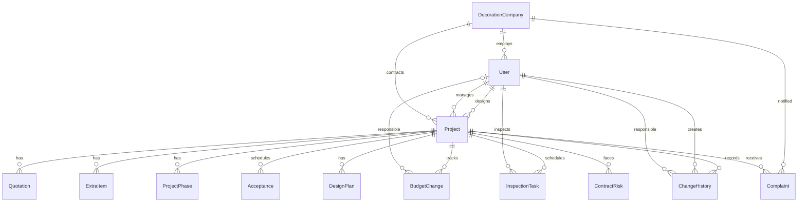

## 1. 架构设计

```mermaid
graph TB
    subgraph "前端 Frontend"
        "Next.js 14 App Router"
        "React 18 Client Components"
        "Tailwind CSS 3"
        "tRPC React Query"
        "Clerk Auth UI"
    end
    subgraph "后端 Backend"
        "Next.js API Routes"
        "tRPC Server Routers"
        "Prisma ORM"
    end
    subgraph "数据层 Data"
        "PostgreSQL"
    end
    subgraph "外部服务 External"
        "Clerk Auth Service"
    end
    "Next.js 14 App Router" --> "tRPC React Query"
    "tRPC React Query" --> "Next.js API Routes"
    "Next.js API Routes" --> "tRPC Server Routers"
    "tRPC Server Routers" --> "Prisma ORM"
    "Prisma ORM" --> "PostgreSQL"
    "Clerk Auth UI" --> "Clerk Auth Service"
    "tRPC Server Routers" --> "Clerk Auth Service"
```

## 2. 技术说明

- **前端**：React@18 + Next.js@14 App Router + Tailwind CSS@3 + tRPC React Query
- **后端**：Next.js API Routes + tRPC Server@11
- **数据库**：PostgreSQL + Prisma@5 ORM
- **认证**：Clerk@5（邮箱登录、角色管理）
- **工具库**：Zod（类型校验）、date-fns（日期处理）、superjson（序列化）、clsx+tailwind-merge（样式合并）
- **UI 改进**：lucide-react（图标替换 emoji）、framer-motion（动画，按需引入）

## 3. 路由定义

| 路由 | 用途 |
|------|------|
| / | 工作台总览——设计师值班首屏，巡检/验收/方案/投诉全展示 |
| /projects | 项目列表——搜索筛选、新建项目 |
| /projects/[id] | 项目详情——8 个标签页全功能 |
| /quotations | 报价/增项确认——设计师快速操作 |
| /phases | 阶段维护——内部后台 |
| /budget | 预算监控——异常追踪+责任人定位 |
| /complaints | 投诉/风险——老板通知+合同风险 |
| /reports | 月度报表——月底复盘 |
| /sign-in | 登录页（Clerk） |
| /sign-up | 注册页（Clerk） |

## 4. API 定义

### 4.1 project Router

```typescript
project.list({ status?, designerId?, search? }) => Project[]
project.getById({ id }) => ProjectDetail
project.create({ name, clientName, clientPhone, ... }) => Project
project.update({ id, status?, designerId?, ... }) => Project
project.getDashboardStats() => { totalProjects, abnormalBudgets, pendingInspections, pendingAcceptances, openComplaints }
project.getAbnormalBudgetList() => BudgetChange[]
```

### 4.2 quotation Router

```typescript
quotation.createQuotation({ projectId, amount, items?, remark? }) => Quotation
quotation.confirmQuotation({ id, confirmed, rejectReason? }) => Quotation
quotation.createExtraItem({ projectId, name, description, amount, reason? }) => ExtraItem
quotation.confirmExtraItem({ id, confirmed, rejectReason? }) => ExtraItem
```

### 4.3 inspection Router

```typescript
inspection.listPending() => InspectionTask[]
inspection.listByProject({ projectId }) => InspectionTask[]
inspection.create({ projectId, title, description?, scheduledDate, inspectorId? }) => InspectionTask
inspection.updateStatus({ id, status, result?, issues? }) => InspectionTask
inspection.listAcceptancesPending() => Acceptance[]
inspection.createAcceptance({ projectId, title, description?, scheduledDate }) => Acceptance
inspection.updateAcceptanceStatus({ id, status, feedback?, passedItems?, rectifyItems? }) => Acceptance
inspection.listDesignPlans({ projectId? }) => DesignPlan[]
inspection.createDesignPlan({ projectId, name, version, fileUrl?, description? }) => DesignPlan
```

### 4.4 complaint Router

```typescript
complaint.list({ status?, projectId? }) => Complaint[]
complaint.listOpen() => Complaint[]
complaint.create({ projectId, title, description, priority, clientName, clientContact, assignedToId? }) => Complaint
complaint.updateStatus({ id, status, resolution?, assignedToId?, notifyBoss? }) => Complaint
complaint.listRisks({ projectId?, reportMonth?, isResolved? }) => ContractRisk[]
complaint.createRisk({ projectId, title, description, riskLevel, category, mitigation? }) => ContractRisk
complaint.resolveRisk({ id, mitigation? }) => ContractRisk
complaint.getMonthlyReport({ month? }) => { month, risks, complaintsStats, projectStats }
```

### 4.5 phase Router

```typescript
phase.listByProject({ projectId }) => ProjectPhase[]
phase.create({ projectId, name, description? }) => ProjectPhase
phase.complete({ id, remark? }) => ProjectPhase
phase.updateProjectStatus({ projectId, status, remark? }) => Project
phase.recordBudgetChange({ projectId, newBudget, reason, responsibleId?, remark? }) => BudgetChange
phase.listChangeHistory({ projectId, entityType?, fieldName? }) => ChangeHistory[]
phase.listAllBudgetChanges() => BudgetChange[]
```

### 4.6 user Router

```typescript
user.list() => User[]
user.listByRole({ role }) => User[]
user.me() => User
user.syncOrCreate({ email, name?, role? }) => User
user.updateRole({ id, role }) => User
user.listDecorationCompanies() => DecorationCompany[]
```

## 5. 服务端架构图

```mermaid
graph LR
    "API Route /api/trpc/[trpc]" --> "tRPC Router"
    "tRPC Router" --> "protectedProcedure"
    "protectedProcedure" --> "Clerk Auth Middleware"
    "Clerk Auth Middleware" --> "requireRole Middleware"
    "requireRole Middleware" --> "Business Logic"
    "Business Logic" --> "Prisma Client"
    "Prisma Client" --> "PostgreSQL"
    "Business Logic" --> "ChangeHistory Logger"
```

## 6. 数据模型

### 6.1 数据模型定义



### 6.2 数据定义语言

```sql
-- 核心表已由 Prisma Schema 管理，以下为关键索引补充

CREATE INDEX IF NOT EXISTS "idx_project_status" ON "Project"("status");
CREATE INDEX IF NOT EXISTS "idx_project_budget_alert" ON "Project"("budgetAlertLevel");
CREATE INDEX IF NOT EXISTS "idx_budget_change_abnormal" ON "BudgetChange"("isAbnormal");
CREATE INDEX IF NOT EXISTS "idx_inspection_status" ON "InspectionTask"("status");
CREATE INDEX IF NOT EXISTS "idx_acceptance_status" ON "Acceptance"("status");
CREATE INDEX IF NOT EXISTS "idx_complaint_status_priority" ON "Complaint"("status", "priority");
CREATE INDEX IF NOT EXISTS "idx_complaint_boss_notified" ON "Complaint"("bossNotified");
CREATE INDEX IF NOT EXISTS "idx_contract_risk_report_month" ON "ContractRisk"("reportMonth");
CREATE INDEX IF NOT EXISTS "idx_change_history_project" ON "ChangeHistory"("projectId", "createdAt" DESC);
CREATE INDEX IF NOT EXISTS "idx_change_history_field" ON "ChangeHistory"("projectId", "fieldName");
```
