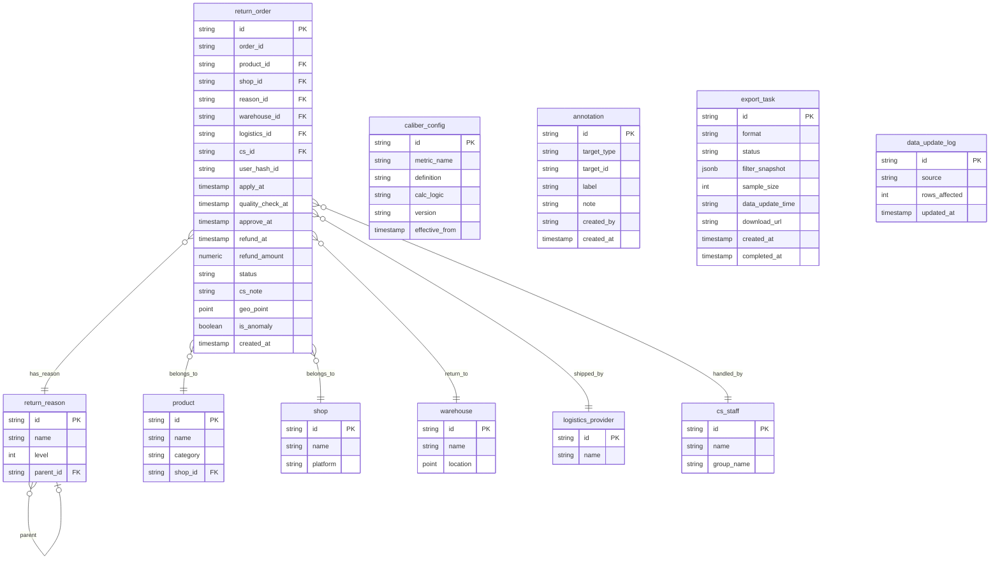

## 1. 架构设计

```mermaid
flowchart TB
    subgraph "前端层"
        "Next.js App" --> "ECharts 图表组件"
        "Next.js App" --> "Mapbox GL 地图组件"
        "Next.js App" --> "Zustand 状态管理"
        "Next.js App" --> "筛选器/下钻交互"
    end

    subgraph "API 层"
        "Express.js API 服务" --> "筛选/下钻路由"
        "Express.js API 服务" --> "导出任务路由"
        "Express.js API Service" --> "权限过滤中间件"
        "Express.js API Service" --> "数据字典/口径路由"
        "Express.js API Service" --> "批量导入路由"
    end

    subgraph "数据层"
        "PostgreSQL/PostGIS" --> "退货订单主表"
        "PostgreSQL/PostGIS" --> "退货原因维度表"
        "PostgreSQL/PostGIS" --> "商品/店铺维度表"
        "PostgreSQL/PostGIS" --> "口径配置表"
        "PostgreSQL/PostGIS" --> "异常标注表"
        "Redis 缓存" --> "聚合查询缓存"
        "Redis 缓存" --> "筛选条件快照"
    end

    subgraph "ETL 层"
        "原始数据源" --> "ETL 清洗脚本"
        "ETL 清洗脚本" --> "口径校验器"
        "ETL 清洗脚本" --> "缺失值处理器"
        "口径校验器" --> "PostgreSQL/PostGIS"
    end

    "Zustand 状态管理" --> "Express.js API 服务"
    "Express.js API 服务" --> "PostgreSQL/PostGIS"
    "Express.js API 服务" --> "Redis 缓存"
```

## 2. 技术说明

- 前端：React@18 + TypeScript + TailwindCSS@3 + Vite（项目模板），ECharts@5 作为图表层，Mapbox GL JS 作为地图层，Zustand 状态管理
- 初始化工具：vite-init（react-express-ts 模板）
- 后端：Express@4 + TypeScript（ESM）
- 数据库：PostgreSQL@16 + PostGIS 扩展，Redis 作为缓存层
- ETL：Node.js 脚本，支持增量清洗和全量重跑
- 导出：Papa Parse（CSV）、jsPDF + html2canvas（PDF）

## 3. 路由定义

| 路由 | 用途 |
|------|------|
| `/` | 分析工作台主页，全局概览+四大图表 |
| `/drilldown/reason` | 退货原因下钻页 |
| `/drilldown/cycle` | 退款周期分析页 |
| `/drilldown/product` | 商品排行与异常页 |
| `/exports` | 导出任务管理页 |
| `/data-management` | 数据管理页（批量导入+数据字典+口径配置） |
| `/api/dashboard/overview` | 获取概览指标数据 |
| `/api/dashboard/reason-tree` | 获取退货原因树数据 |
| `/api/dashboard/cycle-distribution` | 获取退款周期分布数据 |
| `/api/dashboard/product-ranking` | 获取商品排行数据 |
| `/api/dashboard/cs-duration` | 获取客服处理时长数据 |
| `/api/dashboard/samples` | 获取异常样本列表（支持分页、筛选） |
| `/api/dashboard/geo-heatmap` | 获取地理热力图数据 |
| `/api/export` | 创建导出任务 |
| `/api/export/:id` | 查询导出任务状态/下载文件 |
| `/api/data-dictionary` | 获取数据字典 |
| `/api/caliber-config` | 获取/更新口径配置 |
| `/api/import` | 批量导入数据 |
| `/api/annotations` | 异常点标注 CRUD |
| `/api/meta/update-time` | 获取数据最后更新时间 |

## 4. API 定义

### 4.1 通用筛选参数

```typescript
interface FilterParams {
  productIds?: string[];
  shopIds?: string[];
  reasonIds?: string[];
  warehouseIds?: string[];
  logisticsIds?: string[];
  dateRange: { start: string; end: string };
}

interface PaginatedResponse<T> {
  data: T[];
  total: number;
  sampleSize: number;
  filterSnapshot: FilterParams;
  dataUpdateTime: string;
}
```

### 4.2 概览指标

```typescript
interface OverviewResponse {
  totalReturns: number;
  avgRefundCycleDays: number;
  returnRate: number;
  anomalyRate: number;
  sampleSize: number;
  filterSnapshot: FilterParams;
  dataUpdateTime: string;
}
```

### 4.3 退货原因树

```typescript
interface ReasonTreeNode {
  id: string;
  name: string;
  level: number;
  parentId: string | null;
  count: number;
  ratio: number;
  children: ReasonTreeNode[];
}
```

### 4.4 退款周期分布

```typescript
interface CycleDistribution {
  bins: { range: string; count: number; ratio: number }[];
  stages: {
    apply: { avg: number; p50: number; p95: number };
    qualityCheck: { avg: number; p50: number; p95: number };
    approve: { avg: number; p50: number; p95: number };
    refund: { avg: number; p50: number; p95: number };
  };
  logisticsComparison: {
    logisticsId: string;
    logisticsName: string;
    avgDays: number;
    count: number;
  }[];
}
```

### 4.5 商品排行

```typescript
interface ProductRanking {
  productId: string;
  productName: string;
  shopName: string;
  returnCount: number;
  returnRate: number;
  refundAmount: number;
  repeatReturnUsers: {
    hashedUserId: string;
    returnCount: number;
    riskLevel: "low" | "medium" | "high";
  }[];
}
```

### 4.6 客服处理时长

```typescript
interface CSDuration {
  avgResponseMinutes: number;
  avgProcessingMinutes: number;
  distribution: { range: string; count: number }[];
  anomalies: { csId: string; duration: number; orderId: string }[];
}
```

### 4.7 导出任务

```typescript
interface ExportTask {
  id: string;
  format: "csv" | "pdf";
  status: "pending" | "processing" | "completed" | "failed";
  filterSnapshot: FilterParams;
  sampleSize: number;
  dataUpdateTime: string;
  createdAt: string;
  completedAt: string | null;
  downloadUrl: string | null;
}
```

### 4.8 异常标注

```typescript
interface Annotation {
  id: string;
  targetType: "order" | "product" | "reason";
  targetId: string;
  label: string;
  note: string;
  createdBy: string;
  createdAt: string;
}
```

## 5. 服务架构图

```mermaid
flowchart LR
    "Controller" --> "Service"
    "Service" --> "Repository"
    "Repository" --> "PostgreSQL"
    "Service" --> "Cache Layer"
    "Cache Layer" --> "Redis"
    "Controller" --> "Auth Middleware"
    "Auth Middleware" --> "Permission Filter"
    "Service" --> "Export Worker"
    "Export Worker" --> "File Storage"
```

## 6. 数据模型

### 6.1 数据模型定义



### 6.2 数据定义语言（DDL）

```sql
-- 启用 PostGIS 扩展
CREATE EXTENSION IF NOT EXISTS postgis;

-- 店铺表
CREATE TABLE shop (
    id VARCHAR(32) PRIMARY KEY,
    name VARCHAR(128) NOT NULL,
    platform VARCHAR(32) NOT NULL
);

-- 商品表
CREATE TABLE product (
    id VARCHAR(32) PRIMARY KEY,
    name VARCHAR(256) NOT NULL,
    category VARCHAR(64),
    shop_id VARCHAR(32) REFERENCES shop(id)
);

-- 退货原因维度表（支持层级）
CREATE TABLE return_reason (
    id VARCHAR(32) PRIMARY KEY,
    name VARCHAR(128) NOT NULL,
    level SMALLINT NOT NULL,
    parent_id VARCHAR(32) REFERENCES return_reason(id)
);

-- 仓库表
CREATE TABLE warehouse (
    id VARCHAR(32) PRIMARY KEY,
    name VARCHAR(128) NOT NULL,
    location GEOGRAPHY(POINT, 4326)
);

-- 物流商表
CREATE TABLE logistics_provider (
    id VARCHAR(32) PRIMARY KEY,
    name VARCHAR(128) NOT NULL
);

-- 客服人员表
CREATE TABLE cs_staff (
    id VARCHAR(32) PRIMARY KEY,
    name VARCHAR(64) NOT NULL,
    group_name VARCHAR(64)
);

-- 退货订单主表
CREATE TABLE return_order (
    id VARCHAR(32) PRIMARY KEY,
    order_id VARCHAR(64) NOT NULL,
    product_id VARCHAR(32) REFERENCES product(id),
    shop_id VARCHAR(32) REFERENCES shop(id),
    reason_id VARCHAR(32) REFERENCES return_reason(id),
    warehouse_id VARCHAR(32) REFERENCES warehouse(id),
    logistics_id VARCHAR(32) REFERENCES logistics_provider(id),
    cs_id VARCHAR(32) REFERENCES cs_staff(id),
    user_hash_id VARCHAR(64) NOT NULL,
    apply_at TIMESTAMPTZ NOT NULL,
    quality_check_at TIMESTAMPTZ,
    approve_at TIMESTAMPTZ,
    refund_at TIMESTAMPTZ,
    refund_amount DECIMAL(12,2),
    status VARCHAR(32) NOT NULL,
    cs_note TEXT,
    geo_point GEOGRAPHY(POINT, 4326),
    is_anomaly BOOLEAN DEFAULT FALSE,
    created_at TIMESTAMPTZ DEFAULT NOW()
);

CREATE INDEX idx_return_order_product ON return_order(product_id);
CREATE INDEX idx_return_order_shop ON return_order(shop_id);
CREATE INDEX idx_return_order_reason ON return_order(reason_id);
CREATE INDEX idx_return_order_warehouse ON return_order(warehouse_id);
CREATE INDEX idx_return_order_logistics ON return_order(logistics_id);
CREATE INDEX idx_return_order_apply_at ON return_order(apply_at);
CREATE INDEX idx_return_order_user_hash ON return_order(user_hash_id);
CREATE INDEX idx_return_order_geo ON return_order USING GIST(geo_point);

-- 口径配置表
CREATE TABLE caliber_config (
    id VARCHAR(32) PRIMARY KEY,
    metric_name VARCHAR(64) NOT NULL,
    definition TEXT NOT NULL,
    calc_logic TEXT NOT NULL,
    version VARCHAR(16) NOT NULL,
    effective_from TIMESTAMPTZ NOT NULL
);

-- 异常标注表
CREATE TABLE annotation (
    id VARCHAR(32) PRIMARY KEY,
    target_type VARCHAR(32) NOT NULL,
    target_id VARCHAR(32) NOT NULL,
    label VARCHAR(64) NOT NULL,
    note TEXT,
    created_by VARCHAR(64) NOT NULL,
    created_at TIMESTAMPTZ DEFAULT NOW()
);

-- 导出任务表
CREATE TABLE export_task (
    id VARCHAR(32) PRIMARY KEY,
    format VARCHAR(8) NOT NULL,
    status VARCHAR(16) NOT NULL DEFAULT 'pending',
    filter_snapshot JSONB,
    sample_size INTEGER,
    data_update_time VARCHAR(32),
    download_url TEXT,
    created_at TIMESTAMPTZ DEFAULT NOW(),
    completed_at TIMESTAMPTZ
);

-- 数据更新日志表
CREATE TABLE data_update_log (
    id VARCHAR(32) PRIMARY KEY,
    source VARCHAR(64) NOT NULL,
    rows_affected INTEGER,
    updated_at TIMESTAMPTZ DEFAULT NOW()
);
```
