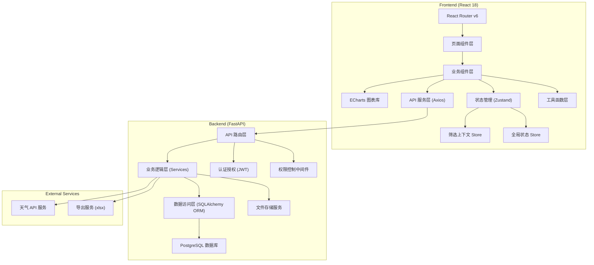
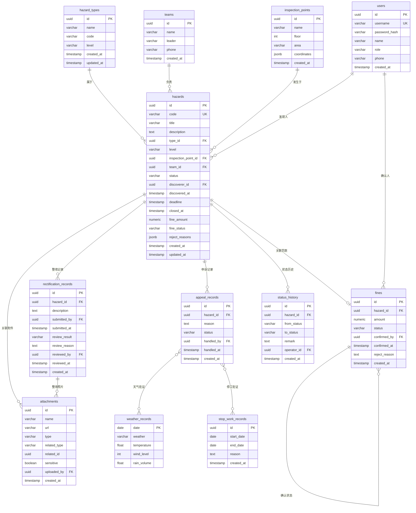

## 1. Architecture Design



## 2. Technology Description

### 2.1 Frontend Stack
- **核心框架**: React 18 + TypeScript
- **构建工具**: Vite 5
- **路由管理**: React Router v6
- **状态管理**: Zustand (轻量级，支持持久化)
- **UI 组件库**: Ant Design 5 (企业级数据密集型场景)
- **图表库**: ECharts 5 (支持热力图、柱状图、折线图等丰富图表)
- **样式方案**: Tailwind CSS 3 + CSS Modules
- **HTTP 客户端**: Axios (拦截器、请求缓存)
- **导出功能**: xlsx + file-saver
- **图标**: Lucide React

### 2.2 Backend Stack
- **Web 框架**: FastAPI (高性能、自动生成 OpenAPI 文档)
- **ORM**: SQLAlchemy 2.0 + Alembic (数据迁移)
- **数据库**: PostgreSQL 15 (JSONB 支持、窗口函数)
- **认证**: python-jose (JWT) + passlib (密码哈希)
- **文件上传**: python-multipart + aiofiles
- **数据导出**: openpyxl
- **CORS**: fastapi-cors

### 2.3 关键技术决策

| 决策点 | 方案选择 | 选型理由 |
|--------|----------|----------|
| 状态管理 | Zustand | 比 Redux 更轻量，API 简洁，天然支持 selectors 和 persist，适合筛选上下文管理 |
| 图表库 | ECharts | 热力图、自定义图表能力强，中文文档完善，社区活跃 |
| UI 组件库 | Ant Design 5 | 企业级后台系统标准选择，表格、表单组件功能完善，支持主题定制 |
| 后端框架 | FastAPI | 异步支持好，类型安全，自动生成 API 文档，开发效率高 |
| 数据库 | PostgreSQL | 支持 JSONB 存储非结构化数据，窗口函数适合复杂统计查询 |

## 3. Route Definitions

| 路由路径 | 页面组件 | 功能说明 |
|----------|----------|----------|
| `/dashboard` | DashboardPage | 数据概览看板 (首页) |
| `/hazards` | HazardListPage | 隐患明细列表 |
| `/hazards/:id` | HazardDetailPage | 隐患详情 (下钻) |
| `/fines` | FineStatisticsPage | 罚款统计与成本分析 |
| `/appeals` | AppealListPage | 申诉处理列表 |
| `/settings` | SettingsPage | 系统配置 (状态口径、权限管理) |
| `/login` | LoginPage | 登录页 |
| `*` | NotFoundPage | 404 页面 |

## 4. API Definitions

### 4.1 TypeScript 类型定义

```typescript
// 隐患状态枚举
export enum HazardStatus {
  PENDING = 'pending',        // 待整改
  IN_PROGRESS = 'in_progress', // 整改中
  UNDER_REVIEW = 'under_review', // 复查中
  CLOSED = 'closed',          // 已关闭
  REJECTED = 'rejected',      // 整改驳回
}

// 罚款状态枚举
export enum FineStatus {
  PENDING = 'pending',   // 待确认
  CONFIRMED = 'confirmed', // 已确认
  REJECTED = 'rejected', // 已驳回
}

// 隐患类型
export interface HazardType {
  id: string;
  name: string;
  code: string;
  level: 'low' | 'medium' | 'high' | 'critical';
}

// 责任班组
export interface Team {
  id: string;
  name: string;
  leader: string;
  phone: string;
}

// 巡检点
export interface InspectionPoint {
  id: string;
  name: string;
  floor: number;
  area: string;
  coordinates?: { x: number; y: number };
}

// 附件
export interface Attachment {
  id: string;
  name: string;
  url: string;
  type: 'image' | 'document';
  uploadedAt: string;
  uploadedBy: string;
  sensitive: boolean;
}

// 整改记录
export interface RectificationRecord {
  id: string;
  hazardId: string;
  submittedAt: string;
  submittedBy: string;
  description: string;
  photos: Attachment[];
  reviewResult?: 'pass' | 'reject';
  reviewReason?: string;
  reviewedAt?: string;
  reviewedBy?: string;
}

// 申诉记录
export interface AppealRecord {
  id: string;
  hazardId: string;
  reason: string;
  weatherEvidence?: WeatherRecord;
  stopWorkEvidence?: StopWorkRecord;
  status: 'pending' | 'approved' | 'rejected';
  createdAt: string;
  handledAt?: string;
  handledBy?: string;
}

// 天气记录
export interface WeatherRecord {
  date: string;
  weather: string;
  temperature: number;
  windLevel: number;
  rainVolume: number;
}

// 停工记录
export interface StopWorkRecord {
  id: string;
  startDate: string;
  endDate: string;
  reason: string;
}

// 隐患主数据
export interface Hazard {
  id: string;
  code: string;
  title: string;
  description: string;
  type: HazardType;
  level: 'low' | 'medium' | 'high' | 'critical';
  inspectionPoint: InspectionPoint;
  team: Team;
  status: HazardStatus;
  discoverer: string;
  discoveredAt: string;
  deadline: string;
  closedAt?: string;
  discoveryPhotos: Attachment[];
  rectificationRecords: RectificationRecord[];
  appealRecords: AppealRecord[];
  fineAmount?: number;
  fineStatus?: FineStatus;
  rejectReasons: string[];
}

// 看板统计数据
export interface DashboardStats {
  total: number;
  pending: number;
  inProgress: number;
  underReview: number;
  closed: number;
  overdue: number;
  closureRate: number;
  overdueRate: number;
  totalConfirmedFine: number;
  totalPendingFine: number;
}

// 筛选条件
export interface FilterCriteria {
  dateRange?: [string, string];
  floors?: number[];
  teamIds?: string[];
  typeIds?: string[];
  statuses?: HazardStatus[];
  levels?: string[];
  keyword?: string;
}
```

### 4.2 API 接口列表

| 方法 | 路径 | 说明 | 请求参数 | 响应数据 |
|------|------|------|----------|----------|
| GET | `/api/auth/me` | 获取当前用户信息 | - | User |
| POST | `/api/auth/login` | 登录 | `{ username, password }` | `{ token, user }` |
| GET | `/api/dashboard/stats` | 获取看板统计数据 | FilterCriteria | DashboardStats |
| GET | `/api/dashboard/closure-rate-trend` | 闭环率趋势数据 | `{ days, ...filters }` | `[{ date, rate }]` |
| GET | `/api/dashboard/overdue-ranking` | 逾期排行榜 | `{ limit, ...filters }` | `[{ teamId, teamName, count }]` |
| GET | `/api/dashboard/floor-heatmap` | 楼层热力数据 | `{ ...filters }` | `[{ floor, count, points }]` |
| GET | `/api/dashboard/team-trend` | 班组趋势数据 | `{ teamIds, days, ...filters }` | `[{ team, date, completed, total }]` |
| GET | `/api/hazards` | 隐患列表 | `{ page, pageSize, ...filters }` | `{ items: Hazard[], total }` |
| GET | `/api/hazards/:id` | 隐患详情 | id | Hazard |
| GET | `/api/hazards/:id/history` | 隐患状态历史 | id | `[{ status, time, operator, remark }]` |
| POST | `/api/hazards/:id/submit-rectification` | 提交整改 | `{ description, photoIds }` | RectificationRecord |
| POST | `/api/hazards/:id/review` | 复查审核 | `{ result, reason, photoIds? }` | RectificationRecord |
| POST | `/api/hazards/:id/appeal` | 申诉逾期 | `{ reason }` | AppealRecord |
| GET | `/api/hazards/:id/weather-evidence` | 获取天气佐证 | `{ startDate, endDate }` | WeatherRecord[] |
| GET | `/api/fines` | 罚款列表 | `{ page, pageSize, status, ...filters }` | `{ items: Fine[], total }` |
| POST | `/api/fines/:id/confirm` | 确认罚款 | - | Fine |
| POST | `/api/fines/:id/reject` | 驳回罚款 | `{ reason }` | Fine |
| GET | `/api/fines/statistics` | 罚款统计 | `{ groupBy, ...filters }` | 统计数据 |
| GET | `/api/teams` | 班组列表 | - | Team[] |
| GET | `/api/hazard-types` | 隐患类型列表 | - | HazardType[] |
| GET | `/api/inspection-points` | 巡检点列表 | - | InspectionPoint[] |
| GET | `/api/export/hazards` | 导出隐患列表 | `{ format, ...filters }` | 文件流 |
| GET | `/api/export/fines` | 导出罚款统计 | `{ format, ...filters }` | 文件流 |
| GET | `/api/attachments/:id` | 获取附件 | id | 文件流 (权限控制) |
| POST | `/api/attachments/upload` | 上传附件 | FormData | Attachment |
| GET | `/api/appeals` | 申诉列表 | `{ status, ...filters }` | AppealRecord[] |
| POST | `/api/appeals/:id/handle` | 处理申诉 | `{ result, remark }` | AppealRecord |

## 5. Server Architecture Diagram

```mermaid
graph TB
    subgraph "API Layer"
        A1["dashboard_routes.py"]
        A2["hazard_routes.py"]
        A3["fine_routes.py"]
        A4["appeal_routes.py"]
        A5["auth_routes.py"]
        A6["attachment_routes.py"]
        A7["export_routes.py"]
        A8["master_data_routes.py"]
    end

    subgraph "Service Layer"
        B1["DashboardService"]
        B2["HazardService"]
        B3["FineService"]
        B4["AppealService"]
        B5["AuthService"]
        B6["AttachmentService"]
        B7["ExportService"]
        B8["WeatherService"]
    end

    subgraph "Repository Layer"
        C1["HazardRepository"]
        C2["FineRepository"]
        C3["AppealRepository"]
        C4["UserRepository"]
        C5["AttachmentRepository"]
    end

    subgraph "Database"
        D1["hazards 表"]
        D2["hazard_types 表"]
        D3["teams 表"]
        D4["inspection_points 表"]
        D5["rectification_records 表"]
        D6["appeal_records 表"]
        D7["fines 表"]
        D8["attachments 表"]
        D9["users 表"]
        D10["status_history 表"]
    end

    A1 --> B1
    A2 --> B2
    A3 --> B3
    A4 --> B4
    A5 --> B5
    A6 --> B6
    A7 --> B7

    B1 --> C1
    B2 --> C1
    B3 --> C2
    B4 --> C3
    B5 --> C4
    B6 --> C5
    B2 --> B8

    C1 --> D1
    C1 --> D10
    C2 --> D7
    C3 --> D6
    C4 --> D9
    C5 --> D8
```



## 6. Data Model

### 6.1 ER Diagram



### 6.2 DDL 语句

```sql
-- 扩展
CREATE EXTENSION IF NOT EXISTS "uuid-ossp";

-- 用户表
CREATE TABLE users (
    id UUID PRIMARY KEY DEFAULT uuid_generate_v4(),
    username VARCHAR(50) UNIQUE NOT NULL,
    password_hash VARCHAR(255) NOT NULL,
    name VARCHAR(100) NOT NULL,
    role VARCHAR(20) NOT NULL CHECK (role IN ('director', 'admin', 'team_leader')),
    phone VARCHAR(20),
    created_at TIMESTAMP WITH TIME ZONE DEFAULT CURRENT_TIMESTAMP,
    updated_at TIMESTAMP WITH TIME ZONE DEFAULT CURRENT_TIMESTAMP
);

-- 隐患类型表
CREATE TABLE hazard_types (
    id UUID PRIMARY KEY DEFAULT uuid_generate_v4(),
    name VARCHAR(100) NOT NULL,
    code VARCHAR(50) UNIQUE NOT NULL,
    level VARCHAR(20) NOT NULL CHECK (level IN ('low', 'medium', 'high', 'critical')),
    created_at TIMESTAMP WITH TIME ZONE DEFAULT CURRENT_TIMESTAMP,
    updated_at TIMESTAMP WITH TIME ZONE DEFAULT CURRENT_TIMESTAMP
);

-- 班组表
CREATE TABLE teams (
    id UUID PRIMARY KEY DEFAULT uuid_generate_v4(),
    name VARCHAR(100) NOT NULL,
    leader VARCHAR(50) NOT NULL,
    phone VARCHAR(20),
    created_at TIMESTAMP WITH TIME ZONE DEFAULT CURRENT_TIMESTAMP,
    updated_at TIMESTAMP WITH TIME ZONE DEFAULT CURRENT_TIMESTAMP
);

-- 巡检点表
CREATE TABLE inspection_points (
    id UUID PRIMARY KEY DEFAULT uuid_generate_v4(),
    name VARCHAR(100) NOT NULL,
    floor INTEGER NOT NULL,
    area VARCHAR(100),
    coordinates JSONB,
    created_at TIMESTAMP WITH TIME ZONE DEFAULT CURRENT_TIMESTAMP,
    updated_at TIMESTAMP WITH TIME ZONE DEFAULT CURRENT_TIMESTAMP
);

-- 隐患主表
CREATE TABLE hazards (
    id UUID PRIMARY KEY DEFAULT uuid_generate_v4(),
    code VARCHAR(50) UNIQUE NOT NULL,
    title VARCHAR(200) NOT NULL,
    description TEXT,
    type_id UUID REFERENCES hazard_types(id),
    level VARCHAR(20) NOT NULL CHECK (level IN ('low', 'medium', 'high', 'critical')),
    inspection_point_id UUID REFERENCES inspection_points(id),
    team_id UUID REFERENCES teams(id),
    status VARCHAR(20) NOT NULL DEFAULT 'pending' CHECK (status IN ('pending', 'in_progress', 'under_review', 'closed', 'rejected')),
    discoverer_id UUID REFERENCES users(id),
    discovered_at TIMESTAMP WITH TIME ZONE NOT NULL,
    deadline TIMESTAMP WITH TIME ZONE NOT NULL,
    closed_at TIMESTAMP WITH TIME ZONE,
    fine_amount NUMERIC(12, 2),
    fine_status VARCHAR(20) CHECK (fine_status IN ('pending', 'confirmed', 'rejected')),
    reject_reasons JSONB DEFAULT '[]'::jsonb,
    created_at TIMESTAMP WITH TIME ZONE DEFAULT CURRENT_TIMESTAMP,
    updated_at TIMESTAMP WITH TIME ZONE DEFAULT CURRENT_TIMESTAMP
);

-- 索引
CREATE INDEX idx_hazards_status ON hazards(status);
CREATE INDEX idx_hazards_team_id ON hazards(team_id);
CREATE INDEX idx_hazards_deadline ON hazards(deadline);
CREATE INDEX idx_hazards_discovered_at ON hazards(discovered_at);
CREATE INDEX idx_hazards_type_id ON hazards(type_id);

-- 状态历史表
CREATE TABLE status_history (
    id UUID PRIMARY KEY DEFAULT uuid_generate_v4(),
    hazard_id UUID REFERENCES hazards(id) ON DELETE CASCADE,
    from_status VARCHAR(20),
    to_status VARCHAR(20) NOT NULL,
    remark TEXT,
    operator_id UUID REFERENCES users(id),
    created_at TIMESTAMP WITH TIME ZONE DEFAULT CURRENT_TIMESTAMP
);
CREATE INDEX idx_status_history_hazard_id ON status_history(hazard_id);

-- 整改记录表
CREATE TABLE rectification_records (
    id UUID PRIMARY KEY DEFAULT uuid_generate_v4(),
    hazard_id UUID REFERENCES hazards(id) ON DELETE CASCADE,
    description TEXT NOT NULL,
    submitted_by UUID REFERENCES users(id),
    submitted_at TIMESTAMP WITH TIME ZONE DEFAULT CURRENT_TIMESTAMP,
    review_result VARCHAR(20) CHECK (review_result IN ('pass', 'reject')),
    review_reason TEXT,
    reviewed_by UUID REFERENCES users(id),
    reviewed_at TIMESTAMP WITH TIME ZONE,
    created_at TIMESTAMP WITH TIME ZONE DEFAULT CURRENT_TIMESTAMP
);
CREATE INDEX idx_rectification_hazard_id ON rectification_records(hazard_id);

-- 申诉记录表
CREATE TABLE appeal_records (
    id UUID PRIMARY KEY DEFAULT uuid_generate_v4(),
    hazard_id UUID REFERENCES hazards(id) ON DELETE CASCADE,
    reason TEXT NOT NULL,
    status VARCHAR(20) NOT NULL DEFAULT 'pending' CHECK (status IN ('pending', 'approved', 'rejected')),
    handled_by UUID REFERENCES users(id),
    handled_at TIMESTAMP WITH TIME ZONE,
    created_at TIMESTAMP WITH TIME ZONE DEFAULT CURRENT_TIMESTAMP
);
CREATE INDEX idx_appeal_hazard_id ON appeal_records(hazard_id);

-- 罚款表
CREATE TABLE fines (
    id UUID PRIMARY KEY DEFAULT uuid_generate_v4(),
    hazard_id UUID REFERENCES hazards(id) ON DELETE CASCADE,
    amount NUMERIC(12, 2) NOT NULL,
    status VARCHAR(20) NOT NULL DEFAULT 'pending' CHECK (status IN ('pending', 'confirmed', 'rejected')),
    confirmed_by UUID REFERENCES users(id),
    confirmed_at TIMESTAMP WITH TIME ZONE,
    reject_reason TEXT,
    created_at TIMESTAMP WITH TIME ZONE DEFAULT CURRENT_TIMESTAMP
);
CREATE INDEX idx_fines_hazard_id ON fines(hazard_id);
CREATE INDEX idx_fines_status ON fines(status);

-- 附件表
CREATE TABLE attachments (
    id UUID PRIMARY KEY DEFAULT uuid_generate_v4(),
    name VARCHAR(255) NOT NULL,
    url VARCHAR(500) NOT NULL,
    type VARCHAR(20) NOT NULL CHECK (type IN ('image', 'document')),
    related_type VARCHAR(50) NOT NULL,
    related_id UUID NOT NULL,
    sensitive BOOLEAN DEFAULT false,
    uploaded_by UUID REFERENCES users(id),
    created_at TIMESTAMP WITH TIME ZONE DEFAULT CURRENT_TIMESTAMP
);
CREATE INDEX idx_attachments_related ON attachments(related_type, related_id);

-- 天气记录表 (用于申诉佐证)
CREATE TABLE weather_records (
    date DATE PRIMARY KEY,
    weather VARCHAR(50) NOT NULL,
    temperature FLOAT,
    wind_level INTEGER,
    rain_volume FLOAT,
    created_at TIMESTAMP WITH TIME ZONE DEFAULT CURRENT_TIMESTAMP
);

-- 停工记录表
CREATE TABLE stop_work_records (
    id UUID PRIMARY KEY DEFAULT uuid_generate_v4(),
    start_date DATE NOT NULL,
    end_date DATE NOT NULL,
    reason TEXT NOT NULL,
    created_at TIMESTAMP WITH TIME ZONE DEFAULT CURRENT_TIMESTAMP
);

-- 自动更新 updated_at 触发器
CREATE OR REPLACE FUNCTION update_updated_at()
RETURNS TRIGGER AS $$
BEGIN
    NEW.updated_at = CURRENT_TIMESTAMP;
    RETURN NEW;
END;
$$ LANGUAGE plpgsql;

CREATE TRIGGER trigger_update_users_updated_at
    BEFORE UPDATE ON users
    FOR EACH ROW EXECUTE FUNCTION update_updated_at();

CREATE TRIGGER trigger_update_hazards_updated_at
    BEFORE UPDATE ON hazards
    FOR EACH ROW EXECUTE FUNCTION update_updated_at();

-- 插入初始数据
INSERT INTO users (username, password_hash, name, role, phone) VALUES
('director', '$2b$12$LQv3c1yqBWVHxkd0LHAkCOYz6TtxMQJqhN8/LewYGyJYKdHxw8XHu', '张安全', 'director', '13800138001'),
('admin1', '$2b$12$LQv3c1yqBWVHxkd0LHAkCOYz6TtxMQJqhN8/LewYGyJYKdHxw8XHu', '李管理', 'admin', '13800138002'),
('team1_leader', '$2b$12$LQv3c1yqBWVHxkd0LHAkCOYz6TtxMQJqhN8/LewYGyJYKdHxw8XHu', '王队长', 'team_leader', '13800138003');

INSERT INTO hazard_types (name, code, level) VALUES
('临边防护缺失', 'edge_protection', 'high'),
('脚手架隐患', 'scaffold', 'critical'),
('临时用电不规范', 'electricity', 'high'),
('消防设施不足', 'fire_fighting', 'medium'),
('高空坠物风险', 'falling_object', 'critical'),
('机械防护缺失', 'machine_protection', 'medium');

INSERT INTO teams (name, leader, phone) VALUES
('土建一班', '王队长', '13800138010'),
('土建二班', '李队长', '13800138011'),
('水电班组', '张班长', '13800138012'),
('架子班组', '刘班长', '13800138013'),
('消防班组', '陈班长', '13800138014');

INSERT INTO inspection_points (name, floor, area) VALUES
('1层东楼梯口', 1, '东区'),
('2层南侧临边', 2, '南区'),
('3层脚手架', 3, '北区'),
('4层电箱区域', 4, '西区'),
('5层电梯井口', 5, '中区'),
('地下室消防通道', -1, '地下室'),
('屋面设备层', 6, '屋面'),
('1层材料堆放区', 1, '材料区');
```
