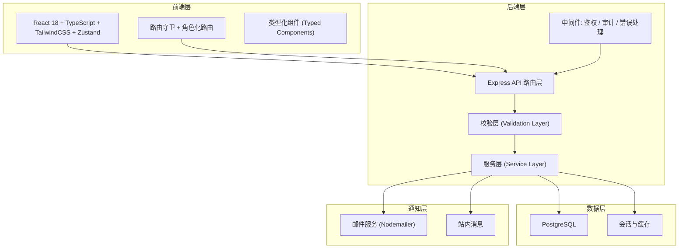
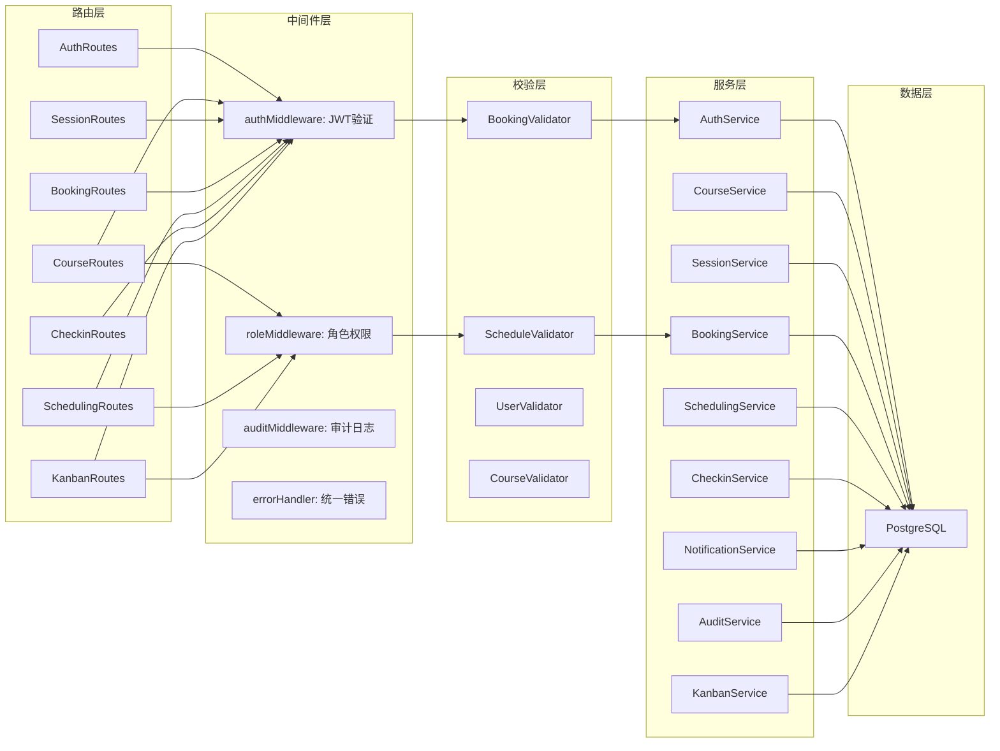
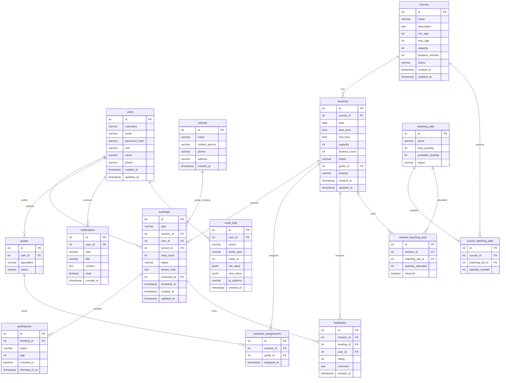

## 1. 架构设计



## 2. 技术说明

- **前端**: React@18 + TypeScript + TailwindCSS@3 + Vite + Zustand
- **初始化工具**: vite-init (react-express-ts 模板)
- **后端**: Express@4 + TypeScript (ESM)
- **数据库**: PostgreSQL (主存储)，连接池 pg 库
- **ORM/查询**: 原生 SQL + 轻量查询构建器（pg 库直接操作）
- **认证**: JWT Token + 角色中间件
- **通知**: Nodemailer (邮件) + 站内消息表

## 3. 路由定义

### 3.1 前端路由

| 路由 | 用途 | 允许角色 |
|------|------|----------|
| `/login` | 登录页 | 公开 |
| `/dashboard` | 工作台首页 | 全部角色 |
| `/courses` | 课程列表 | 全部角色 |
| `/courses/:id` | 课程详情 | 全部角色 |
| `/sessions` | 场次日历 | 负责人、讲解员 |
| `/sessions/:id` | 场次详情 | 负责人、讲解员 |
| `/booking/group` | 团体报名 | 学校联系人 |
| `/booking/individual` | 散客报名 | 散客家长 |
| `/review` | 审核中心 | 负责人 |
| `/review/:id` | 审核详情 | 负责人 |
| `/scheduling` | 排班日历 | 负责人 |
| `/checkin/:sessionId` | 签到页面 | 负责人、讲解员 |
| `/teaching-aids` | 教具管理 | 负责人 |
| `/feedback` | 反馈页面 | 全部角色 |
| `/feedback/stats` | 反馈统计 | 负责人 |
| `/kanban` | 后台看板 | 负责人、管理员 |
| `/notifications` | 通知中心 | 全部角色 |
| `/audit-logs` | 审计日志 | 管理员 |
| `/admin/users` | 用户管理 | 管理员 |

### 3.2 后端 API 路由

| 方法 | 路由 | 用途 |
|------|------|------|
| POST | `/api/auth/login` | 用户登录 |
| POST | `/api/auth/register` | 用户注册（学校联系人/散客家长） |
| GET | `/api/courses` | 课程列表 |
| POST | `/api/courses` | 创建课程 |
| GET | `/api/courses/:id` | 课程详情 |
| PUT | `/api/courses/:id` | 更新课程 |
| GET | `/api/sessions` | 场次列表 |
| POST | `/api/sessions` | 创建场次 |
| GET | `/api/sessions/:id` | 场次详情 |
| PUT | `/api/sessions/:id` | 更新场次 |
| GET | `/api/sessions/calendar` | 场次日历数据 |
| POST | `/api/bookings/group` | 提交团体报名 |
| POST | `/api/bookings/individual` | 提交散客报名 |
| GET | `/api/bookings` | 报名列表 |
| GET | `/api/bookings/:id` | 报名详情 |
| PUT | `/api/bookings/:id/review` | 审核报名 |
| PUT | `/api/bookings/:id/cancel` | 取消报名 |
| GET | `/api/scheduling` | 排班列表 |
| POST | `/api/scheduling/assign` | 分配讲解员 |
| DELETE | `/api/scheduling/:id` | 移除排班 |
| GET | `/api/scheduling/conflicts` | 冲突检测 |
| POST | `/api/checkin/:sessionId` | 签到 |
| GET | `/api/checkin/:sessionId/status` | 签到状态 |
| GET | `/api/teaching-aids` | 教具列表 |
| POST | `/api/teaching-aids` | 创建教具 |
| PUT | `/api/teaching-aids/:id` | 更新教具 |
| POST | `/api/teaching-aids/:id/allocate` | 分配教具到场次 |
| POST | `/api/feedback` | 提交反馈 |
| GET | `/api/feedback/stats` | 反馈统计 |
| GET | `/api/notifications` | 通知列表 |
| PUT | `/api/notifications/:id/read` | 标记已读 |
| GET | `/api/kanban/overdue` | 超时事项 |
| GET | `/api/kanban/idle-resources` | 空闲资源 |
| GET | `/api/kanban/metrics` | 关键指标 |
| GET | `/api/audit-logs` | 审计日志 |
| GET | `/api/admin/users` | 用户列表 |
| POST | `/api/admin/users` | 创建用户 |
| PUT | `/api/admin/users/:id` | 更新用户 |
| GET | `/api/schools` | 学校列表 |
| POST | `/api/schools` | 创建学校 |

## 4. API 定义

### 4.1 核心类型定义

```typescript
interface User {
  id: number;
  username: string;
  email: string;
  role: "admin" | "manager" | "guide" | "school_contact" | "parent";
  name: string;
  phone?: string;
  created_at: string;
  updated_at: string;
}

interface Course {
  id: number;
  name: string;
  description: string;
  min_age: number;
  max_age: number;
  capacity: number;
  duration_minutes: number;
  teaching_aid_ids: number[];
  status: "active" | "inactive";
  created_at: string;
  updated_at: string;
}

interface Session {
  id: number;
  course_id: number;
  date: string;
  start_time: string;
  end_time: string;
  capacity: number;
  booked_count: number;
  status: "open" | "full" | "closed" | "completed";
  guide_id?: number;
  location: string;
  created_at: string;
  updated_at: string;
}

interface Booking {
  id: number;
  type: "group" | "individual";
  session_id: number;
  user_id: number;
  school_id?: number;
  participants: Participant[];
  total_count: number;
  status: "pending" | "approved" | "rejected" | "cancelled" | "completed";
  review_note?: string;
  reviewed_by?: number;
  reviewed_at?: string;
  created_at: string;
  updated_at: string;
}

interface Participant {
  id: number;
  booking_id: number;
  name: string;
  age: number;
  checked_in: boolean;
}

interface Guide {
  id: number;
  user_id: number;
  specialties: string[];
  status: "available" | "busy" | "off";
}

interface ScheduleAssignment {
  id: number;
  session_id: number;
  guide_id: number;
  assigned_at: string;
}

interface TeachingAid {
  id: number;
  name: string;
  total_quantity: number;
  available_quantity: number;
  status: "available" | "low" | "depleted";
}

interface Feedback {
  id: number;
  session_id: number;
  booking_id: number;
  user_id: number;
  rating: number;
  comment?: string;
  created_at: string;
}

interface Notification {
  id: number;
  user_id: number;
  type: "booking_status" | "schedule" | "reminder" | "system";
  title: string;
  content: string;
  read: boolean;
  created_at: string;
}

interface AuditLog {
  id: number;
  user_id: number;
  action: string;
  entity_type: string;
  entity_id: number;
  old_value?: object;
  new_value?: object;
  ip_address: string;
  created_at: string;
}

interface School {
  id: number;
  name: string;
  contact_person: string;
  phone: string;
  address?: string;
  created_at: string;
}
```

### 4.2 请求/响应示例

```typescript
// 团体报名请求
interface GroupBookingRequest {
  session_id: number;
  school_id: number;
  participants: { name: string; age: number }[];
}

// 审核请求
interface ReviewRequest {
  action: "approve" | "reject";
  note?: string;
}

// 排班分配请求
interface ScheduleAssignRequest {
  session_id: number;
  guide_id: number;
}

// 签到请求
interface CheckinRequest {
  participant_id: number;
}

// 通用分页响应
interface PaginatedResponse<T> {
  data: T[];
  total: number;
  page: number;
  page_size: number;
}
```

## 5. 服务端架构图



## 6. 数据模型

### 6.1 数据模型定义



### 6.2 数据定义语言

```sql
-- 用户表
CREATE TABLE users (
    id SERIAL PRIMARY KEY,
    username VARCHAR(50) UNIQUE NOT NULL,
    email VARCHAR(255) UNIQUE NOT NULL,
    password_hash VARCHAR(255) NOT NULL,
    role VARCHAR(20) NOT NULL CHECK (role IN ('admin', 'manager', 'guide', 'school_contact', 'parent')),
    name VARCHAR(100) NOT NULL,
    phone VARCHAR(20),
    created_at TIMESTAMP DEFAULT CURRENT_TIMESTAMP,
    updated_at TIMESTAMP DEFAULT CURRENT_TIMESTAMP
);

CREATE INDEX idx_users_role ON users(role);
CREATE INDEX idx_users_email ON users(email);

-- 学校表
CREATE TABLE schools (
    id SERIAL PRIMARY KEY,
    name VARCHAR(200) NOT NULL,
    contact_person VARCHAR(100) NOT NULL,
    phone VARCHAR(20) NOT NULL,
    address VARCHAR(500),
    created_at TIMESTAMP DEFAULT CURRENT_TIMESTAMP
);

CREATE INDEX idx_schools_name ON schools(name);

-- 课程表
CREATE TABLE courses (
    id SERIAL PRIMARY KEY,
    name VARCHAR(200) NOT NULL,
    description TEXT,
    min_age INT NOT NULL DEFAULT 5,
    max_age INT NOT NULL DEFAULT 18,
    capacity INT NOT NULL DEFAULT 30,
    duration_minutes INT NOT NULL DEFAULT 90,
    status VARCHAR(20) NOT NULL DEFAULT 'active' CHECK (status IN ('active', 'inactive')),
    created_at TIMESTAMP DEFAULT CURRENT_TIMESTAMP,
    updated_at TIMESTAMP DEFAULT CURRENT_TIMESTAMP
);

CREATE INDEX idx_courses_status ON courses(status);

-- 场次表
CREATE TABLE sessions (
    id SERIAL PRIMARY KEY,
    course_id INT NOT NULL REFERENCES courses(id),
    date DATE NOT NULL,
    start_time TIME NOT NULL,
    end_time TIME NOT NULL,
    capacity INT NOT NULL,
    booked_count INT NOT NULL DEFAULT 0,
    status VARCHAR(20) NOT NULL DEFAULT 'open' CHECK (status IN ('open', 'full', 'closed', 'completed')),
    guide_id INT REFERENCES guides(id),
    location VARCHAR(200),
    created_at TIMESTAMP DEFAULT CURRENT_TIMESTAMP,
    updated_at TIMESTAMP DEFAULT CURRENT_TIMESTAMP
);

CREATE INDEX idx_sessions_course ON sessions(course_id);
CREATE INDEX idx_sessions_date ON sessions(date);
CREATE INDEX idx_sessions_status ON sessions(status);
CREATE INDEX idx_sessions_guide ON sessions(guide_id);
CREATE UNIQUE INDEX idx_sessions_guide_time ON sessions(guide_id, date, start_time, end_time) WHERE guide_id IS NOT NULL;

-- 报名表
CREATE TABLE bookings (
    id SERIAL PRIMARY KEY,
    type VARCHAR(20) NOT NULL CHECK (type IN ('group', 'individual')),
    session_id INT NOT NULL REFERENCES sessions(id),
    user_id INT NOT NULL REFERENCES users(id),
    school_id INT REFERENCES schools(id),
    total_count INT NOT NULL,
    status VARCHAR(20) NOT NULL DEFAULT 'pending' CHECK (status IN ('pending', 'approved', 'rejected', 'cancelled', 'completed')),
    review_note TEXT,
    reviewed_by INT REFERENCES users(id),
    reviewed_at TIMESTAMP,
    created_at TIMESTAMP DEFAULT CURRENT_TIMESTAMP,
    updated_at TIMESTAMP DEFAULT CURRENT_TIMESTAMP
);

CREATE INDEX idx_bookings_session ON bookings(session_id);
CREATE INDEX idx_bookings_user ON bookings(user_id);
CREATE INDEX idx_bookings_status ON bookings(status);
CREATE INDEX idx_bookings_school ON bookings(school_id);

-- 参与者表（儿童信息最小化采集：仅姓名+年龄）
CREATE TABLE participants (
    id SERIAL PRIMARY KEY,
    booking_id INT NOT NULL REFERENCES bookings(id) ON DELETE CASCADE,
    name VARCHAR(50) NOT NULL,
    age INT NOT NULL,
    checked_in BOOLEAN NOT NULL DEFAULT FALSE,
    checked_in_at TIMESTAMP
);

CREATE INDEX idx_participants_booking ON participants(booking_id);

-- 讲解员表
CREATE TABLE guides (
    id SERIAL PRIMARY KEY,
    user_id INT UNIQUE NOT NULL REFERENCES users(id),
    specialties VARCHAR(500),
    status VARCHAR(20) NOT NULL DEFAULT 'available' CHECK (status IN ('available', 'busy', 'off'))
);

CREATE INDEX idx_guides_user ON guides(user_id);
CREATE INDEX idx_guides_status ON guides(status);

-- 排班分配表
CREATE TABLE schedule_assignments (
    id SERIAL PRIMARY KEY,
    session_id INT NOT NULL REFERENCES sessions(id),
    guide_id INT NOT NULL REFERENCES guides(id),
    assigned_at TIMESTAMP DEFAULT CURRENT_TIMESTAMP,
    UNIQUE(session_id, guide_id)
);

CREATE INDEX idx_schedule_session ON schedule_assignments(session_id);
CREATE INDEX idx_schedule_guide ON schedule_assignments(guide_id);

-- 教具表
CREATE TABLE teaching_aids (
    id SERIAL PRIMARY KEY,
    name VARCHAR(200) NOT NULL,
    total_quantity INT NOT NULL,
    available_quantity INT NOT NULL,
    status VARCHAR(20) NOT NULL DEFAULT 'available' CHECK (status IN ('available', 'low', 'depleted'))
);

-- 课程教具需求关联表
CREATE TABLE course_teaching_aids (
    id SERIAL PRIMARY KEY,
    course_id INT NOT NULL REFERENCES courses(id),
    teaching_aid_id INT NOT NULL REFERENCES teaching_aids(id),
    quantity_needed INT NOT NULL DEFAULT 1,
    UNIQUE(course_id, teaching_aid_id)
);

-- 场次教具分配表
CREATE TABLE session_teaching_aids (
    id SERIAL PRIMARY KEY,
    session_id INT NOT NULL REFERENCES sessions(id),
    teaching_aid_id INT NOT NULL REFERENCES teaching_aids(id),
    quantity_allocated INT NOT NULL DEFAULT 1,
    returned BOOLEAN NOT NULL DEFAULT FALSE
);

CREATE INDEX idx_session_aids_session ON session_teaching_aids(session_id);

-- 反馈表
CREATE TABLE feedbacks (
    id SERIAL PRIMARY KEY,
    session_id INT NOT NULL REFERENCES sessions(id),
    booking_id INT NOT NULL REFERENCES bookings(id),
    user_id INT NOT NULL REFERENCES users(id),
    rating INT NOT NULL CHECK (rating BETWEEN 1 AND 5),
    comment TEXT,
    created_at TIMESTAMP DEFAULT CURRENT_TIMESTAMP
);

CREATE INDEX idx_feedbacks_session ON feedbacks(session_id);
CREATE INDEX idx_feedbacks_user ON feedbacks(user_id);

-- 通知表
CREATE TABLE notifications (
    id SERIAL PRIMARY KEY,
    user_id INT NOT NULL REFERENCES users(id),
    type VARCHAR(30) NOT NULL CHECK (type IN ('booking_status', 'schedule', 'reminder', 'system')),
    title VARCHAR(200) NOT NULL,
    content TEXT NOT NULL,
    read BOOLEAN NOT NULL DEFAULT FALSE,
    created_at TIMESTAMP DEFAULT CURRENT_TIMESTAMP
);

CREATE INDEX idx_notifications_user ON notifications(user_id);
CREATE INDEX idx_notifications_read ON notifications(user_id, read);

-- 审计日志表
CREATE TABLE audit_logs (
    id SERIAL PRIMARY KEY,
    user_id INT REFERENCES users(id),
    action VARCHAR(100) NOT NULL,
    entity_type VARCHAR(50) NOT NULL,
    entity_id INT NOT NULL,
    old_value JSONB,
    new_value JSONB,
    ip_address VARCHAR(45),
    created_at TIMESTAMP DEFAULT CURRENT_TIMESTAMP
);

CREATE INDEX idx_audit_user ON audit_logs(user_id);
CREATE INDEX idx_audit_entity ON audit_logs(entity_type, entity_id);
CREATE INDEX idx_audit_created ON audit_logs(created_at);
CREATE INDEX idx_audit_action ON audit_logs(action);
```

### 6.3 权限矩阵

| 操作 | admin | manager | guide | school_contact | parent |
|------|-------|---------|-------|----------------|--------|
| 查看课程 | ✅ | ✅ | ✅ | ✅ | ✅ |
| 创建/编辑课程 | ✅ | ✅ | ❌ | ❌ | ❌ |
| 创建场次 | ✅ | ✅ | ❌ | ❌ | ❌ |
| 提交团体报名 | ❌ | ❌ | ❌ | ✅ | ❌ |
| 提交散客报名 | ❌ | ❌ | ❌ | ❌ | ✅ |
| 审核报名 | ✅ | ✅ | ❌ | ❌ | ❌ |
| 分配讲解员 | ✅ | ✅ | ❌ | ❌ | ❌ |
| 查看排班 | ✅ | ✅ | ✅ | ❌ | ❌ |
| 签到核验 | ✅ | ✅ | ✅ | ❌ | ❌ |
| 管理教具 | ✅ | ✅ | ❌ | ❌ | ❌ |
| 提交反馈 | ❌ | ❌ | ✅ | ❌ | ✅ |
| 查看反馈统计 | ✅ | ✅ | ❌ | ❌ | ❌ |
| 查看看板 | ✅ | ✅ | ❌ | ❌ | ❌ |
| 查看审计日志 | ✅ | ❌ | ❌ | ❌ | ❌ |
| 用户管理 | ✅ | ❌ | ❌ | ❌ | ❌ |
| 取消自己的报名 | ❌ | ❌ | ❌ | ✅ | ✅ |
