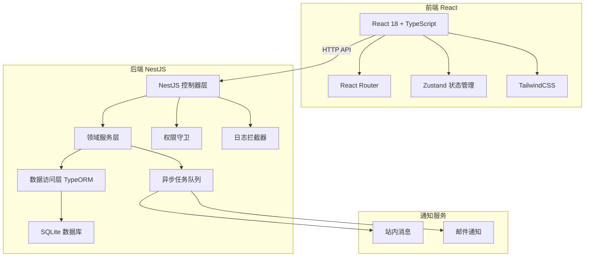
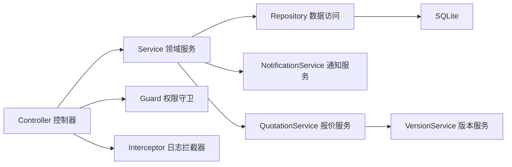
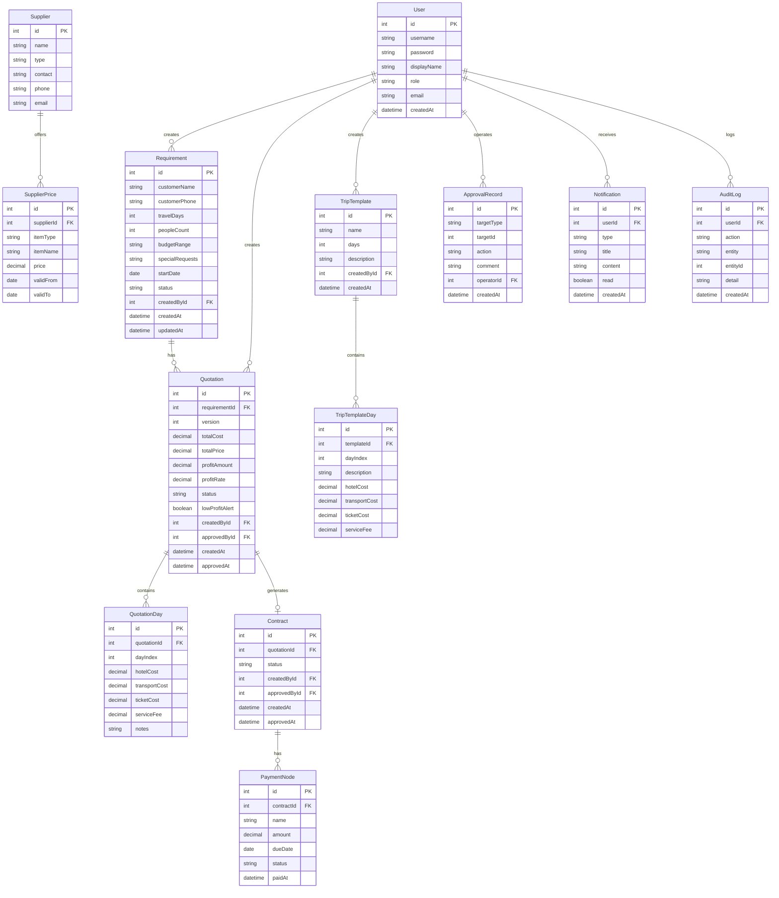

## 1. 架构设计



## 2. 技术说明
- 前端：React@18 + TailwindCSS@3 + Vite + Zustand + React Router
- 初始化工具：vite-init
- 后端：NestJS + TypeORM + SQLite
- 数据库：SQLite（本地开发，无需额外安装）
- 通知：站内消息表 + nodemailer 邮件（可配置 SMTP）

## 3. 路由定义
| 路由 | 用途 | 权限 |
|------|------|------|
| /login | 登录页面 | 公开 |
| / | 工作台 | 所有角色 |
| /requirements | 需求列表 | 销售+ |
| /requirements/:id | 需求详情 | 销售+ |
| /quotations | 报价列表 | 销售+ |
| /quotations/:id | 报价详情 | 销售+ |
| /quotations/:id/compare | 版本对比 | 销售+ |
| /approvals | 审批中心 | 产品经理+ |
| /contracts | 合同列表 | 财务+ |
| /contracts/:id | 合同详情 | 财务+ |
| /suppliers | 供应商管理 | 产品经理+ |
| /templates | 行程模板 | 产品经理+ |
| /profit | 利润统计 | 主管+ |
| /admin | 系统管理 | 管理员 |

## 4. API 定义

### 认证模块
```typescript
interface LoginDto { username: string; password: string }
interface LoginResponse { accessToken: string; user: UserVo }
interface UserVo { id: number; username: string; role: UserRole; displayName: string }
type UserRole = 'admin' | 'sales' | 'pm' | 'supervisor' | 'finance'
```

### 需求模块
```typescript
interface CreateRequirementDto {
  customerName: string
  customerPhone: string
  travelDays: number
  peopleCount: number
  budgetRange: string
  specialRequests: string
  startDate: string
}
interface RequirementVo {
  id: number
  customerName: string
  customerPhone: string
  travelDays: number
  peopleCount: number
  budgetRange: string
  specialRequests: string
  startDate: string
  status: RequirementStatus
  createdBy: UserVo
  createdAt: string
  updatedAt: string
  quotations: QuotationVo[]
}
type RequirementStatus = 'draft' | 'quoted' | 'approved' | 'contracted' | 'completed' | 'closed'
```

### 报价模块
```typescript
interface CreateQuotationDto {
  requirementId: number
  templateId?: number
  days: QuotationDayDto[]
}
interface QuotationDayDto {
  dayIndex: number
  hotelCost: number
  transportCost: number
  ticketCost: number
  serviceFee: number
  notes: string
}
interface QuotationVo {
  id: number
  requirementId: number
  version: number
  totalCost: number
  totalPrice: number
  profitAmount: number
  profitRate: number
  status: QuotationStatus
  lowProfitAlert: boolean
  days: QuotationDayVo[]
  createdBy: UserVo
  createdAt: string
  approvedBy?: UserVo
  approvedAt?: string
}
type QuotationStatus = 'draft' | 'pending_approval' | 'low_profit_confirmed' | 'approved' | 'rejected' | 'contracted'
```

### 审批模块
```typescript
interface ApprovalActionDto {
  targetType: 'quotation' | 'contract' | 'low_profit'
  targetId: number
  action: 'approve' | 'reject' | 'return'
  comment: string
}
interface ApprovalRecordVo {
  id: number
  targetType: string
  targetId: number
  action: string
  comment: string
  operator: UserVo
  createdAt: string
}
```

### 合同模块
```typescript
interface CreateContractDto {
  quotationId: number
  paymentNodes: PaymentNodeDto[]
}
interface PaymentNodeDto {
  name: string
  amount: number
  dueDate: string
}
interface ContractVo {
  id: number
  quotationId: number
  status: ContractStatus
  paymentNodes: PaymentNodeVo[]
  createdBy: UserVo
  createdAt: string
}
type ContractStatus = 'pending_approval' | 'approved' | 'active' | 'completed'
```

### 通知模块
```typescript
interface NotificationVo {
  id: number
  type: 'approval' | 'low_profit' | 'payment_due' | 'status_change'
  title: string
  content: string
  read: boolean
  createdAt: string
}
```

### 利润统计模块
```typescript
interface ProfitStatsVo {
  monthlyProfits: { month: string; revenue: number; cost: number; profit: number }[]
  topProjects: { id: number; customerName: string; profit: number; profitRate: number }[]
  teamPerformance: { userId: number; displayName: string; quotationCount: number; totalProfit: number }[]
}
```

## 5. 服务架构图



## 6. 数据模型

### 6.1 数据模型定义



### 6.2 数据定义语言

```sql
CREATE TABLE user (
  id INTEGER PRIMARY KEY AUTOINCREMENT,
  username VARCHAR(50) NOT NULL UNIQUE,
  password VARCHAR(255) NOT NULL,
  displayName VARCHAR(100) NOT NULL,
  role VARCHAR(20) NOT NULL DEFAULT 'sales',
  email VARCHAR(255),
  createdAt DATETIME NOT NULL DEFAULT CURRENT_TIMESTAMP
);

CREATE TABLE requirement (
  id INTEGER PRIMARY KEY AUTOINCREMENT,
  customerName VARCHAR(100) NOT NULL,
  customerPhone VARCHAR(20),
  travelDays INTEGER NOT NULL,
  peopleCount INTEGER NOT NULL DEFAULT 1,
  budgetRange VARCHAR(50),
  specialRequests TEXT,
  startDate DATE,
  status VARCHAR(20) NOT NULL DEFAULT 'draft',
  createdById INTEGER NOT NULL REFERENCES user(id),
  createdAt DATETIME NOT NULL DEFAULT CURRENT_TIMESTAMP,
  updatedAt DATETIME NOT NULL DEFAULT CURRENT_TIMESTAMP
);

CREATE TABLE quotation (
  id INTEGER PRIMARY KEY AUTOINCREMENT,
  requirementId INTEGER NOT NULL REFERENCES requirement(id),
  version INTEGER NOT NULL DEFAULT 1,
  totalCost DECIMAL(12,2) NOT NULL DEFAULT 0,
  totalPrice DECIMAL(12,2) NOT NULL DEFAULT 0,
  profitAmount DECIMAL(12,2) NOT NULL DEFAULT 0,
  profitRate DECIMAL(5,2) NOT NULL DEFAULT 0,
  status VARCHAR(20) NOT NULL DEFAULT 'draft',
  lowProfitAlert BOOLEAN NOT NULL DEFAULT 0,
  createdById INTEGER NOT NULL REFERENCES user(id),
  approvedById INTEGER REFERENCES user(id),
  createdAt DATETIME NOT NULL DEFAULT CURRENT_TIMESTAMP,
  approvedAt DATETIME
);

CREATE TABLE quotation_day (
  id INTEGER PRIMARY KEY AUTOINCREMENT,
  quotationId INTEGER NOT NULL REFERENCES quotation(id) ON DELETE CASCADE,
  dayIndex INTEGER NOT NULL,
  hotelCost DECIMAL(10,2) NOT NULL DEFAULT 0,
  transportCost DECIMAL(10,2) NOT NULL DEFAULT 0,
  ticketCost DECIMAL(10,2) NOT NULL DEFAULT 0,
  serviceFee DECIMAL(10,2) NOT NULL DEFAULT 0,
  notes TEXT
);

CREATE TABLE supplier (
  id INTEGER PRIMARY KEY AUTOINCREMENT,
  name VARCHAR(100) NOT NULL,
  type VARCHAR(30) NOT NULL,
  contact VARCHAR(50),
  phone VARCHAR(20),
  email VARCHAR(255)
);

CREATE TABLE supplier_price (
  id INTEGER PRIMARY KEY AUTOINCREMENT,
  supplierId INTEGER NOT NULL REFERENCES supplier(id),
  itemType VARCHAR(30) NOT NULL,
  itemName VARCHAR(100) NOT NULL,
  price DECIMAL(10,2) NOT NULL,
  validFrom DATE NOT NULL,
  validTo DATE NOT NULL
);

CREATE TABLE trip_template (
  id INTEGER PRIMARY KEY AUTOINCREMENT,
  name VARCHAR(100) NOT NULL,
  days INTEGER NOT NULL,
  description TEXT,
  createdById INTEGER NOT NULL REFERENCES user(id),
  createdAt DATETIME NOT NULL DEFAULT CURRENT_TIMESTAMP
);

CREATE TABLE trip_template_day (
  id INTEGER PRIMARY KEY AUTOINCREMENT,
  templateId INTEGER NOT NULL REFERENCES trip_template(id) ON DELETE CASCADE,
  dayIndex INTEGER NOT NULL,
  description TEXT,
  hotelCost DECIMAL(10,2) NOT NULL DEFAULT 0,
  transportCost DECIMAL(10,2) NOT NULL DEFAULT 0,
  ticketCost DECIMAL(10,2) NOT NULL DEFAULT 0,
  serviceFee DECIMAL(10,2) NOT NULL DEFAULT 0
);

CREATE TABLE contract (
  id INTEGER PRIMARY KEY AUTOINCREMENT,
  quotationId INTEGER NOT NULL REFERENCES quotation(id),
  status VARCHAR(20) NOT NULL DEFAULT 'pending_approval',
  createdById INTEGER NOT NULL REFERENCES user(id),
  approvedById INTEGER REFERENCES user(id),
  createdAt DATETIME NOT NULL DEFAULT CURRENT_TIMESTAMP,
  approvedAt DATETIME
);

CREATE TABLE payment_node (
  id INTEGER PRIMARY KEY AUTOINCREMENT,
  contractId INTEGER NOT NULL REFERENCES contract(id) ON DELETE CASCADE,
  name VARCHAR(100) NOT NULL,
  amount DECIMAL(12,2) NOT NULL,
  dueDate DATE NOT NULL,
  status VARCHAR(20) NOT NULL DEFAULT 'pending',
  paidAt DATETIME
);

CREATE TABLE approval_record (
  id INTEGER PRIMARY KEY AUTOINCREMENT,
  targetType VARCHAR(30) NOT NULL,
  targetId INTEGER NOT NULL,
  action VARCHAR(20) NOT NULL,
  comment TEXT,
  operatorId INTEGER NOT NULL REFERENCES user(id),
  createdAt DATETIME NOT NULL DEFAULT CURRENT_TIMESTAMP
);

CREATE TABLE notification (
  id INTEGER PRIMARY KEY AUTOINCREMENT,
  userId INTEGER NOT NULL REFERENCES user(id),
  type VARCHAR(30) NOT NULL,
  title VARCHAR(200) NOT NULL,
  content TEXT,
  read BOOLEAN NOT NULL DEFAULT 0,
  createdAt DATETIME NOT NULL DEFAULT CURRENT_TIMESTAMP
);

CREATE TABLE audit_log (
  id INTEGER PRIMARY KEY AUTOINCREMENT,
  userId INTEGER NOT NULL REFERENCES user(id),
  action VARCHAR(50) NOT NULL,
  entity VARCHAR(50) NOT NULL,
  entityId INTEGER NOT NULL,
  detail TEXT,
  createdAt DATETIME NOT NULL DEFAULT CURRENT_TIMESTAMP
);

CREATE INDEX idx_requirement_status ON requirement(status);
CREATE INDEX idx_requirement_createdBy ON requirement(createdById);
CREATE INDEX idx_quotation_requirement ON quotation(requirementId);
CREATE INDEX idx_quotation_status ON quotation(status);
CREATE INDEX idx_quotation_createdBy ON quotation(createdById);
CREATE INDEX idx_contract_status ON contract(status);
CREATE INDEX idx_payment_node_due ON payment_node(dueDate);
CREATE INDEX idx_notification_user ON notification(userId, read);
CREATE INDEX idx_audit_log_entity ON audit_log(entity, entityId);
CREATE INDEX idx_audit_log_user ON audit_log(userId);

INSERT INTO user (username, password, displayName, role, email) VALUES
  ('admin', '$2b$10$dummyhashedpassword', '系统管理员', 'admin', 'admin@travel.local'),
  ('sales1', '$2b$10$dummyhashedpassword', '张销售', 'sales', 'zhang@travel.local'),
  ('pm1', '$2b$10$dummyhashedpassword', '李产品', 'pm', 'li@travel.local'),
  ('supervisor1', '$2b$10$dummyhashedpassword', '王主管', 'supervisor', 'wang@travel.local'),
  ('finance1', '$2b$10$dummyhashedpassword', '赵财务', 'finance', 'zhao@travel.local');
```
