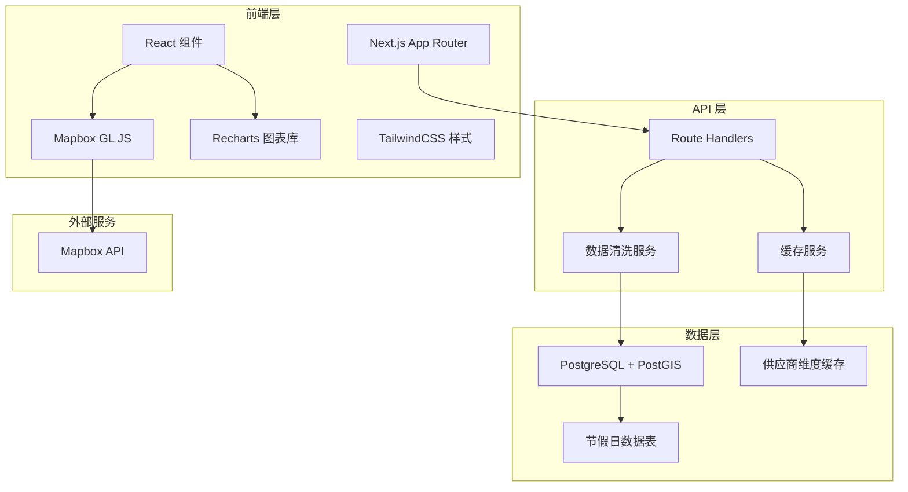
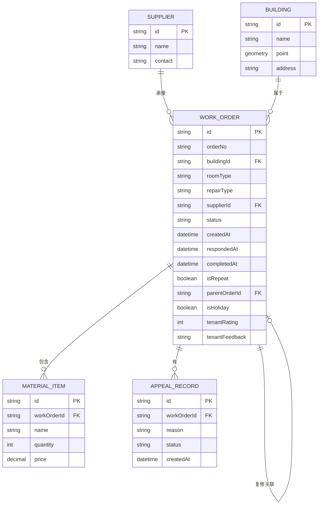

## 1. 架构设计



## 2. 技术描述

- **前端框架**: Next.js 14 (App Router) + React 18
- **样式方案**: TailwindCSS 3
- **地图组件**: Mapbox GL JS
- **图表组件**: Recharts
- **数据库**: PostgreSQL + PostGIS (模拟使用 mock 数据)
- **状态管理**: React Context + useSWR
- **导出功能**: SheetJS (xlsx) + CSV 导出

## 3. 路由定义

| 路由 | 用途 |
|-------|---------|
| /dashboard | 核心看板首页 |
| /work-orders | 工单列表页 |
| /work-orders/[id] | 工单详情页 |
| /suppliers/[id] | 供应商详情页 |
| /api/work-orders | 工单数据 API |
| /api/suppliers | 供应商数据 API |
| /api/metrics | 指标统计 API |
| /api/export | 数据导出 API |

## 4. API 定义

### 4.1 类型定义

```typescript
// 工单类型
interface WorkOrder {
  id: string;
  orderNo: string;
  buildingId: string;
  roomType: string;
  repairType: string;
  supplierId: string;
  status: 'pending' | 'confirmed' | 'in_progress' | 'completed' | 'appealing' | 'closed';
  createdAt: Date;
  respondedAt?: Date;
  completedAt?: Date;
  responseTime?: number;
  isRepeat: boolean;
  parentOrderId?: string;
  isHoliday: boolean;
  tenantRating?: number;
  tenantFeedback?: string;
  materials: MaterialItem[];
  photos: string[];
  appealRecords: AppealRecord[];
}

// 供应商
interface Supplier {
  id: string;
  name: string;
  totalOrders: number;
  repeatRate: number;
  avgResponseTime: number;
  timeoutCount: number;
  avgRating: number;
}

// 材料项
interface MaterialItem {
  id: string;
  name: string;
  quantity: number;
  unit: string;
  price: number;
}

// 申诉记录
interface AppealRecord {
  id: string;
  workOrderId: string;
  reason: string;
  photos: string[];
  tenantConfirmation?: boolean;
  createdAt: Date;
  status: 'pending' | 'approved' | 'rejected';
}
```

## 5. 数据模型

### 5.1 ER 图



### 5.2 核心数据处理逻辑

1. **工单生命周期清洗**:
   - 计算响应时长 = respondedAt - createdAt
   - 标记节假日工单（匹配节假日表）
   - 识别复修工单（关联 parentOrderId）

2. **供应商维度缓存**:
   - 按供应商聚合：总工单量、复修率、平均响应时长、超时率、平均评分
   - 缓存 TTL: 1 小时

3. **响应时长箱线图**:
   - 按周/月统计响应时长分布
   - 计算四分位数、中位数、异常值

4. **地图点位聚合**:
   - 按楼栋聚合工单数
   - 颜色编码：问题密度分级

5. **超时判定**:
   - 排除节假日工单
   - 仅统计已完成工单
   - 确认中工单不纳入绩效
