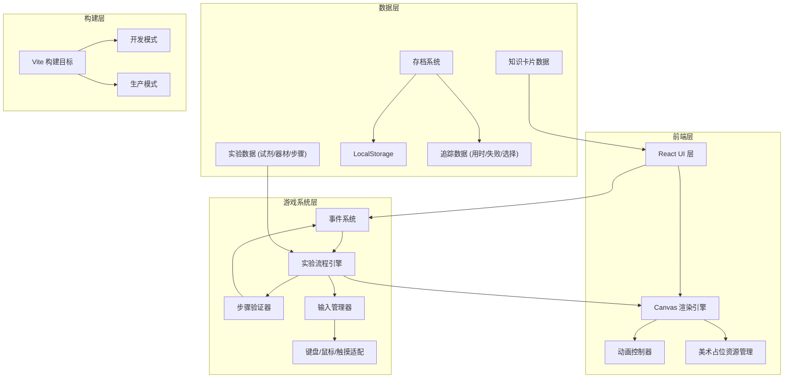

## 1. 架构设计



## 2. 技术说明

- **前端框架**：React@18 + TypeScript + Vite
- **样式方案**：Tailwind CSS@3
- **状态管理**：Zustand（游戏状态、存档状态、设置状态）
- **画布渲染**：HTML5 Canvas 2D API，由 React 组件封装
- **动画**：requestAnimationFrame 驱动的自定义动画控制器
- **数据持久化**：LocalStorage（存档、设置、追踪数据）
- **初始化工具**：vite-init（react-ts 模板）
- **后端**：无（纯前端项目）
- **构建工具**：Vite，多目标构建（开发/生产）

## 3. 路由定义

| 路由 | 用途 |
|------|------|
| `/` | 主菜单页 |
| `/tutorial` | 教程关卡页 |
| `/lab/:levelId` | 实验关卡页（动态关卡 ID） |
| `/knowledge/:cardId` | 知识卡片页 |
| `/result/:levelId` | 结算页 |
| `/settings` | 设置页 |
| `/records` | 实验记录页 |

## 4. 目录结构设计

```
src/
├── components/          # React UI 组件
│   ├── ui/              # 通用 UI 组件（按钮、面板、提示框）
│   ├── lab/             # 实验台相关组件
│   ├── menu/            # 主菜单组件
│   └── result/          # 结算页组件
├── pages/               # 页面组件
│   ├── MainMenu.tsx
│   ├── Tutorial.tsx
│   ├── Lab.tsx
│   ├── Knowledge.tsx
│   ├── Result.tsx
│   ├── Settings.tsx
│   └── Records.tsx
├── engine/              # 游戏引擎核心
│   ├── canvas/          # Canvas 渲染引擎
│   │   ├── renderer.ts       # 渲染器主控
│   │   └── scene.ts          # 场景管理
│   ├── animation/       # 动画控制器
│   │   ├── controller.ts     # 动画控制器
│   │   └── tween.ts          # 补间动画
│   ├── events/          # 事件系统
│   │   └── emitter.ts        # 事件发射器
│   ├── input/           # 输入管理
│   │   ├── manager.ts        # 输入管理器
│   │   ├── keyboard.ts       # 键盘输入
│   │   ├── mouse.ts          # 鼠标输入
│   │   └── touch.ts          # 触摸输入
│   └── experiment/      # 实验流程引擎
│       ├── engine.ts         # 实验引擎
│       ├── validator.ts      # 步骤验证器
│       └── reactions.ts      # 反应模拟
├── data/                # 游戏数据
│   ├── reagents.ts      # 试剂数据
│   ├── apparatus.ts     # 器材数据
│   ├── experiments.ts   # 实验步骤数据
│   ├── knowledge.ts     # 知识卡片数据
│   └── levels.ts        # 关卡配置
├── assets/              # 美术占位资源
│   ├── placeholders.ts  # 占位图形定义
│   └── sprites.ts       # 精灵图管理
├── stores/              # Zustand 状态
│   ├── gameStore.ts     # 游戏主状态
│   ├── saveStore.ts     # 存档状态
│   └── settingsStore.ts # 设置状态
├── hooks/               # 自定义 Hooks
│   ├── useCanvas.ts     # Canvas 渲染 Hook
│   ├── useAnimation.ts  # 动画 Hook
│   └── useInput.ts      # 输入 Hook
├── utils/               # 工具函数
│   ├── tracker.ts       # 数据追踪
│   └── storage.ts       # 存储工具
├── types/               # TypeScript 类型
│   └── game.ts          # 游戏类型定义
├── App.tsx
└── main.tsx
```

## 5. 核心数据模型

### 5.1 类型定义

```typescript
// 试剂
interface Reagent {
  id: string;
  name: string;
  formula: string;
  concentration: string;
  color: string;
  state: 'liquid' | 'solid' | 'gas';
  dangerLevel: 0 | 1 | 2 | 3;
}

// 器材
interface Apparatus {
  id: string;
  name: string;
  type: 'beaker' | 'flask' | 'test_tube' | 'thermometer' | 'bunsen_burner' | 'dropper' | 'stirrer' | 'funnel' | 'graduated_cylinder';
  capacity?: number;
}

// 实验步骤
interface ExperimentStep {
  id: string;
  order: number;
  description: string;
  action: StepAction;
  target: string;
  tolerance: number;
  hint: string;
  errorPrompt: string;
  safetyNote?: string;
}

// 知识卡片
interface KnowledgeCard {
  id: string;
  title: string;
  principle: string;
  safetyNote: string;
  realWorldApplication: string;
  relatedFormula?: string;
}

// 关卡
interface Level {
  id: string;
  title: string;
  description: string;
  experimentId: string;
  knowledgeCardId: string;
  newRules: string[];
  timeLimit?: number;
  hintCount: number;
}

// 追踪数据
interface PlayTracker {
  levelId: string;
  startTime: number;
  endTime: number;
  duration: number;
  failureCount: number;
  keyChoices: KeyChoice[];
  score: number;
  hintsUsed: number;
}

interface KeyChoice {
  stepId: string;
  timestamp: number;
  choice: string;
  correct: boolean;
}
```

### 5.2 关卡数据规划

| 关卡 | 名称 | 核心操作 | 新增规则 |
|------|------|----------|----------|
| 教程 | 实验室入门 | 选取器材、添加试剂 | 无（引导式） |
| 关卡1 | 基础溶液配制 | 用量筒量取、搅拌溶解 | 量取精度要求 |
| 关卡2 | 温度控制实验 | 酒精灯加热、温度监测 | 温度区间控制 |
| 关卡3 | 酸碱中和反应 | 滴加指示剂、逐滴加入 | 滴加速度控制 |
| 关卡4 | 沉淀反应 | 过滤操作、洗涤沉淀 | 操作顺序要求 |
| 关卡5 | 综合实验 | 多步骤串联 | 全部规则综合 |
