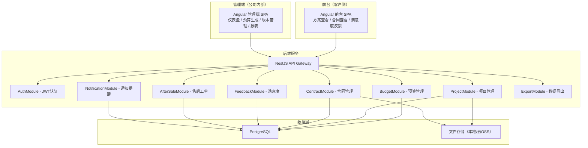
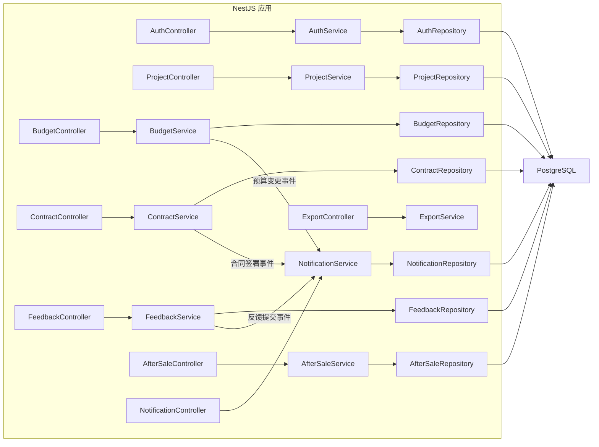
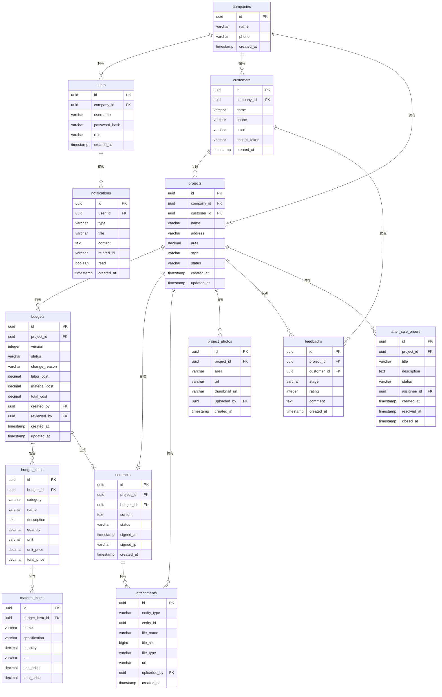

## 1. 架构设计



## 2. 技术说明

- 前端：Angular 17+ + Angular Material + TypeScript
- 后端：NestJS 10+ + TypeScript（ESM格式）
- 数据库：PostgreSQL 15+
- ORM：TypeORM
- 认证：JWT（Passport策略）
- 文件存储：本地存储（可扩展至云OSS）
- 实时通知：WebSocket（Socket.IO）
- 数据导出：xlsx 库生成 Excel
- 初始化工具：Angular CLI + NestJS CLI

## 3. 路由定义

### 3.1 前台路由（客户侧）

| 路由 | 用途 |
|------|------|
| /portal/:token | 客户入口（通过邀请Token访问） |
| /portal/proposal/:id | 查看装修方案详情 |
| /portal/contract/:id | 查看合同内容与附件 |
| /portal/feedback/:id | 提交满意度反馈 |

### 3.2 管理端路由（公司内部）

| 路由 | 用途 |
|------|------|
| /login | 登录页 |
| /dashboard | 工作台仪表盘 |
| /projects | 项目列表 |
| /projects/:id | 项目明细视图（含材料/照片/附件内嵌Tab） |
| /budgets/create | 创建新预算 |
| /budgets/:id/edit | 编辑预算 |
| /budgets/:id/versions | 预算版本管理 |
| /contracts | 合同列表 |
| /contracts/:id | 合同详情 |
| /feedbacks | 客户满意度记录 |
| /after-sale | 售后工单管理 |
| /reports | 售后闭环报表 |

## 4. API定义

### 4.1 认证相关

```typescript
interface LoginRequest {
  username: string;
  password: string;
}

interface LoginResponse {
  accessToken: string;
  user: {
    id: string;
    username: string;
    role: 'owner' | 'worker' | 'customer';
    companyId: string;
  };
}
```

### 4.2 项目相关

```typescript
interface Project {
  id: string;
  name: string;
  customerName: string;
  customerPhone: string;
  address: string;
  area: number;
  style: string;
  status: 'draft' | 'budgeting' | 'confirmed' | 'contracted' | 'constructing' | 'completed';
  companyId: string;
  createdAt: Date;
  updatedAt: Date;
}

interface ProjectDetail extends Project {
  budgets: Budget[];
  latestBudget: Budget;
  contract: Contract | null;
  feedbacks: Feedback[];
  afterSaleOrders: AfterSaleOrder[];
  photos: ProjectPhoto[];
  attachments: Attachment[];
}
```

### 4.3 预算相关

```typescript
interface Budget {
  id: string;
  projectId: string;
  version: number;
  status: 'draft' | 'pending_review' | 'approved' | 'rejected' | 'sent_to_client';
  changeReason: string | null;
  items: BudgetItem[];
  laborCost: number;
  materialCost: number;
  totalCost: number;
  createdBy: string;
  reviewedBy: string | null;
  createdAt: Date;
  updatedAt: Date;
}

interface BudgetItem {
  id: string;
  budgetId: string;
  category: 'demolition' | 'plumbing' | 'masonry' | 'carpentry' | 'painting' | 'main_material' | 'other';
  name: string;
  description: string;
  quantity: number;
  unit: string;
  unitPrice: number;
  totalPrice: number;
  materials: MaterialItem[];
}

interface MaterialItem {
  id: string;
  budgetItemId: string;
  name: string;
  specification: string;
  quantity: number;
  unit: string;
  unitPrice: number;
  totalPrice: number;
}
```

### 4.4 合同相关

```typescript
interface Contract {
  id: string;
  projectId: string;
  budgetId: string;
  content: string;
  status: 'draft' | 'sent' | 'signed';
  signedAt: Date | null;
  signedIp: string | null;
  attachments: Attachment[];
  createdAt: Date;
}
```

### 4.5 满意度反馈

```typescript
interface Feedback {
  id: string;
  projectId: string;
  customerId: string;
  stage: 'design' | 'construction' | 'completion';
  rating: number;
  comment: string;
  createdAt: Date;
}
```

### 4.6 售后工单

```typescript
interface AfterSaleOrder {
  id: string;
  projectId: string;
  title: string;
  description: string;
  status: 'pending' | 'processing' | 'closed';
  assigneeId: string | null;
  createdAt: Date;
  resolvedAt: Date | null;
  closedAt: Date | null;
}
```

### 4.7 通知相关

```typescript
interface Notification {
  id: string;
  userId: string;
  type: 'budget_change' | 'contract_signed' | 'feedback_received' | 'after_sale_created';
  title: string;
  content: string;
  relatedId: string;
  read: boolean;
  createdAt: Date;
}
```

### 4.8 文件相关

```typescript
interface ProjectPhoto {
  id: string;
  projectId: string;
  area: string;
  url: string;
  thumbnailUrl: string;
  uploadedBy: string;
  createdAt: Date;
}

interface Attachment {
  id: string;
  entityType: 'contract' | 'project';
  entityId: string;
  fileName: string;
  fileSize: number;
  fileType: string;
  url: string;
  uploadedBy: string;
  createdAt: Date;
}
```

## 5. 服务端架构图



## 6. 数据模型

### 6.1 数据模型定义



### 6.2 数据定义语言

```sql
CREATE TABLE companies (
    id UUID PRIMARY KEY DEFAULT gen_random_uuid(),
    name VARCHAR(200) NOT NULL,
    phone VARCHAR(20),
    created_at TIMESTAMP DEFAULT CURRENT_TIMESTAMP
);

CREATE TABLE users (
    id UUID PRIMARY KEY DEFAULT gen_random_uuid(),
    company_id UUID NOT NULL REFERENCES companies(id),
    username VARCHAR(100) NOT NULL UNIQUE,
    password_hash VARCHAR(255) NOT NULL,
    role VARCHAR(20) NOT NULL CHECK (role IN ('owner', 'worker')),
    created_at TIMESTAMP DEFAULT CURRENT_TIMESTAMP
);

CREATE TABLE customers (
    id UUID PRIMARY KEY DEFAULT gen_random_uuid(),
    company_id UUID NOT NULL REFERENCES companies(id),
    name VARCHAR(100) NOT NULL,
    phone VARCHAR(20),
    email VARCHAR(200),
    access_token VARCHAR(255) UNIQUE,
    created_at TIMESTAMP DEFAULT CURRENT_TIMESTAMP
);

CREATE TABLE projects (
    id UUID PRIMARY KEY DEFAULT gen_random_uuid(),
    company_id UUID NOT NULL REFERENCES companies(id),
    customer_id UUID REFERENCES customers(id),
    name VARCHAR(200) NOT NULL,
    address VARCHAR(500),
    area DECIMAL(10,2),
    style VARCHAR(50),
    status VARCHAR(20) NOT NULL DEFAULT 'draft' CHECK (status IN ('draft', 'budgeting', 'confirmed', 'contracted', 'constructing', 'completed')),
    created_at TIMESTAMP DEFAULT CURRENT_TIMESTAMP,
    updated_at TIMESTAMP DEFAULT CURRENT_TIMESTAMP
);

CREATE TABLE budgets (
    id UUID PRIMARY KEY DEFAULT gen_random_uuid(),
    project_id UUID NOT NULL REFERENCES projects(id),
    version INTEGER NOT NULL DEFAULT 1,
    status VARCHAR(20) NOT NULL DEFAULT 'draft' CHECK (status IN ('draft', 'pending_review', 'approved', 'rejected', 'sent_to_client')),
    change_reason TEXT,
    labor_cost DECIMAL(12,2) DEFAULT 0,
    material_cost DECIMAL(12,2) DEFAULT 0,
    total_cost DECIMAL(12,2) DEFAULT 0,
    created_by UUID REFERENCES users(id),
    reviewed_by UUID REFERENCES users(id),
    created_at TIMESTAMP DEFAULT CURRENT_TIMESTAMP,
    updated_at TIMESTAMP DEFAULT CURRENT_TIMESTAMP
);

CREATE TABLE budget_items (
    id UUID PRIMARY KEY DEFAULT gen_random_uuid(),
    budget_id UUID NOT NULL REFERENCES budgets(id) ON DELETE CASCADE,
    category VARCHAR(30) NOT NULL CHECK (category IN ('demolition', 'plumbing', 'masonry', 'carpentry', 'painting', 'main_material', 'other')),
    name VARCHAR(200) NOT NULL,
    description TEXT,
    quantity DECIMAL(10,2) NOT NULL DEFAULT 0,
    unit VARCHAR(20),
    unit_price DECIMAL(12,2) NOT NULL DEFAULT 0,
    total_price DECIMAL(12,2) NOT NULL DEFAULT 0
);

CREATE TABLE material_items (
    id UUID PRIMARY KEY DEFAULT gen_random_uuid(),
    budget_item_id UUID NOT NULL REFERENCES budget_items(id) ON DELETE CASCADE,
    name VARCHAR(200) NOT NULL,
    specification VARCHAR(200),
    quantity DECIMAL(10,2) NOT NULL DEFAULT 0,
    unit VARCHAR(20),
    unit_price DECIMAL(12,2) NOT NULL DEFAULT 0,
    total_price DECIMAL(12,2) NOT NULL DEFAULT 0
);

CREATE TABLE contracts (
    id UUID PRIMARY KEY DEFAULT gen_random_uuid(),
    project_id UUID NOT NULL REFERENCES projects(id),
    budget_id UUID NOT NULL REFERENCES budgets(id),
    content TEXT NOT NULL,
    status VARCHAR(20) NOT NULL DEFAULT 'draft' CHECK (status IN ('draft', 'sent', 'signed')),
    signed_at TIMESTAMP,
    signed_ip VARCHAR(45),
    created_at TIMESTAMP DEFAULT CURRENT_TIMESTAMP
);

CREATE TABLE attachments (
    id UUID PRIMARY KEY DEFAULT gen_random_uuid(),
    entity_type VARCHAR(20) NOT NULL,
    entity_id UUID NOT NULL,
    file_name VARCHAR(500) NOT NULL,
    file_size BIGINT NOT NULL DEFAULT 0,
    file_type VARCHAR(50),
    url VARCHAR(1000) NOT NULL,
    uploaded_by UUID REFERENCES users(id),
    created_at TIMESTAMP DEFAULT CURRENT_TIMESTAMP
);

CREATE TABLE project_photos (
    id UUID PRIMARY KEY DEFAULT gen_random_uuid(),
    project_id UUID NOT NULL REFERENCES projects(id),
    area VARCHAR(100),
    url VARCHAR(1000) NOT NULL,
    thumbnail_url VARCHAR(1000),
    uploaded_by UUID REFERENCES users(id),
    created_at TIMESTAMP DEFAULT CURRENT_TIMESTAMP
);

CREATE TABLE feedbacks (
    id UUID PRIMARY KEY DEFAULT gen_random_uuid(),
    project_id UUID NOT NULL REFERENCES projects(id),
    customer_id UUID NOT NULL REFERENCES customers(id),
    stage VARCHAR(20) NOT NULL CHECK (stage IN ('design', 'construction', 'completion')),
    rating INTEGER NOT NULL CHECK (rating BETWEEN 1 AND 5),
    comment TEXT,
    created_at TIMESTAMP DEFAULT CURRENT_TIMESTAMP
);

CREATE TABLE after_sale_orders (
    id UUID PRIMARY KEY DEFAULT gen_random_uuid(),
    project_id UUID NOT NULL REFERENCES projects(id),
    title VARCHAR(200) NOT NULL,
    description TEXT,
    status VARCHAR(20) NOT NULL DEFAULT 'pending' CHECK (status IN ('pending', 'processing', 'closed')),
    assignee_id UUID REFERENCES users(id),
    created_at TIMESTAMP DEFAULT CURRENT_TIMESTAMP,
    resolved_at TIMESTAMP,
    closed_at TIMESTAMP
);

CREATE TABLE notifications (
    id UUID PRIMARY KEY DEFAULT gen_random_uuid(),
    user_id UUID NOT NULL REFERENCES users(id),
    type VARCHAR(30) NOT NULL CHECK (type IN ('budget_change', 'contract_signed', 'feedback_received', 'after_sale_created')),
    title VARCHAR(200) NOT NULL,
    content TEXT,
    related_id UUID,
    read BOOLEAN NOT NULL DEFAULT FALSE,
    created_at TIMESTAMP DEFAULT CURRENT_TIMESTAMP
);

CREATE INDEX idx_projects_company ON projects(company_id);
CREATE INDEX idx_projects_status ON projects(status);
CREATE INDEX idx_budgets_project ON budgets(project_id);
CREATE INDEX idx_budgets_version ON budgets(project_id, version);
CREATE INDEX idx_attachments_entity ON attachments(entity_type, entity_id);
CREATE INDEX idx_photos_project ON project_photos(project_id);
CREATE INDEX idx_feedbacks_project ON feedbacks(project_id);
CREATE INDEX idx_after_sale_project ON after_sale_orders(project_id);
CREATE INDEX idx_after_sale_status ON after_sale_orders(status);
CREATE INDEX idx_notifications_user ON notifications(user_id, read);
CREATE INDEX idx_notifications_created ON notifications(created_at DESC);
```
