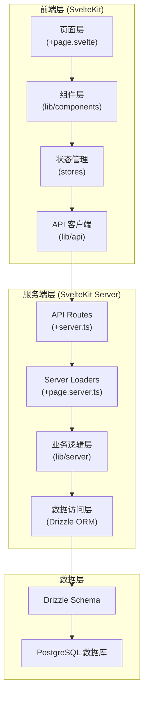
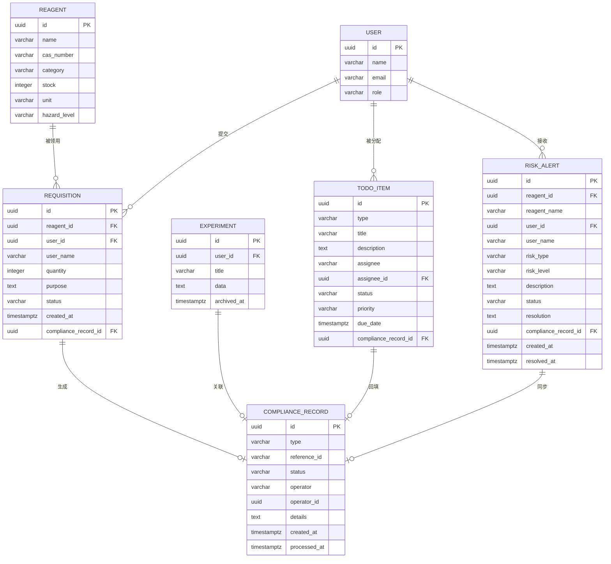

## 1. 架构设计



## 2. 技术描述

### 2.1 技术栈选型
- **前端框架**: SvelteKit 2.x (全栈框架，前后端一体)
- **样式方案**: Tailwind CSS 3.x
- **ORM**: Drizzle ORM 0.33.x
- **数据库**: PostgreSQL 16.x
- **开发语言**: TypeScript 5.x
- **包管理器**: pnpm
- **图标库**: lucide-svelte
- **日期处理**: date-fns

### 2.2 项目初始化
使用 `pnpm create svelte@latest` 初始化 SvelteKit 项目，选择 TypeScript + ESLint + Prettier 配置。

## 3. 目录结构与路由定义

### 3.1 目录结构
```
/
├── src/
│   ├── lib/
│   │   ├── components/          # 通用组件
│   │   │   ├── DataTable.svelte      # 响应式表格/卡片组件
│   │   │   ├── StatusBadge.svelte    # 状态标签组件
│   │   │   ├── TodoCard.svelte       # 待办卡片组件
│   │   │   ├── RiskAlert.svelte      # 危化风险提醒组件
│   │   │   └── FormField.svelte      # 表单字段组件
│   │   ├── server/              # 服务端逻辑
│   │   │   ├── db.ts                 # Drizzle 数据库连接
│   │   │   ├── schema.ts             # 数据库模型定义
│   │   │   ├── services/             # 业务服务
│   │   │   │   ├── reagent.ts        # 试剂服务
│   │   │   │   ├── requisition.ts    # 领用申请服务
│   │   │   │   ├── compliance.ts     # 安全合规服务
│   │   │   │   ├── todo.ts           # 待办服务
│   │   │   │   └── risk.ts           # 危化风险服务
│   │   │   └── seed.ts               # 初始化数据
│   │   ├── stores/              # 客户端状态
│   │   ├── types/               # 类型定义
│   │   ├── api/                 # API 客户端
│   │   └── utils/               # 工具函数
│   ├── routes/
│   │   ├── +layout.svelte       # 根布局
│   │   ├── +page.svelte         # 首页（待办面板）
│   │   ├── requisition/         # 领用申请
│   │   ├── archive/             # 实验数据归档
│   │   ├── compliance/          # 安全合规
│   │   └── admin/               # 后台管理
│   │       ├── +layout.server.ts
│   │       ├── experiments/
│   │       ├── compliance-dashboard/
│   │       └── risk-management/
│   └── app.css                  # 全局样式 + Tailwind
├── static/
├── drizzle.config.ts
├── svelte.config.js
├── tailwind.config.js
├── postcss.config.js
├── tsconfig.json
└── package.json
```

### 3.2 路由定义

| 路由 | 页面 | 权限 |
|-------|------|------|
| `/` | 首页 - 待办事项面板 | 所有登录用户 |
| `/requisition` | 试剂领用申请 | 科研人员/研究生 |
| `/archive` | 实验数据归档 | 科研人员/研究生 |
| `/compliance` | 安全合规数据列表 & 导出 | 所有登录用户 |
| `/admin/experiments` | 实验数据管理 | 管理员 |
| `/admin/compliance-dashboard` | 安全合规看板 | 管理员 |
| `/admin/risk-management` | 危化风险处理 | 管理员 |

## 4. API 定义

### 4.1 API Routes
所有 API 位于 `src/routes/api/` 目录下：

```typescript
// src/lib/types/index.ts
export type Reagent = {
  id: string;
  name: string;
  casNumber: string;
  category: 'normal' | 'hazardous' | 'controlled';
  stock: number;
  unit: string;
  hazardLevel?: 'low' | 'medium' | 'high';
};

export type Requisition = {
  id: string;
  reagentId: string;
  userId: string;
  userName: string;
  quantity: number;
  purpose: string;
  status: 'pending' | 'approved' | 'rejected' | 'completed';
  createdAt: Date;
  complianceRecordId?: string;
};

export type ComplianceRecord = {
  id: string;
  type: 'requisition' | 'experiment' | 'todo' | 'risk';
  referenceId: string;
  status: 'pending' | 'completed' | 'failed';
  operator: string;
  operatorId: string;
  details: string;
  createdAt: Date;
  processedAt?: Date;
};

export type TodoItem = {
  id: string;
  type: 'project_report' | 'instrument_booking' | 'sample_tracking';
  title: string;
  description: string;
  assignee: string;
  assigneeId: string;
  status: 'pending' | 'processing' | 'completed';
  priority: 'low' | 'medium' | 'high';
  dueDate: Date;
  complianceRecordId?: string;
};

export type RiskAlert = {
  id: string;
  reagentId: string;
  reagentName: string;
  userId: string;
  userName: string;
  riskType: string;
  riskLevel: 'low' | 'medium' | 'high' | 'critical';
  description: string;
  status: 'pending' | 'processing' | 'resolved';
  resolution?: string;
  complianceRecordId?: string;
  createdAt: Date;
  resolvedAt?: Date;
};
```

### 4.2 核心 API 端点
| 方法 | 路径 | 描述 |
|------|------|------|
| GET | `/api/reagents` | 获取试剂列表 |
| POST | `/api/requisitions` | 提交领用申请 |
| GET | `/api/requisitions` | 获取领用申请列表 |
| POST | `/api/experiments` | 归档实验数据 |
| GET | `/api/compliance` | 获取安全合规记录 |
| GET | `/api/compliance/export` | 导出合规数据 (CSV) |
| GET | `/api/todos` | 获取待办列表 |
| POST | `/api/todos/:id/complete` | 完成待办（自动回填合规） |
| GET | `/api/risks` | 获取危化风险提醒 |
| POST | `/api/risks/:id/resolve` | 处理风险（同步到合规看板） |

## 5. 数据模型

### 5.1 ER 图



### 5.2 Drizzle Schema

```typescript
// src/lib/server/schema.ts
import { pgTable, uuid, varchar, integer, text, timestamp, pgEnum } from 'drizzle-orm/pg-core';

export const userRoleEnum = pgEnum('user_role', ['researcher', 'admin']);
export const statusEnum = pgEnum('status', ['pending', 'approved', 'rejected', 'completed', 'processing', 'resolved', 'failed']);
export const priorityEnum = pgEnum('priority', ['low', 'medium', 'high', 'critical']);
export const todoTypeEnum = pgEnum('todo_type', ['project_report', 'instrument_booking', 'sample_tracking']);
export const complianceTypeEnum = pgEnum('compliance_type', ['requisition', 'experiment', 'todo', 'risk']);
export const hazardLevelEnum = pgEnum('hazard_level', ['low', 'medium', 'high', 'critical']);
export const reagentCategoryEnum = pgEnum('reagent_category', ['normal', 'hazardous', 'controlled']);

export const users = pgTable('users', {
  id: uuid('id').primaryKey().defaultRandom(),
  name: varchar('name', { length: 100 }).notNull(),
  email: varchar('email', { length: 255 }).notNull().unique(),
  role: userRoleEnum('role').default('researcher'),
});

export const reagents = pgTable('reagents', {
  id: uuid('id').primaryKey().defaultRandom(),
  name: varchar('name', { length: 255 }).notNull(),
  casNumber: varchar('cas_number', { length: 50 }),
  category: reagentCategoryEnum('category').default('normal'),
  stock: integer('stock').notNull().default(0),
  unit: varchar('unit', { length: 20 }).notNull(),
  hazardLevel: hazardLevelEnum('hazard_level'),
});

export const requisitions = pgTable('requisitions', {
  id: uuid('id').primaryKey().defaultRandom(),
  reagentId: uuid('reagent_id').references(() => reagents.id),
  userId: uuid('user_id').references(() => users.id),
  userName: varchar('user_name', { length: 100 }).notNull(),
  quantity: integer('quantity').notNull(),
  purpose: text('purpose').notNull(),
  status: statusEnum('status').default('pending'),
  createdAt: timestamp('created_at', { withTimezone: true }).defaultNow(),
  complianceRecordId: uuid('compliance_record_id').references(() => complianceRecords.id),
});

export const complianceRecords = pgTable('compliance_records', {
  id: uuid('id').primaryKey().defaultRandom(),
  type: complianceTypeEnum('type').notNull(),
  referenceId: varchar('reference_id', { length: 100 }).notNull(),
  status: statusEnum('status').default('pending'),
  operator: varchar('operator', { length: 100 }).notNull(),
  operatorId: uuid('operator_id').references(() => users.id),
  details: text('details').notNull(),
  createdAt: timestamp('created_at', { withTimezone: true }).defaultNow(),
  processedAt: timestamp('processed_at', { withTimezone: true }),
});

export const todoItems = pgTable('todo_items', {
  id: uuid('id').primaryKey().defaultRandom(),
  type: todoTypeEnum('type').notNull(),
  title: varchar('title', { length: 255 }).notNull(),
  description: text('description'),
  assignee: varchar('assignee', { length: 100 }).notNull(),
  assigneeId: uuid('assignee_id').references(() => users.id),
  status: statusEnum('status').default('pending'),
  priority: priorityEnum('priority').default('medium'),
  dueDate: timestamp('due_date', { withTimezone: true }).notNull(),
  complianceRecordId: uuid('compliance_record_id').references(() => complianceRecords.id),
});

export const riskAlerts = pgTable('risk_alerts', {
  id: uuid('id').primaryKey().defaultRandom(),
  reagentId: uuid('reagent_id').references(() => reagents.id),
  reagentName: varchar('reagent_name', { length: 255 }).notNull(),
  userId: uuid('user_id').references(() => users.id),
  userName: varchar('user_name', { length: 100 }).notNull(),
  riskType: varchar('risk_type', { length: 100 }).notNull(),
  riskLevel: hazardLevelEnum('risk_level').default('medium'),
  description: text('description').notNull(),
  status: statusEnum('status').default('pending'),
  resolution: text('resolution'),
  complianceRecordId: uuid('compliance_record_id').references(() => complianceRecords.id),
  createdAt: timestamp('created_at', { withTimezone: true }).defaultNow(),
  resolvedAt: timestamp('resolved_at', { withTimezone: true }),
});

export const experiments = pgTable('experiments', {
  id: uuid('id').primaryKey().defaultRandom(),
  userId: uuid('user_id').references(() => users.id),
  title: varchar('title', { length: 255 }).notNull(),
  data: text('data').notNull(),
  archivedAt: timestamp('archived_at', { withTimezone: true }).defaultNow(),
  complianceRecordId: uuid('compliance_record_id').references(() => complianceRecords.id),
});
```

## 6. 核心业务逻辑

### 6.1 待办回填安全合规
当待办事项标记为完成时，自动创建合规记录：
- 调用 `todoService.completeTodo(id, userId)`
- 更新 todo_items 状态为 completed
- 插入 compliance_records，type 为 'todo'，referenceId 为 todo.id
- 更新 todo_items.compliance_record_id

### 6.2 危化处理同步到看板
当研究生处理完危化风险提醒时：
- 调用 `riskService.resolveRisk(id, resolution, userId)`
- 更新 risk_alerts 状态为 resolved，记录 resolution 和 resolvedAt
- 插入或更新 compliance_records，type 为 'risk'
- 合规看板实时展示最新处理状态

### 6.3 响应式数据展示组件
`<DataTable>` 组件核心逻辑：
- 使用 `window.innerWidth` 或 CSS `@media (max-width: 768px)` 检测屏幕宽度
- 宽屏：渲染 `<table>` 完整列
- 窄屏：渲染 `<div class="card">` 列表，每行数据转为卡片
- 强制显示字段：`status`（状态标签）和 `operator/assignee`（负责人）始终渲染

### 6.4 数据导出
安全合规数据导出：
- 支持 CSV 和 Excel 格式
- 导出内容包含所有合规字段 + 关联详情
- 导出时生成导出记录，本身也计入合规追踪
