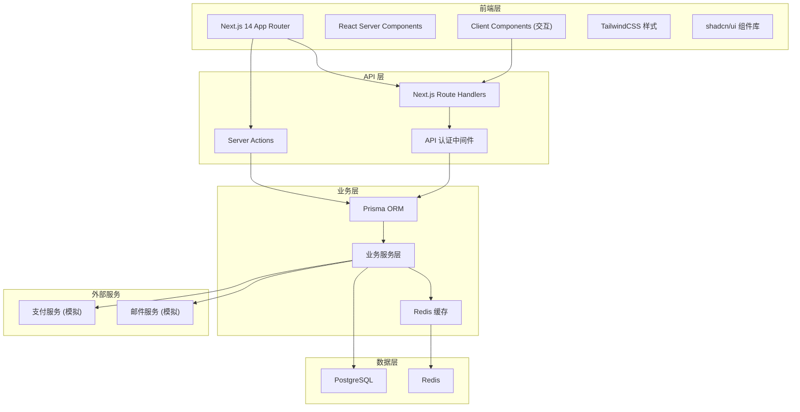
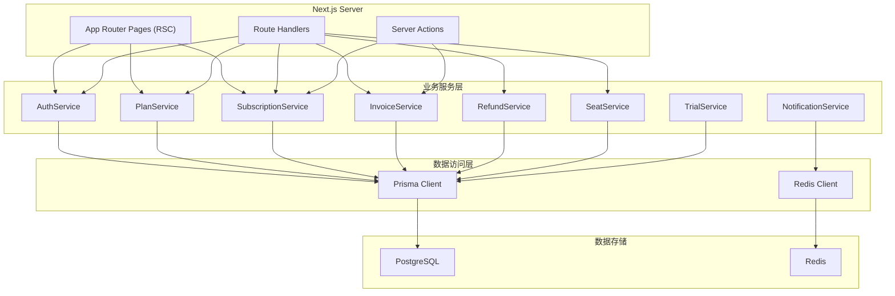
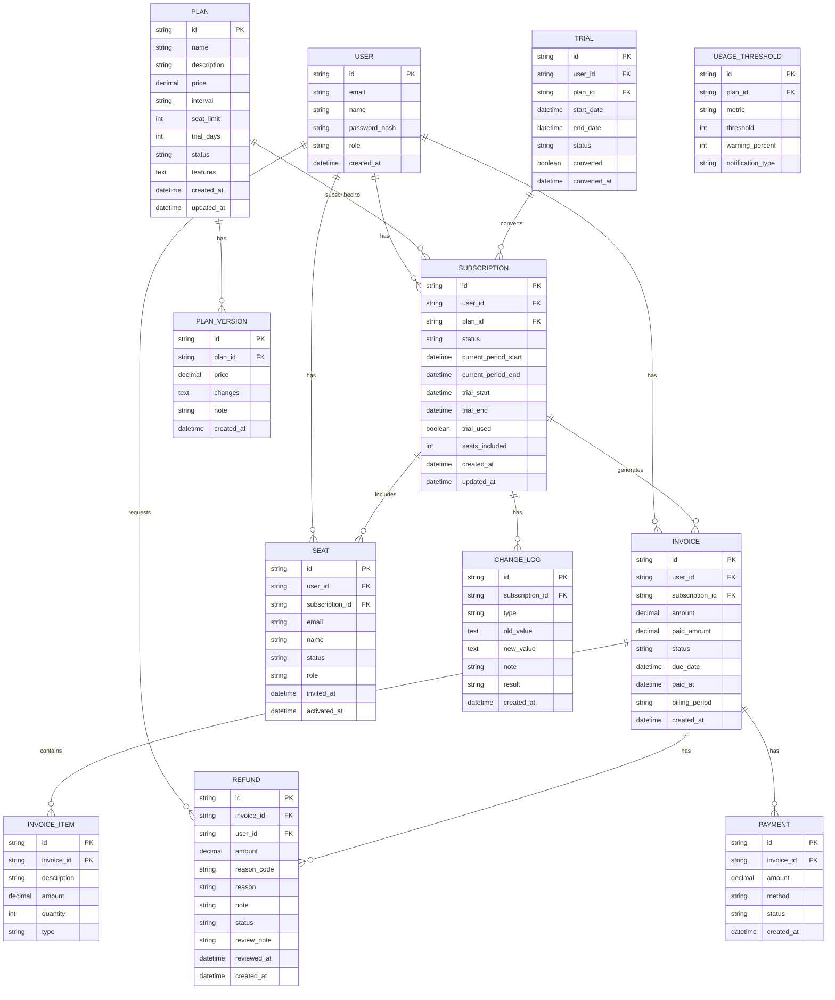

## 1. 架构设计



## 2. 技术描述

- **前端框架**：Next.js 14 (App Router) + React 18 + TypeScript 5
- **样式方案**：TailwindCSS 3 + shadcn/ui 组件库
- **ORM**：Prisma 5
- **主数据库**：PostgreSQL 15
- **缓存/会话**：Redis 7
- **图表库**：recharts
- **日期处理**：date-fns
- **表单处理**：react-hook-form + zod
- **图标库**：lucide-react
- **状态管理**：React Context + Server State

## 3. 路由定义

| 路由 | 用途 | 权限 |
|------|------|------|
| / | 用户首页/概览 | 登录用户 |
| /pricing | 套餐列表 | 公开 |
| /billing | 账单列表 | 登录用户 |
| /billing/[id] | 账单详情 | 登录用户 |
| /seats | 席位管理 | 登录用户 |
| /admin | 管理后台首页 | 管理员 |
| /admin/plans | 套餐配置 | 管理员 |
| /admin/plans/[id] | 套餐编辑 | 管理员 |
| /admin/billing-rules | 账期规则 | 管理员 |
| /admin/seats | 席位总览 | 管理员 |
| /admin/trials | 试用管理 | 管理员 |
| /admin/thresholds | 用量阈值 | 管理员 |
| /admin/refunds | 退款管理 | 管理员 |
| /admin/refunds/stats | 退款统计 | 管理员 |
| /admin/changes | 变更记录 | 管理员 |
| /login | 登录页 | 公开 |
| /register | 注册页 | 公开 |

## 4. API 定义

### 4.1 认证相关

```typescript
// POST /api/auth/login
interface LoginRequest {
  email: string;
  password: string;
}
interface LoginResponse {
  user: User;
  token: string;
}

// POST /api/auth/register
interface RegisterRequest {
  email: string;
  password: string;
  name: string;
}
interface RegisterResponse {
  user: User;
  token: string;
}
```

### 4.2 套餐相关

```typescript
// GET /api/plans
interface PlanListResponse {
  plans: Plan[];
}

// POST /api/plans (管理员)
interface CreatePlanRequest {
  name: string;
  description: string;
  price: number;
  interval: 'monthly' | 'yearly';
  features: string[];
  seatLimit: number;
  trialDays: number;
  status: 'active' | 'inactive';
}

// PATCH /api/plans/[id] (管理员)
interface UpdatePlanRequest extends Partial<CreatePlanRequest> {}
```

### 4.3 订阅相关

```typescript
// POST /api/subscriptions
interface CreateSubscriptionRequest {
  planId: string;
  paymentMethodId: string;
}
interface CreateSubscriptionResponse {
  subscription: Subscription;
  invoice: Invoice;
}

// POST /api/subscriptions/upgrade
interface UpgradeSubscriptionRequest {
  targetPlanId: string;
}
```

### 4.4 账单相关

```typescript
// GET /api/invoices
interface InvoiceListResponse {
  invoices: Invoice[];
  total: number;
  page: number;
  pageSize: number;
}

// GET /api/invoices/[id]
interface InvoiceDetailResponse {
  invoice: Invoice;
  items: InvoiceItem[];
}

// GET /api/invoices/export
// 返回 CSV 文件
```

### 4.5 退款相关

```typescript
// POST /api/refunds
interface CreateRefundRequest {
  invoiceId: string;
  reason: string;
  reasonCode: string;
  amount: number;
  note?: string;
}

// GET /api/admin/refunds (管理员)
interface RefundListResponse {
  refunds: Refund[];
  total: number;
}

// PATCH /api/admin/refunds/[id] (管理员)
interface ReviewRefundRequest {
  status: 'approved' | 'rejected';
  reviewNote?: string;
}

// GET /api/admin/refunds/stats (管理员)
interface RefundStatsResponse {
  totalRefunds: number;
  totalAmount: number;
  byReason: { reason: string; count: number; amount: number }[];
  monthlyTrend: { month: string; count: number; amount: number }[];
}
```

### 4.6 席位相关

```typescript
// GET /api/seats
interface SeatListResponse {
  seats: Seat[];
  total: number;
  used: number;
}

// POST /api/seats/invite
interface InviteSeatRequest {
  email: string;
  role?: string;
}
```

### 4.7 变更记录

```typescript
// GET /api/admin/changes (管理员)
interface ChangeLogListResponse {
  changes: ChangeLog[];
  total: number;
}
```

## 5. 服务器架构图



## 6. 数据模型

### 6.1 ER 图



### 6.2 核心表字段说明

**users 表**
- id: 主键，UUID
- email: 邮箱，唯一索引
- name: 用户名称
- password_hash: 密码哈希
- role: 角色 (user/admin)
- created_at: 创建时间

**plans 表**
- id: 主键，UUID
- name: 套餐名称
- description: 套餐描述
- price: 价格 (decimal)
- interval: 计费周期 (monthly/yearly)
- seat_limit: 席位限制
- trial_days: 试用天数
- status: 状态 (active/inactive)
- features: 功能列表 (JSON/text)

**subscriptions 表**
- id: 主键，UUID
- user_id: 用户ID，外键
- plan_id: 套餐ID，外键
- status: 状态 (active/past_due/canceled/trialing)
- current_period_start: 当前周期开始
- current_period_end: 当前周期结束
- trial_start: 试用开始
- trial_end: 试用结束
- seats_included: 包含席位数

**invoices 表**
- id: 主键，UUID
- user_id: 用户ID
- subscription_id: 订阅ID
- amount: 账单金额
- paid_amount: 已付金额
- status: 状态 (draft/open/paid/uncollectible/void)
- due_date: 到期日
- paid_at: 支付时间
- billing_period: 账期描述

**refunds 表**
- id: 主键，UUID
- invoice_id: 账单ID
- user_id: 用户ID
- amount: 退款金额
- reason_code: 退款原因编码
- reason: 退款原因描述
- note: 备注
- status: 状态 (pending/approved/rejected/processed)
- review_note: 审核备注

**change_logs 表**
- id: 主键，UUID
- subscription_id: 订阅ID
- type: 变更类型 (upgrade/downgrade/cancel/reactivate)
- old_value: 旧值 (JSON)
- new_value: 新值 (JSON)
- note: 变更备注
- result: 处理结果
- created_at: 创建时间
