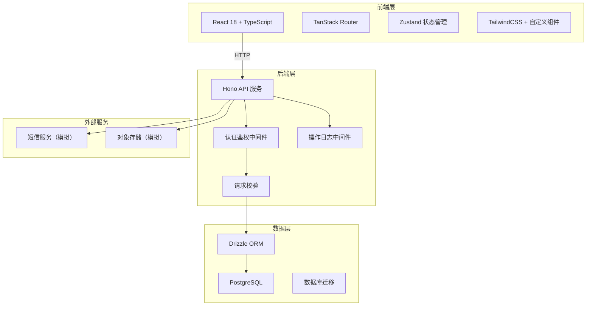
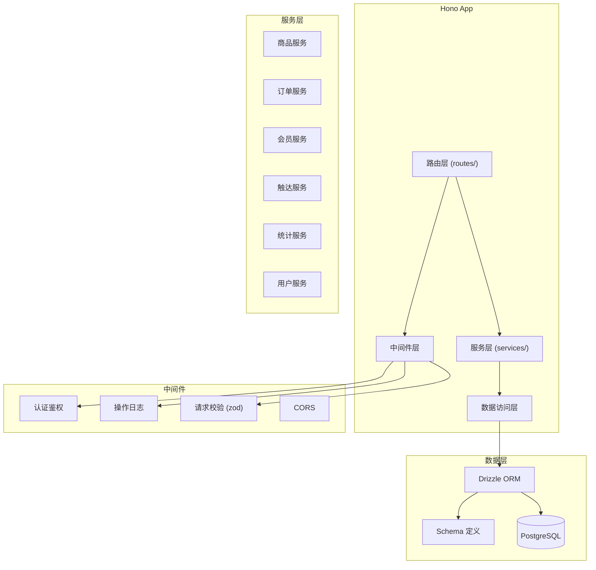
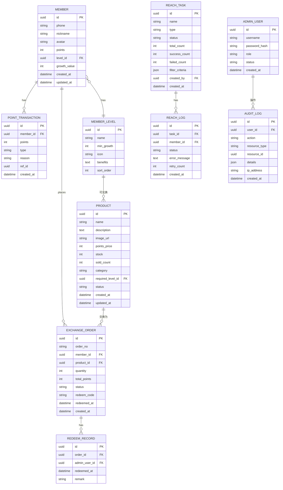

## 1. 架构设计



## 2. 技术描述

- **前端框架**：React 18 + TypeScript + Vite
- **路由方案**：TanStack Router（文件路由 + 类型安全）
- **状态管理**：Zustand（轻量级、模块化）
- **UI 样式**：TailwindCSS 3 + 自定义组件库
- **图表库**：Recharts（数据可视化）
- **后端框架**：Hono（轻量级、高性能、Edge 友好）
- **ORM**：Drizzle ORM（类型安全、SQL 优先）
- **数据库**：PostgreSQL 15+
- **认证方案**：JWT + Refresh Token
- **文件结构**：Monorepo 风格，frontend + server + shared 三目录
- **包管理**：pnpm

### 目录结构

```
.
├── frontend/              # 前端应用
│   ├── src/
│   │   ├── pages/         # 页面组件（按路由组织）
│   │   ├── components/    # 通用组件
│   │   ├── hooks/         # 自定义 Hooks
│   │   ├── stores/        # Zustand stores
│   │   ├── utils/         # 工具函数
│   │   ├── api/           # API 客户端
│   │   └── routes/        # TanStack Router 路由
│   └── ...
├── server/                # 后端服务
│   ├── src/
│   │   ├── routes/        # API 路由
│   │   ├── middleware/    # 中间件
│   │   ├── services/      # 业务逻辑层
│   │   └── db/            # 数据库相关
│   │       ├── schema/    # Drizzle Schema
│   │       └── migrations/
│   └── ...
├── shared/                # 共享类型与常量
│   └── types.ts
└── ...
```

## 3. 路由定义

### 前台路由（会员端）

| 路由 | 页面 | 权限 |
|------|------|------|
| `/` | 商城首页 | 公开 |
| `/products` | 商品列表 | 公开 |
| `/products/:id` | 商品详情 | 公开 |
| `/my/orders` | 兑换记录 | 会员登录 |
| `/my/orders/:id` | 订单详情 | 会员登录 |
| `/my/profile` | 会员中心 | 会员登录 |
| `/login` | 会员登录 | 公开 |

### 后台路由（管理端）

| 路由 | 页面 | 权限 |
|------|------|------|
| `/admin` | 后台首页/仪表盘 | 电商负责人/管理员 |
| `/admin/products` | 商品管理 | 电商负责人/管理员 |
| `/admin/products/new` | 新建商品 | 电商负责人/管理员 |
| `/admin/products/:id/edit` | 编辑商品 | 电商负责人/管理员 |
| `/admin/orders` | 兑换订单 | 电商负责人/管理员 |
| `/admin/orders/:id` | 订单详情/核销 | 电商负责人/管理员 |
| `/admin/members` | 会员管理 | 电商负责人/管理员 |
| `/admin/levels` | 等级配置 | 管理员 |
| `/admin/reach` | 触达任务 | 电商负责人/管理员 |
| `/admin/reach/:id` | 任务详情/核对 | 电商负责人/管理员 |
| `/admin/statistics` | 积分成本统计 | 电商负责人/管理员 |
| `/admin/users` | 用户管理 | 管理员 |
| `/admin/logs` | 操作日志 | 管理员 |
| `/admin/login` | 后台登录 | 公开 |

## 4. API 定义

### 4.1 认证相关

```typescript
// 会员登录
POST /api/auth/member/login
Request: { phone: string; code: string }
Response: { token: string; member: Member }

// 后台登录
POST /api/auth/admin/login
Request: { username: string; password: string }
Response: { token: string; admin: AdminUser }

// 获取当前用户
GET /api/auth/me
Response: { user: Member | AdminUser; role: 'member' | 'ecommerce' | 'admin' }
```

### 4.2 商品相关

```typescript
// 商品列表
GET /api/products
Query: { page?: number; pageSize?: number; category?: string; minPoints?: number; maxPoints?: number; level?: string; keyword?: string }
Response: { items: Product[]; total: number; filters: FilterState }

// 商品详情
GET /api/products/:id
Response: Product

// 创建商品（后台）
POST /api/admin/products
Request: ProductCreateInput
Response: Product

// 更新商品（后台）
PUT /api/admin/products/:id
Request: ProductUpdateInput
Response: Product

// 商品上下架（后台）
PATCH /api/admin/products/:id/status
Request: { status: 'active' | 'inactive' }
Response: Product
```

### 4.3 订单与兑换

```typescript
// 创建兑换订单
POST /api/orders
Request: { productId: string; quantity: number }
Response: ExchangeOrder

// 我的订单列表
GET /api/orders/mine
Query: { page?: number; pageSize?: number; status?: string }
Response: { items: ExchangeOrder[]; total: number }

// 订单详情
GET /api/orders/:id
Response: ExchangeOrderDetail

// 订单列表（后台）
GET /api/admin/orders
Query: { page?: number; pageSize?: number; status?: string; keyword?: string; startDate?: string; endDate?: string }
Response: { items: ExchangeOrder[]; total: number; filters: FilterState }

// 核销订单（后台）
POST /api/admin/orders/:id/redeem
Request: { redeemCode?: string }
Response: ExchangeOrder

// 导出订单（后台）
GET /api/admin/orders/export
Query: { filters: FilterState }
Response: CSV 文件（含筛选口径说明）
```

### 4.4 会员与等级

```typescript
// 会员列表（后台）
GET /api/admin/members
Query: { page?: number; pageSize?: number; level?: string; keyword?: string }
Response: { items: Member[]; total: number }

// 会员详情
GET /api/admin/members/:id
Response: MemberDetail

// 调整积分（后台）
POST /api/admin/members/:id/points
Request: { points: number; reason: string }
Response: { points: number }

// 等级配置列表
GET /api/member-levels
Response: MemberLevel[]

// 创建/更新等级（后台）
POST /api/admin/member-levels
PUT /api/admin/member-levels/:id
```

### 4.5 触达任务

```typescript
// 触达任务列表
GET /api/admin/reach-tasks
Query: { page?: number; pageSize?: number; status?: string }
Response: { items: ReachTask[]; total: number }

// 创建触达任务
POST /api/admin/reach-tasks
Request: { name: string; type: string; memberIds?: string[]; importFile?: File }
Response: ReachTask

// 任务详情
GET /api/admin/reach-tasks/:id
Response: ReachTaskDetail

// 批量核对
POST /api/admin/reach-tasks/:id/verify
Request: { filterCriteria?: any }
Response: { matched: number; unmatched: number; total: number }

// 执行触达
POST /api/admin/reach-tasks/:id/execute
Response: { success: number; failed: number }

// 触达日志
GET /api/admin/reach-tasks/:id/logs
Query: { status?: 'success' | 'failed' }
Response: ReachLog[]

// 失败重试
POST /api/admin/reach-tasks/:id/retry
Response: { retried: number }
```

### 4.6 统计与报表

```typescript
// 积分成本统计
GET /api/admin/statistics/point-cost
Query: { startDate: string; endDate: string; dimension: 'date' | 'product' | 'level'; filters?: FilterState }
Response: { data: PointCostItem[]; summary: PointCostSummary; filters: FilterState }

// 兑换趋势
GET /api/admin/statistics/exchange-trend
Query: { startDate: string; endDate: string; period: 'day' | 'week' | 'month' }
Response: { dates: string[]; orders: number[]; points: number[] }

// 导出报表
GET /api/admin/statistics/export
Query: { type: string; filters: FilterState }
Response: CSV 文件（含筛选口径说明）
```

### 4.7 系统管理

```typescript
// 管理员用户列表
GET /api/admin/users
Response: AdminUser[]

// 创建管理员
POST /api/admin/users
Request: { username: string; password: string; role: 'ecommerce' | 'admin' }
Response: AdminUser

// 操作日志
GET /api/admin/audit-logs
Query: { page?: number; pageSize?: number; userId?: string; action?: string; startDate?: string; endDate?: string }
Response: { items: AuditLog[]; total: number }
```

## 5. 服务器架构图



## 6. 数据模型

### 6.1 数据模型定义



### 6.2 核心 Schema 定义

```typescript
// 会员表
export const members = pgTable('members', {
  id: uuid('id').primaryKey().defaultRandom(),
  phone: varchar('phone', 20).unique().notNull(),
  nickname: varchar('nickname', 50),
  avatar: varchar('avatar_url', 255),
  points: integer('points').default(0).notNull(),
  levelId: uuid('level_id').references(() => memberLevels.id),
  growthValue: integer('growth_value').default(0).notNull(),
  createdAt: timestamp('created_at').defaultNow().notNull(),
  updatedAt: timestamp('updated_at').defaultNow().notNull(),
});

// 会员等级表
export const memberLevels = pgTable('member_levels', {
  id: uuid('id').primaryKey().defaultRandom(),
  name: varchar('name', 50).notNull(),
  minGrowth: integer('min_growth').default(0).notNull(),
  icon: varchar('icon', 100),
  benefits: text('benefits'),
  sortOrder: integer('sort_order').default(0).notNull(),
});

// 商品表
export const products = pgTable('products', {
  id: uuid('id').primaryKey().defaultRandom(),
  name: varchar('name', 200).notNull(),
  description: text('description'),
  imageUrl: varchar('image_url', 255),
  pointsPrice: integer('points_price').notNull(),
  stock: integer('stock').default(0).notNull(),
  soldCount: integer('sold_count').default(0).notNull(),
  category: varchar('category', 50),
  requiredLevelId: uuid('required_level_id').references(() => memberLevels.id),
  status: varchar('status', 20).default('active').notNull(),
  createdAt: timestamp('created_at').defaultNow().notNull(),
  updatedAt: timestamp('updated_at').defaultNow().notNull(),
});

// 兑换订单表
export const exchangeOrders = pgTable('exchange_orders', {
  id: uuid('id').primaryKey().defaultRandom(),
  orderNo: varchar('order_no', 32).unique().notNull(),
  memberId: uuid('member_id').references(() => members.id).notNull(),
  productId: uuid('product_id').references(() => products.id).notNull(),
  quantity: integer('quantity').default(1).notNull(),
  totalPoints: integer('total_points').notNull(),
  status: varchar('status', 20).default('pending').notNull(),
  redeemCode: varchar('redeem_code', 32).unique(),
  redeemedAt: timestamp('redeemed_at'),
  createdAt: timestamp('created_at').defaultNow().notNull(),
});

// 积分流水表
export const pointTransactions = pgTable('point_transactions', {
  id: uuid('id').primaryKey().defaultRandom(),
  memberId: uuid('member_id').references(() => members.id).notNull(),
  points: integer('points').notNull(),
  type: varchar('type', 20).notNull(),
  reason: varchar('reason', 200),
  refId: uuid('ref_id'),
  createdAt: timestamp('created_at').defaultNow().notNull(),
});

// 触达任务表
export const reachTasks = pgTable('reach_tasks', {
  id: uuid('id').primaryKey().defaultRandom(),
  name: varchar('name', 200).notNull(),
  type: varchar('type', 50).notNull(),
  status: varchar('status', 20).default('draft').notNull(),
  totalCount: integer('total_count').default(0).notNull(),
  successCount: integer('success_count').default(0).notNull(),
  failedCount: integer('failed_count').default(0).notNull(),
  filterCriteria: jsonb('filter_criteria'),
  createdBy: uuid('created_by').references(() => adminUsers.id),
  createdAt: timestamp('created_at').defaultNow().notNull(),
});

// 触达日志表
export const reachLogs = pgTable('reach_logs', {
  id: uuid('id').primaryKey().defaultRandom(),
  taskId: uuid('task_id').references(() => reachTasks.id).notNull(),
  memberId: uuid('member_id').references(() => members.id),
  status: varchar('status', 20).notNull(),
  errorMessage: text('error_message'),
  retryCount: integer('retry_count').default(0).notNull(),
  createdAt: timestamp('created_at').defaultNow().notNull(),
});

// 管理员用户表
export const adminUsers = pgTable('admin_users', {
  id: uuid('id').primaryKey().defaultRandom(),
  username: varchar('username', 50).unique().notNull(),
  passwordHash: varchar('password_hash', 255).notNull(),
  role: varchar('role', 20).default('ecommerce').notNull(),
  status: varchar('status', 20).default('active').notNull(),
  createdAt: timestamp('created_at').defaultNow().notNull(),
});

// 审计日志表
export const auditLogs = pgTable('audit_logs', {
  id: uuid('id').primaryKey().defaultRandom(),
  userId: uuid('user_id').references(() => adminUsers.id),
  action: varchar('action', 100).notNull(),
  resourceType: varchar('resource_type', 50),
  resourceId: uuid('resource_id'),
  details: jsonb('details'),
  ipAddress: varchar('ip_address', 45),
  createdAt: timestamp('created_at').defaultNow().notNull(),
});
```

### 6.3 索引设计

- `members`: `phone` (unique), `level_id`, `points`
- `products`: `status`, `category`, `points_price`, `required_level_id`
- `exchange_orders`: `member_id`, `product_id`, `status`, `order_no` (unique), `redeem_code` (unique), `created_at`
- `point_transactions`: `member_id`, `created_at`, `type`
- `reach_tasks`: `status`, `created_by`, `created_at`
- `reach_logs`: `task_id`, `status`, `member_id`
- `audit_logs`: `user_id`, `action`, `created_at`
