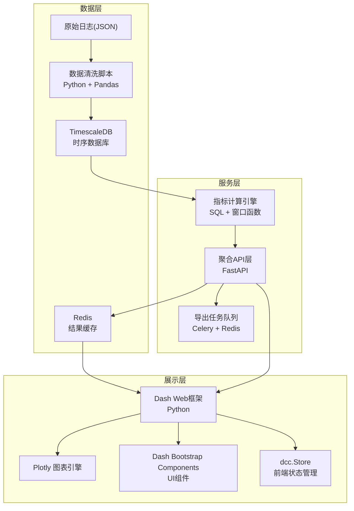
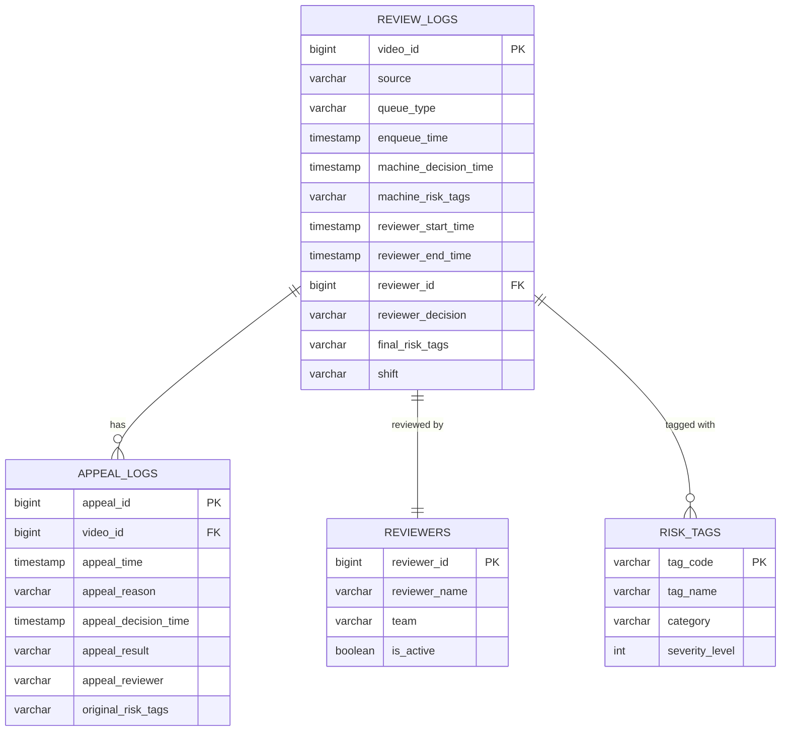

## 1. 架构设计



---

## 2. 技术选型说明

| 层级 | 技术栈 | 版本 | 选型理由 |
|------|--------|------|----------|
| 前端框架 | Dash | 2.16+ | 纯Python构建交互式Web仪表板，原生集成Plotly |
| 图表引擎 | Plotly | 5.18+ | 交互式图表丰富，支持漏斗图、桑基图、热力图等 |
| UI组件 | Dash Bootstrap Components | 1.5+ | 提供响应式布局和表单组件 |
| 后端API | FastAPI | 0.104+ | 高性能异步API，自动生成接口文档 |
| 时序数据库 | TimescaleDB | 2.13+ | PostgreSQL扩展，优化时序数据写入与聚合查询 |
| 缓存 | Redis | 7.2+ | 缓存高频聚合结果，降低数据库压力 |
| 任务队列 | Celery | 5.3+ | 异步处理大数据量导出任务 |
| 数据清洗 | Python + Pandas | 2.1+ | 灵活处理半结构化日志数据 |
| 配置管理 | Pydantic | 2.5+ | 类型安全的配置与指标口径定义 |

---

## 3. 目录结构

```
content-safety-dashboard/
├── app/                          # Dash 应用主目录
│   ├── app.py                    # Dash 应用入口
│   ├── layouts/                  # 页面布局组件
│   │   ├── summary_cards.py      # 异常摘要卡片
│   │   ├── filters.py            # 多维筛选器
│   │   ├── backlog_chart.py      # 积压曲线图
│   │   ├── funnel_chart.py       # 队列漏斗图
│   │   ├── workload_chart.py     # 审核员负载图
│   │   └── appeal_chart.py       # 申诉逆转率图
│   ├── callbacks/                # 交互回调逻辑
│   │   ├── filter_callbacks.py   # 筛选联动
│   │   ├── chart_callbacks.py    # 图表更新
│   │   └── export_callbacks.py   # 导出功能
│   └── assets/                   # 静态资源(CSS/JS)
│       └── custom.css            # 自定义样式
├── data/                         # 数据层
│   ├── cleaning/                 # 数据清洗脚本
│   │   ├── clean_raw_logs.py     # 原始日志清洗
│   │   └── load_to_timescaledb.py # 入库脚本
│   ├── metrics/                  # 指标口径
│   │   └── definitions.py        # 指标计算逻辑定义
│   ├── api/                      # 聚合API
│   │   ├── main.py               # FastAPI入口
│   │   ├── routes/               # API路由
│   │   └── schemas/              # 请求响应模型
│   ├── cache/                    # 缓存策略
│   │   └── redis_client.py       # Redis连接与缓存管理
│   └── export/                   # 导出任务
│       ├── tasks.py              # Celery任务定义
│       └── workers.py            # Worker启动
├── config/                       # 配置文件
│   ├── settings.py               # 全局配置
│   └── database.ini              # 数据库连接配置
├── tests/                        # 测试用例
├── requirements.txt              # Python依赖
└── README.md
```

---

## 4. API 接口定义

### 4.1 聚合查询接口

```python
from pydantic import BaseModel
from datetime import datetime
from typing import List, Optional

class FilterParams(BaseModel):
    risk_tags: Optional[List[str]] = None
    queue_types: Optional[List[str]] = None
    reviewers: Optional[List[str]] = None
    shifts: Optional[List[str]] = None
    sources: Optional[List[str]] = None
    time_start: datetime
    time_end: datetime
    granularity: str = "1h"  # 1m, 5m, 1h, 1d

class BacklogPoint(BaseModel):
    timestamp: datetime
    queue_name: str
    backlog_count: int
    sla_breach_count: int

class FunnelStep(BaseModel):
    step_name: str
    count: int
    avg_duration_seconds: float
    conversion_rate: float

class WorkloadItem(BaseModel):
    reviewer_id: str
    reviewer_name: str
    shift: str
    processed_count: int
    avg_review_seconds: float
    current_backlog: int

class AppealReversalItem(BaseModel):
    original_risk_tag: str
    appeal_total: int
    appeal_success: int
    appeal_failed: int
    reversal_rate: float

# 响应模型
class BacklogResponse(BaseModel):
    data: List[BacklogPoint]
    filters_applied: FilterParams

class FunnelResponse(BaseModel):
    data: List[FunnelStep]
    filters_applied: FilterParams

class WorkloadResponse(BaseModel):
    data: List[WorkloadItem]
    filters_applied: FilterParams

class AppealReversalResponse(BaseModel):
    data: List[AppealReversalItem]
    filters_applied: FilterParams
```

### 4.2 导出接口

| 路径 | 方法 | 说明 |
|------|------|------|
| `/api/export/submit` | POST | 提交导出任务，返回task_id |
| `/api/export/status/{task_id}` | GET | 查询导出任务状态 |
| `/api/export/download/{task_id}` | GET | 下载导出文件 |

---

## 5. 数据模型

### 5.1 ER 图



### 5.2 TimescaleDB DDL

```sql
-- 审核主日志表（超表）
CREATE TABLE review_logs (
    video_id BIGINT NOT NULL,
    source VARCHAR(50) NOT NULL,
    queue_type VARCHAR(50) NOT NULL,
    enqueue_time TIMESTAMPTZ NOT NULL,
    machine_decision_time TIMESTAMPTZ,
    machine_risk_tags VARCHAR(200)[],
    reviewer_start_time TIMESTAMPTZ,
    reviewer_end_time TIMESTAMPTZ,
    reviewer_id BIGINT,
    reviewer_decision VARCHAR(50),
    final_risk_tags VARCHAR(200)[],
    shift VARCHAR(20),
    created_at TIMESTAMPTZ DEFAULT NOW()
);
SELECT create_hypertable('review_logs', 'enqueue_time');
CREATE INDEX idx_review_logs_queue ON review_logs(queue_type, enqueue_time DESC);
CREATE INDEX idx_review_logs_reviewer ON review_logs(reviewer_id, enqueue_time DESC);

-- 申诉日志表
CREATE TABLE appeal_logs (
    appeal_id BIGSERIAL PRIMARY KEY,
    video_id BIGINT NOT NULL,
    appeal_time TIMESTAMPTZ NOT NULL,
    appeal_reason TEXT,
    appeal_decision_time TIMESTAMPTZ,
    appeal_result VARCHAR(20) NOT NULL,
    appeal_reviewer VARCHAR(100),
    original_risk_tags VARCHAR(200)[]
);
SELECT create_hypertable('appeal_logs', 'appeal_time');
CREATE INDEX idx_appeal_video ON appeal_logs(video_id, appeal_time DESC);
```

---

## 6. 缓存策略

### 6.1 缓存层级

| 缓存项 | TTL | 粒度 | 键名规则 |
|--------|-----|------|----------|
| 积压曲线数据 | 5分钟 | 筛选参数hash | `backlog:{filter_hash}` |
| 漏斗转化数据 | 10分钟 | 筛选参数hash | `funnel:{filter_hash}` |
| 审核员负载 | 5分钟 | 日期+班次 | `workload:{date}:{shift}` |
| 申诉逆转率 | 30分钟 | 日期范围+标签 | `appeal:{date_range}:{tags}` |
| 维度选项列表 | 1小时 | 全局 | `dimensions:{dim_name}` |

### 6.2 缓存失效

- 定时任务每5分钟刷新热门查询
- 数据入库完成后主动失效相关缓存
- 支持手动刷新接口 `/api/cache/clear`

---

## 7. 指标口径定义文件

`config/metrics_definitions.yaml`

```yaml
metrics:
  backlog_count:
    name: "队列积压量"
    description: "截止当前时间，处于待审核状态的视频数量"
    calculation: "COUNT(*) WHERE reviewer_end_time IS NULL AND enqueue_time <= :asof"
    unit: "条"
  
  avg_review_duration:
    name: "平均审核时长"
    description: "人审从接单到提交结果的平均耗时"
    calculation: "AVG(EXTRACT(EPOCH FROM (reviewer_end_time - reviewer_start_time)))"
    unit: "秒"
    filters: "reviewer_end_time IS NOT NULL"
  
  sla_breach_rate:
    name: "SLA违规率"
    description: "超过队列规定SLA时长仍未审核的视频占比"
    calculation: "COUNT(CASE WHEN (NOW() - enqueue_time) > :sla_threshold THEN 1 END) / COUNT(*)"
    unit: "%"
  
  appeal_reversal_rate:
    name: "申诉逆转率"
    description: "申诉成功的视频占总申诉量的比例，按原机器风险标签分组"
    calculation: "COUNT(CASE WHEN appeal_result = 'success' THEN 1 END)::FLOAT / COUNT(*)"
    group_by: "original_risk_tags"
    unit: "%"
```
