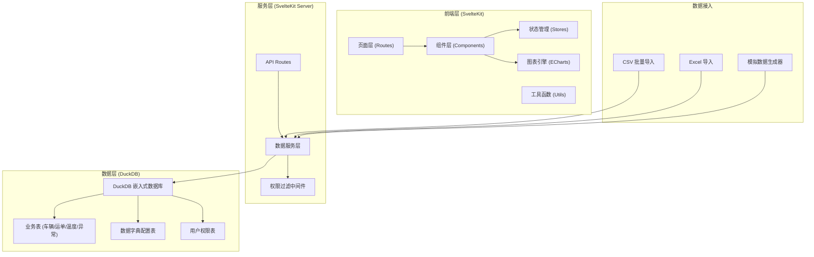
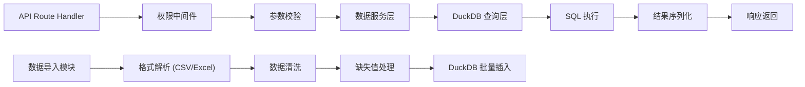
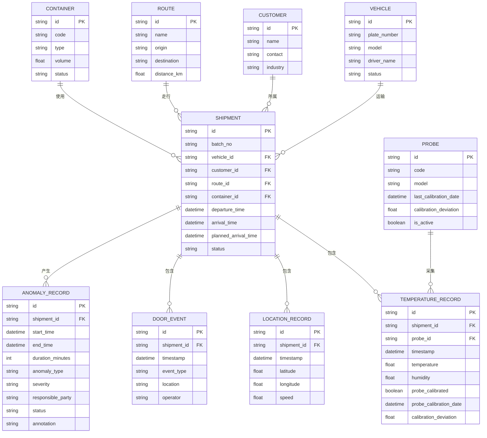

## 1. 架构设计



## 2. 技术描述

- **前端框架**：SvelteKit@2 + TypeScript + Vite
- **UI 样式**：Tailwind CSS@3 + 自定义主题配色
- **图表引擎**：Apache ECharts@5（路线回放、温度曲线、异常统计、责任段甘特图）
- **数据引擎**：DuckDB@1（嵌入式分析型数据库，支持 SQL 查询、数据清洗、聚合计算）
- **状态管理**：Svelte Stores（内置响应式状态，管理筛选条件、视图配置、用户信息）
- **文件处理**：PapaParse（CSV 解析）+ SheetJS（Excel 解析）
- **导出功能**：jsPDF（PDF 生成）+ 原生 CSV 导出
- **图标库**：lucide-svelte
- **权限控制**：基于角色的访问控制（RBAC），服务端数据过滤

## 3. 路由定义

| 路由路径 | 页面用途 | 权限要求 |
|----------|----------|----------|
| /login | 登录页面 | 公开 |
| /dashboard | 驾驶舱总览 | 运营分析员及以上 |
| /transport | 运输分析列表 | 运营分析员及以上 |
| /transport/[id] | 运单详情（路线回放+温度曲线） | 运营分析员及以上 |
| /anomaly | 异常分析中心 | 质量管控及以上 |
| /analysis | 多维分析（OLAP） | 运营分析员及以上 |
| /data/import | 数据导入 | 运营管理员 |
| /data/dictionary | 数据字典配置 | 运营管理员 |
| /reports | 报表中心 | 运营分析员及以上 |
| /settings | 系统设置 | 运营管理员 |

## 4. API 定义

### 4.1 核心数据类型

```typescript
// 车辆信息
interface Vehicle {
  id: string;
  plateNumber: string;
  model: string;
  driverName: string;
  status: 'active' | 'maintenance' | 'idle';
  createdAt: Date;
}

// 运单信息
interface Shipment {
  id: string;
  batchNo: string;
  vehicleId: string;
  customerId: string;
  routeId: string;
  containerId: string;
  departureTime: Date;
  arrivalTime: Date;
  plannedArrivalTime: Date;
  status: 'in_transit' | 'completed' | 'delayed' | 'abnormal';
}

// 温度记录
interface TemperatureRecord {
  id: string;
  shipmentId: string;
  timestamp: Date;
  temperature: number;
  humidity?: number;
  probeId: string;
  probeCalibrated: boolean;
  probeCalibrationDate?: Date;
  calibrationDeviation?: number;
}

// 定位记录
interface LocationRecord {
  id: string;
  shipmentId: string;
  timestamp: Date;
  latitude: number;
  longitude: number;
  speed?: number;
}

// 开门记录
interface DoorEvent {
  id: string;
  shipmentId: string;
  timestamp: Date;
  eventType: 'open' | 'close';
  location?: string;
  operator?: string;
}

// 异常记录
interface AnomalyRecord {
  id: string;
  shipmentId: string;
  startTime: Date;
  endTime: Date;
  durationMinutes: number;
  anomalyType: 'over_temp' | 'under_temp' | 'door_open' | 'probe_error' | 'delay';
  severity: 'low' | 'medium' | 'high' | 'critical';
  responsibleParty: 'carrier' | 'warehouse' | 'customer' | 'equipment' | 'unknown';
  status: 'pending' | 'confirmed' | 'resolved';
  annotation?: string;
}

// 筛选条件
interface FilterState {
  dateRange: [Date, Date];
  vehicleIds: string[];
  customerIds: string[];
  routeIds: string[];
  batchNos: string[];
  anomalyTypes: string[];
  severityLevels: string[];
}

// 保存的视图
interface SavedView {
  id: string;
  name: string;
  description?: string;
  page: string;
  filters: FilterState;
  chartConfigs: Record<string, any>;
  createdAt: Date;
  createdBy: string;
}
```

### 4.2 API 端点

| 方法 | 路径 | 描述 | 请求参数 | 返回值 |
|------|------|------|----------|--------|
| GET | /api/vehicles | 获取车辆列表 | 分页参数、筛选 | Vehicle[] |
| GET | /api/shipments | 获取运单列表 | 分页参数、筛选 | Shipment[] |
| GET | /api/shipments/:id | 获取运单详情 | id | Shipment + 关联数据 |
| GET | /api/shipments/:id/temperature | 获取温度曲线 | id, timeRange | TemperatureRecord[] |
| GET | /api/shipments/:id/locations | 获取定位轨迹 | id | LocationRecord[] |
| GET | /api/shipments/:id/door-events | 获取开门事件 | id | DoorEvent[] |
| GET | /api/anomalies | 获取异常列表 | 筛选、分页 | AnomalyRecord[] |
| POST | /api/anomalies/:id/annotate | 标注异常 | id, 标注内容 | 更新后的异常 |
| GET | /api/analysis/summary | 获取汇总统计 | 筛选条件 | KPI 数据 |
| GET | /api/analysis/anomaly-duration | 异常时长统计 | 筛选条件 | 统计数据 |
| GET | /api/analysis/responsibility | 责任段分布 | 筛选条件 | 统计数据 |
| POST | /api/data/import | 导入数据 | FormData 文件 | 导入结果 |
| GET | /api/data/dictionary | 获取数据字典 | - | 字典配置 |
| POST | /api/views | 保存视图 | 视图配置 | 保存的视图 |
| GET | /api/views | 获取保存的视图 | - | SavedView[] |
| POST | /api/export/csv | 导出 CSV | 筛选条件 | CSV 文件 |
| POST | /api/export/pdf | 导出 PDF | 报表配置 | PDF 文件 |

## 5. 服务端架构



## 6. 数据模型

### 6.1 ER 图



### 6.2 DuckDB 初始化 DDL

```sql
-- 车辆表
CREATE TABLE IF NOT EXISTS vehicles (
    id VARCHAR PRIMARY KEY,
    plate_number VARCHAR NOT NULL,
    model VARCHAR,
    driver_name VARCHAR,
    status VARCHAR DEFAULT 'active',
    created_at TIMESTAMP DEFAULT CURRENT_TIMESTAMP
);

-- 客户表
CREATE TABLE IF NOT EXISTS customers (
    id VARCHAR PRIMARY KEY,
    name VARCHAR NOT NULL,
    contact VARCHAR,
    industry VARCHAR,
    created_at TIMESTAMP DEFAULT CURRENT_TIMESTAMP
);

-- 路线表
CREATE TABLE IF NOT EXISTS routes (
    id VARCHAR PRIMARY KEY,
    name VARCHAR NOT NULL,
    origin VARCHAR,
    destination VARCHAR,
    distance_km FLOAT,
    created_at TIMESTAMP DEFAULT CURRENT_TIMESTAMP
);

-- 温控箱表
CREATE TABLE IF NOT EXISTS containers (
    id VARCHAR PRIMARY KEY,
    code VARCHAR NOT NULL,
    type VARCHAR,
    volume FLOAT,
    status VARCHAR DEFAULT 'active',
    created_at TIMESTAMP DEFAULT CURRENT_TIMESTAMP
);

-- 温度探头表
CREATE TABLE IF NOT EXISTS probes (
    id VARCHAR PRIMARY KEY,
    code VARCHAR NOT NULL,
    model VARCHAR,
    last_calibration_date TIMESTAMP,
    calibration_deviation FLOAT DEFAULT 0,
    is_active BOOLEAN DEFAULT true,
    created_at TIMESTAMP DEFAULT CURRENT_TIMESTAMP
);

-- 运单表
CREATE TABLE IF NOT EXISTS shipments (
    id VARCHAR PRIMARY KEY,
    batch_no VARCHAR NOT NULL,
    vehicle_id VARCHAR REFERENCES vehicles(id),
    customer_id VARCHAR REFERENCES customers(id),
    route_id VARCHAR REFERENCES routes(id),
    container_id VARCHAR REFERENCES containers(id),
    departure_time TIMESTAMP,
    arrival_time TIMESTAMP,
    planned_arrival_time TIMESTAMP,
    status VARCHAR DEFAULT 'in_transit',
    created_at TIMESTAMP DEFAULT CURRENT_TIMESTAMP
);

-- 温度记录表
CREATE TABLE IF NOT EXISTS temperature_records (
    id VARCHAR PRIMARY KEY,
    shipment_id VARCHAR REFERENCES shipments(id),
    probe_id VARCHAR REFERENCES probes(id),
    timestamp TIMESTAMP NOT NULL,
    temperature FLOAT NOT NULL,
    humidity FLOAT,
    probe_calibrated BOOLEAN DEFAULT false,
    probe_calibration_date TIMESTAMP,
    calibration_deviation FLOAT DEFAULT 0,
    created_at TIMESTAMP DEFAULT CURRENT_TIMESTAMP
);

-- 定位记录表
CREATE TABLE IF NOT EXISTS location_records (
    id VARCHAR PRIMARY KEY,
    shipment_id VARCHAR REFERENCES shipments(id),
    timestamp TIMESTAMP NOT NULL,
    latitude FLOAT NOT NULL,
    longitude FLOAT NOT NULL,
    speed FLOAT,
    created_at TIMESTAMP DEFAULT CURRENT_TIMESTAMP
);

-- 开门事件表
CREATE TABLE IF NOT EXISTS door_events (
    id VARCHAR PRIMARY KEY,
    shipment_id VARCHAR REFERENCES shipments(id),
    timestamp TIMESTAMP NOT NULL,
    event_type VARCHAR NOT NULL,
    location VARCHAR,
    operator VARCHAR,
    created_at TIMESTAMP DEFAULT CURRENT_TIMESTAMP
);

-- 异常记录表
CREATE TABLE IF NOT EXISTS anomaly_records (
    id VARCHAR PRIMARY KEY,
    shipment_id VARCHAR REFERENCES shipments(id),
    start_time TIMESTAMP NOT NULL,
    end_time TIMESTAMP NOT NULL,
    duration_minutes INTEGER NOT NULL,
    anomaly_type VARCHAR NOT NULL,
    severity VARCHAR NOT NULL,
    responsible_party VARCHAR DEFAULT 'unknown',
    status VARCHAR DEFAULT 'pending',
    annotation TEXT,
    created_at TIMESTAMP DEFAULT CURRENT_TIMESTAMP
);

-- 数据字典表
CREATE TABLE IF NOT EXISTS data_dictionary (
    id VARCHAR PRIMARY KEY,
    category VARCHAR NOT NULL,
    key VARCHAR NOT NULL,
    value VARCHAR NOT NULL,
    label VARCHAR,
    description TEXT,
    sort_order INTEGER DEFAULT 0,
    is_active BOOLEAN DEFAULT true,
    created_at TIMESTAMP DEFAULT CURRENT_TIMESTAMP,
    UNIQUE(category, key)
);

-- 保存视图表
CREATE TABLE IF NOT EXISTS saved_views (
    id VARCHAR PRIMARY KEY,
    name VARCHAR NOT NULL,
    description TEXT,
    page VARCHAR NOT NULL,
    filters JSON NOT NULL,
    chart_configs JSON,
    created_by VARCHAR,
    created_at TIMESTAMP DEFAULT CURRENT_TIMESTAMP
);

-- 用户表
CREATE TABLE IF NOT EXISTS users (
    id VARCHAR PRIMARY KEY,
    username VARCHAR UNIQUE NOT NULL,
    password_hash VARCHAR NOT NULL,
    role VARCHAR NOT NULL,
    customer_id VARCHAR REFERENCES customers(id),
    full_name VARCHAR,
    email VARCHAR,
    is_active BOOLEAN DEFAULT true,
    created_at TIMESTAMP DEFAULT CURRENT_TIMESTAMP
);

-- 创建索引
CREATE INDEX IF NOT EXISTS idx_temp_shipment_time ON temperature_records(shipment_id, timestamp);
CREATE INDEX IF NOT EXISTS idx_loc_shipment_time ON location_records(shipment_id, timestamp);
CREATE INDEX IF NOT EXISTS idx_anomaly_shipment ON anomaly_records(shipment_id);
CREATE INDEX IF NOT EXISTS idx_anomaly_type ON anomaly_records(anomaly_type, severity);
CREATE INDEX IF NOT EXISTS idx_shipment_status ON shipments(status, departure_time);
```

### 6.3 数据口径校验规则

1. **温度异常判定口径**：
   - 超温：连续 5 分钟温度 > 上限阈值（默认 8°C）
   - 低温：连续 5 分钟温度 < 下限阈值（默认 -25°C）
   - 探头校准偏差 > ±0.5°C 时标记为"待校准"，计算温度时自动补偿偏差

2. **异常时长口径**：
   - 按自然时间分段统计，跨天异常自动拆分
   - 开门时长单独统计，不计入温度异常时长
   - 探头故障期间的异常标记为"设备原因"，不计入承运商考核

3. **责任段定位口径**：
   - 承运商责任：运输途中温度异常（排除设备故障）
   - 仓库责任：装卸货期间开门超时
   - 客户责任：收货人延迟卸货
   - 设备责任：探头未校准、温控箱故障

4. **合规率计算口径**：
   - 温控合规率 = (总运输时长 - 异常时长) / 总运输时长 × 100%
   - 按批次、车辆、客户、路线分别聚合计算
   - 探头未校准期间的数据单独标注，不计入合规率统计
