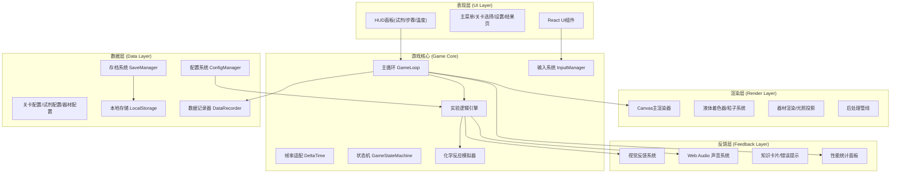
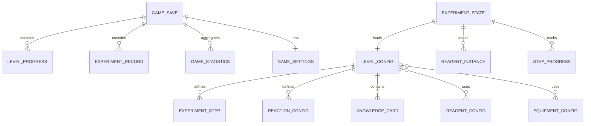

## 1. 架构设计



## 2. 技术描述

- **前端框架**：React@18 + TypeScript + Vite
- **样式方案**：TailwindCSS@3 + CSS变量主题系统
- **状态管理**：Zustand（UI状态）+ 自定义GameStore（游戏状态）
- **渲染技术**：HTML5 Canvas 2D + 自定义渲染管线
- **声音引擎**：Web Audio API（合成音，无需外部音频文件）
- **数据持久化**：LocalStorage + JSON序列化
- **图标库**：Lucide React

## 3. 路由定义
| 路由 | 用途 |
|------|------|
| `/` | 主菜单页 |
| `/levels` | 关卡选择页 |
| `/game/:levelId` | 实验游戏主场景 |
| `/settings` | 设置页 |
| `/result/:levelId` | 实验结果页 |

## 4. 核心模块定义

### 4.1 游戏主循环 (GameLoop)
```typescript
interface GameLoop {
  start(): void;
  stop(): void;
  pause(): void;
  resume(): void;
  onUpdate(callback: (deltaTime: number) => void): void;
  onRender(callback: (ctx: CanvasRenderingContext2D, alpha: number) => void): void;
}
```

### 4.2 配置系统 (ConfigManager)
```typescript
interface LevelConfig {
  id: string;
  name: string;
  description: string;
  difficulty: 1 | 2 | 3 | 4 | 5;
  objective: string;
  timeLimit: number;
  maxScore: number;
  availableReagents: string[];
  availableEquipment: string[];
  steps: ExperimentStep[];
  reactions: ReactionConfig[];
  knowledgeCards: KnowledgeCard[];
  safetyNotes: string[];
}

interface ReagentConfig {
  id: string;
  name: string;
  formula: string;
  color: string;
  density: number;
  toxicity: number;
  description: string;
  hazardLevel: 'safe' | 'caution' | 'warning' | 'danger';
}

interface EquipmentConfig {
  id: string;
  name: string;
  type: 'beaker' | 'flask' | 'burette' | 'pipette' | 'thermometer' | 'burner' | 'stirrer';
  capacity: number;
  renderParams: RenderParams;
}
```

### 4.3 输入系统 (InputManager)
```typescript
type InputDevice = 'keyboard' | 'mouse' | 'gamepad' | 'touch';
type InputAction = 
  | 'select' | 'cancel' | 'drag' 
  | 'heat_up' | 'cool_down' | 'stir' 
  | 'pour' | 'menu' | 'pause' | 'help';

interface InputMapping {
  device: InputDevice;
  bindings: Record<InputAction, string[]>;
}

interface InputManager {
  currentDevice: InputDevice;
  on(action: InputAction, callback: () => void): void;
  getKeyHint(action: InputAction): string;
  rebind(action: InputAction, device: InputDevice, key: string): void;
  resetDefaults(): void;
}
```

### 4.4 存档系统 (SaveManager)
```typescript
interface GameSave {
  version: string;
  timestamp: number;
  playerName: string;
  settings: GameSettings;
  progress: LevelProgress[];
  statistics: GameStatistics;
  records: ExperimentRecord[];
}

interface LevelProgress {
  levelId: string;
  unlocked: boolean;
  bestScore: number;
  stars: number;
  completed: boolean;
  attempts: number;
  bestTime: number;
}

interface GameStatistics {
  totalExperiments: number;
  totalScore: number;
  accuracyRate: number;
  safetyRate: number;
  learnTime: number;
}
```

### 4.5 性能统计
```typescript
interface PerformanceStats {
  fps: number;
  frameTime: number;
  minFps: number;
  maxFps: number;
  drawCalls: number;
  particles: number;
  memory: number;
}
```

## 5. 数据模型

### 5.1 数据模型定义


### 5.2 存档序列化格式
采用JSON格式存储，Base64编码可选压缩：
```json
{
  "version": "1.0.0",
  "timestamp": 1718000000000,
  "checksum": "sha256-hash",
  "payload": { /* GameSave对象 */ }
}
```

## 6. 目录结构
```
src/
├── components/          # React UI组件
│   ├── ui/             # 通用UI组件(按钮、卡片、滑块等)
│   ├── menu/           # 主菜单相关
│   ├── levels/         # 关卡选择相关
│   ├── game/           # 游戏HUD面板
│   ├── settings/       # 设置页组件
│   └── result/         # 结果页组件
├── game/               # 游戏核心引擎
│   ├── GameLoop.ts     # 主循环与帧率适配
│   ├── GameState.ts    # 游戏状态机
│   ├── InputManager.ts # 多输入系统
│   ├── Renderer.ts     # Canvas渲染器
│   ├── particles/      # 粒子系统
│   ├── fluids/         # 液体渲染
│   └── audio/          # Web Audio系统
├── config/             # 可编辑配置文件
│   ├── levels.json     # 关卡配置
│   ├── reagents.json   # 试剂配置
│   ├── equipment.json  # 器材配置
│   └── reactions.json  # 化学反应配置
├── store/              # Zustand状态管理
│   ├── useGameStore.ts
│   ├── useSettingsStore.ts
│   └── useSaveStore.ts
├── utils/              # 工具函数
│   ├── config.ts       # 配置加载验证
│   ├── save.ts         # 存档序列化
│   ├── math.ts         # 数学插值工具
│   └── perf.ts         # 性能统计
├── types/              # TypeScript类型定义
│   ├── game.ts
│   ├── config.ts
│   └── save.ts
├── pages/              # 路由页面
├── App.tsx
├── main.tsx
└── index.css
```
