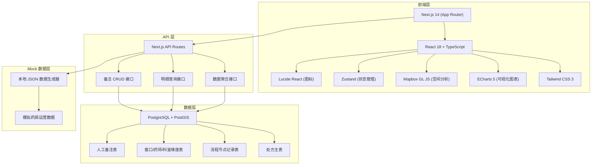
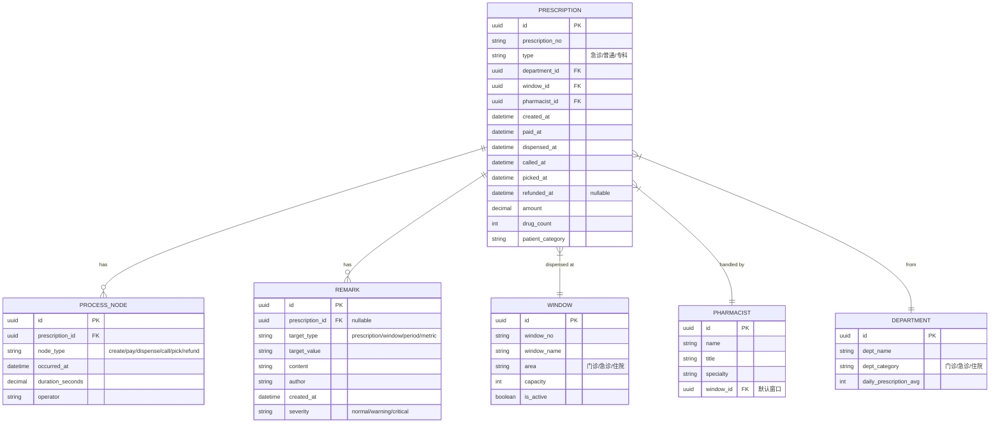

## 1. 架构设计



## 2. 技术说明

- 前端框架：Next.js 14 (App Router) + React 18 + TypeScript
- 样式方案：Tailwind CSS 3
- 图表可视化：ECharts 5（等待分布、窗口对比、堆叠图、桑基图）
- 地图可视化：Mapbox GL JS（药房窗口布局热力图）
- 状态管理：Zustand
- 图标库：Lucide React
- 数据存储：PostgreSQL + PostGIS（生产环境），本地 Mock 数据（开发演示）
- 初始化方式：使用 create-next-app 初始化项目

## 3. 路由定义

| 路由 | 用途 |
|------|------|
| / | 运营复盘总览仪表盘 |
| /bottleneck | 流程瓶颈分析页（桑基图） |
| /comparison | 多维度对比分析页 |
| /details | 处方明细表（带下钻和备注） |

## 4. 数据模型

### 4.1 数据模型定义



### 4.2 核心数据结构（TypeScript）

```typescript
// 处方类型
export type PrescriptionType = 'emergency' | 'normal' | 'specialist';

// 流程节点类型
export type ProcessNodeType = 'create' | 'pay' | 'dispense' | 'call' | 'pick' | 'refund';

// 处方记录
export interface Prescription {
  id: string;
  prescriptionNo: string;
  type: PrescriptionType;
  departmentId: string;
  departmentName: string;
  windowId: string;
  windowNo: string;
  pharmacistId: string;
  pharmacistName: string;
  createdAt: string;
  paidAt: string;
  dispensedAt: string;
  calledAt: string;
  pickedAt: string;
  refundedAt?: string;
  amount: number;
  drugCount: number;
  patientCategory: string;
  waitTime: number; // 总等待时长（分钟）
  dispenseTime: number; // 配药时长（分钟）
}

// KPI 指标
export interface KPIData {
  totalPrescriptions: number;
  emergencyPrescriptions: number;
  normalPrescriptions: number;
  avgWaitTime: number;
  avgWaitTimeEmergency: number;
  avgWaitTimeNormal: number;
  avgDispenseTime: number;
  refundRate: number;
  windowUtilization: Record<string, number>;
}

// 备注记录
export interface Remark {
  id: string;
  targetType: 'prescription' | 'window' | 'period' | 'metric';
  targetValue: string;
  content: string;
  author: string;
  createdAt: string;
  severity: 'normal' | 'warning' | 'critical';
}
```

## 5. 组件结构

```
src/
├── app/
│   ├── layout.tsx          # 根布局
│   ├── page.tsx            # 总览仪表盘
│   ├── bottleneck/
│   │   └── page.tsx        # 瓶颈分析页
│   ├── comparison/
│   │   └── page.tsx        # 多维度对比页
│   └── details/
│       └── page.tsx        # 明细页
├── components/
│   ├── charts/
│   │   ├── WaitDistributionChart.tsx   # 等待时长分布
│   │   ├── WindowCompareChart.tsx      # 窗口对比图
│   │   ├── PrescriptionStackChart.tsx  # 处方类型堆叠图
│   │   └── BottleneckSankeyChart.tsx   # 瓶颈桑基图
│   ├── layout/
│   │   ├── Header.tsx
│   │   ├── Sidebar.tsx
│   │   └── FilterPanel.tsx
│   ├── common/
│   │   ├── KPICard.tsx
│   │   ├── DataTable.tsx
│   │   └── RemarkPanel.tsx
│   └── map/
│       └── PharmacyHeatmap.tsx         # Mapbox 热力图
├── store/
│   └── useFilterStore.ts   # 筛选状态管理
├── data/
│   └── mockData.ts         # Mock 数据生成
├── types/
│   └── index.ts            # 类型定义
└── utils/
    └── formatters.ts       # 格式化工具函数
```
