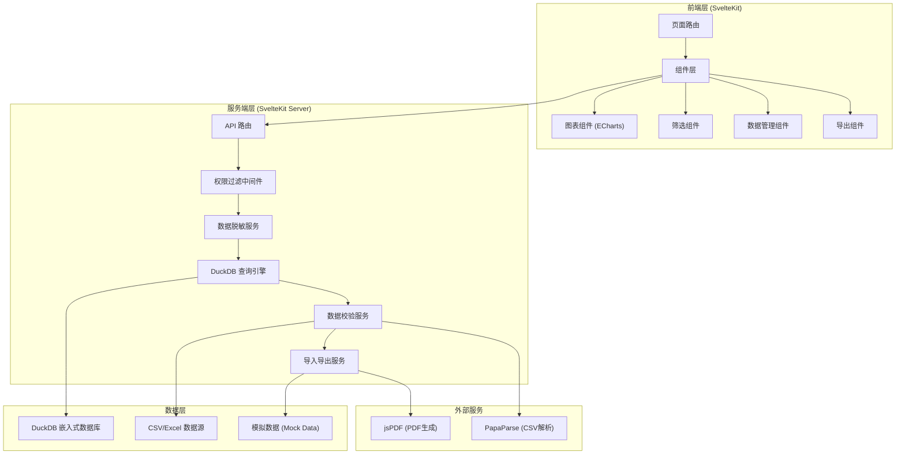
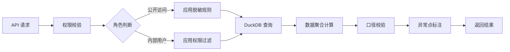
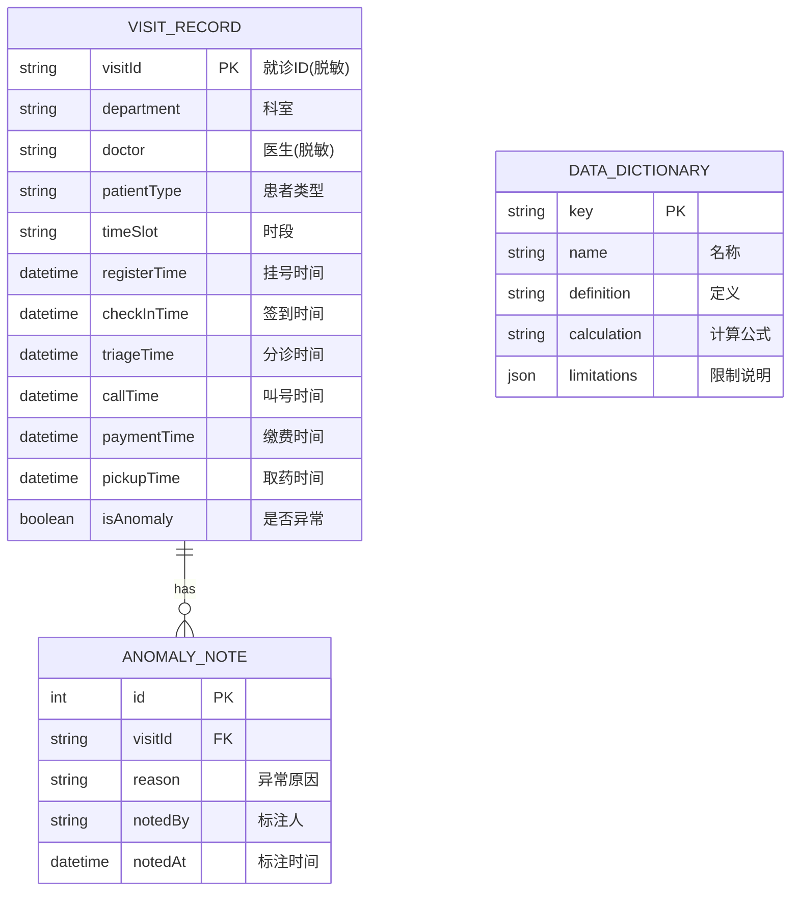

## 1. 架构设计



## 2. 技术栈说明

- **前端框架**：SvelteKit 2.x（全栈框架，SSR + 客户端路由）
- **图表库**：Apache ECharts 5.x（桑基图、直方图、柱状图、折线图）
- **数据库**：DuckDB（嵌入式分析型数据库，用于快速聚合查询）
- **样式方案**：TailwindCSS 3.x
- **语言**：TypeScript
- **包管理**：npm
- **构建工具**：Vite（SvelteKit 内置）
- **PDF 导出**：jsPDF + html2canvas
- **CSV 解析**：PapaParse
- **数据模拟**：内置 Mock 数据生成器

## 3. 路由定义

| 路由 | 页面类型 | 用途 | 权限要求 |
|------|----------|------|----------|
| `/` | 仪表盘 | 全局概览、核心指标、快速筛选 | 公开（脱敏）/ 内部（完整） |
| `/process` | 流程分析 | 桑基图、等待分布、瓶颈识别 | 内部 |
| `/comparison` | 多维对比 | 科室、医生、时段对比分析 | 内部 |
| `/trends` | 趋势分析 | 日内趋势、周期趋势 | 公开（脱敏）/ 内部（完整） |
| `/data` | 数据管理 | 批量导入、数据字典、异常标注 | 运营分析师 |
| `/export` | 导出中心 | CSV/PDF 导出配置 | 内部 |
| `/public` | 公开页面 | 对外公开的脱敏数据展示 | 公开 |
| `/api/*` | API 路由 | 数据查询、导入、导出接口 | 按接口权限控制 |

## 4. API 定义

### 4.1 TypeScript 类型定义

```typescript
// 门诊流程时间戳记录
interface VisitRecord {
  visitId: string;
  department: string;
  doctor: string;
  patientType: '普通' | '急诊' | '复诊' | 'VIP';
  timeSlot: string;
  registerTime: Date | null;
  checkInTime: Date | null;
  triageTime: Date | null;
  callTime: Date | null;
  paymentTime: Date | null;
  pickupTime: Date | null;
  isAnomaly: boolean;
  anomalyReason?: string;
}

// 筛选条件
interface FilterParams {
  departments: string[];
  doctors: string[];
  timeSlots: string[];
  patientTypes: string[];
  dateRange: { start: Date; end: Date };
  processNodes: string[];
}

// 等待时间统计
interface WaitTimeStats {
  node: string;
  avg: number;
  median: number;
  p95: number;
  min: number;
  max: number;
  count: number;
}

// 桑基图数据
interface SankeyData {
  nodes: { name: string }[];
  links: { source: string; target: string; value: number; waitTime: number }[];
}

// 口径说明
interface MetricDefinition {
  key: string;
  name: string;
  definition: string;
  calculation: string;
  limitations: string[];
}
```

### 4.2 API 接口列表

| 接口 | 方法 | 请求参数 | 返回 | 权限 |
|------|------|----------|------|------|
| `/api/overview` | GET | `FilterParams` | 全局指标统计 | 公开/内部 |
| `/api/sankey` | GET | `FilterParams` | 桑基图数据 | 内部 |
| `/api/wait-distribution` | GET | `FilterParams`, `node` | 等待时间分布直方图数据 | 内部 |
| `/api/department-compare` | GET | `FilterParams` | 科室对比数据 | 内部 |
| `/api/intraday-trend` | GET | `FilterParams` | 日内趋势数据 | 公开/内部 |
| `/api/import` | POST | FormData (CSV/Excel) | 导入结果报告 | 运营分析师 |
| `/api/export/csv` | POST | `FilterParams`, `fields` | CSV 文件流 | 内部 |
| `/api/export/pdf` | POST | `FilterParams`, `reportConfig` | PDF 文件流 | 内部 |
| `/api/dictionary` | GET | - | 数据字典和口径说明 | 公开 |
| `/api/anomalies` | GET, POST | 标注信息 | 异常点列表/标注结果 | 运营分析师 |

## 5. 服务端处理流程



## 6. 数据模型

### 6.1 ER 图



### 6.2 DuckDB 表定义

```sql
-- 就诊记录表
CREATE TABLE IF NOT EXISTS visit_records (
    visit_id VARCHAR PRIMARY KEY,
    department VARCHAR NOT NULL,
    doctor VARCHAR NOT NULL,
    patient_type VARCHAR NOT NULL,
    time_slot VARCHAR NOT NULL,
    register_time TIMESTAMP,
    check_in_time TIMESTAMP,
    triage_time TIMESTAMP,
    call_time TIMESTAMP,
    payment_time TIMESTAMP,
    pickup_time TIMESTAMP,
    is_anomaly BOOLEAN DEFAULT false,
    created_at TIMESTAMP DEFAULT CURRENT_TIMESTAMP
);

-- 异常标注表
CREATE TABLE IF NOT EXISTS anomaly_notes (
    id INTEGER PRIMARY KEY,
    visit_id VARCHAR REFERENCES visit_records(visit_id),
    reason VARCHAR NOT NULL,
    noted_by VARCHAR NOT NULL,
    noted_at TIMESTAMP DEFAULT CURRENT_TIMESTAMP
);

-- 数据字典表
CREATE TABLE IF NOT EXISTS data_dictionary (
    key VARCHAR PRIMARY KEY,
    name VARCHAR NOT NULL,
    definition VARCHAR NOT NULL,
    calculation VARCHAR,
    limitations JSON
);

-- 索引
CREATE INDEX idx_department ON visit_records(department);
CREATE INDEX idx_doctor ON visit_records(doctor);
CREATE INDEX idx_patient_type ON visit_records(patient_type);
CREATE INDEX idx_time_slot ON visit_records(time_slot);
CREATE INDEX idx_register_time ON visit_records(register_time);
```

### 6.3 脱敏规则定义

| 字段 | 内部用户 | 公开访问 | 脱敏方式 |
|------|----------|----------|----------|
| visit_id | 明文 | 哈希 | SHA-256 哈希 |
| doctor | 真实姓名 | 编码 | 医生A、医生B... |
| patient_id | - | - | 不存储 |
| 诊断信息 | - | - | 不存储 |
| 费用信息 | 聚合 | 聚合 | 仅统计，不展示明细 |

### 6.4 缺失值处理策略

| 缺失场景 | 处理方式 | 标记方式 |
|----------|----------|----------|
| 某环节时间戳缺失 | 跳过该环节计算，不参与平均 | 在数据字典中说明样本量 |
| 时间顺序异常（如叫号早于签到） | 标记为异常数据，可选择排除 | 异常标注功能 |
| 极端值（等待时间 > 3倍IQR） | 保留但标记，统计时可选择是否包含 | p95 指标辅助参考 |
