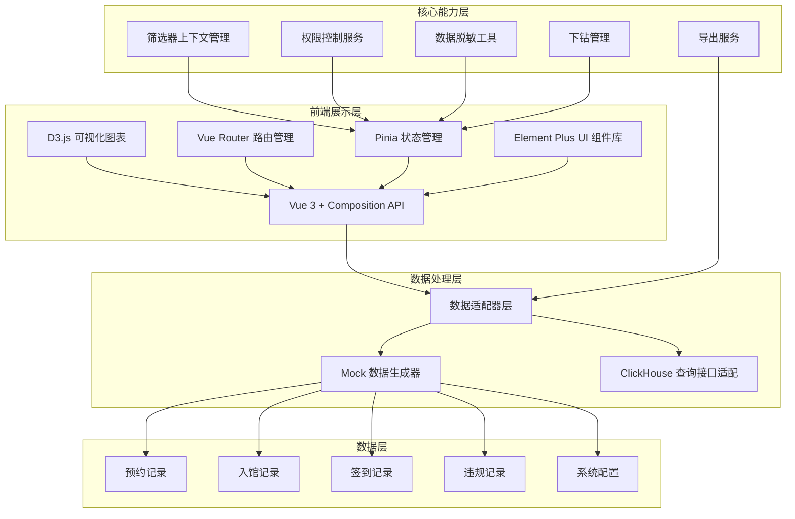
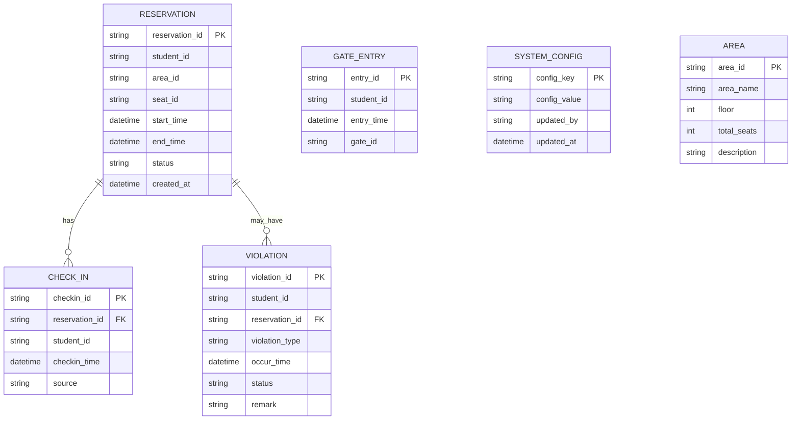

## 1. 架构设计



## 2. 技术选型说明

### 2.1 前端技术栈

| 技术 | 版本 | 用途 |
|------|------|------|
| Vue | 3.4.x | 前端框架，使用 Composition API |
| Vite | 5.x | 构建工具，快速开发体验 |
| TypeScript | 5.x | 类型安全，提升代码质量 |
| D3.js | 7.8.x | 数据可视化核心库 |
| Pinia | 2.x | 状态管理，存储筛选上下文和用户权限 |
| Vue Router | 4.x | 路由管理 |
| Element Plus | 2.5.x | UI 组件库（表格、弹窗、表单等） |
| Tailwind CSS | 3.4.x | 原子化 CSS，快速构建界面 |
| date-fns | 3.x | 日期处理工具库 |
| file-saver | 2.x | 文件导出下载 |

### 2.2 数据层说明

- **Mock 数据**：开发阶段使用 Mock 数据模拟 ClickHouse 查询结果
- **数据适配器**：统一的数据查询接口，后续可无缝对接真实 ClickHouse 后端
- **数据脱敏**：前端实现学号脱敏工具函数，根据权限动态控制

## 3. 路由定义

| 路由路径 | 页面名称 | 说明 |
|----------|----------|------|
| /dashboard | 总览仪表盘 | 核心指标概览、快捷筛选、趋势图表 |
| /heatmap | 时段热力分析 | 日期-时段热力图、闭馆标记 |
| /area-utilization | 区域利用率 | 区域对比柱状图、趋势分析 |
| /violation | 爽约与违规分析 | 爽约率趋势、违规分布、记录列表 |
| /exam-week | 考试周专项分析 | 考试周对比、规则配置入口 |
| /settings | 系统配置 | 闭馆日历、规则管理 |

## 4. 核心模块设计

### 4.1 状态管理 (Pinia)

```typescript
// stores/filter.ts
interface FilterState {
  dateRange: [Date, Date];
  selectedAreas: string[];
  selectedFloors: number[];
  studentTypes: string[];
  preserveContext: boolean;
}

// stores/auth.ts
interface AuthState {
  userRole: 'super_admin' | 'librarian' | 'student';
  userId: string;
  permissions: string[];
}

// stores/drillDown.ts
interface DrillDownState {
  isOpen: boolean;
  drillData: any;
  rawRecords: any[];
  remarks: any[];
}
```

### 4.2 工具函数

```typescript
// utils/dataMasking.ts
function maskStudentId(studentId: string, role: string): string;
function shouldMask(role: string): boolean;

// utils/export.ts
function exportToCSV(data: any[], filename: string): void;
function exportToExcel(data: any[], filename: string): void;

// utils/dateHelper.ts
function isExamWeek(date: Date, examPeriods: any[]): boolean;
function isTemporaryClosed(date: Date, closedDates: any[]): boolean;
```

### 4.3 数据适配器接口

```typescript
// api/adapter.ts
interface QueryParams {
  dateRange: [Date, Date];
  areas?: string[];
  floors?: number[];
  dimensions?: string[];
}

interface DataAdapter {
  getHeatmapData(params: QueryParams): Promise<HeatmapData[]>;
  getAreaUtilization(params: QueryParams): Promise<AreaData[]>;
  getViolationStats(params: QueryParams): Promise<ViolationData[]>;
  getRawRecords(params: QueryParams): Promise<RawRecord[]>;
  getDashboardStats(params: QueryParams): Promise<DashboardStats>;
}
```

## 5. 组件结构

```
src/
├── components/
│   ├── charts/
│   │   ├── HeatmapChart.vue      # 热力图组件
│   │   ├── AreaBarChart.vue      # 区域利用率柱状图
│   │   ├── LineTrendChart.vue    # 趋势折线图
│   │   ├── ViolationPieChart.vue # 违规分布饼图
│   │   └── StatCard.vue          # 数据卡片
│   ├── filters/
│   │   ├── DateRangePicker.vue   # 日期范围选择
│   │   ├── AreaSelector.vue      # 区域选择器
│   │   └── FilterBar.vue         # 筛选栏容器
│   ├── common/
│   │   ├── DrillDownPanel.vue    # 下钻详情面板
│   │   ├── ExportButton.vue      # 导出按钮
│   │   ├── SampleSizeTip.vue     # 样本量提示
│   │   └── ClosedDateMarker.vue  # 闭馆日标记
│   └── layout/
│       ├── Sidebar.vue           # 侧边栏导航
│       └── MainLayout.vue        # 主布局
├── views/
│   ├── Dashboard.vue
│   ├── Heatmap.vue
│   ├── AreaUtilization.vue
│   ├── ViolationAnalysis.vue
│   ├── ExamWeek.vue
│   └── Settings.vue
├── stores/
├── utils/
├── api/
└── mock/
```

## 6. 数据模型设计

### 6.1 核心数据模型



### 6.2 Mock 数据配置

- 生成 3 个月的历史数据（2026-03-01 至 2026-05-31）
- 包含 5 个楼层、10 个区域
- 模拟考试周（2026-05-15 至 2026-05-28）
- 设置 3 个临时闭馆日
- 生成约 5 万条预约记录、3 千条违规记录
