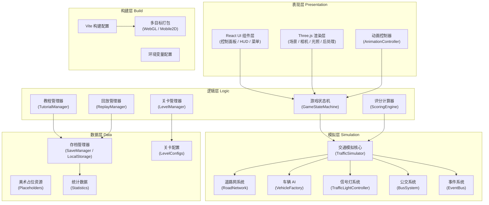
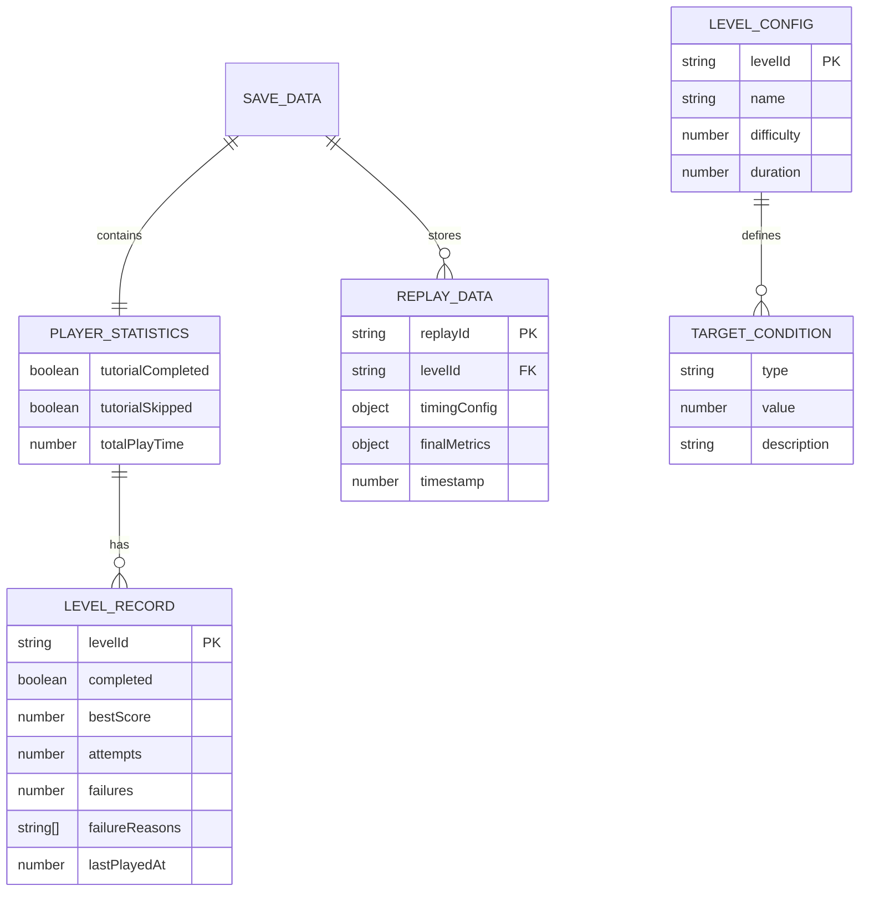

## 1. 架构设计



## 2. 技术栈说明

- **前端框架**：React@18 + TypeScript + Vite@5
- **3D 引擎**：three@0.160 + @react-three/fiber@8 + @react-three/drei@9 + @react-three/postprocessing@2
- **状态管理**：Zustand@4（轻量状态机 + 模拟数据）
- **样式方案**：TailwindCSS@3 + 自定义 CSS 变量主题
- **动画系统**：GSAP@3（UI 动画） + 自定义 AnimationController（Three.js 动画）
- **图表库**：recharts@2（雷达图、柱状图）
- **事件系统**：mitt@3（全局事件总线）
- **存档方案**：LocalStorage + 自定义序列化（IndexedDB 备用）
- **构建工具**：Vite + TypeScript 严格模式 + ESLint
- **测试方案**：Vitest（核心模拟逻辑单测）

## 3. 路由定义

| 路由 | 页面组件 | 用途 |
|------|----------|------|
| / | MainMenu | 主菜单，模式选择与存档入口 |
| /levels | LevelSelect | 关卡地图选择界面 |
| /game/:levelId | GameScene | 游戏主场景（3D + 控制面板） |
| /sandbox | Sandbox | 沙盒模式自由配置 |
| /stats | Statistics | 统计中心，失败重试记录 |
| /tutorial | Tutorial | 独立教程页（也可在游戏内嵌入） |

## 4. 核心模块 API 定义

### 4.1 事件系统 (EventBus)

```typescript
type GameEvents = {
  'game:start': { levelId: string };
  'game:end': { success: boolean; score: number };
  'level:complete': { levelId: string; score: number };
  'level:fail': { levelId: string; reason: string; attempt: number };
  'tutorial:step': { stepId: number; skipped: boolean };
  'tutorial:complete': { skipped: boolean };
  'timing:change': { cycle: number; phases: PhaseConfig };
  'bus:priority': { enabled: boolean; threshold: number };
  'replay:capture': { frameData: SimulationFrame };
  'replay:seek': { time: number };
  'simulation:tick': { delta: number; metrics: MetricsSnapshot };
  'save:update': { data: SaveData };
};

declare class EventBus<Events> {
  on<K extends keyof Events>(event: K, handler: (payload: Events[K]) => void): void;
  off<K extends keyof Events>(event: K, handler: (payload: Events[K]) => void): void;
  emit<K extends keyof Events>(event: K, payload: Events[K]): void;
}
```

### 4.2 信号灯控制器

```typescript
type LightPhase = 'NS_GREEN' | 'NS_YELLOW' | 'EW_GREEN' | 'EW_YELLOW' | 'ALL_RED';

interface PhaseConfig {
  nsGreen: number;      // 南北绿灯时长（秒）
  ewGreen: number;      // 东西绿灯时长（秒）
  yellow: number;       // 黄灯时长（秒）
  allRed: number;       // 全红清空（秒）
  busPriority: boolean; // 公交优先开关
  busThreshold: number; // 公交触发阈值（排队数）
}

interface TrafficLightState {
  currentPhase: LightPhase;
  phaseTimer: number;
  totalCycle: number;
  busOverride: boolean;
}

declare class TrafficLightController {
  constructor(config: PhaseConfig);
  update(delta: number): void;
  getState(intersectionId: string): TrafficLightState;
  applyConfig(config: Partial<PhaseConfig>): void;
  triggerBusPriority(intersectionId: string): void;
}
```

### 4.3 交通模拟核心

```typescript
interface Vehicle {
  id: string;
  type: 'car' | 'bus' | 'taxi';
  position: { x: number; z: number };
  speed: number;
  maxSpeed: number;
  laneId: string;
  routeId: string;
  waitingTime: number;
  isBus: boolean;
}

interface Intersection {
  id: string;
  position: { x: number; z: number };
  lanes: Lane[];
  trafficLight: TrafficLightState;
  queueLength: Record<string, number>;
}

interface RoadNetwork {
  intersections: Map<string, Intersection>;
  roads: Road[];
  lanes: Lane[];
}

interface MetricsSnapshot {
  congestionIndex: number;    // 0-100 拥堵指数
  avgWaitingTime: number;     // 平均等待时间（秒）
  avgSpeed: number;           // 平均车速
  busOnTimeRate: number;      // 公交准点率 %
  throughput: number;         // 已通过车辆数
  queueLengths: Record<string, number>;
}

declare class TrafficSimulator {
  constructor(network: RoadNetwork, spawnConfig: SpawnConfig);
  start(): void;
  pause(): void;
  reset(): void;
  update(delta: number): MetricsSnapshot;
  setSpeedScale(scale: number): void;
  getVehicles(): Vehicle[];
  getMetrics(): MetricsSnapshot;
}
```

### 4.4 存档管理器

```typescript
interface PlayerStatistics {
  tutorialCompleted: boolean;
  tutorialSkipped: boolean;
  totalPlayTime: number;
  levels: Record<string, LevelRecord>;
}

interface LevelRecord {
  completed: boolean;
  bestScore: number;
  bestMetrics: MetricsSnapshot;
  attempts: number;
  failures: number;
  lastPlayedAt: number;
  failureReasons: string[];
}

interface ReplayData {
  levelId: string;
  timingConfig: PhaseConfig;
  frames: SimulationFrame[];
  finalMetrics: MetricsSnapshot;
  timestamp: number;
}

interface SaveData {
  version: number;
  playerId: string;
  statistics: PlayerStatistics;
  currentLevel: string;
  replays: ReplayData[];
  sandboxSettings: any;
}

declare class SaveManager {
  load(): SaveData | null;
  save(data: SaveData): void;
  recordLevelAttempt(levelId: string, success: boolean, reason?: string): void;
  recordTutorial(skipped: boolean): void;
  getLevelRecord(levelId: string): LevelRecord;
  clear(): void;
}
```

### 4.5 关卡配置

```typescript
interface LevelConfig {
  id: string;
  name: string;
  description: string;
  difficulty: 1 | 2 | 3 | 4 | 5;
  unlockRequirement: string | null;
  roadNetwork: RoadNetworkConfig;
  spawnPatterns: SpawnPattern[]; // 早高峰/晚高峰车流模式
  duration: number;              // 关卡时长（秒）
  targetConditions: TargetCondition[];
  newRules: NewRuleIntroductions[];
  tutorialSteps?: TutorialStepConfig[];
}

interface TargetCondition {
  type: 'congestion_below' | 'avg_wait_below' | 'bus_on_time_above' | 'throughput_above';
  value: number;
  description: string;
}

interface NewRuleIntroduction {
  ruleId: string;
  title: string;
  description: string;
  uiHighlight: string;
}
```

## 5. 目录结构

```
src/
├── components/              # React UI 组件
│   ├── ui/                  # 基础组件（按钮、滑块、卡片）
│   ├── menu/                # 主菜单、关卡选择
│   ├── game/                # 游戏内 HUD、控制面板
│   ├── tutorial/            # 教程气泡、引导遮罩
│   ├── result/              # 结算、失败界面
│   └── stats/               # 统计中心
├── game/                    # 游戏核心逻辑
│   ├── TrafficSimulator.ts  # 交通模拟核心
│   ├── RoadNetwork.ts       # 道路网定义
│   ├── Vehicle.ts           # 车辆与 AI
│   ├── TrafficLight.ts      # 信号灯控制器
│   ├── BusSystem.ts         # 公交系统
│   ├── ScoringEngine.ts     # 评分计算
│   ├── LevelManager.ts      # 关卡管理
│   ├── TutorialManager.ts   # 教程管理
│   ├── ReplayManager.ts     # 回放系统
│   └── EventBus.ts          # 事件系统
├── scene/                   # Three.js 渲染层
│   ├── SceneRoot.tsx        # R3F 场景根组件
│   ├── CameraRig.tsx        # 摄像机控制
│   ├── Lighting.tsx         # 光照配置
│   ├── roads/               # 道路渲染
│   ├── vehicles/            # 车辆渲染
│   ├── buildings/           # 建筑渲染
│   ├── effects/             # 后处理、粒子
│   └── AnimationController.ts # 动画控制器
├── store/                   # Zustand 状态
│   ├── useGameStore.ts
│   ├── useUIVStore.ts
│   └── useReplayStore.ts
├── data/                    # 数据与配置
│   ├── levels/              # 关卡配置文件
│   ├── placeholders/        # 美术占位资源
│   ├── tutorials/           # 教程步骤配置
│   └── themes/              # 主题色变量
├── hooks/                   # 自定义 Hooks
│   ├── useAnimation.ts
│   ├── useEventListener.ts
│   └── useSaveManager.ts
├── types/                   # 全局类型定义
│   └── index.ts
├── utils/                   # 工具函数
│   ├── math.ts
│   ├── serialization.ts
│   └── pathfinding.ts
├── App.tsx
├── main.tsx
└── index.css
```

## 6. 数据模型

### 6.1 ER 关系



### 6.2 关键设计决策

1. **模拟层与渲染层分离**：`TrafficSimulator` 纯逻辑计算（可单测），Three.js 层仅消费状态渲染
2. **固定时间步长模拟**：逻辑使用 60Hz 固定步长，渲染插值过渡，保证回放一致性
3. **事件驱动架构**：核心模块通过 `EventBus` 解耦，新增功能只需订阅/发布事件
4. **存档版本化**：`SaveData.version` 字段支持迁移，兼容旧存档
5. **关卡配置驱动**：难度渐进和新规则通过 JSON 配置引入，不硬编码在代码中
6. **动画控制器独立**：`AnimationController` 统一管理 Three.js 插值动画，不耦合业务逻辑
7. **失败原因追踪**：`LevelRecord.failureReasons` 分析关卡难度曲线，辅助平衡调整
