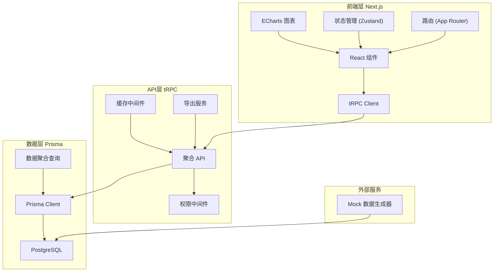
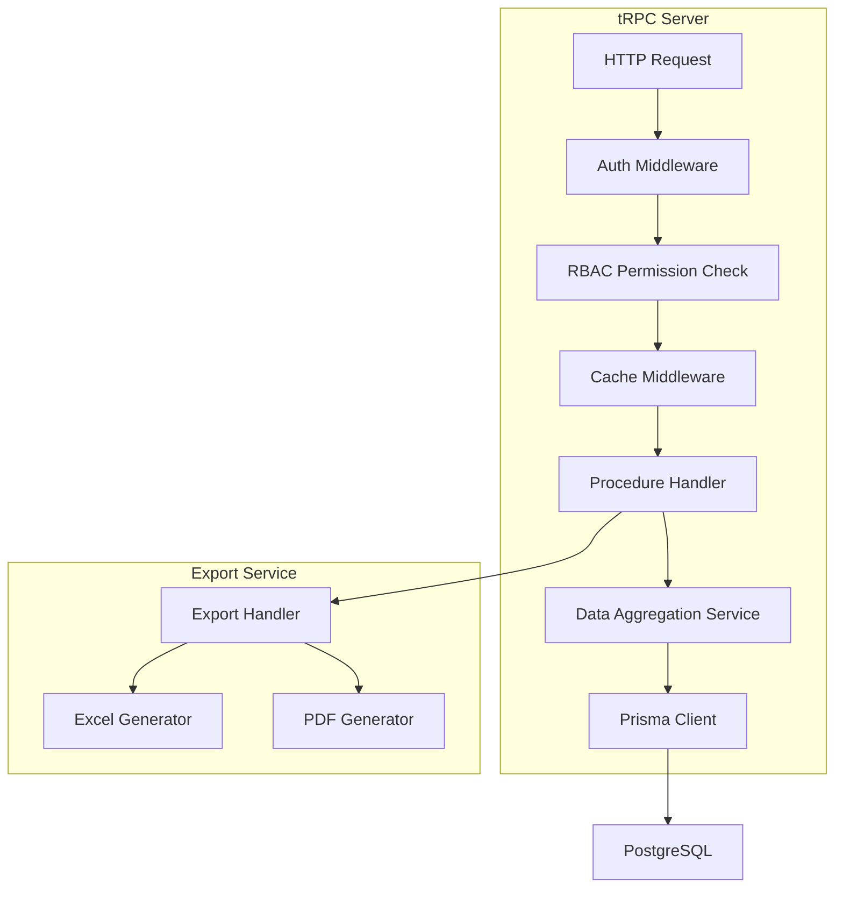
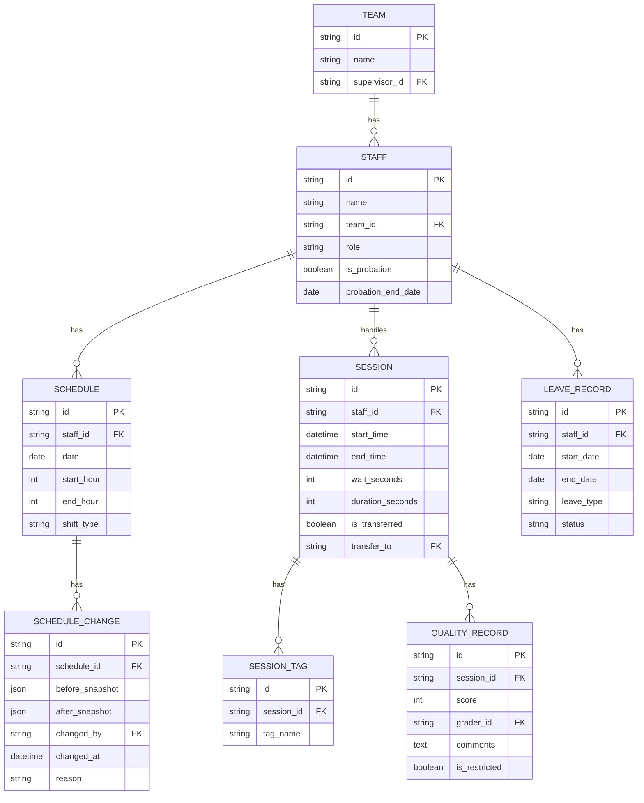

## 1. 架构设计



## 2. 技术栈描述

- **前端框架**: Next.js 14 (App Router) + React 18 + TypeScript
- **样式方案**: TailwindCSS 3 + shadcn/ui 组件库
- **API 层**: tRPC 11 + Zod 数据校验
- **ORM**: Prisma 5
- **数据库**: PostgreSQL (开发环境使用 Docker)
- **图表库**: ECharts 5 + echarts-for-react
- **状态管理**: Zustand (轻量级全局状态) + React Query (数据缓存)
- **拖拽库**: @dnd-kit/core (排班调整)
- **权限控制**: 基于角色的访问控制 (RBAC)
- **数据导出**: xlsx (Excel) + jsPDF (PDF)
- **缓存策略**: React Query 客户端缓存 + tRPC 服务端内存缓存

## 3. 路由定义

| Route | 页面用途 |
|-------|----------|
| /dashboard | 看板总览 - 核心指标卡片 + 快捷视图入口 |
| /dashboard/workload | 班组负载视图 - 热力图 + 排班调整面板 |
| /dashboard/timeout | 超时趋势视图 - 等待时长趋势 + 超时预警 |
| /dashboard/tags | 标签分布视图 - 问题标签统计分析 |
| /dashboard/staff | 人员对比视图 - 绩效排名 + 新人保护标记 |
| /dashboard/history | 调班历史页 - 版本对比 + 操作日志 |

## 4. API 定义 (tRPC Procedures)

### 4.1 类型定义
```typescript
// 筛选器上下文
interface FilterContext {
  dateRange: { start: Date; end: Date };
  teamIds: string[];
  staffIds: string[];
  timeGranularity: 'hour' | 'day' | 'week';
}

// 客服人员
interface Staff {
  id: string;
  name: string;
  teamId: string;
  role: 'agent' | 'supervisor' | 'admin';
  isProbation: boolean;
  probationEndDate?: Date;
}

// 班组负载数据
interface TeamWorkload {
  teamId: string;
  teamName: string;
  hour: number;
  workload: number; // 0-100
  sessionCount: number;
  avgWaitTime: number;
}

// 调班记录
interface ScheduleChange {
  id: string;
  scheduleId: string;
  beforeSnapshot: WorkloadSnapshot;
  afterSnapshot: WorkloadSnapshot;
  changedBy: string;
  changedAt: Date;
  reason?: string;
}
```

### 4.2 tRPC 路由
| Procedure | 类型 | 描述 | 权限 |
|-----------|------|------|------|
| dashboard.getMetrics | Query | 获取核心指标卡片数据 | ALL |
| workload.getByTeam | Query | 获取班组负载数据 | 主管/组长 |
| timeout.getTrend | Query | 获取超时趋势数据 | 主管/组长 |
| tags.getDistribution | Query | 获取标签分布统计 | 主管/组长 |
| staff.getRanking | Query | 获取人员绩效排名 | 主管/组长 |
| schedule.adjust | Mutation | 调整班次 | 主管 |
| schedule.getHistory | Query | 获取调班历史 | 主管/组长 |
| session.getLowQuality | Query | 质检低分会话详情 | 主管(授权) |
| export.workloadReport | Query | 导出负载报表 | 主管 |

## 5. 服务端架构图



## 6. 数据模型

### 6.1 ER 图



### 6.2 Prisma Schema 关键定义

```prisma
model Staff {
  id               String     @id @default(uuid())
  name             String
  teamId           String
  team             Team       @relation(fields: [teamId], references: [id])
  role             String     // agent, supervisor, admin
  isProbation      Boolean    @default(false)
  probationEndDate DateTime?
  schedules        Schedule[]
  sessions         Session[]
  leaveRecords     LeaveRecord[]
}

model Schedule {
  id              String             @id @default(uuid())
  staffId         String
  staff           Staff              @relation(fields: [staffId], references: [id])
  date            DateTime
  startHour       Int
  endHour         Int
  shiftType       String
  changes         ScheduleChange[]
}

model ScheduleChange {
  id              String   @id @default(uuid())
  scheduleId      String
  schedule        Schedule @relation(fields: [scheduleId], references: [id])
  beforeSnapshot  Json
  afterSnapshot   Json
  changedBy       String
  changedAt       DateTime @default(now())
  reason          String?
}

model Session {
  id              String        @id @default(uuid())
  staffId         String
  staff           Staff         @relation(fields: [staffId], references: [id])
  startTime       DateTime
  endTime         DateTime
  waitSeconds     Int
  durationSeconds Int
  isTransferred   Boolean       @default(false)
  transferTo      String?
  tags            SessionTag[]
  qualityRecord   QualityRecord?
}

model QualityRecord {
  id            String  @id @default(uuid())
  sessionId     String  @unique
  session       Session @relation(fields: [sessionId], references: [id])
  score         Int
  graderId      String
  comments      String?
  isRestricted  Boolean @default(false)
}
```

## 7. 关键技术实现点

### 7.1 权限控制
- tRPC 中间件实现 RBAC，每个 Procedure 声明所需角色
- 质检低分数据 `isRestricted` 字段额外校验数据范围授权

### 7.2 缓存策略
- React Query 客户端缓存：列表数据 5 分钟，详情数据 10 分钟
- 服务端缓存：聚合查询结果使用内存缓存（lru-cache），Key 包含筛选条件哈希

### 7.3 筛选器上下文
- Zustand store 管理全局筛选状态
- URL search params 同步，支持页面刷新和链接分享
- 所有图表组件订阅同一筛选状态源，保证口径一致

### 7.4 调班版本保留
- 每次调班操作创建 `ScheduleChange` 记录
- `beforeSnapshot` 和 `afterSnapshot` 存储调整前后完整班组负载快照
- 支持时间轴回溯查看任意版本

### 7.5 新人保护期
- `Staff.isProbation` 标记新人
- 绩效排名 API 中新人单独分组，不参与正式排名
- 前端展示新人徽章，排名栏置灰或单独区域
