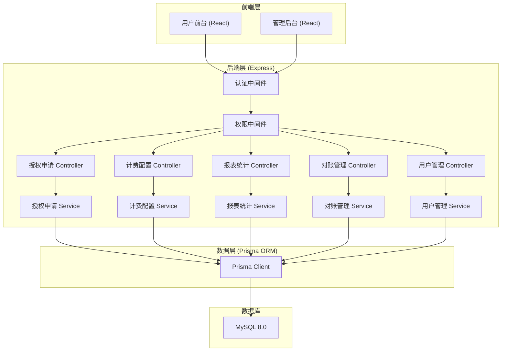
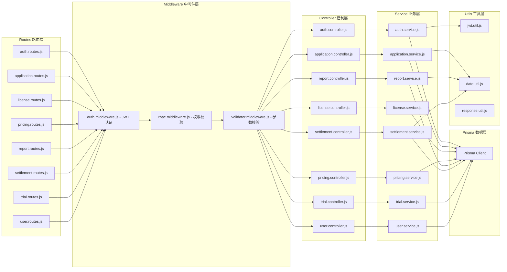
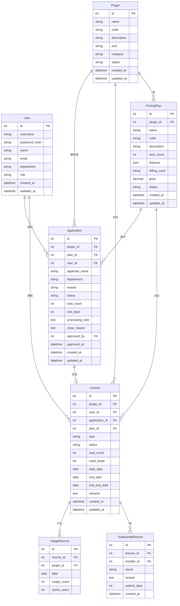

## 1. 架构设计

插件授权计费台采用前后端分离的单体架构。前端基于 React + Ant Design + Vite 构建，分为用户前台和管理后台两个入口；后端基于 Express + Prisma + MySQL 提供 RESTful API 服务。



## 2. 技术描述

### 2.1 技术栈

- **前端框架**：React 18
- **UI 组件库**：Ant Design 5.x
- **构建工具**：Vite 5.x
- **路由管理**：React Router 6.x
- **状态管理**：Zustand（轻量级）
- **HTTP 请求**：Axios
- **图表库**：ECharts 5.x（用于使用趋势图）
- **图标**：@ant-design/icons

### 2.2 后端技术栈

- **后端框架**：Express 4.x
- **ORM**：Prisma 5.x
- **数据库**：MySQL 8.0
- **认证**：JWT (jsonwebtoken)
- **密码加密**：bcryptjs
- **请求校验**：express-validator
- **CORS**：cors 中间件
- **环境变量**：dotenv

### 2.3 项目结构

```
work-0401/
├── server/                 # 后端项目
│   ├── prisma/
│   │   ├── schema.prisma   # 数据模型定义
│   │   └── seed.js         # 初始化数据
│   ├── src/
│   │   ├── config/         # 配置文件
│   │   ├── middleware/     # 中间件
│   │   ├── controllers/    # 控制器
│   │   ├── services/       # 业务逻辑
│   │   ├── routes/         # 路由定义
│   │   ├── utils/          # 工具函数
│   │   └── app.js          # 应用入口
│   ├── package.json
│   └── .env
└── client/                 # 前端项目
    ├── src/
    │   ├── pages/          # 页面组件
    │   │   ├── user/       # 用户前台页面
    │   │   └── admin/      # 管理后台页面
    │   ├── components/     # 公共组件
    │   ├── layout/         # 布局组件
    │   ├── store/          # 状态管理
    │   ├── api/            # API 接口
    │   ├── utils/          # 工具函数
    │   ├── router/         # 路由配置
    │   ├── App.jsx
    │   └── main.jsx
    ├── package.json
    └── vite.config.js
```

## 3. 路由定义

### 3.1 前端路由

| 路由路径 | 页面 | 角色权限 | 说明 |
|----------|------|----------|------|
| `/login` | 登录页 | 所有 | 登录入口，角色选择 |
| `/user/plugins` | 插件市场 | 普通用户 | 浏览和申请插件 |
| `/user/licenses` | 我的授权 | 普通用户 | 查看已有授权 |
| `/user/applications` | 申请记录 | 普通用户 | 历史申请记录 |
| `/admin/approvals` | 授权审批 | 运营/系统管理员 | 审批授权申请 |
| `/admin/pricing` | 计费配置 | 运营/系统管理员 | 价格、账期、套餐配置 |
| `/admin/reports` | 数据报表 | 运营/财务/系统管理员 | 使用趋势、席位利用率 |
| `/admin/settlement` | 对账中心 | 财务/系统管理员 | 续费名单、跨部门对账 |
| `/admin/trials` | 试用管理 | 运营/系统管理员 | 试用授权管理、到期处理 |
| `/admin/users` | 用户管理 | 系统管理员 | 用户列表、权限管理 |

### 3.2 后端 API 路由

| 方法 | 路径 | 说明 | 权限 |
|------|------|------|------|
| POST | `/api/auth/login` | 用户登录 | 公开 |
| GET | `/api/auth/me` | 获取当前用户 | 已登录 |
| GET | `/api/plugins` | 获取插件列表 | 已登录 |
| GET | `/api/plugins/:id` | 获取插件详情 | 已登录 |
| POST | `/api/applications` | 提交授权申请 | 普通用户 |
| GET | `/api/applications` | 获取申请列表 | 已登录 |
| GET | `/api/applications/:id` | 获取申请详情 | 已登录 |
| PUT | `/api/applications/:id/status` | 更新申请状态 | 管理员 |
| GET | `/api/licenses` | 获取授权列表 | 已登录 |
| GET | `/api/licenses/:id` | 获取授权详情 | 已登录 |
| POST | `/api/pricing/plans` | 创建套餐 | 管理员 |
| GET | `/api/pricing/plans` | 获取套餐列表 | 已登录 |
| PUT | `/api/pricing/plans/:id` | 更新套餐 | 管理员 |
| POST | `/api/pricing/prices` | 创建价格 | 管理员 |
| GET | `/api/pricing/prices` | 获取价格列表 | 已登录 |
| GET | `/api/reports/usage-trend` | 使用趋势数据 | 管理员 |
| GET | `/api/reports/seat-utilization` | 席位利用率 | 管理员 |
| GET | `/api/settlement/renewal-list` | 续费名单 | 管理员 |
| GET | `/api/settlement/department-summary` | 部门对账汇总 | 管理员 |
| GET | `/api/trials` | 试用授权列表 | 管理员 |
| PUT | `/api/trials/:id/handle` | 处理试用到期 | 管理员 |
| GET | `/api/users` | 用户列表 | 系统管理员 |

## 4. API 数据类型定义

### 4.1 通用类型

```typescript
// 申请状态
type ApplicationStatus = 'PENDING' | 'PROCESSING' | 'COMPLETED' | 'CLOSED_ABNORMAL';

// 授权类型
type LicenseType = 'TRIAL' | 'PAID';

// 授权状态
type LicenseStatus = 'ACTIVE' | 'EXPIRED' | 'CANCELLED';

// 试用处理结果
type TrialHandleResult = 'CONVERT' | 'CLOSE' | 'EXTEND';

// 用户角色
type UserRole = 'USER' | 'OP_ADMIN' | 'FIN_ADMIN' | 'SYS_ADMIN';

// 账期类型
type BillingCycle = 'MONTHLY' | 'QUARTERLY' | 'YEARLY';
```

### 4.2 核心实体类型

```typescript
interface User {
  id: number;
  username: string;
  name: string;
  email: string;
  department: string;
  role: UserRole;
  createdAt: string;
}

interface Plugin {
  id: number;
  name: string;
  code: string;
  description: string;
  icon: string;
  category: string;
  status: 'ACTIVE' | 'INACTIVE';
  createdAt: string;
}

interface PricingPlan {
  id: number;
  pluginId: number;
  name: string;
  code: string;
  description: string;
  seatCount: number;
  features: string[];
  billingCycle: BillingCycle;
  price: number;
  status: 'ACTIVE' | 'INACTIVE';
}

interface Application {
  id: number;
  pluginId: number;
  planId: number;
  userId: number;
  applicantName: string;
  department: string;
  reason: string;
  status: ApplicationStatus;
  seatCount: number;
  trialDays: number;
  processingNote: string;
  closeReason: string;
  approvedBy: number;
  approvedAt: string;
  createdAt: string;
  updatedAt: string;
}

interface License {
  id: number;
  pluginId: number;
  userId: number;
  applicationId: number;
  planId: number;
  type: LicenseType;
  status: LicenseStatus;
  seatCount: number;
  usedSeats: number;
  startDate: string;
  endDate: string;
  trialEndDate: string;
  remarks: string;
  createdAt: string;
}

interface TrialHandleRecord {
  id: number;
  licenseId: number;
  handlerId: number;
  result: TrialHandleResult;
  remark: string;
  extendDays: number;
  createdAt: string;
}

interface UsageRecord {
  id: number;
  licenseId: number;
  pluginId: number;
  date: string;
  usageCount: number;
  activeUsers: number;
}
```

## 5. 服务端架构图



## 6. 数据模型

### 6.1 ER 图



### 6.2 数据库初始化脚本（Prisma Schema 核心）

- **User 表**：存储用户信息，包含账号、姓名、部门、角色等
- **Plugin 表**：存储插件信息，支持分类和状态管理
- **PricingPlan 表**：存储套餐价格信息，关联插件，支持多种账期
- **Application 表**：存储授权申请单，状态流转（待处理/处理中/已完成/异常关闭）
- **License 表**：存储授权信息，区分试用和付费，记录席位和有效期
- **UsageRecord 表**：存储插件使用记录，用于趋势分析
- **TrialHandleRecord 表**：存储试用到期处理记录，包含备注和处理结果

所有表均包含创建和更新时间字段，关键表（Application、License）建有状态和日期索引以优化查询性能。
