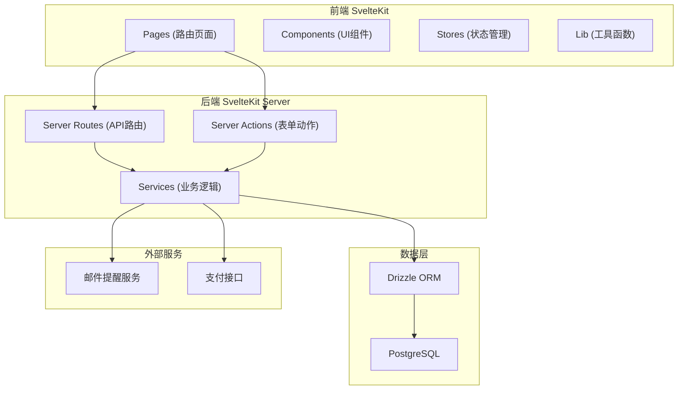
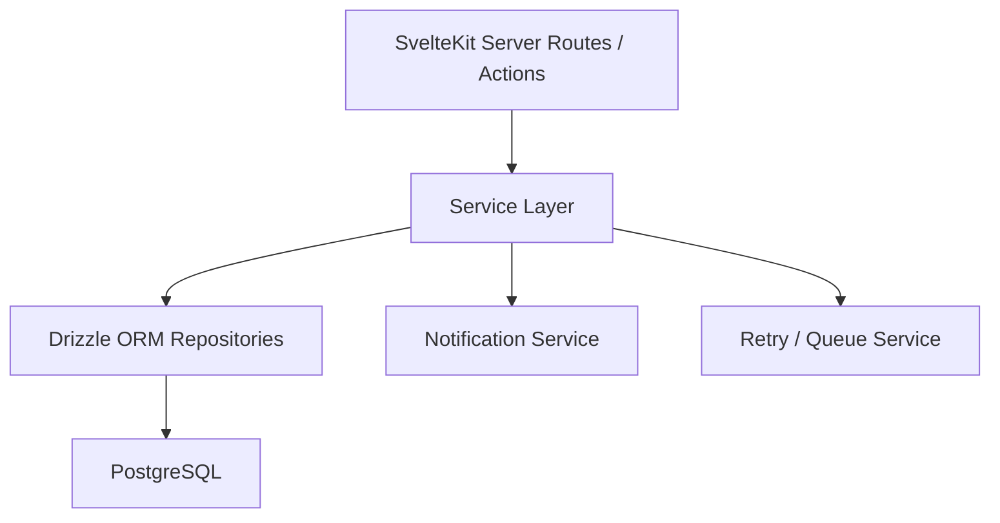
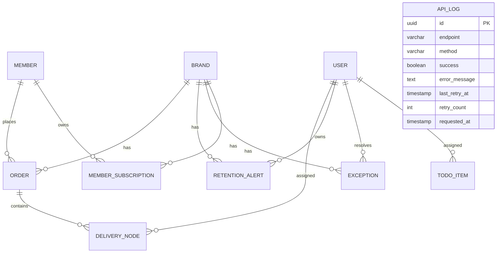

## 1. 架构设计



## 2. 技术说明
- 前端框架：SvelteKit 2 (Full-Stack SSR/SSG)
- 样式方案：Tailwind CSS 3
- 数据库ORM：Drizzle ORM
- 数据库：PostgreSQL 15+
- 状态管理：Svelte Stores (原生)
- 认证：SvelteKit Session + Cookie
- 包管理：pnpm

## 3. 路由定义
| 路由 | 用途 | 权限 |
|------|------|------|
| / | 登录/首页跳转 | 公开 |
| /dashboard | 主理人工作台（默认页） | 主理人/运营 |
| /dashboard/members | 会员订阅列表 | 主理人/运营 |
| /dashboard/todos | 待办面板 | 主理人 |
| /dashboard/exceptions | 异常池 | 主理人/运营 |
| /admin | 运营后台首页 | 运营负责人 |
| /admin/orders | 订单管理 | 运营负责人 |
| /admin/delivery | 交付节点管理 | 运营负责人 |
| /admin/retention | 付费留存预警 | 运营负责人 |
| /admin/api-logs | 接口监控日志 | 运营负责人 |
| /api/* | JSON API 端点 | 对应权限 |

## 4. API 定义

```typescript
// 会员订阅
interface MemberSubscription {
  id: string;
  memberName: string;
  brandId: string;
  brandName: string;
  planType: 'monthly' | 'quarterly' | 'yearly';
  materialAuthStatus: 'pending' | 'approved' | 'rejected';
  invoiceCycle: 'monthly' | 'quarterly' | 'yearly';
  subscriptionStatus: 'active' | 'expiring' | 'expired' | 'cancelled';
  startDate: Date;
  endDate: Date;
  createdAt: Date;
}

// 待办事项
interface TodoItem {
  id: string;
  title: string;
  type: 'material_auth' | 'invoice_cycle' | 'subscription';
  priority: 'high' | 'medium' | 'low';
  materialAuthStatus?: string;
  invoiceCycle?: string;
  subscriptionStatus?: string;
  relatedBrand: string;
  relatedMember?: string;
  dueDate: Date;
  status: 'pending' | 'processing' | 'done';
  assigneeId: string;
}

// 异常记录
interface ExceptionRecord {
  id: string;
  brandId: string;
  brandName: string;
  title: string;
  description: string;
  category: string;
  status: 'unconfirmed' | 'confirmed' | 'resolved';
  result?: string;
  remark?: string;
  hostId: string;
  resolvedAt?: Date;
  createdAt: Date;
}

// 订单
interface Order {
  id: string;
  orderNo: string;
  memberId: string;
  memberName: string;
  brandId: string;
  amount: number;
  status: 'pending' | 'paid' | 'delivering' | 'completed' | 'refunded';
  deliveryNodes: DeliveryNode[];
  paidAt?: Date;
  createdAt: Date;
}

// 交付节点
interface DeliveryNode {
  id: string;
  orderId: string;
  name: string;
  status: 'pending' | 'in_progress' | 'completed';
  assigneeId: string;
  completedAt?: Date;
  deadline: Date;
}

// 接口日志
interface ApiLog {
  id: string;
  endpoint: string;
  method: string;
  success: boolean;
  errorMessage?: string;
  lastRetryAt?: Date;
  retryCount: number;
  requestedAt: Date;
}

// 留存预警
interface RetentionAlert {
  id: string;
  brandId: string;
  metric: string;
  currentValue: number;
  threshold: number;
  ownerId: string;
  notifiedAt?: Date;
  status: 'active' | 'acknowledged' | 'resolved';
  createdAt: Date;
}
```

## 5. 服务端架构



## 6. 数据模型

### 6.1 ER图



### 6.2 DDL

```sql
-- 用户表
CREATE TABLE users (
  id UUID PRIMARY KEY DEFAULT gen_random_uuid(),
  email VARCHAR(255) UNIQUE NOT NULL,
  name VARCHAR(100) NOT NULL,
  role VARCHAR(20) NOT NULL CHECK (role IN ('host', 'operator')),
  avatar_url VARCHAR(500),
  created_at TIMESTAMPTZ DEFAULT NOW()
);

-- 品牌表
CREATE TABLE brands (
  id UUID PRIMARY KEY DEFAULT gen_random_uuid(),
  name VARCHAR(100) NOT NULL,
  host_id UUID REFERENCES users(id),
  created_at TIMESTAMPTZ DEFAULT NOW()
);

-- 会员表
CREATE TABLE members (
  id UUID PRIMARY KEY DEFAULT gen_random_uuid(),
  name VARCHAR(100) NOT NULL,
  email VARCHAR(255),
  phone VARCHAR(20),
  created_at TIMESTAMPTZ DEFAULT NOW()
);

-- 会员订阅表
CREATE TABLE member_subscriptions (
  id UUID PRIMARY KEY DEFAULT gen_random_uuid(),
  member_id UUID REFERENCES members(id) NOT NULL,
  brand_id UUID REFERENCES brands(id) NOT NULL,
  plan_type VARCHAR(20) NOT NULL CHECK (plan_type IN ('monthly', 'quarterly', 'yearly')),
  material_auth_status VARCHAR(20) NOT NULL DEFAULT 'pending' CHECK (material_auth_status IN ('pending', 'approved', 'rejected')),
  invoice_cycle VARCHAR(20) NOT NULL DEFAULT 'monthly' CHECK (invoice_cycle IN ('monthly', 'quarterly', 'yearly')),
  subscription_status VARCHAR(20) NOT NULL DEFAULT 'active' CHECK (subscription_status IN ('active', 'expiring', 'expired', 'cancelled')),
  start_date DATE NOT NULL,
  end_date DATE NOT NULL,
  created_at TIMESTAMPTZ DEFAULT NOW()
);

-- 待办事项表
CREATE TABLE todo_items (
  id UUID PRIMARY KEY DEFAULT gen_random_uuid(),
  title VARCHAR(200) NOT NULL,
  type VARCHAR(30) NOT NULL CHECK (type IN ('material_auth', 'invoice_cycle', 'subscription')),
  priority VARCHAR(10) NOT NULL DEFAULT 'medium' CHECK (priority IN ('high', 'medium', 'low')),
  material_auth_status VARCHAR(20),
  invoice_cycle VARCHAR(20),
  subscription_status VARCHAR(20),
  related_brand_id UUID REFERENCES brands(id),
  related_member_id UUID REFERENCES members(id),
  due_date TIMESTAMPTZ NOT NULL,
  status VARCHAR(20) NOT NULL DEFAULT 'pending' CHECK (status IN ('pending', 'processing', 'done')),
  assignee_id UUID REFERENCES users(id) NOT NULL,
  created_at TIMESTAMPTZ DEFAULT NOW()
);

-- 异常池表
CREATE TABLE exceptions (
  id UUID PRIMARY KEY DEFAULT gen_random_uuid(),
  brand_id UUID REFERENCES brands(id) NOT NULL,
  title VARCHAR(200) NOT NULL,
  description TEXT,
  category VARCHAR(50) NOT NULL,
  status VARCHAR(20) NOT NULL DEFAULT 'unconfirmed' CHECK (status IN ('unconfirmed', 'confirmed', 'resolved')),
  result TEXT,
  remark TEXT,
  host_id UUID REFERENCES users(id),
  resolved_at TIMESTAMPTZ,
  created_at TIMESTAMPTZ DEFAULT NOW()
);

-- 订单表
CREATE TABLE orders (
  id UUID PRIMARY KEY DEFAULT gen_random_uuid(),
  order_no VARCHAR(50) UNIQUE NOT NULL,
  member_id UUID REFERENCES members(id) NOT NULL,
  brand_id UUID REFERENCES brands(id) NOT NULL,
  amount DECIMAL(10,2) NOT NULL,
  status VARCHAR(20) NOT NULL DEFAULT 'pending' CHECK (status IN ('pending', 'paid', 'delivering', 'completed', 'refunded')),
  paid_at TIMESTAMPTZ,
  created_at TIMESTAMPTZ DEFAULT NOW()
);

-- 交付节点表
CREATE TABLE delivery_nodes (
  id UUID PRIMARY KEY DEFAULT gen_random_uuid(),
  order_id UUID REFERENCES orders(id) NOT NULL,
  name VARCHAR(100) NOT NULL,
  status VARCHAR(20) NOT NULL DEFAULT 'pending' CHECK (status IN ('pending', 'in_progress', 'completed')),
  assignee_id UUID REFERENCES users(id),
  completed_at TIMESTAMPTZ,
  deadline TIMESTAMPTZ NOT NULL,
  sort_order INT NOT NULL DEFAULT 0
);

-- 留存预警表
CREATE TABLE retention_alerts (
  id UUID PRIMARY KEY DEFAULT gen_random_uuid(),
  brand_id UUID REFERENCES brands(id) NOT NULL,
  metric VARCHAR(50) NOT NULL,
  current_value DECIMAL(10,2) NOT NULL,
  threshold DECIMAL(10,2) NOT NULL,
  owner_id UUID REFERENCES users(id) NOT NULL,
  notified_at TIMESTAMPTZ,
  status VARCHAR(20) NOT NULL DEFAULT 'active' CHECK (status IN ('active', 'acknowledged', 'resolved')),
  created_at TIMESTAMPTZ DEFAULT NOW()
);

-- 接口日志表
CREATE TABLE api_logs (
  id UUID PRIMARY KEY DEFAULT gen_random_uuid(),
  endpoint VARCHAR(500) NOT NULL,
  method VARCHAR(10) NOT NULL,
  success BOOLEAN NOT NULL,
  error_message TEXT,
  last_retry_at TIMESTAMPTZ,
  retry_count INT NOT NULL DEFAULT 0,
  requested_at TIMESTAMPTZ DEFAULT NOW()
);

-- 索引
CREATE INDEX idx_subscriptions_brand ON member_subscriptions(brand_id);
CREATE INDEX idx_subscriptions_status ON member_subscriptions(subscription_status);
CREATE INDEX idx_todos_assignee ON todo_items(assignee_id, status);
CREATE INDEX idx_exceptions_brand_status ON exceptions(brand_id, status);
CREATE INDEX idx_orders_brand ON orders(brand_id);
CREATE INDEX idx_api_logs_success ON api_logs(success, requested_at);
```
