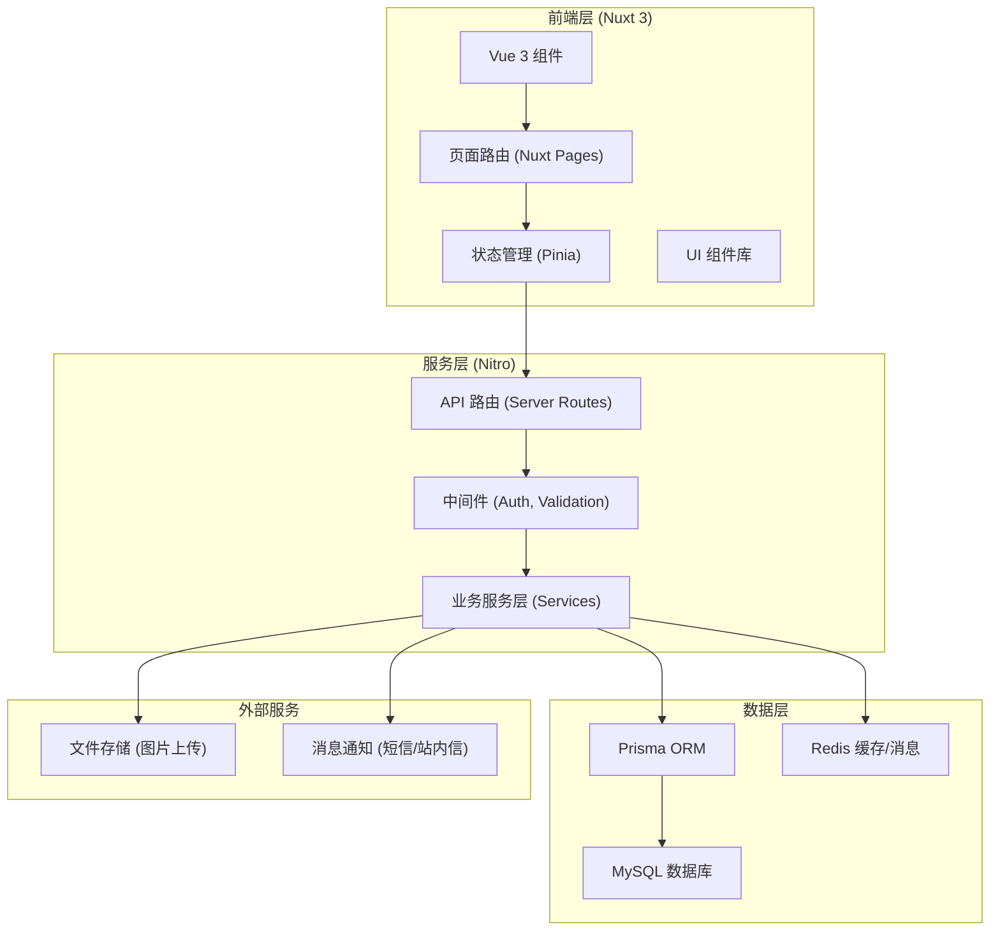
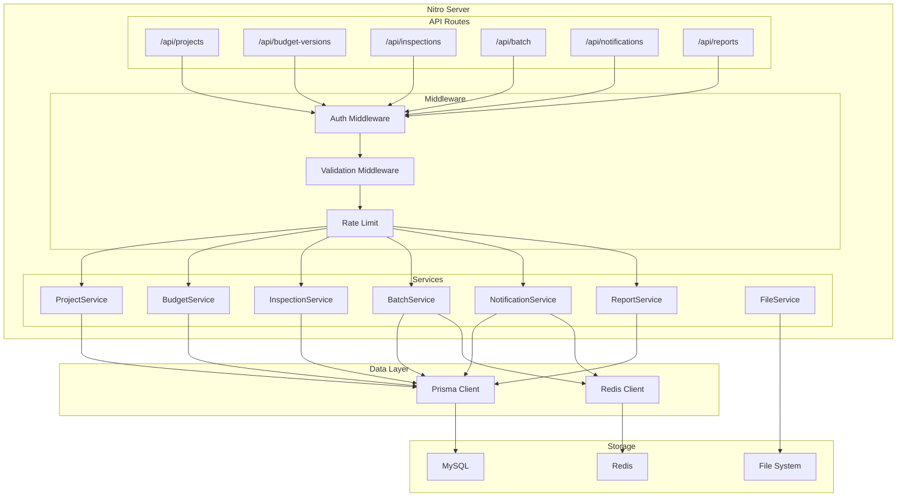
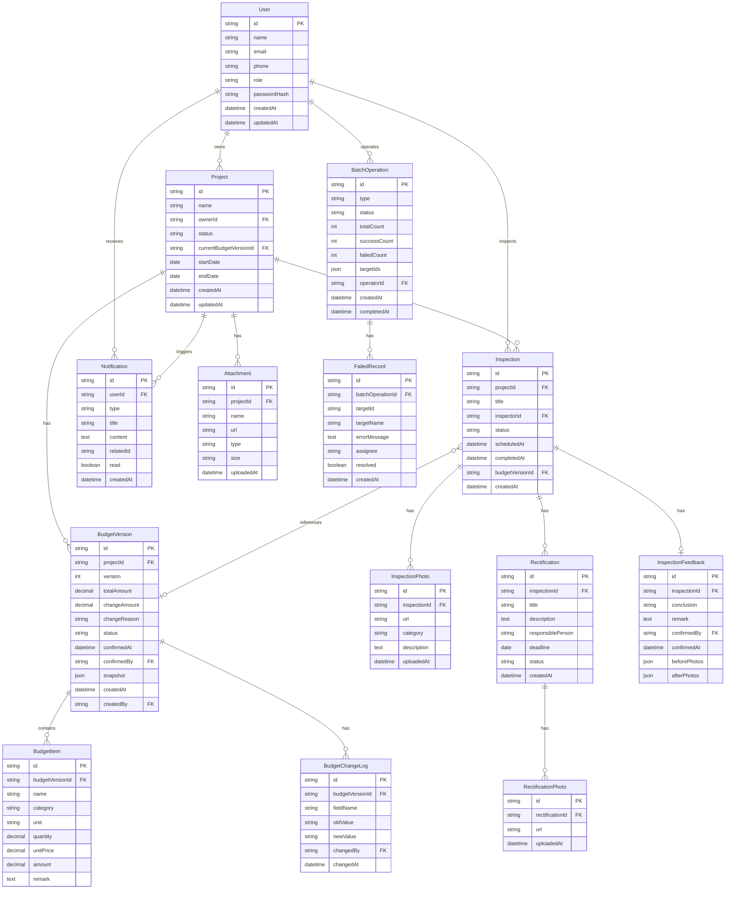

## 1. 架构设计



## 2. 技术描述

- **前端框架**：Nuxt 3.12 + Vue 3.4 + TypeScript 5.4
- **状态管理**：Pinia 2.1
- **UI 样式**：Tailwind CSS 3.4 + Headless UI
- **图标库**：Lucide Vue
- **服务端运行时**：Nitro 2.9（Nuxt 内置）
- **ORM**：Prisma 5.14
- **主数据库**：MySQL 8.0
- **缓存/消息**：Redis 7.0 + ioredis
- **文件上传**：本地存储（可扩展至 OSS）
- **构建工具**：Vite 5.2
- **包管理**：pnpm 9.0

## 3. 路由定义

| 路由路径 | 页面名称 | 权限要求 |
|----------|----------|----------|
| /dashboard | 项目总览 | 登录用户 |
| /projects | 项目列表 | 登录用户 |
| /projects/:id | 项目详情 | 项目相关人员 |
| /projects/:id/budget | 预算版本 | 项目经理/业主 |
| /inspections/:id | 巡检详情 | 项目相关人员 |
| /batch/operations | 批量操作 | 项目经理 |
| /reports | 报表中心 | 项目经理/客服 |
| /login | 登录页 | 公开 |

## 4. API 定义

### 4.1 项目相关

```typescript
interface Project {
  id: string
  name: string
  ownerId: string
  ownerName: string
  status: 'draft' | 'quoting' | 'in_progress' | 'completed' | 'cancelled'
  currentBudgetVersionId: string | null
  contractAttachments: Attachment[]
  startDate: string
  endDate: string
  createdAt: string
  updatedAt: string
}

interface ProjectListQuery {
  page: number
  pageSize: number
  status?: Project['status']
  keyword?: string
}

// GET /api/projects - 项目列表
// POST /api/projects - 创建项目
// GET /api/projects/:id - 项目详情
// PUT /api/projects/:id - 更新项目
```

### 4.2 预算版本相关

```typescript
interface BudgetVersion {
  id: string
  projectId: string
  version: number
  totalAmount: number
  changeAmount: number
  changeReason: string
  status: 'draft' | 'pending_confirm' | 'confirmed' | 'rejected'
  confirmedAt: string | null
  confirmedBy: string | null
  snapshot: BudgetSnapshot
  createdAt: string
  createdBy: string
}

interface BudgetSnapshot {
  items: BudgetItem[]
  attachments: Attachment[]
}

interface BudgetItem {
  id: string
  name: string
  category: string
  unit: string
  quantity: number
  unitPrice: number
  amount: number
  remark?: string
}

// GET /api/projects/:id/budget-versions - 预算版本列表
// POST /api/projects/:id/budget-versions - 创建新版本
// GET /api/budget-versions/:id - 版本详情
// POST /api/budget-versions/:id/confirm - 确认版本
// POST /api/budget-versions/:id/reject - 拒绝版本
// GET /api/budget-versions/compare?from=&to= - 版本对比
```

### 4.3 巡检相关

```typescript
interface Inspection {
  id: string
  projectId: string
  title: string
  inspectorId: string
  inspectorName: string
  status: 'pending' | 'in_progress' | 'completed' | 'rectifying'
  scheduledAt: string
  completedAt: string | null
  photos: InspectionPhoto[]
  rectifications: Rectification[]
  feedback: InspectionFeedback | null
  budgetVersionId: string | null
  createdAt: string
}

interface InspectionPhoto {
  id: string
  url: string
  category: string
  description?: string
  uploadedAt: string
}

interface Rectification {
  id: string
  inspectionId: string
  title: string
  description: string
  responsiblePerson: string
  deadline: string
  status: 'pending' | 'processing' | 'completed' | 'rechecked'
  photos: string[]
  createdAt: string
}

interface InspectionFeedback {
  id: string
  inspectionId: string
  conclusion: 'pass' | 'pass_with_rectification' | 'fail'
  remark: string
  confirmedBy: string
  confirmedAt: string
  beforePhotos: string[]
  afterPhotos: string[]
}

// GET /api/projects/:id/inspections - 巡检列表
// POST /api/projects/:id/inspections - 分派巡检
// GET /api/inspections/:id - 巡检详情
// PUT /api/inspections/:id - 更新巡检
// POST /api/inspections/:id/photos - 上传照片
// POST /api/inspections/:id/rectifications - 添加整改项
// POST /api/inspections/:id/feedback - 提交验收反馈
```

### 4.4 批量操作相关

```typescript
interface BatchOperation {
  id: string
  type: 'assign_inspection' | 'update_status' | 'notify_owner'
  status: 'preview' | 'executing' | 'completed' | 'partial_failed'
  totalCount: number
  successCount: number
  failedCount: number
  targetIds: string[]
  failedRecords: FailedRecord[]
  operatorId: string
  createdAt: string
  completedAt: string | null
}

interface FailedRecord {
  id: string
  targetId: string
  targetName: string
  errorMessage: string
  assignee: string
  resolved: boolean
}

// POST /api/batch/preview - 预览影响范围
// POST /api/batch/execute - 执行批量操作
// GET /api/batch/operations - 批量操作记录
// GET /api/batch/operations/:id - 操作详情
// POST /api/batch/failed/:id/reassign - 重新分配失败记录
```

### 4.5 通知与报表

```typescript
interface Notification {
  id: string
  userId: string
  type: 'budget_change' | 'delay_warning' | 'rectification_due'
  title: string
  content: string
  relatedId: string
  read: boolean
  createdAt: string
}

interface MonthlyReport {
  month: string
  totalProjects: number
  completedProjects: number
  delayedProjects: number
  totalBudgetChange: number
  closureRate: number
  avgRectificationDays: number
}

// GET /api/notifications - 通知列表
// POST /api/notifications/:id/read - 标记已读
// GET /api/reports/monthly - 月度报表
// GET /api/reports/closure - 售后闭环报表
```

## 5. 服务端架构图



## 6. 数据模型

### 6.1 ER 图



### 6.2 索引设计

- `Project.ownerId` - 业主查询项目列表
- `Project.status` - 按状态筛选项目
- `BudgetVersion.projectId, version` - 联合索引，版本查询
- `BudgetVersion.status` - 待确认版本筛选
- `Inspection.projectId` - 项目下巡检列表
- `Inspection.inspectorId` - 巡检人员任务列表
- `Inspection.status` - 状态筛选
- `Rectification.status` - 待处理整改项
- `Rectification.deadline` - 延期提醒
- `Notification.userId, read` - 未读通知查询
- `BatchOperation.operatorId` - 操作人历史
- `FailedRecord.assignee, resolved` - 负责人待处理

## 7. Redis 使用场景

1. **缓存层**：项目详情、预算版本、巡检详情等热点数据缓存
2. **会话管理**：用户登录态存储（JWT + Redis 黑名单）
3. **消息队列**：预算变更提醒、延期预警等异步通知
4. **分布式锁**：批量操作执行时的并发控制
5. **计数统计**：月度报表实时统计计数器
6. **限流**：API 接口调用频率限制
