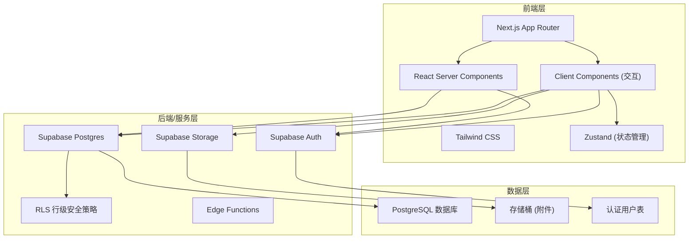
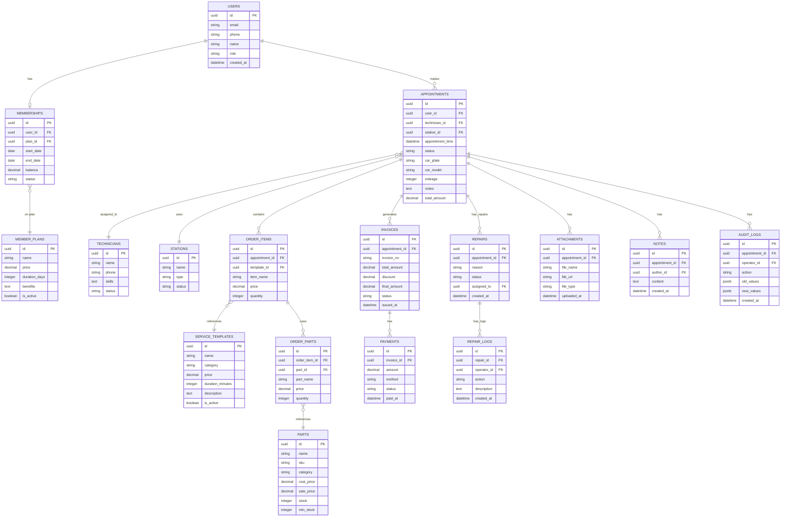

## 1. 架构设计



## 2. 技术描述

- **前端框架**：Next.js 14 (App Router) + React 18 + TypeScript
- **样式方案**：Tailwind CSS 3 + CSS Variables
- **状态管理**：Zustand
- **图标库**：Lucide React
- **后端服务**：Supabase (Auth + Postgres + Storage)
- **数据库**：PostgreSQL 15
- **文件存储**：Supabase Storage
- **认证方案**：Supabase Auth (邮箱 + 手机号)
- **部署方式**：Vercel (前端) + Supabase (后端)

## 3. 路由定义

| 路由路径 | 页面用途 | 角色权限 |
|----------|----------|----------|
| `/` | 用户端首页 | 公开 |
| `/services` | 检测项目列表 | 公开 |
| `/booking` | 预约页面 | 登录用户 |
| `/member` | 会员中心 | 登录用户 |
| `/admin` | 管理仪表盘 | 管理员/技师 |
| `/admin/technicians` | 技师工位管理 | 管理员 |
| `/admin/templates` | 检测模板维护 | 管理员 |
| `/admin/parts` | 配件管理 | 管理员 |
| `/admin/invoices` | 收银单管理 | 管理员 |
| `/admin/repairs` | 返修追踪 | 管理员/技师 |
| `/admin/reports` | 数据报表 | 管理员 |
| `/orders/[id]` | 检测处理详情 | 管理员/技师 |
| `/login` | 登录页 | 公开 |

## 4. 数据模型

### 4.1 ER 图



### 4.2 表结构说明

#### 核心业务表
- **users**: 用户表，扩展 Supabase auth.users，存储用户基本信息和角色
- **member_plans**: 会员套餐表，定义不同等级的会员套餐
- **memberships**: 会员记录表，用户的会员状态和余额
- **service_templates**: 检测项目模板，维护检测项目和价格
- **technicians**: 技师表，技师档案和技能
- **stations**: 工位表，工位配置和状态
- **parts**: 配件表，配件库存和价格管理
- **appointments**: 预约单，核心业务表
- **order_items**: 检测项目明细
- **order_parts**: 配件使用明细
- **invoices**: 收银单
- **payments**: 支付记录
- **repairs**: 返修工单
- **repair_logs**: 返修处理记录
- **attachments**: 附件表，存储检测照片等
- **notes**: 备注表
- **audit_logs**: 修改历史审计日志

### 4.3 RLS 安全策略

- 用户只能查看自己的预约和会员信息
- 技师可以查看分配给自己的预约单
- 管理员可以查看所有数据
- 所有表启用行级安全策略
- 使用 Supabase Auth 的 JWT 进行身份验证

## 5. 项目目录结构

```
.
├── app/                    # Next.js App Router
│   ├── (public)/          # 公开路由组
│   │   ├── page.tsx       # 首页
│   │   ├── services/      # 检测项目
│   │   ├── booking/       # 预约
│   │   └── login/         # 登录
│   ├── (member)/          # 会员路由组
│   │   └── member/        # 会员中心
│   ├── (admin)/           # 管理路由组
│   │   └── admin/         # 管理后台
│   ├── orders/            # 订单详情
│   └── api/               # API 路由
├── components/            # 通用组件
│   ├── ui/               # UI 基础组件
│   ├── layout/           # 布局组件
│   └── features/         # 业务组件
├── lib/                   # 工具库
│   ├── supabase.ts       # Supabase 客户端
│   ├── utils.ts          # 工具函数
│   └── types.ts          # 类型定义
├── hooks/                 # 自定义 Hooks
├── store/                 # Zustand 状态管理
├── styles/                # 全局样式
├── supabase/              # 数据库配置
│   ├── schema.sql        # 表结构
│   ├── seed.sql          # 种子数据
│   └── policies.sql      # RLS 策略
└── public/                # 静态资源
```

## 6. 核心技术决策

### 6.1 为什么选择 Next.js + Supabase
- **全栈能力**：Next.js 前后端一体，Supabase 提供完整后端服务
- **快速开发**：Supabase 开箱即用的 Auth、DB、Storage
- **类型安全**：TypeScript + Supabase 类型生成
- **部署简单**：Vercel + Supabase 托管

### 6.2 状态管理策略
- 服务端数据：优先使用 Server Components + 数据预取
- 客户端状态：Zustand 管理 UI 状态（侧边栏展开、筛选条件等）
- 表单状态：React Hook Form 本地管理

### 6.3 性能优化
- Server Components 减少客户端 JS
- 图片使用 next/image 优化
- 列表数据分页加载
- 数据库查询添加索引
