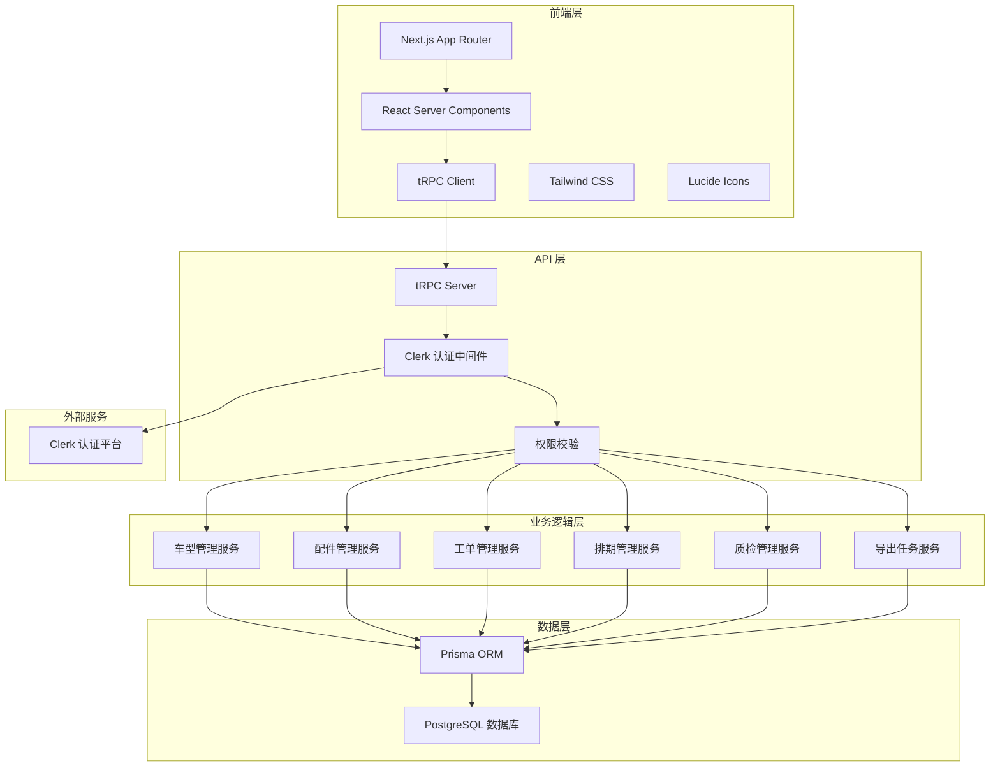
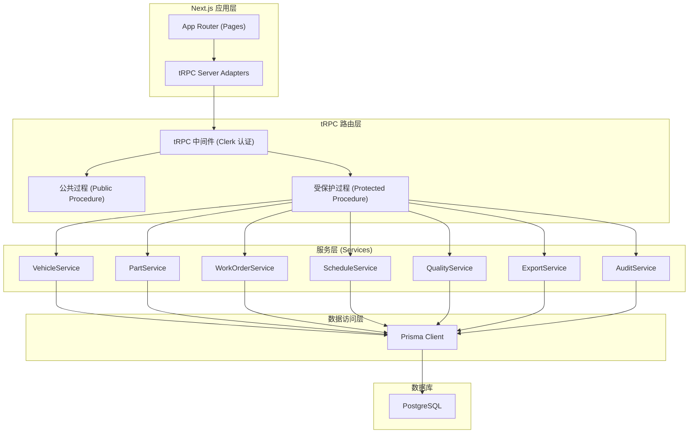
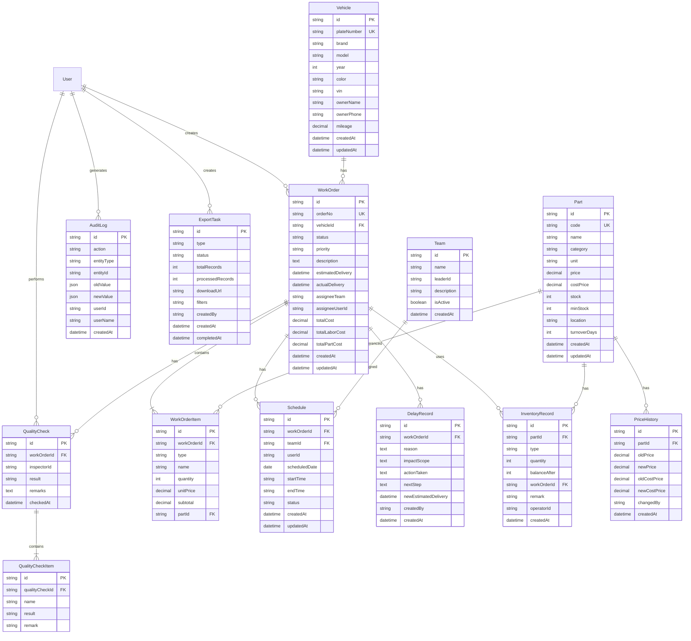

# 汽配门店业务一体化管理台 - 技术架构文档

## 1. 架构设计



## 2. 技术栈说明

| 层级 | 技术选型 | 版本 | 用途 |
|------|----------|------|------|
| 前端框架 | Next.js | 14.x | 全栈 React 框架，App Router |
| 前端语言 | TypeScript | 5.x | 类型安全 |
| 前端样式 | Tailwind CSS | 3.x | 原子化 CSS |
| 图标库 | lucide-react | 最新 | 线性图标 |
| API 框架 | tRPC | 10.x | 类型安全的 API 层 |
| ORM | Prisma | 5.x | 数据库访问层 |
| 数据库 | PostgreSQL | 15.x | 关系型数据库 |
| 认证 | Clerk | 最新 | 用户认证与管理 |
| 状态管理 | React Server Components | - | 服务端数据获取 |
| 包管理器 | pnpm | 最新 | 依赖管理 |

## 3. 路由定义

### 3.1 页面路由

| 路由路径 | 页面名称 | 说明 |
|----------|----------|------|
| `/` | 工作台首页 | 数据概览、快捷入口、今日排期 |
| `/vehicles` | 车辆列表 | 车型登记、车辆管理 |
| `/vehicles/[id]` | 车辆详情 | 车辆信息、维修历史 |
| `/vehicles/new` | 新增车辆 | 登记新车型 |
| `/workorders` | 工单列表 | 维修工单管理 |
| `/workorders/[id]` | 工单详情 | 工单信息、配件、质检 |
| `/workorders/new` | 新建工单 | 创建维修工单 |
| `/parts` | 配件列表 | 配件库存管理 |
| `/parts/[id]` | 配件详情 | 配件信息、周转统计 |
| `/schedule` | 班组排期 | 排期看板、工单分配 |
| `/quality` | 质检管理 | 质检记录、交付管理 |
| `/quality/delay` | 延期管理 | 延期工单、处理跟踪 |
| `/settings/basic` | 基础资料 | 价格、分类等基础数据 |
| `/settings/logs` | 操作日志 | 全量操作记录查询 |
| `/settings/exports` | 导出任务 | 导出任务列表与状态 |

### 3.2 tRPC API 路由

| 路由组 | 功能 |
|--------|------|
| `vehicle.*` | 车辆管理相关 API |
| `workOrder.*` | 工单管理相关 API |
| `part.*` | 配件管理相关 API |
| `inventory.*` | 库存出入库相关 API |
| `schedule.*` | 排期管理相关 API |
| `quality.*` | 质检管理相关 API |
| `delay.*` | 延期处理相关 API |
| `export.*` | 导出任务相关 API |
| `auditLog.*` | 操作日志相关 API |
| `stats.*` | 统计数据相关 API |

## 4. API 定义

### 4.1 核心数据类型

```typescript
// 车辆
interface Vehicle {
  id: string;
  plateNumber: string;
  brand: string;
  model: string;
  year: number;
  color: string;
  vin: string;
  ownerName: string;
  ownerPhone: string;
  mileage: number;
  createdAt: Date;
  updatedAt: Date;
}

// 配件
interface Part {
  id: string;
  code: string;
  name: string;
  category: string;
  unit: string;
  price: number;
  costPrice: number;
  stock: number;
  minStock: number;
  location: string;
  turnoverDays: number;
  createdAt: Date;
  updatedAt: Date;
}

// 工单
interface WorkOrder {
  id: string;
  orderNo: string;
  vehicleId: string;
  status: 'PENDING' | 'ASSIGNED' | 'IN_PROGRESS' | 'QUALITY_CHECK' | 'COMPLETED' | 'DELAYED';
  priority: 'LOW' | 'NORMAL' | 'HIGH' | 'URGENT';
  description: string;
  estimatedDelivery: Date;
  actualDelivery?: Date;
  assigneeTeam?: string;
  assigneeUserId?: string;
  totalCost: number;
  totalLaborCost: number;
  totalPartCost: number;
  createdAt: Date;
  updatedAt: Date;
}

// 工单项目
interface WorkOrderItem {
  id: string;
  workOrderId: string;
  type: 'SERVICE' | 'PART';
  name: string;
  quantity: number;
  unitPrice: number;
  subtotal: number;
  partId?: string;
}

// 排期
interface Schedule {
  id: string;
  workOrderId: string;
  teamId: string;
  userId?: string;
  scheduledDate: Date;
  startTime: string;
  endTime: string;
  status: 'SCHEDULED' | 'IN_PROGRESS' | 'COMPLETED';
}

// 质检记录
interface QualityCheck {
  id: string;
  workOrderId: string;
  inspectorId: string;
  result: 'PASSED' | 'FAILED' | 'PENDING';
  remarks: string;
  checkedAt: Date;
  items: QualityCheckItem[];
}

// 延期记录
interface DelayRecord {
  id: string;
  workOrderId: string;
  reason: string;
  impactScope: string;
  actionTaken: string;
  nextStep: string;
  newEstimatedDelivery: Date;
  createdBy: string;
  createdAt: Date;
}

// 导出任务
interface ExportTask {
  id: string;
  type: string;
  status: 'PENDING' | 'PROCESSING' | 'COMPLETED' | 'FAILED';
  totalRecords: number;
  processedRecords: number;
  downloadUrl?: string;
  createdBy: string;
  createdAt: Date;
  completedAt?: Date;
}

// 操作日志
interface AuditLog {
  id: string;
  action: string;
  entityType: string;
  entityId: string;
  oldValue?: Record<string, unknown>;
  newValue?: Record<string, unknown>;
  userId: string;
  userName: string;
  createdAt: Date;
}
```

### 4.2 主要 API 定义

```typescript
// 车辆
vehicle.list({ page, pageSize, keyword, brand }) => { data: Vehicle[], total: number }
vehicle.get({ id }) => Vehicle & { workOrders: WorkOrder[] }
vehicle.create({ input }) => Vehicle
vehicle.update({ id, input }) => Vehicle
vehicle.delete({ id }) => boolean

// 工单
workOrder.list({ page, pageSize, status, keyword, dateRange }) => { data: WorkOrder[], total: number }
workOrder.get({ id }) => WorkOrderDetail
workOrder.create({ input }) => WorkOrder
workOrder.updateStatus({ id, status }) => WorkOrder
workOrder.addItem({ workOrderId, item }) => WorkOrderItem
workOrder.removeItem({ itemId }) => boolean

// 配件
part.list({ page, pageSize, keyword, category, stockStatus }) => { data: Part[], total: number }
part.get({ id }) => PartDetail
part.create({ input }) => Part
part.update({ id, input }) => Part
part.updatePrice({ id, price, costPrice }) => Part

// 库存
inventory.inbound({ partId, quantity, remark }) => InventoryRecord
inventory.outbound({ partId, quantity, workOrderId, remark }) => InventoryRecord
inventory.transfer({ partId, fromLocation, toLocation, quantity }) => InventoryRecord

// 排期
schedule.listByDate({ date }) => Schedule[]
schedule.assign({ workOrderId, teamId, userId, scheduledDate }) => Schedule
schedule.update({ id, input }) => Schedule
schedule.delete({ id }) => boolean

// 质检
qualityCheck.create({ workOrderId, result, remarks, items }) => QualityCheck
qualityCheck.listByWorkOrder({ workOrderId }) => QualityCheck[]

// 延期
delayRecord.create({ workOrderId, reason, impactScope, actionTaken, nextStep, newEstimatedDelivery }) => DelayRecord
delayRecord.listByWorkOrder({ workOrderId }) => DelayRecord[]

// 导出
exportTask.create({ type, filters }) => ExportTask
exportTask.list() => ExportTask[]
exportTask.get({ id }) => ExportTask

// 统计
stats.dashboard() => DashboardStats
stats.turnover({ period }) => TurnoverStats[]
```

## 5. 服务器架构图



## 6. 数据模型

### 6.1 ER 图



### 6.2 关键索引说明

| 表名 | 索引字段 | 索引类型 | 用途 |
|------|----------|----------|------|
| Vehicle | plateNumber | UNIQUE | 车牌号唯一 |
| Vehicle | brand, model | INDEX | 品牌型号筛选 |
| WorkOrder | orderNo | UNIQUE | 工单号唯一 |
| WorkOrder | status | INDEX | 状态筛选 |
| WorkOrder | vehicleId | INDEX | 车辆工单查询 |
| WorkOrder | estimatedDelivery | INDEX | 交付日期排序 |
| Part | code | UNIQUE | 配件编码唯一 |
| Part | category | INDEX | 分类筛选 |
| Part | name | GIN | 名称搜索 |
| InventoryRecord | partId, createdAt | INDEX | 出入库记录查询 |
| Schedule | teamId, scheduledDate | INDEX | 班组排期查询 |
| Schedule | workOrderId | INDEX | 工单排期查询 |
| AuditLog | entityType, entityId | INDEX | 实体操作记录 |
| AuditLog | userId, createdAt | INDEX | 用户操作历史 |
| DelayRecord | workOrderId | INDEX | 工单延期记录 |

## 7. 项目目录结构

```
.
├── prisma/                    # Prisma 数据库
│   ├── schema.prisma         # 数据模型定义
│   └── seed.ts               # 种子数据
├── src/
│   ├── app/                   # Next.js App Router
│   │   ├── (dashboard)/      # 布局组
│   │   │   ├── layout.tsx
│   │   │   ├── page.tsx      # 工作台
│   │   │   ├── vehicles/
│   │   │   ├── workorders/
│   │   │   ├── parts/
│   │   │   ├── schedule/
│   │   │   ├── quality/
│   │   │   └── settings/
│   │   ├── api/              # API 路由
│   │   │   └── trpc/         # tRPC 端点
│   │   └── sign-in/          # Clerk 登录页
│   ├── server/               # 服务端代码
│   │   ├── api/              # tRPC 路由
│   │   │   ├── routers/      # 各模块路由
│   │   │   └── trpc.ts       # tRPC 实例
│   │   ├── services/         # 业务逻辑层
│   │   ├── db/               # 数据库连接
│   │   └── lib/              # 服务端工具
│   ├── components/           # React 组件
│   │   ├── ui/               # 基础 UI 组件
│   │   ├── layout/           # 布局组件
│   │   └── features/         # 业务组件
│   ├── hooks/                # 自定义 Hooks
│   ├── lib/                  # 前端工具
│   ├── store/                # 状态管理
│   └── types/                # 类型定义
├── public/                   # 静态资源
├── .env.example              # 环境变量示例
├── next.config.js            # Next.js 配置
├── tailwind.config.ts        # Tailwind 配置
├── tsconfig.json             # TypeScript 配置
└── package.json
```
