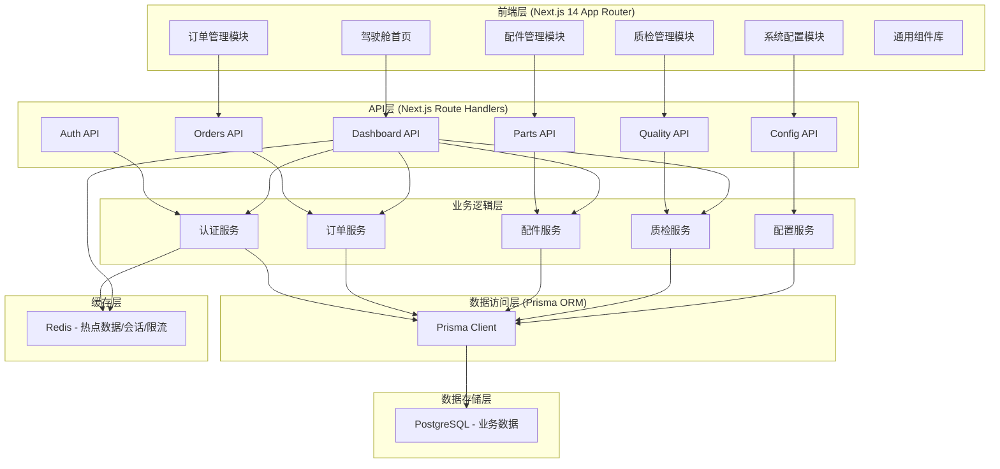
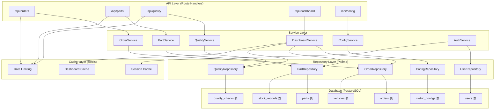
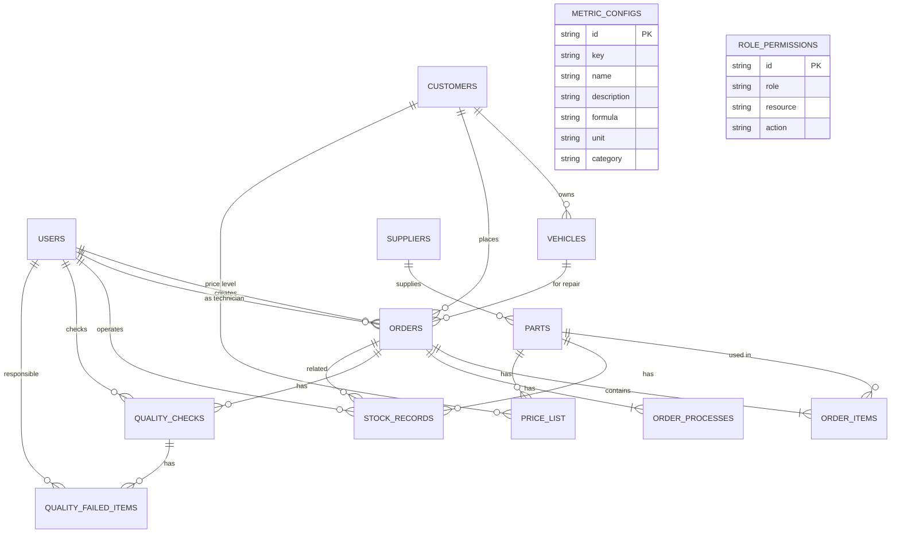

## 1. 架构设计



## 2. 技术描述

- **前端框架**：Next.js 14 (App Router) + React 18 + TypeScript
- **UI组件库**：TailwindCSS 3 + Radix UI (无样式组件) + lucide-react (图标)
- **图表库**：recharts (React图表组件)
- **状态管理**：React Context + Zustand (轻量状态管理)
- **表单处理**：react-hook-form + zod (验证)
- **后端**：Next.js Route Handlers (API Routes)
- **数据库**：PostgreSQL 15
- **ORM**：Prisma 5
- **缓存**：Redis 7 + ioredis
- **认证**：NextAuth.js (Auth.js) + JWT
- **权限**：基于角色的访问控制 (RBAC)
- **数据导出**：xlsx (Excel导出) + csv-writer
- **日期处理**：date-fns
- **代码规范**：ESLint + Prettier
- **包管理**：pnpm

## 3. 路由定义

| 路由 | 页面 | 权限要求 |
|------|------|----------|
| /login | 登录页 | 公开 |
| / | 驾驶舱首页 | 已登录 |
| /orders | 订单列表 | 前台/店长/技师 |
| /orders/new | 新建订单(车型+需求登记) | 前台/店长 |
| /orders/[id] | 订单详情 | 已登录 |
| /orders/[id]/process | 订单工艺 | 技师/店长 |
| /price-list | 客户价目表 | 前台/财务/店长 |
| /delivery | 交付日期追踪 | 前台/店长 |
| /parts | 配件列表 | 库管/店长 |
| /parts/new | 新增配件 | 库管/店长 |
| /parts/inventory | 库存周转 | 库管/店长/财务 |
| /parts/in-out | 出入库记录 | 库管/店长 |
| /quality | 质检列表 | 技师/店长 |
| /quality/[id] | 质检详情 | 已登录 |
| /quality/failed | 不合格记录 | 店长/技师 |
| /config/metrics | 指标口径配置 | 店长 |
| /config/permissions | 角色权限管理 | 店长 |
| /config/users | 用户管理 | 店长 |

### API路由

| 路由 | 方法 | 功能 |
|------|------|------|
| /api/auth/[...nextauth] | - | NextAuth认证端点 |
| /api/dashboard | GET | 获取驾驶舱数据 |
| /api/orders | GET/POST | 订单列表/创建 |
| /api/orders/[id] | GET/PUT/DELETE | 订单详情/更新/删除 |
| /api/orders/[id]/process | GET/PUT | 订单工艺 |
| /api/vehicles | GET/POST | 车型列表/登记 |
| /api/parts | GET/POST | 配件列表/新增 |
| /api/parts/[id] | GET/PUT | 配件详情/更新 |
| /api/parts/inventory | GET | 库存周转数据 |
| /api/parts/in-out | GET/POST | 出入库记录 |
| /api/parts/export | GET | 配件数据导出 |
| /api/quality | GET/POST | 质检列表/创建 |
| /api/quality/[id] | GET/PUT | 质检详情/更新 |
| /api/quality/failed | GET | 不合格记录 |
| /api/price-list | GET | 价目表查询 |
| /api/config/metrics | GET/PUT | 指标口径配置 |
| /api/config/permissions | GET/PUT | 角色权限配置 |
| /api/users | GET/POST | 用户列表/创建 |

## 4. API定义

### 类型定义

```typescript
// 用户与权限
interface User {
  id: string;
  name: string;
  email: string;
  role: 'admin' | 'reception' | 'technician' | 'storekeeper' | 'accountant';
  avatar?: string;
  createdAt: Date;
}

// 车型
interface Vehicle {
  id: string;
  plateNumber: string;
  brand: string;
  model: string;
  vin: string;
  mileage: number;
  customerId: string;
  customer: Customer;
  createdAt: Date;
}

// 客户
interface Customer {
  id: string;
  name: string;
  phone: string;
  type: 'retail' | 'enterprise' | 'vip';
  priceLevel: number;
  createdAt: Date;
}

// 订单
interface Order {
  id: string;
  orderNo: string;
  customerId: string;
  vehicleId: string;
  status: 'pending' | 'in_progress' | 'quality_check' | 'completed' | 'cancelled';
  repairType: string;
  faultDescription: string;
  estimatedDelivery: Date;
  actualDelivery?: Date;
  totalAmount: number;
  technicianId?: string;
  createdBy: string;
  createdAt: Date;
  items: OrderItem[];
  processes: OrderProcess[];
}

// 订单项
interface OrderItem {
  id: string;
  orderId: string;
  type: 'part' | 'service';
  name: string;
  partId?: string;
  quantity: number;
  unitPrice: number;
  amount: number;
}

// 订单工艺
interface OrderProcess {
  id: string;
  orderId: string;
  step: number;
  name: string;
  description: string;
  status: 'pending' | 'in_progress' | 'completed';
  technicianId?: string;
  startedAt?: Date;
  completedAt?: Date;
}

// 配件
interface Part {
  id: string;
  sku: string;
  name: string;
  category: string;
  brand: string;
  spec: string;
  unit: string;
  costPrice: number;
  salePrice: number;
  stock: number;
  minStock: number;
  maxStock: number;
  supplierId: string;
  createdAt: Date;
}

// 出入库记录
interface StockRecord {
  id: string;
  partId: string;
  type: 'in' | 'out' | 'adjust' | 'check';
  quantity: number;
  beforeStock: number;
  afterStock: number;
  relatedOrderId?: string;
  remark?: string;
  operatorId: string;
  createdAt: Date;
}

// 质检记录
interface QualityCheck {
  id: string;
  orderId: string;
  result: 'passed' | 'failed';
  checkedBy: string;
  checkedAt: Date;
  remark?: string;
  failedItems?: QualityFailedItem[];
}

// 质检不合格项
interface QualityFailedItem {
  id: string;
  qualityCheckId: string;
  name: string;
  description: string;
  impactScope: string;
  severity: 'low' | 'medium' | 'high';
  action: string;
  nextStep: string;
  responsibleId: string;
  deadline: Date;
  status: 'pending' | 'processing' | 'resolved';
}

// 指标配置
interface MetricConfig {
  id: string;
  key: string;
  name: string;
  description: string;
  formula: string;
  unit: string;
  category: string;
  updatedAt: Date;
}

// 价目表
interface PriceItem {
  id: string;
  partId?: string;
  serviceName?: string;
  priceLevel: number;
  price: number;
  effectiveDate: Date;
}

// 驾驶舱数据
interface DashboardData {
  todayRevenue: number;
  todayOrders: number;
  partTurnoverRate: number;
  qualityPassRate: number;
  pendingOrders: number;
  lowStockAlerts: number;
  deliveryAlerts: number;
  revenueTrend: ChartData[];
  orderTrend: ChartData[];
  turnoverTrend: ChartData[];
}
```

## 5. 服务架构图



## 6. 数据模型

### 6.1 数据模型定义 (ER图)



### 6.2 数据定义语言 (Prisma Schema)

```prisma
// 用户
model User {
  id            String    @id @default(cuid())
  name          String
  email         String    @unique
  passwordHash  String
  role          Role
  avatar        String?
  createdAt     DateTime  @default(now())
  updatedAt     DateTime  @updatedAt
  
  createdOrders     Order[]   @relation("OrderCreator")
  technicianOrders  Order[]   @relation("OrderTechnician")
  stockRecords      StockRecord[]
  qualityChecks     QualityCheck[]
  responsibleItems  QualityFailedItem[]
}

enum Role {
  admin
  reception
  technician
  storekeeper
  accountant
}

// 客户
model Customer {
  id          String    @id @default(cuid())
  name        String
  phone       String
  type        CustomerType
  priceLevel  Int
  createdAt   DateTime  @default(now())
  
  vehicles  Vehicle[]
  orders    Order[]
}

enum CustomerType {
  retail
  enterprise
  vip
}

// 车辆
model Vehicle {
  id          String    @id @default(cuid())
  plateNumber String
  brand       String
  model       String
  vin         String
  mileage     Int
  customerId  String
  customer    Customer  @relation(fields: [customerId], references: [id])
  createdAt   DateTime  @default(now())
  
  orders  Order[]
}

// 订单
model Order {
  id                  String        @id @default(cuid())
  orderNo             String        @unique
  customerId          String
  vehicleId           String
  status              OrderStatus
  repairType          String
  faultDescription    String
  estimatedDelivery   DateTime
  actualDelivery      DateTime?
  totalAmount         Decimal
  technicianId        String?
  createdBy           String
  createdAt           DateTime      @default(now())
  updatedAt           DateTime      @updatedAt
  
  customer    Customer          @relation(fields: [customerId], references: [id])
  vehicle     Vehicle           @relation(fields: [vehicleId], references: [id])
  technician  User?             @relation("OrderTechnician", fields: [technicianId], references: [id])
  creator     User              @relation("OrderCreator", fields: [createdBy], references: [id])
  items       OrderItem[]
  processes   OrderProcess[]
  qualityChecks QualityCheck[]
  stockRecords StockRecord[]
}

enum OrderStatus {
  pending
  in_progress
  quality_check
  completed
  cancelled
}

// 订单项
model OrderItem {
  id        String   @id @default(cuid())
  orderId   String
  type      ItemType
  name      String
  partId    String?
  quantity  Int
  unitPrice Decimal
  amount    Decimal
  
  order  Order  @relation(fields: [orderId], references: [id])
  part   Part?  @relation(fields: [partId], references: [id])
}

enum ItemType {
  part
  service
}

// 订单工艺
model OrderProcess {
  id             String   @id @default(cuid())
  orderId        String
  step           Int
  name           String
  description    String?
  status         ProcessStatus
  technicianId   String?
  startedAt      DateTime?
  completedAt    DateTime?
  
  order       Order  @relation(fields: [orderId], references: [id])
  technician  User?  @relation(fields: [technicianId], references: [id])
}

enum ProcessStatus {
  pending
  in_progress
  completed
}

// 供应商
model Supplier {
  id        String   @id @default(cuid())
  name      String
  contact   String
  phone     String
  address   String?
  createdAt DateTime @default(now())
  
  parts  Part[]
}

// 配件
model Part {
  id        String   @id @default(cuid())
  sku       String   @unique
  name      String
  category  String
  brand     String
  spec      String
  unit      String
  costPrice Decimal
  salePrice Decimal
  stock     Int
  minStock  Int
  maxStock  Int
  supplierId String
  createdAt DateTime @default(now())
  updatedAt DateTime @updatedAt
  
  supplier      Supplier       @relation(fields: [supplierId], references: [id])
  orderItems    OrderItem[]
  stockRecords  StockRecord[]
  priceList     PriceList[]
}

// 库存记录
model StockRecord {
  id          String      @id @default(cuid())
  partId      String
  type        StockType
  quantity    Int
  beforeStock Int
  afterStock  Int
  orderId     String?
  remark      String?
  operatorId  String
  createdAt   DateTime    @default(now())
  
  part      Part    @relation(fields: [partId], references: [id])
  order     Order?  @relation(fields: [orderId], references: [id])
  operator  User    @relation(fields: [operatorId], references: [id])
}

enum StockType {
  in
  out
  adjust
  check
}

// 价目表
model PriceList {
  id            String   @id @default(cuid())
  partId        String?
  serviceName   String?
  priceLevel    Int
  price         Decimal
  effectiveDate DateTime
  createdAt     DateTime @default(now())
  
  part  Part?  @relation(fields: [partId], references: [id])
}

// 质检记录
model QualityCheck {
  id         String   @id @default(cuid())
  orderId    String
  result     CheckResult
  checkedBy  String
  checkedAt  DateTime @default(now())
  remark     String?
  
  order       Order               @relation(fields: [orderId], references: [id])
  inspector   User                @relation(fields: [checkedBy], references: [id])
  failedItems QualityFailedItem[]
}

enum CheckResult {
  passed
  failed
}

// 质检不合格项
model QualityFailedItem {
  id              String           @id @default(cuid())
  qualityCheckId  String
  name            String
  description     String
  impactScope     String
  severity        SeverityLevel
  action          String
  nextStep        String
  responsibleId   String
  deadline        DateTime
  status          FailedItemStatus
  createdAt       DateTime         @default(now())
  updatedAt       DateTime         @updatedAt
  
  qualityCheck  QualityCheck  @relation(fields: [qualityCheckId], references: [id])
  responsible   User          @relation(fields: [responsibleId], references: [id])
}

enum SeverityLevel {
  low
  medium
  high
}

enum FailedItemStatus {
  pending
  processing
  resolved
}

// 指标配置
model MetricConfig {
  id          String   @id @default(cuid())
  key         String   @unique
  name        String
  description String?
  formula     String
  unit        String
  category    String
  updatedAt   DateTime @updatedAt
}

// 角色权限
model RolePermission {
  id        String   @id @default(cuid())
  role      Role
  resource  String
  action    String
  createdAt DateTime @default(now())
  
  @@unique([role, resource, action])
}
```

## 7. Redis缓存策略

| 缓存键 | 数据类型 | 过期时间 | 用途 |
|-------|----------|----------|------|
| session:{token} | string | 24h | 用户会话 |
| dashboard:data | hash | 5min | 驾驶舱汇总数据 |
| part:hot:{id} | string | 1h | 热门配件信息 |
| order:list:{page} | list | 2min | 订单列表分页缓存 |
| rate_limit:{ip} | string | 1min | 接口限流计数 |
| stock:alert | set | 5min | 库存预警集合 |
| metric:config | hash | 1h | 指标配置缓存 |
