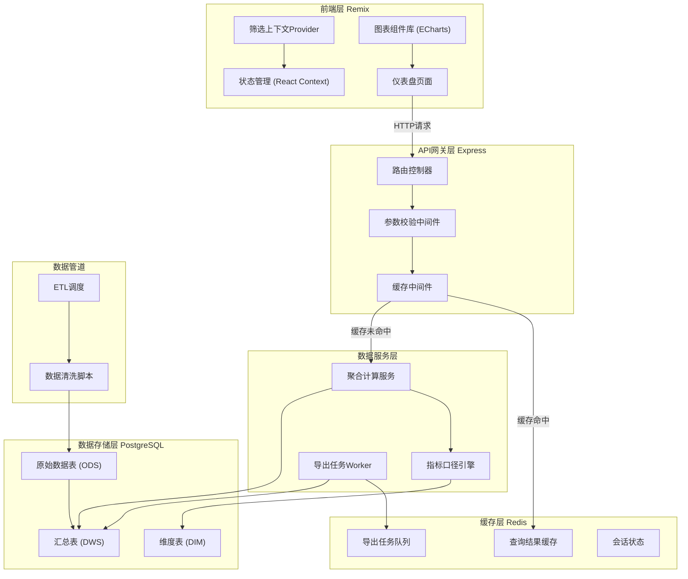
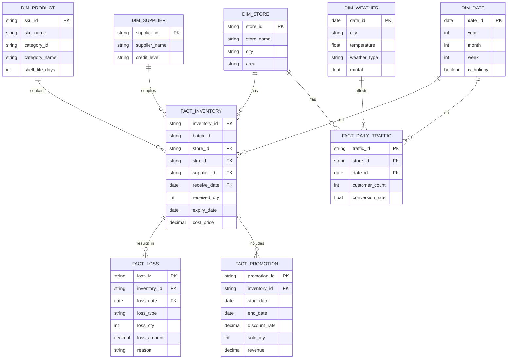

## 1. 总体架构设计



## 2. 技术选型说明

| 层级 | 技术栈 | 版本 | 用途说明 |
|------|--------|------|----------|
| 前端 | Remix | ^2.8.0 | 全栈React框架，支持服务端渲染和数据加载 |
| 前端 | React | ^18.2.0 | UI组件库基础 |
| 前端 | TypeScript | ^5.4.0 | 类型安全 |
| 前端 | ECharts | ^5.5.0 | 数据可视化图表 |
| 前端 | TailwindCSS | ^3.4.0 | 原子化CSS框架 |
| 后端 | Express | ^4.18.0 | API服务器 |
| 缓存 | Redis | ^7.2.0 | 查询缓存、任务队列 |
| 数据库 | PostgreSQL | ^16.0 | 主数据存储 |
| ORM | Prisma | ^5.12.0 | 数据库访问层 |
| 导出 | exceljs | ^4.4.0 | Excel文件生成 |
| 任务队列 | BullMQ | ^5.6.0 | 异步导出任务 |

## 3. 项目目录结构

```
.
├── app/                    # Remix 前端应用
│   ├── routes/             # 路由页面
│   ├── components/         # React组件
│   ├── contexts/           # 上下文（筛选状态等）
│   ├── utils/              # 工具函数
│   └── types/              # TypeScript类型定义
├── server/                 # Express 后端服务
│   ├── controllers/        # 控制器
│   ├── services/           # 业务逻辑服务
│   ├── middlewares/        # 中间件
│   ├── routes/             # API路由
│   └── workers/            # 后台任务Worker
├── prisma/                 # Prisma ORM
│   ├── schema.prisma       # 数据模型定义
│   └── seed.ts             # 模拟数据生成
├── scripts/                # 数据脚本
│   ├── clean/              # 数据清洗脚本
│   ├── etl/                # ETL脚本
│   └── metrics/            # 指标口径定义
├── public/                 # 静态资源
└── .trae/documents/        # 项目文档
```

## 4. 路由定义

### 4.1 前端路由

| 路由 | 页面 | 说明 |
|------|------|------|
| / | 主仪表盘 | 异常摘要 + 核心视图 |
| /batch/:id | 批次详情 | 单批次全链路追踪 |
| /export | 导出中心 | 查看和下载导出任务 |

### 4.2 API路由

| 方法 | 路径 | 说明 |
|------|------|------|
| GET | /api/overview | 获取异常摘要数据 |
| GET | /api/funnel | 获取临期漏斗数据 |
| GET | /api/pareto | 获取损耗Pareto数据 |
| GET | /api/promotion | 获取促销对比数据 |
| GET | /api/suppliers | 获取供应商排行数据 |
| GET | /api/filters | 获取筛选维度选项 |
| POST | /api/export | 提交导出任务 |
| GET | /api/export/:id | 查询导出任务状态 |

## 5. API接口定义

### 5.1 通用筛选参数

```typescript
interface FilterParams {
  storeIds?: string[];       // 门店ID列表
  categoryIds?: string[];    // 品类ID列表
  supplierIds?: string[];    // 供应商ID列表
  batchIds?: string[];       // 批次ID列表
  startDate: string;         // 开始日期 YYYY-MM-DD
  endDate: string;           // 结束日期 YYYY-MM-DD
}
```

### 5.2 异常摘要响应

```typescript
interface OverviewResponse {
  anomalies: {
    id: string;
    type: 'high_loss' | 'near_expiry' | 'poor_promotion' | 'weather_impact' | 'low_traffic';
    title: string;
    description: string;
    severity: 'high' | 'medium' | 'low';
    metric: {
      value: number;
      unit: string;
      change: number;         // 同比变化率
    };
    filterContext: Partial<FilterParams>;
  }[];
  summary: {
    totalLoss: number;
    lossRate: number;
    nearExpiryCount: number;
    promotionEffectiveness: number;
  };
}
```

### 5.3 临期漏斗响应

```typescript
interface FunnelStage {
  stage: 'received' | 'sellable' | 'near_expiry' | 'promotion' | 'written_off' | 'returned';
  name: string;
  quantity: number;
  amount: number;
  conversionRate: number;
  batches: {
    batchId: string;
    skuId: string;
    skuName: string;
    quantity: number;
    expiryDate: string;
  }[];
}

interface FunnelResponse {
  stages: FunnelStage[];
  totalBatches: number;
}
```

## 6. 数据模型设计

### 6.1 ER图



### 6.2 核心约束

- **批次独立性**：`FACT_INVENTORY` 中 `batch_id` + `sku_id` + `store_id` 构成唯一键，确保不同批次同SKU不合并
- **分区策略**：所有事实表按日期分区，提升查询性能
- **索引设计**：针对常用筛选维度（门店、品类、供应商、批次、日期）建立复合索引

### 6.3 DDL 示例

```sql
-- 批次库存事实表（核心）
CREATE TABLE fact_inventory (
    inventory_id UUID PRIMARY KEY DEFAULT gen_random_uuid(),
    batch_id VARCHAR(50) NOT NULL,
    store_id VARCHAR(20) NOT NULL,
    sku_id VARCHAR(50) NOT NULL,
    supplier_id VARCHAR(20) NOT NULL,
    receive_date DATE NOT NULL,
    received_qty INT NOT NULL,
    expiry_date DATE NOT NULL,
    cost_price DECIMAL(10,2) NOT NULL,
    created_at TIMESTAMP DEFAULT CURRENT_TIMESTAMP,
    UNIQUE(batch_id, sku_id, store_id)
);

CREATE INDEX idx_inventory_filters ON fact_inventory(store_id, sku_id, supplier_id, receive_date);
CREATE INDEX idx_inventory_expiry ON fact_inventory(expiry_date);

-- 汇总表：预聚合提升查询速度
CREATE TABLE dws_daily_loss_summary (
    summary_date DATE,
    store_id VARCHAR(20),
    category_id VARCHAR(20),
    supplier_id VARCHAR(20),
    total_received_qty INT,
    total_loss_qty INT,
    total_loss_amount DECIMAL(12,2),
    loss_rate DECIMAL(5,4),
    PRIMARY KEY (summary_date, store_id, category_id, supplier_id)
);
```

## 7. 缓存策略

| 缓存类型 | Key格式 | TTL | 说明 |
|----------|---------|-----|------|
| 查询结果 | `api:{endpoint}:{hash(filters)}` | 15分钟 | 聚合API结果缓存 |
| 维度选项 | `dim:{type}` | 24小时 | 门店、品类、供应商等维度选项 |
| 导出任务 | `export:{taskId}` | 7天 | 导出任务状态和文件链接 |
| 热门指标 | `metrics:{date}` | 1小时 | 核心KPI指标 |

缓存失效策略：
- ETL任务完成后主动失效相关缓存
- 筛选条件变化时生成新的缓存Key
- 使用Redis Hash结构存储同一API不同参数的结果

## 8. 指标口径定义

| 指标名称 | 计算公式 | 数据来源 |
|----------|----------|----------|
| 损耗率 | 损耗数量 / 入库数量 × 100% | FACT_LOSS / FACT_INVENTORY |
| 临期率 | 临期库存数量 / 总可售数量 × 100% | FACT_INVENTORY (按保质期过滤) |
| 促销消化率 | 促销期间销量 / 促销前库存数量 × 100% | FACT_PROMOTION / FACT_INVENTORY |
| 批次周转天数 | (当前日期 - 入库日期) / (入库数量 - 当前库存) | FACT_INVENTORY |
| 供应商损耗率 | 该供应商所有批次总损耗 / 总入库 × 100% | 按供应商聚合 |
