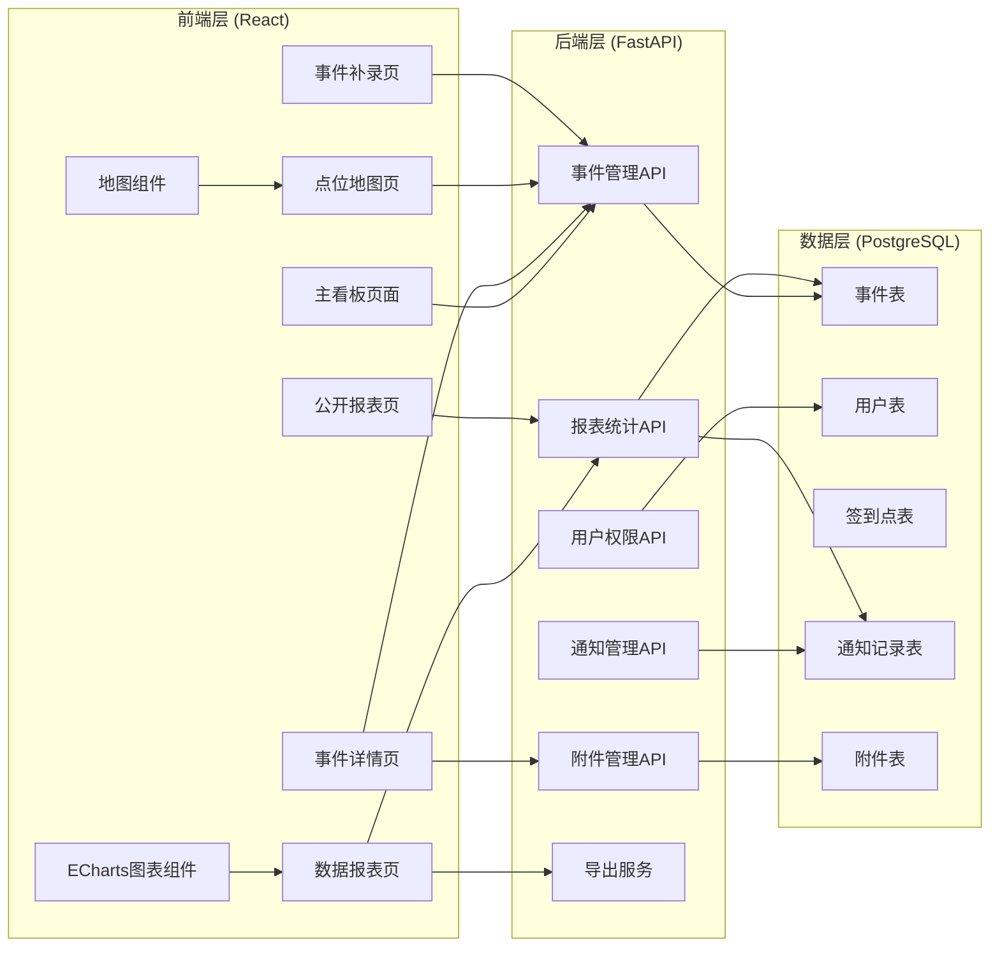
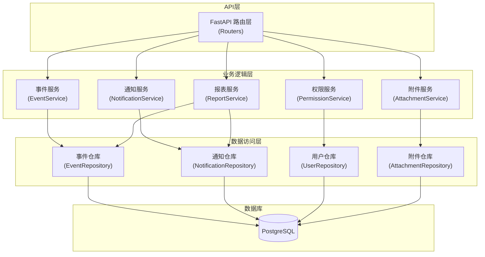
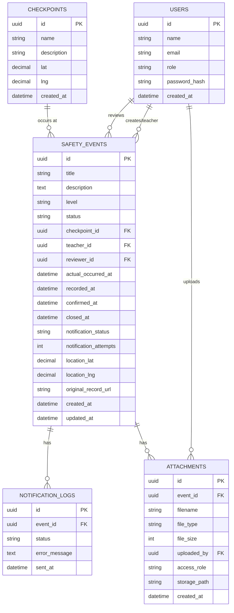

## 1. 架构设计



## 2. 技术描述

- **前端**: React@18 + TypeScript + Vite + TailwindCSS@3 + ECharts@5 + React Router@6
- **状态管理**: React Context + useReducer (轻量级状态管理)
- **地图**: Leaflet + OpenStreetMap (免费地图服务)
- **后端**: FastAPI@0.104 + Python@3.11 + SQLAlchemy@2.0 + Pydantic@2
- **数据库**: PostgreSQL@15 + psycopg2-binary
- **认证**: JWT Token认证
- **文件存储**: 本地文件系统存储
- **导出**: 后端生成Excel/PDF，前端触发下载

## 3. 路由定义

### 前端路由
| 路由 | 页面 | 权限要求 |
|-------|---------|----------|
| /dashboard | 主看板(时间线) | 项目负责人/带队老师 |
| /event/:id | 事件详情 | 项目负责人/带队老师(仅自己的) |
| /map | 点位地图 | 项目负责人 |
| /reports | 数据报表 | 项目负责人 |
| /event/new | 事件补录 | 带队老师 |
| /public | 公开报表 | 公开访问 |
| /login | 登录页 | 公开访问 |

### 后端API路由
| 方法 | 路由 | 功能 | 权限 |
|------|------|------|------|
| POST | /api/auth/login | 用户登录 | 公开 |
| GET | /api/events | 获取事件列表(支持筛选) | 已认证 |
| GET | /api/events/:id | 获取事件详情 | 已认证 |
| POST | /api/events | 创建事件(补录) | 带队老师 |
| PUT | /api/events/:id | 更新事件 | 项目负责人 |
| GET | /api/events/:id/original | 获取原始记录 | 已认证 |
| GET | /api/notifications/pending | 获取待补发通知列表 | 项目负责人 |
| POST | /api/notifications/:id/resend | 补发通知 | 项目负责人 |
| GET | /api/reports/notification-rate | 通知完成率统计 | 已认证 |
| GET | /api/reports/event-status | 事件状态口径统计 | 已认证 |
| GET | /api/reports/handle-duration | 处理耗时聚合统计 | 已认证 |
| GET | /api/reports/public | 公开聚合数据 | 公开 |
| GET | /api/reports/export | 导出报告(匿名/完整) | 已认证 |
| GET | /api/checkpoints | 获取签到点列表 | 已认证 |
| POST | /api/events/:id/attachments | 上传附件 | 已认证 |
| GET | /api/attachments/:id | 下载附件(权限控制) | 已认证 |

## 4. API定义

### 4.1 类型定义

```typescript
// 用户类型
interface User {
  id: string;
  name: string;
  role: 'project_manager' | 'teacher' | 'public';
  email: string;
}

// 事件等级
type EventLevel = 'low' | 'medium' | 'high' | 'critical';

// 事件状态
type EventStatus = 'unconfirmed' | 'processing' | 'closed';

// 通知状态
type NotificationStatus = 'pending' | 'success' | 'failed';

// 事件
interface SafetyEvent {
  id: string;
  title: string;
  description: string;
  level: EventLevel;
  status: EventStatus;
  checkpoint_id: string;
  checkpoint_name: string;
  teacher_id: string;
  teacher_name: string;
  reviewer_id: string | null;
  reviewer_name: string | null;
  actual_occurred_at: string;  // 真实发生时间
  recorded_at: string;         // 补录时间
  confirmed_at: string | null;
  closed_at: string | null;
  notification_status: NotificationStatus;
  notification_attempts: number;
  handle_duration_minutes: number | null;  // 基于真实发生时间计算
  location_lat: number;
  location_lng: number;
  original_record_url: string;
  created_at: string;
  updated_at: string;
}

// 签到点
interface Checkpoint {
  id: string;
  name: string;
  description: string;
  lat: number;
  lng: number;
}

// 附件
interface Attachment {
  id: string;
  event_id: string;
  filename: string;
  file_type: string;
  file_size: number;
  uploaded_by: string;
  access_role: 'project_manager' | 'teacher' | 'all';
  created_at: string;
}

// 统计数据
interface NotificationRate {
  total: number;
  success: number;
  failed: number;
  rate: number;
  by_level: Record<EventLevel, { total: number; success: number; rate: number }>;
}

interface EventStatusStats {
  unconfirmed: number;
  processing: number;
  closed: number;
  by_level: Record<EventLevel, { unconfirmed: number; processing: number; closed: number }>;
}

interface HandleDurationStats {
  overall_avg_minutes: number;
  by_level: Record<EventLevel, { count: number; avg_minutes: number; median_minutes: number }>;
  by_date: Array<{ date: string; avg_minutes: number; count: number }>;
}
```

### 4.2 请求/响应示例

```typescript
// POST /api/events (补录事件)
// Request
interface CreateEventRequest {
  title: string;
  description: string;
  level: EventLevel;
  checkpoint_id: string;
  actual_occurred_at: string;  // 必须手动填写真实发生时间
  location_lat: number;
  location_lng: number;
  original_record_url: string;
}

// Response
interface CreateEventResponse {
  event: SafetyEvent;
  recorded_at: string;  // 系统自动记录补录时间
}

// GET /api/reports/handle-duration
// Response: 处理耗时聚合，全部基于 actual_occurred_at 计算
interface HandleDurationResponse extends HandleDurationStats {}
```

## 5. 服务器架构图



## 6. 数据模型

### 6.1 ER图



### 6.2 DDL语句

```sql
-- 创建枚举类型
CREATE TYPE user_role AS ENUM ('project_manager', 'teacher');
CREATE TYPE event_level AS ENUM ('low', 'medium', 'high', 'critical');
CREATE TYPE event_status AS ENUM ('unconfirmed', 'processing', 'closed');
CREATE TYPE notification_status AS ENUM ('pending', 'success', 'failed');
CREATE TYPE attachment_access_role AS ENUM ('project_manager', 'teacher', 'all');

-- 用户表
CREATE TABLE users (
    id UUID PRIMARY KEY DEFAULT gen_random_uuid(),
    name VARCHAR(100) NOT NULL,
    email VARCHAR(255) UNIQUE NOT NULL,
    role user_role NOT NULL,
    password_hash VARCHAR(255) NOT NULL,
    created_at TIMESTAMP WITH TIME ZONE DEFAULT CURRENT_TIMESTAMP
);

-- 签到点表
CREATE TABLE checkpoints (
    id UUID PRIMARY KEY DEFAULT gen_random_uuid(),
    name VARCHAR(100) NOT NULL,
    description TEXT,
    lat DECIMAL(10, 8) NOT NULL,
    lng DECIMAL(11, 8) NOT NULL,
    created_at TIMESTAMP WITH TIME ZONE DEFAULT CURRENT_TIMESTAMP
);

-- 事件表
CREATE TABLE safety_events (
    id UUID PRIMARY KEY DEFAULT gen_random_uuid(),
    title VARCHAR(255) NOT NULL,
    description TEXT NOT NULL,
    level event_level NOT NULL,
    status event_status NOT NULL DEFAULT 'unconfirmed',
    checkpoint_id UUID REFERENCES checkpoints(id),
    teacher_id UUID REFERENCES users(id),
    reviewer_id UUID REFERENCES users(id),
    actual_occurred_at TIMESTAMP WITH TIME ZONE NOT NULL,
    recorded_at TIMESTAMP WITH TIME ZONE NOT NULL DEFAULT CURRENT_TIMESTAMP,
    confirmed_at TIMESTAMP WITH TIME ZONE,
    closed_at TIMESTAMP WITH TIME ZONE,
    notification_status notification_status NOT NULL DEFAULT 'pending',
    notification_attempts INTEGER NOT NULL DEFAULT 0,
    location_lat DECIMAL(10, 8),
    location_lng DECIMAL(11, 8),
    original_record_url VARCHAR(500),
    created_at TIMESTAMP WITH TIME ZONE DEFAULT CURRENT_TIMESTAMP,
    updated_at TIMESTAMP WITH TIME ZONE DEFAULT CURRENT_TIMESTAMP
);

-- 创建索引
CREATE INDEX idx_events_status ON safety_events(status);
CREATE INDEX idx_events_level ON safety_events(level);
CREATE INDEX idx_events_actual_occurred_at ON safety_events(actual_occurred_at DESC);
CREATE INDEX idx_events_notification_status ON safety_events(notification_status);
CREATE INDEX idx_events_teacher_id ON safety_events(teacher_id);

-- 通知日志表
CREATE TABLE notification_logs (
    id UUID PRIMARY KEY DEFAULT gen_random_uuid(),
    event_id UUID REFERENCES safety_events(id) ON DELETE CASCADE,
    status notification_status NOT NULL,
    error_message TEXT,
    sent_at TIMESTAMP WITH TIME ZONE DEFAULT CURRENT_TIMESTAMP
);

-- 附件表
CREATE TABLE attachments (
    id UUID PRIMARY KEY DEFAULT gen_random_uuid(),
    event_id UUID REFERENCES safety_events(id) ON DELETE CASCADE,
    filename VARCHAR(255) NOT NULL,
    file_type VARCHAR(100) NOT NULL,
    file_size INTEGER NOT NULL,
    uploaded_by UUID REFERENCES users(id),
    access_role attachment_access_role NOT NULL DEFAULT 'all',
    storage_path VARCHAR(500) NOT NULL,
    created_at TIMESTAMP WITH TIME ZONE DEFAULT CURRENT_TIMESTAMP
);

-- 插入测试数据
INSERT INTO users (name, email, role, password_hash) VALUES
('张主任', 'zhang@camp.com', 'project_manager', '$2b$12$...'),
('李老师', 'li@camp.com', 'teacher', '$2b$12$...'),
('王老师', 'wang@camp.com', 'teacher', '$2b$12$...');

INSERT INTO checkpoints (name, description, lat, lng) VALUES
('东门签到点', '营地入口处', 39.9042, 116.4074),
('活动广场', '中心活动区域', 39.9050, 116.4080),
('宿舍区', '学生住宿区域', 39.9035, 116.4065),
('餐厅', '就餐区域', 39.9048, 116.4060),
('医务室', '医疗站点', 39.9040, 116.4085);
```

## 7. 关键业务规则

1. **处理时长计算**：统计处理时长时，**只能使用 `actual_occurred_at`（真实发生时间）**，不能使用 `recorded_at`（补录时间）。处理时长 = 关闭时间 - 真实发生时间。

2. **补录时间标记**：老师补录事件时，系统自动记录 `recorded_at`，用户必须手动填写 `actual_occurred_at`。

3. **事件分区展示**：未确认事件(status='unconfirmed')和已关闭事件(status='closed')必须在UI上**分开展示**。

4. **通知失败单独列表**：`notification_status='failed'` 的事件需要**单独进入待补发列表**。

5. **公开报表脱敏**：公开报表只显示聚合统计数据，不包含任何具体事件的个人信息、具体时间、地点等敏感信息。

6. **附件权限控制**：附件的 `access_role` 字段控制访问权限：
   - `project_manager`：仅项目负责人可查看
   - `teacher`：项目负责人和相关带队老师可查看
   - `all`：所有认证用户可查看

7. **匿名导出报告**：导出报告时，根据用户角色决定是否脱敏：
   - 项目负责人：完整报告，含所有信息
   - 其他/公开：匿名报告，仅聚合数据，去除个人标识
