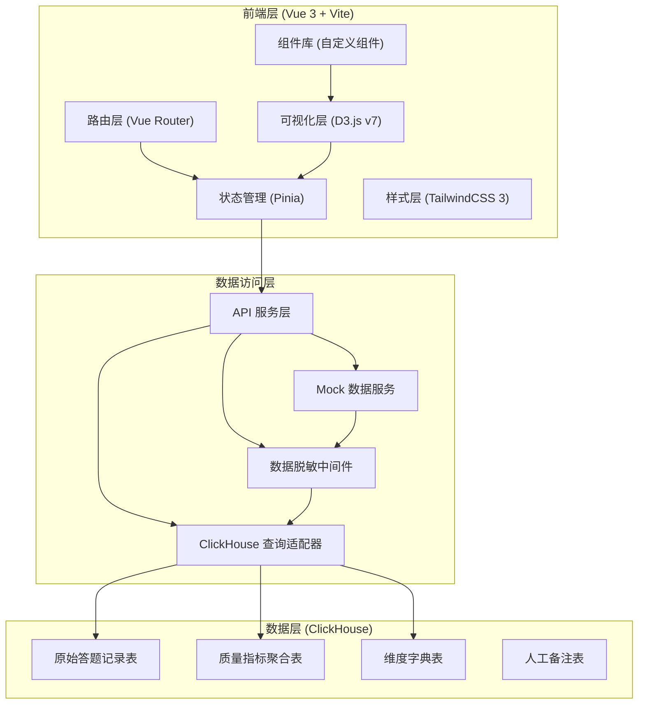

## 1. 架构设计



## 2. 技术描述

- **前端框架**: Vue 3.4 + Composition API + `<script setup>` 语法
- **构建工具**: Vite 5.x
- **可视化库**: D3.js v7.8（核心图表渲染）
- **状态管理**: Pinia 2.x
- **路由**: Vue Router 4.x
- **样式方案**: TailwindCSS 3.4 + CSS Variables
- **UI 组件**: 基于设计规范的自定义组件库
- **图标**: Lucide Vue
- **日期处理**: dayjs
- **数据层**: Mock 数据模拟 ClickHouse 查询结果
- **代码规范**: ESLint + Prettier

## 3. 路由定义

| 路由路径 | 页面名称 | 功能说明 |
|----------|----------|----------|
| `/` | 总览仪表盘 | 核心 KPI、样本漏斗、异常趋势 |
| `/comparison` | 多维对比分析 | 按维度/指标交叉对比分析 |
| `/anomaly` | 异常矩阵 | 异常热力矩阵、渠道排行、耗时分布 |
| `/details` | 明细下钻 | 异常样本列表、答题详情、质检详情 |
| `/specs` | 口径说明 | 指标字典、时间窗口、数据校验说明 |

## 4. 核心数据模型

### 4.1 TypeScript 类型定义

```typescript
// 质量指标类型
interface QualityMetrics {
  totalSamples: number;
  validSamples: number;
  anomalyRate: number;
  avgDuration: number;
  skipRate: number;
  duplicateRate: number;
  ipAbnormalRate: number;
  deviceAbnormalRate: number;
  qualityMarkRate: number;
}

// 维度类型
type DimensionType = 'survey' | 'channel' | 'questionGroup' | 'region' | 'device';

interface Dimension {
  id: string;
  name: string;
  type: DimensionType;
  code: string;
}

// 漏斗数据
interface FunnelData {
  stage: string;
  stageCode: string;
  count: number;
  conversionRate: number;
  dropRate: number;
}

// 异常矩阵数据
interface AnomalyMatrixCell {
  channelId: string;
  channelName: string;
  anomalyType: string;
  anomalyTypeName: string;
  count: number;
  rate: number;
  level: 'low' | 'medium' | 'high' | 'critical';
}

// 渠道排行数据
interface ChannelRanking {
  rank: number;
  channelId: string;
  channelName: string;
  totalSamples: number;
  qualityScore: number;
  anomalyRate: number;
  avgDuration: number;
  trend: 'up' | 'down' | 'flat';
}

// 题组耗时分布
interface QuestionGroupDuration {
  groupId: string;
  groupName: string;
  min: number;
  q1: number;
  median: number;
  q3: number;
  max: number;
  outliers: number[];
  mean: number;
}

// 异常样本明细
interface AnomalySample {
  sampleId: string;
  surveyId: string;
  surveyName: string;
  channelId: string;
  channelName: string;
  region: string;
  deviceType: string;
  duration: number;
  skipCount: number;
  totalQuestions: number;
  anomalyTypes: string[];
  qualityMark: 'pass' | 'warning' | 'fail';
  submitTime: string;
  hasNote: boolean;
}

// 答题轨迹
interface AnswerTrajectory {
  questionId: string;
  questionTitle: string;
  groupId: string;
  startTime: number;
  endTime: number;
  duration: number;
  isSkipped: boolean;
  answerValue: string;
}

// 人工备注
interface ManualNote {
  noteId: string;
  targetType: 'sample' | 'channel' | 'anomaly';
  targetId: string;
  content: string;
  tags: string[];
  author: string;
  createTime: string;
  updateTime: string;
}

// 质检规则命中
interface QualityCheckHit {
  ruleId: string;
  ruleName: string;
  ruleDescription: string;
  hitValue: string;
  threshold: string;
  severity: 'low' | 'medium' | 'high';
}
```

### 4.2 数据聚合口径

| 指标 | 计算公式 | 时间窗口 | 刷新频率 |
|------|----------|----------|----------|
| 异常率 | 异常样本数 / 总提交样本数 × 100% | 自然日 | T+1 刷新 |
| 跳题率 | 跳题总次数 / (样本数 × 总题数) × 100% | 自然日 | T+1 刷新 |
| 平均答题时长 | 所有有效样本答题时长的中位数 | 自然日 | T+1 刷新 |
| 重复提交率 | 去重后样本数 / 总提交样本数 × 100% | 自然日 | T+1 刷新 |
| IP 异常率 | IP 归属地异常 / 总样本数 × 100% | 自然日 | T+1 刷新 |
| 设备异常率 | 设备指纹异常 / 总样本数 × 100% | 自然日 | T+1 刷新 |

## 5. 目录结构

```
src/
├── assets/                 # 静态资源
│   └── styles/            # 全局样式、CSS 变量
├── components/            # 可复用组件
│   ├── charts/           # D3 图表组件
│   │   ├── FunnelChart.vue
│   │   ├── AnomalyMatrix.vue
│   │   ├── ChannelRanking.vue
│   │   ├── DurationBoxplot.vue
│   │   └── TrendLineChart.vue
│   ├── layout/           # 布局组件
│   │   ├── AppHeader.vue
│   │   ├── AppSidebar.vue
│   │   └── CardContainer.vue
│   ├── filters/          # 筛选器组件
│   │   ├── DimensionFilter.vue
│   │   ├── MetricSelector.vue
│   │   └── TimeRangePicker.vue
│   └── common/           # 通用组件
│       ├── KpiCard.vue
│       ├── DataTable.vue
│       ├── DetailDrawer.vue
│       ├── NoteModal.vue
│       └── TagBadge.vue
├── views/                # 页面组件
│   ├── Dashboard.vue
│   ├── Comparison.vue
│   ├── AnomalyMatrix.vue
│   ├── Details.vue
│   └── Specs.vue
├── stores/               # Pinia 状态管理
│   ├── filter.ts         # 筛选条件状态
│   ├── quality.ts        # 质量数据状态
│   └── notes.ts          # 备注状态
├── services/             # API 服务
│   ├── api.ts            # 请求封装
│   ├── quality.ts        # 质量指标接口
│   ├── dimensions.ts     # 维度字典接口
│   └── notes.ts          # 备注接口
├── mock/                 # Mock 数据
│   ├── data/            # 模拟数据源
│   └── index.ts         # Mock 服务配置
├── types/                # TypeScript 类型定义
│   └── index.ts
├── utils/                # 工具函数
│   ├── d3-helpers.ts     # D3 辅助函数
│   ├── format.ts         # 格式化函数
│   └── constants.ts      # 常量定义
├── router/               # 路由配置
│   └── index.ts
├── App.vue
└── main.ts
```

## 6. 可视化组件技术要点

### 6.1 样本漏斗图 (FunnelChart)
- 使用 D3 `shape` 生成漏斗路径
- 支持分段着色（根据转化率高低）
- Hover 显示详情 tooltip
- 点击漏斗段可下钻查看该阶段明细
- 响应式重绘，监听容器尺寸变化

### 6.2 异常提交矩阵 (AnomalyMatrix)
- 热力矩阵布局，X 轴为异常类型，Y 轴为渠道
- 颜色映射：色阶从浅到深表示异常严重程度
- 单元格显示异常数量和百分比
- 点击单元格触发下钻，打开明细表筛选对应条件
- 支持行/列排序切换

### 6.3 渠道质量排行 (ChannelRanking)
- 表格 + 进度条混合展示
- 质量分使用色阶渐变背景
- 支持点击列头排序
- 行 hover 高亮，点击查看渠道详情
- 分页展示，每页 10 条

### 6.4 题组耗时分布 (DurationBoxplot)
- D3 绘制箱线图，展示四分位分布
- 离群点使用不同颜色高亮
- 支持缩放和平移
- Hover 显示统计值
- 参考线标记正常耗时区间

## 7. 关键交互实现

### 7.1 下钻联动
- 矩阵单元格/图表元素点击 → 提取筛选条件 → 更新全局筛选状态 → 明细表自动过滤
- 使用 Pinia 存储筛选条件，实现跨组件联动

### 7.2 多维度对比
- 支持同时选择多个维度值进行对比
- 动态生成对比图表的系列数据
- 支持图表类型切换（柱状图/雷达图）

### 7.3 人工备注
- 点击备注按钮打开模态框
- 支持文本输入和标签选择
- 备注数据关联到对应样本/渠道
- 历史备注以时间线形式展示
