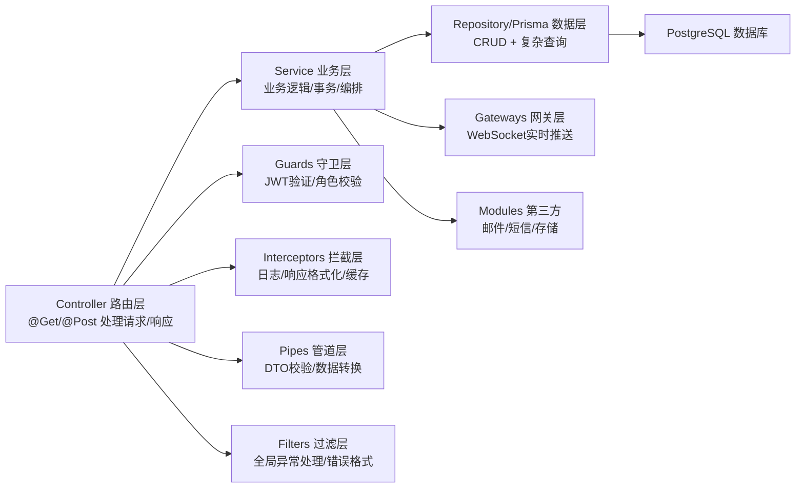

## 1. 架构设计

```mermaid
graph TB
    subgraph "前端层 (Angular 17 + Material UI)"
        A1["参会者端 SPA<br>/register /status"]
        A2["管理端 SPA<br>/admin/** 路由"]
        A3["Angular Material 组件库"]
        A4["状态管理: NgRx / Signals"]
        A5["ECharts 图表组件"]
    end

    subgraph "网关与通信"
        B1["HTTP REST API"]
        B2["JWT 鉴权中间件"]
        B3["WebSocket (实时通知)"]
        B4["File Upload (证件/发票)"]
    end

    subgraph "后端层 (NestJS 10)"
        C1["Auth 模块: 登录/权限/JWT"]
        C2["Registration 模块: 报名CRUD/审核流"]
        C3["Ticket 模块: 票种/库存/座位"]
        C4["Guest 模块: 嘉宾配额/分配"]
        C5["CheckIn 模块: 签到码/核销"]
        C6["Refund 模块: 退款流程/关联原单"]
        C7["Notification 模块: 邮件/短信/模板"]
        C8["Analytics 模块: 质量统计/漏斗/缺口"]
        C9["Exception 模块: 异常关闭/复盘"]
    end

    subgraph "数据层 (PostgreSQL 16)"
        D1["用户表 users / 角色表 roles"]
        D2["报名表 registrations"]
        D3["票种表 ticket_types / 库存表 inventory"]
        D4["场次表 sessions / 座位表 seats"]
        D5["嘉宾表 guests / 配额表 guest_quotas"]
        D6["签到码表 checkin_codes / 核销表 checkin_records"]
        D7["退款表 refunds"]
        D8["通知表 notifications"]
        D9["异常关闭表 close_exceptions"]
        D10["质量统计表 quality_metrics MV"]
    end

    subgraph "外部服务"
        E1["邮件服务 (SMTP/Nodemailer)"]
        E2["短信服务 (Mock API)"]
        E3["支付服务 (Mock/微信/支付宝)"]
        E4["对象存储 (证件/发票文件)"]
    end

    A1 & A2 --> B1 & B2 & B3 & B4
    B1 & B2 & B3 & B4 --> C1 & C2 & C3 & C4 & C5 & C6 & C7 & C8 & C9
    C1 & C2 & C3 & C4 & C5 & C6 & C7 & C8 & C9 --> D1 & D2 & D3 & D4 & D5 & D6 & D7 & D8 & D9 & D10
    C7 --> E1 & E2
    C2 & C6 --> E3
    C2 --> E4
```


## 2. 技术栈说明
- 前端框架：Angular 17 (Standalone Components) + TypeScript 5.3
- UI 组件：Angular Material 17 (MatTable/MatDialog/MatStepper/MatDrawer)
- 状态管理：Angular Signals (组件内) + RxJS BehaviorSubject (跨组件)
- 路由：Angular Router 17 (Lazy Loading, Route Guards)
- 图表：ngx-echarts 17 + ECharts 5.4
- HTTP：Angular HttpClient + Interceptors (JWT, Error Handling)
- 后端框架：NestJS 10 + TypeScript 5.3
- ORM：Prisma 5 (类型安全) / TypeORM (备选)
- 数据库：PostgreSQL 16 + UUID 主键 + 索引优化
- 鉴权：Passport.js + JWT (Access Token + Refresh Token)
- 文件上传：Multer + Multer-S3 (本地/S3兼容)
- 邮件：Nodemailer + Handlebars 模板
- API 文档：Swagger / OpenAPI 3.0 (NestJS Swagger)
- 实时通知：Socket.IO (NestJS Gateway)
- 构建工具：前端 Angular CLI / 后端 Nest CLI
- 包管理：pnpm 8
- 环境变量：dotenv + ConfigModule
- 代码规范：ESLint + Prettier + Husky + lint-staged

## 3. 路由定义

### 参会者端 (public 访问)
| 路由 | 用途 | 权限 |
|------|------|------|
| / | 报名首页/峰会介绍 | 公开 |
| /register | 报名提交表单 | 公开 |
| /register/success | 报名提交成功页 | 公开 |
| /status | 报名状态查询(通过手机号/订单号) | 公开 |
| /status/:orderId | 具体订单详情 | 本人 |
| /checkin/:code | 签到码展示页 | 本人 |
| /refund/apply/:orderId | 提交退款申请 | 本人 |
| /login | 参会者快捷登录 | 公开 |

### 管理端 (需登录)
| 路由 | 用途 | 角色 |
|------|------|------|
| /admin/login | 管理员登录页 | 公开 |
| /admin/dashboard | 总览仪表板 | admin/super |
| /admin/reviews | 报名审核工作台 | admin/super |
| /admin/reviews/:id | 报名审核详情 | admin/super |
| /admin/guests | 嘉宾名额管理 | admin/super |
| /admin/tickets | 票种库存管理 | admin/super |
| /admin/sessions | 场次座位管理 | admin/super |
| /admin/checkin | 签到码管理 | admin/super |
| /admin/refunds | 退款申请中心 | admin/super |
| /admin/refunds/:id | 退款审核详情 | admin/super |
| /admin/notifications | 通知中心 | admin/super |
| /admin/analytics/quality | 报名质量统计 | admin/super |
| /admin/analytics/funnel | 转化漏斗分析 | admin/super |
| /admin/gap | 到场缺口待办 | admin/super |
| /admin/exceptions | 异常关闭复盘 | admin/super |
| /admin/exceptions/:id | 异常原单追溯 | admin/super |
| /admin/settings | 系统配置 | super |
| /admin/users | 管理员账号管理 | super |

## 4. API 定义 (核心)

### 4.1 鉴权
```typescript
POST /api/auth/login (admin): { username, password } → { accessToken, refreshToken, user }
POST /api/auth/refresh: { refreshToken } → { accessToken }
POST /api/auth/register (public): 参会者注册 → { user }
GET  /api/auth/me: 当前用户信息
```

### 4.2 报名
```typescript
POST   /api/registrations (public): 创建报名
  Body: { name, company, title, phone, email, idCard, ticketTypeId, sessionId, seatIds?, invoice?, files? }
  → { orderId, status }

GET    /api/registrations: 报名列表(管理员带筛选)
  Query: status, ticketType, session, channel, dateFrom, dateTo, page, pageSize, keyword
  → { items: Registration[], total, page, pageSize }

GET    /api/registrations/:id: 报名详情
PATCH  /api/registrations/:id/review: 审核操作
  Body: { action: 'approve'|'reject'|'close', reason?, note?, closeReasonId? }
  → { status, message }

GET    /api/registrations/lookup (public): 凭手机号+订单号查状态
  Query: phone, orderId
  → Registration
```

### 4.3 票种与库存
```typescript
GET    /api/ticket-types (public/admin): 票种列表
POST   /api/ticket-types (admin): 创建票种
PUT    /api/ticket-types/:id (admin): 更新票种
PATCH  /api/ticket-types/:id/status (admin): 开售/停售
PATCH  /api/ticket-types/:id/inventory (admin): 调整库存 { delta, reason }
GET    /api/ticket-types/:id/history (admin): 库存变更历史
```

### 4.4 场次座位
```typescript
GET    /api/sessions (public/admin): 场次列表
POST   /api/sessions (admin): 创建场次
GET    /api/sessions/:id/seats: 座位图数据
PATCH  /api/sessions/:id/seats/:seatId (admin): 更新座位(锁定/释放/分配)
PATCH  /api/sessions/:id/quality-weight (admin): 设置场次质量权重
```

### 4.5 嘉宾管理
```typescript
GET    /api/guests: 嘉宾列表
POST   /api/guests: 创建嘉宾
PATCH  /api/guests/:id/quota: 调整配额 { totalQuota }
POST   /api/guests/:id/allocations: 分配名额 { registrationId, priority, note }
GET    /api/guests/:id/allocations: 分配历史
```

### 4.6 签到码
```typescript
POST   /api/checkin-codes/generate (admin): 批量生成 { registrationIds?, count? }
GET    /api/checkin-codes (admin): 签到码列表(筛选/导出)
GET    /api/checkin-codes/:code (public/admin): 签到码详情
POST   /api/checkin-codes/:code/verify (admin): 核销签到 { location, operatorId }
GET    /api/checkin-codes/export (admin): 导出PDF/Excel
```

### 4.7 退款
```typescript
POST   /api/refunds (public): 提交退款申请 { orderId, reason, note }
GET    /api/refunds (admin): 退款列表(筛选)
GET    /api/refunds/:id: 退款详情(含原单)
PATCH  /api/refunds/:id/review (admin): 审核 { action:'approve'|'reject', note }
POST   /api/refunds/:id/execute (admin): 执行退款操作(模拟支付回调)
```

### 4.8 通知
```typescript
GET    /api/notification-templates (admin): 模板列表
PUT    /api/notification-templates/:id (admin): 更新模板内容
POST   /api/notifications/send (admin): 发送通知 { audience, templateId, variables? }
GET    /api/notifications/history (admin): 发送记录
```

### 4.9 统计与缺口
```typescript
GET    /api/analytics/dashboard (admin): 仪表板KPI
GET    /api/analytics/quality (admin): 报名质量多维数据
GET    /api/analytics/funnel (admin): 转化漏斗数据
GET    /api/gap/todos (admin): 到场缺口待办列表
POST   /api/gap/:registrationId/handle (admin): 处理缺口 { action, note }
GET    /api/exceptions (admin): 异常关闭列表(复盘)
GET    /api/exceptions/reasons (admin): 关闭原因字典及统计
```

## 5. 后端分层架构


### 模块划分
- `src/modules/auth`: 登录、JWT策略、角色守卫
- `src/modules/registrations`: 报名、审核、状态机
- `src/modules/tickets`: 票种、库存、价格策略
- `src/modules/sessions`: 场次、座位、质量权重
- `src/modules/guests`: 嘉宾配额、分配记录
- `src/modules/checkin`: 签到码生成、核销、导出
- `src/modules/refunds`: 退款申请、审核、关联原单
- `src/modules/notifications`: 模板、邮件/短信、发送记录
- `src/modules/analytics`: KPI聚合、质量统计、漏斗
- `src/modules/gap`: 到场缺口检测、待办、处理记录
- `src/modules/exceptions`: 异常关闭、原因字典、原单追溯
- `src/modules/common`: 通用工具、DTO、装饰器、过滤器

## 6. 数据模型

### 6.1 ER 关系图
```mermaid
erDiagram
    USERS ||--o{ REGISTRATIONS : "提交"
    USERS ||--o{ REFUNDS : "申请"
    TICKET_TYPES ||--o{ REGISTRATIONS : "所属票种"
    SESSIONS ||--o{ REGISTRATIONS : "所属场次"
    SESSIONS ||--o{ SEATS : "包含座位"
    SEATS ||--o| REGISTRATIONS : "被占用"
    REGISTRATIONS ||--o| CHECKIN_CODES : "生成"
    REGISTRATIONS ||--o{ REFUNDS : "关联原单"
    REGISTRATIONS ||--o| CLOSE_EXCEPTIONS : "异常关闭"
    REGISTRATIONS ||--o{ QUALITY_METRICS : "统计来源"
    GUESTS ||--o{ GUEST_ALLOCATIONS : "分配名额"
    GUEST_ALLOCATIONS }o--|| REGISTRATIONS : "对应报名"
    ADMINS ||--o{ REVIEW_LOGS : "审核操作"
    CLOSE_REASONS ||--o{ CLOSE_EXCEPTIONS : "关闭原因"
    NOTIFICATION_TEMPLATES ||--o{ NOTIFICATION_LOGS : "发送记录"

    USERS {
        uuid id PK
        string name
        string phone UK
        string email
        string id_card_hash
        string company
        string title
        string channel_source
        datetime created_at
    }

    REGISTRATIONS {
        uuid id PK
        string order_no UK
        uuid user_id FK
        uuid ticket_type_id FK
        uuid session_id FK
        uuid seat_id FK
        uuid guest_allocation_id FK
        enum status "pending/reviewing/approved/rejected/paid/checked_in/refunded/closed"
        decimal amount
        enum review_result
        datetime review_at
        uuid reviewed_by FK
        string review_note
        int quality_score
        datetime created_at
        datetime updated_at
    }

    TICKET_TYPES {
        uuid id PK
        string name
        enum level "normal/vip/guest"
        decimal price
        int total_inventory
        int sold_count
        int warning_threshold
        boolean is_on_sale
        text description
        json quality_weight
    }

    SESSIONS {
        uuid id PK
        string name
        datetime start_time
        datetime end_time
        string venue
        int capacity
        float quality_weight
        boolean is_active
    }

    SEATS {
        uuid id PK
        uuid session_id FK
        string row
        string number
        string zone
        enum status "available/locked/sold/reserved"
        uuid registration_id FK
    }

    GUESTS {
        uuid id PK
        string name
        string company
        int total_quota
        int used_quota
        int priority_level
    }

    GUEST_ALLOCATIONS {
        uuid id PK
        uuid guest_id FK
        uuid registration_id FK
        int priority
        text note
        uuid assigned_by FK
        datetime created_at
    }

    CHECKIN_CODES {
        uuid id PK
        uuid registration_id FK UK
        string code UK
        string qr_svg
        boolean is_used
        datetime used_at
        string used_location
        uuid used_by FK
    }

    REFUNDS {
        uuid id PK
        string refund_no UK
        uuid registration_id FK
        uuid user_id FK
        decimal amount
        enum reason
        text note
        enum status "pending/approved/rejected/executed/failed"
        uuid reviewed_by FK
        datetime reviewed_at
        datetime executed_at
        string transaction_id
    }

    CLOSE_EXCEPTIONS {
        uuid id PK
        uuid registration_id FK UK
        uuid close_reason_id FK
        text custom_reason
        text note
        uuid closed_by FK
        datetime created_at
    }

    CLOSE_REASONS {
        uuid id PK
        string name
        string category
        boolean is_active
        int sort_order
    }

    QUALITY_METRICS {
        uuid id PK
        uuid registration_id FK
        int channel_score
        int company_score
        int position_score
        int payment_speed_score
        int total_score
        text details_json
    }
```

### 6.2 初始化数据 (Seed)
```sql
-- 管理员账号 (密码: Admin@2024，bcrypt 加密)
INSERT INTO admins (username, password, name, role)
VALUES ('admin', '$2b$10$...', '超级管理员', 'super');

-- 关闭原因字典
INSERT INTO close_reasons (id, name, category, is_active, sort_order) VALUES
(gen_random_uuid(), '信息虚假/伪造证件', '资料问题', true, 1),
(gen_random_uuid(), '重复报名', '规则问题', true, 2),
(gen_random_uuid(), '身份不符(非目标人群)', '资格问题', true, 3),
(gen_random_uuid(), '联系不上参会者', '沟通问题', true, 4),
(gen_random_uuid(), '参会者主动取消', '用户侧', true, 5),
(gen_random_uuid(), '名额已满超售关闭', '运营侧', true, 6),
(gen_random_uuid(), '其他(需备注)', '其他', true, 99);

-- 示例票种
INSERT INTO ticket_types (id, name, level, price, total_inventory, sold_count, warning_threshold, is_on_sale) VALUES
(gen_random_uuid(), '普通通票', 'normal', 1999.00, 500, 0, 50, true),
(gen_random_uuid(), 'VIP 贵宾票', 'vip', 4999.00, 100, 0, 10, true),
(gen_random_uuid(), '嘉宾专属票', 'guest', 0.00, 50, 0, 5, false);

-- 示例场次
INSERT INTO sessions (id, name, start_time, end_time, venue, capacity, quality_weight, is_active) VALUES
(gen_random_uuid(), '主论坛·第一天上午', '2026-09-15 09:00:00', '2026-09-15 12:00:00', '国际会议中心A厅', 650, 1.2, true),
(gen_random_uuid(), '主论坛·第一天下午', '2026-09-15 14:00:00', '2026-09-15 17:30:00', '国际会议中心A厅', 650, 1.2, true),
(gen_random_uuid(), '分论坛·AI专场', '2026-09-16 09:00:00', '2026-09-16 12:00:00', 'B1分会场', 200, 1.0, true);

-- 通知模板
INSERT INTO notification_templates (id, code, name, type, subject, content_body, variables) VALUES
(gen_random_uuid(), 'review_approved', '审核通过通知', 'email', '【峰会报名】您的报名已审核通过',
 '<p>尊敬的 {{name}}，您报名的「{{summitName}}」审核已通过，请凭签到码入场。</p><p>签到码：{{checkinCode}}</p>',
 '["name","summitName","checkinCode"]'),
(gen_random_uuid(), 'review_rejected', '审核未通过通知', 'email', '【峰会报名】您的报名未通过审核',
 '<p>尊敬的 {{name}}，很抱歉您的报名未通过审核。原因：{{reason}}</p>',
 '["name","reason"]'),
(gen_random_uuid(), 'refund_completed', '退款完成通知', 'email', '【峰会报名】退款已完成',
 '<p>尊敬的 {{name}}，您的退款申请已处理，退款金额 ¥{{amount}} 将于 1-3 个工作日原路返回。</p>',
 '["name","amount"]');
```
