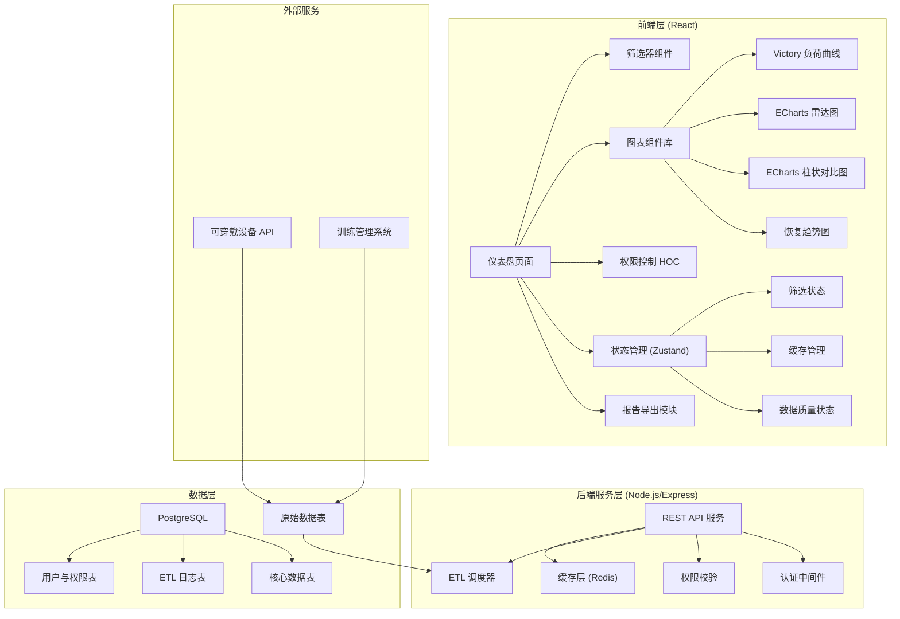
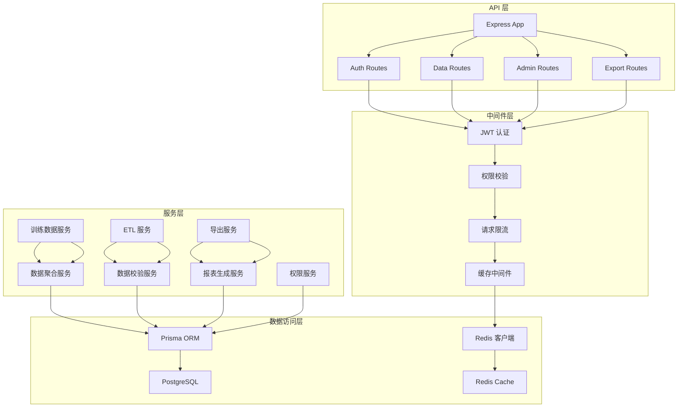
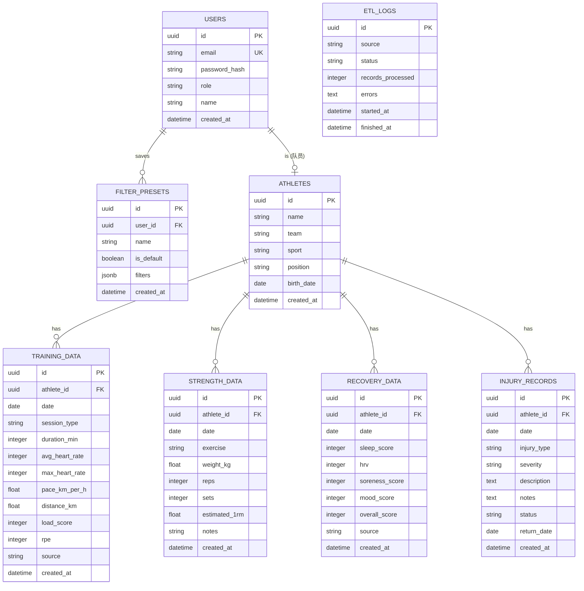
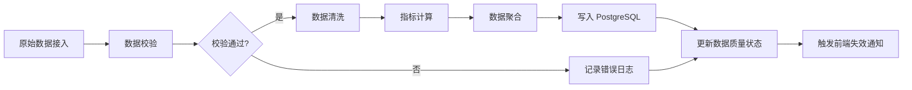

## 1. 架构设计



## 2. 技术描述

### 2.1 前端技术栈
- **框架**: React@18 + TypeScript
- **构建工具**: Vite@5
- **样式方案**: TailwindCSS@3 + CSS Variables
- **图表库**: 
  - Victory@36 (负荷曲线、趋势图)
  - ECharts@5 (雷达图、柱状图、热力图)
- **状态管理**: Zustand@4 (轻量级全局状态)
- **路由**: React Router@6
- **数据请求**: React Query@5 (含缓存策略)
- **UI 组件**: 自研组件库 + HeadlessUI
- **报告导出**: jsPDF + SheetJS (xlsx)
- **动画**: Framer Motion

### 2.2 后端技术栈
- **运行时**: Node.js@20
- **框架**: Express@4
- **ORM**: Prisma@5
- **数据库**: PostgreSQL@15
- **缓存**: Redis@7
- **认证**: JWT + bcrypt
- **ETL**: node-cron + 自定义管道

### 2.3 初始化方式
- 前端: `npm create vite@latest -- --template react-ts`
- 后端: Express 手动搭建 + Prisma 初始化

## 3. 路由定义

| 路由路径 | 页面用途 | 权限要求 |
|----------|----------|----------|
| `/login` | 登录页面 | 公开 |
| `/dashboard` | 仪表盘主页 | 教练/队员 |
| `/workload` | 负荷分析详情页 | 教练/队员 |
| `/compare` | 对比分析页 | 教练/队员 |
| `/recovery` | 恢复监测页 | 教练/队员 |
| `/injury` | 伤病管理页 | 仅教练组 |
| `/reports` | 报告中心 | 教练/队员 |
| `/admin` | 系统管理页 | 仅教练组 |

## 4. API 定义

### 4.1 TypeScript 类型定义

```typescript
// 队员信息
interface Athlete {
  id: string;
  name: string;
  team: string;
  sport: string;
  position?: string;
  birthDate?: string;
  avatar?: string;
}

// 训练数据点
interface TrainingData {
  id: string;
  athleteId: string;
  date: string;
  sessionType: string;
  duration: number;
  avgHeartRate?: number;
  maxHeartRate?: number;
  pace?: number;
  distance?: number;
  loadScore: number;
  rpe?: number;
}

// 力量测试数据
interface StrengthData {
  id: string;
  athleteId: string;
  date: string;
  exercise: string;
  weight: number;
  reps: number;
  sets: number;
  oneRm?: number;
}

// 恢复评分
interface RecoveryData {
  id: string;
  athleteId: string;
  date: string;
  sleepScore?: number;
  hrv?: number;
  soreness?: number;
  mood?: number;
  overallScore: number;
}

// 伤病记录
interface InjuryRecord {
  id: string;
  athleteId: string;
  date: string;
  type: string;
  severity: 'mild' | 'moderate' | 'severe';
  description: string;
  notes?: string;
  status: 'active' | 'recovered' | 'chronic';
  returnDate?: string;
}

// 筛选组合
interface FilterPreset {
  id: string;
  name: string;
  userId: string;
  isDefault: boolean;
  filters: FilterState;
  createdAt: string;
}

// 筛选状态
interface FilterState {
  athleteIds: string[];
  sports: string[];
  dateRange: { start: string; end: string };
  timeWindow: 'day' | 'week' | 'month' | 'custom';
  exercises: string[];
  metrics: string[];
}

// 数据质量状态
interface DataQualityStatus {
  lastUpdated: string;
  updateSuccess: boolean;
  missingFields: string[];
  sampleSize: number;
  warnings: string[];
  errors: string[];
}
```

### 4.2 API 端点

| 方法 | 路径 | 描述 |
|------|------|------|
| POST | `/api/auth/login` | 用户登录 |
| GET | `/api/athletes` | 获取队员列表 |
| GET | `/api/athletes/:id` | 获取单个队员详情 |
| GET | `/api/training` | 获取训练数据 (支持筛选参数) |
| GET | `/api/strength` | 获取力量测试数据 |
| GET | `/api/recovery` | 获取恢复评分数据 |
| GET | `/api/injuries` | 获取伤病记录 (权限控制) |
| GET | `/api/data-quality` | 获取数据质量状态 |
| GET | `/api/radar/:athleteId` | 获取雷达图数据 |
| GET | `/api/presets` | 获取筛选组合列表 |
| POST | `/api/presets` | 保存筛选组合 |
| DELETE | `/api/presets/:id` | 删除筛选组合 |
| POST | `/api/etl/trigger` | 手动触发 ETL |
| GET | `/api/export/report` | 导出报告 |

## 5. 服务器架构图



## 6. 数据模型

### 6.1 ER 图



### 6.2 DDL 语句

```sql
-- 创建扩展
CREATE EXTENSION IF NOT EXISTS "uuid-ossp";

-- 用户表
CREATE TABLE users (
    id UUID PRIMARY KEY DEFAULT uuid_generate_v4(),
    email VARCHAR(255) UNIQUE NOT NULL,
    password_hash VARCHAR(255) NOT NULL,
    role VARCHAR(50) NOT NULL CHECK (role IN ('coach', 'athlete')),
    name VARCHAR(255) NOT NULL,
    created_at TIMESTAMP WITH TIME ZONE DEFAULT CURRENT_TIMESTAMP
);

-- 队员表
CREATE TABLE athletes (
    id UUID PRIMARY KEY DEFAULT uuid_generate_v4(),
    name VARCHAR(255) NOT NULL,
    team VARCHAR(100),
    sport VARCHAR(100) NOT NULL,
    position VARCHAR(100),
    birth_date DATE,
    created_at TIMESTAMP WITH TIME ZONE DEFAULT CURRENT_TIMESTAMP
);

-- 训练数据表
CREATE TABLE training_data (
    id UUID PRIMARY KEY DEFAULT uuid_generate_v4(),
    athlete_id UUID NOT NULL REFERENCES athletes(id) ON DELETE CASCADE,
    date DATE NOT NULL,
    session_type VARCHAR(100) NOT NULL,
    duration_min INTEGER NOT NULL,
    avg_heart_rate INTEGER,
    max_heart_rate INTEGER,
    pace_km_per_h NUMERIC(5,2),
    distance_km NUMERIC(6,2),
    load_score INTEGER NOT NULL,
    rpe INTEGER CHECK (rpe BETWEEN 1 AND 10),
    source VARCHAR(100),
    created_at TIMESTAMP WITH TIME ZONE DEFAULT CURRENT_TIMESTAMP,
    INDEX idx_training_athlete_date (athlete_id, date)
);

-- 力量测试表
CREATE TABLE strength_data (
    id UUID PRIMARY KEY DEFAULT uuid_generate_v4(),
    athlete_id UUID NOT NULL REFERENCES athletes(id) ON DELETE CASCADE,
    date DATE NOT NULL,
    exercise VARCHAR(100) NOT NULL,
    weight_kg NUMERIC(5,1) NOT NULL,
    reps INTEGER NOT NULL,
    sets INTEGER NOT NULL,
    estimated_1rm NUMERIC(5,1),
    notes TEXT,
    created_at TIMESTAMP WITH TIME ZONE DEFAULT CURRENT_TIMESTAMP,
    INDEX idx_strength_athlete_exercise (athlete_id, exercise)
);

-- 恢复数据表
CREATE TABLE recovery_data (
    id UUID PRIMARY KEY DEFAULT uuid_generate_v4(),
    athlete_id UUID NOT NULL REFERENCES athletes(id) ON DELETE CASCADE,
    date DATE NOT NULL,
    sleep_score INTEGER CHECK (sleep_score BETWEEN 0 AND 100),
    hrv INTEGER,
    soreness_score INTEGER CHECK (soreness_score BETWEEN 0 AND 10),
    mood_score INTEGER CHECK (mood_score BETWEEN 0 AND 10),
    overall_score INTEGER NOT NULL CHECK (overall_score BETWEEN 0 AND 100),
    source VARCHAR(100),
    created_at TIMESTAMP WITH TIME ZONE DEFAULT CURRENT_TIMESTAMP,
    INDEX idx_recovery_athlete_date (athlete_id, date)
);

-- 伤病记录表
CREATE TABLE injury_records (
    id UUID PRIMARY KEY DEFAULT uuid_generate_v4(),
    athlete_id UUID NOT NULL REFERENCES athletes(id) ON DELETE CASCADE,
    date DATE NOT NULL,
    injury_type VARCHAR(100) NOT NULL,
    severity VARCHAR(20) NOT NULL CHECK (severity IN ('mild', 'moderate', 'severe')),
    description TEXT NOT NULL,
    notes TEXT,
    status VARCHAR(20) NOT NULL DEFAULT 'active' CHECK (status IN ('active', 'recovered', 'chronic')),
    return_date DATE,
    created_at TIMESTAMP WITH TIME ZONE DEFAULT CURRENT_TIMESTAMP,
    INDEX idx_injury_athlete (athlete_id)
);

-- 筛选组合表
CREATE TABLE filter_presets (
    id UUID PRIMARY KEY DEFAULT uuid_generate_v4(),
    user_id UUID NOT NULL REFERENCES users(id) ON DELETE CASCADE,
    name VARCHAR(255) NOT NULL,
    is_default BOOLEAN DEFAULT FALSE,
    filters JSONB NOT NULL,
    created_at TIMESTAMP WITH TIME ZONE DEFAULT CURRENT_TIMESTAMP
);

-- ETL 日志表
CREATE TABLE etl_logs (
    id UUID PRIMARY KEY DEFAULT uuid_generate_v4(),
    source VARCHAR(100) NOT NULL,
    status VARCHAR(20) NOT NULL CHECK (status IN ('pending', 'running', 'success', 'failed')),
    records_processed INTEGER DEFAULT 0,
    errors TEXT,
    started_at TIMESTAMP WITH TIME ZONE DEFAULT CURRENT_TIMESTAMP,
    finished_at TIMESTAMP WITH TIME ZONE,
    INDEX idx_etl_status (status)
);

-- 插入初始教练用户
INSERT INTO users (email, password_hash, role, name) VALUES
('coach@demo.com', '$2b$10$N9qo8uLOickgx2ZMRZoMyeIjZAgcfl7p92ldGxad68LJZdL17lhWy', 'coach', '张教练');
```

## 7. 缓存策略

### 7.1 前端缓存 (React Query)
- **训练数据**: staleTime=5分钟, cacheTime=30分钟, 按筛选参数作为缓存键
- **队员列表**: staleTime=1小时, cacheTime=24小时
- **筛选组合**: staleTime=0 (实时)
- **数据质量状态**: staleTime=1分钟, cacheTime=5分钟

### 7.2 后端缓存 (Redis)
- 高频查询结果: TTL=15分钟
- 导出报告: TTL=1小时
- 用户会话: TTL=24小时

## 8. ETL 管道设计


