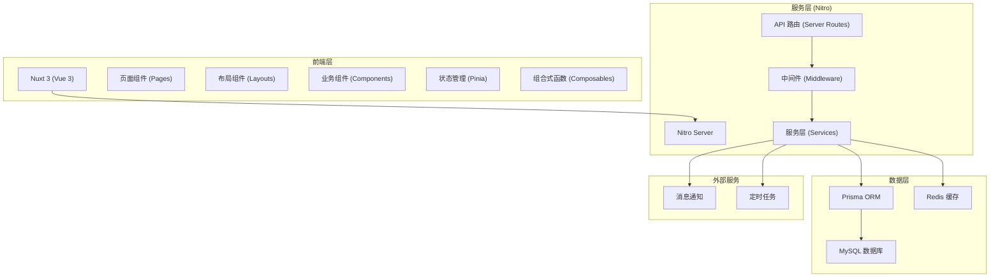
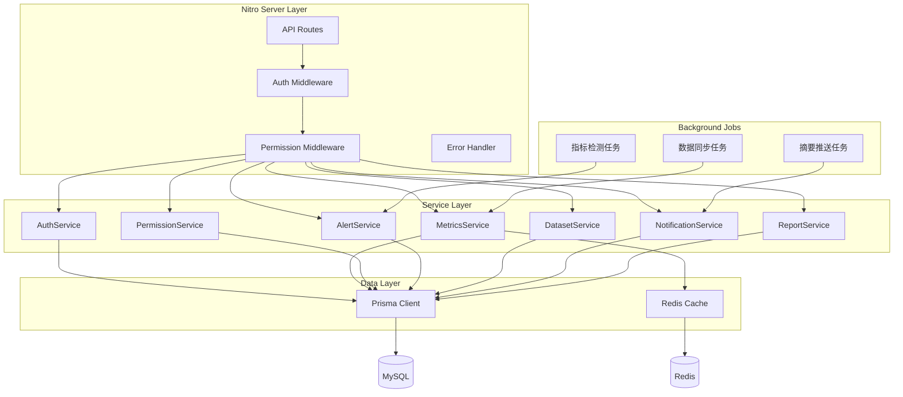
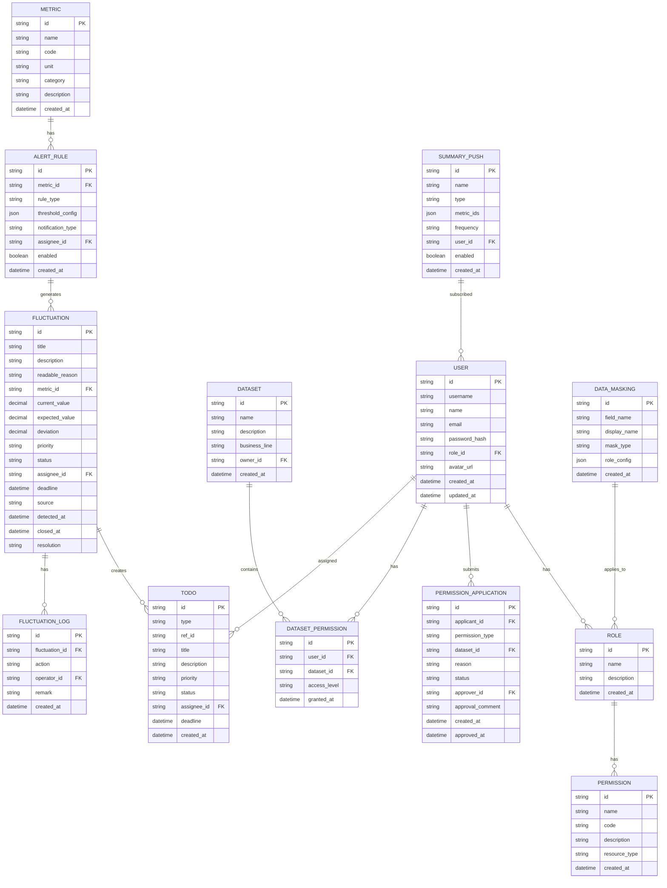

## 1. 架构设计



## 2. 技术描述

### 2.1 前端技术栈
- **框架**: Nuxt 3.12.x (基于 Vue 3.4+)
- **语言**: TypeScript 5.4+
- **样式**: TailwindCSS 3.4+
- **状态管理**: Pinia
- **图表库**: ECharts 5.5+
- **UI 组件**: 自定义组件 + Headless UI
- **图标**: Lucide Icons

### 2.2 后端技术栈
- **服务框架**: Nitro (Nuxt 内置)
- **ORM**: Prisma 5.15+
- **数据库**: MySQL 8.0+
- **缓存**: Redis 7.0+
- **认证**: JWT + 会话管理

### 2.3 核心特性
- **SSR/SSG**: Nuxt 3 服务端渲染，首屏性能优化
- **权限控制**: 基于角色的访问控制 (RBAC) + 数据行级权限
- **数据脱敏**: 字段级脱敏，按角色配置脱敏规则
- **异常监控**: 指标波动检测、接口错误监控
- **待办机制**: 按负责人拆分待办，支持流转和关闭
- **消息通知**: 站内消息 + 邮件通知

## 3. 路由定义

| 路由路径 | 页面名称 | 权限要求 |
|----------|----------|----------|
| / | 总监首页 | 销售总监及以上 |
| /dashboard | 数据看板 | 已登录用户 |
| /permissions | 权限管理 | 数据管理员/销售总监 |
| /permissions/approvals | 权限审批 | 销售总监 |
| /permissions/data-masking | 数据脱敏配置 | 数据管理员 |
| /datasets | 数据集管理 | 业务负责人及以上 |
| /datasets/todos | 负责人待办 | 业务负责人 |
| /alerts | 告警中心 | 已登录用户 |
| /alerts/rules | 告警规则配置 | 数据管理员 |
| /alerts/fluctuations | 异常波动列表 | 已登录用户 |
| /alerts/summary | 摘要推送配置 | 业务负责人 |
| /reports | 复盘报表 | 销售总监及以上 |
| /reports/monthly | 月度复盘报表 | 销售总监 |
| /settings | 系统设置 | 管理员 |
| /settings/users | 用户管理 | 管理员 |
| /settings/roles | 角色管理 | 管理员 |
| /login | 登录页 | 公开 |

## 4. API 定义

### 4.1 认证接口

```typescript
// POST /api/auth/login
interface LoginRequest {
  username: string;
  password: string;
}

interface LoginResponse {
  token: string;
  user: {
    id: string;
    name: string;
    role: string;
    avatar?: string;
  };
}
```

### 4.2 指标数据接口

```typescript
// GET /api/metrics/overview
interface MetricsOverviewRequest {
  timeRange: 'today' | 'week' | 'month' | 'quarter' | 'custom';
  startDate?: string;
  endDate?: string;
}

interface MetricsOverviewResponse {
  salesAmount: number;
  orderCount: number;
  avgOrderValue: number;
  grossMargin: number;
  salesAmountYoY: number;
  orderCountYoY: number;
  avgOrderValueYoY: number;
  grossMarginYoY: number;
  salesAmountMoM: number;
  orderCountMoM: number;
  avgOrderValueMoM: number;
  grossMarginMoM: number;
}

// GET /api/metrics/trend
interface MetricsTrendRequest {
  metric: string;
  timeRange: string;
  startDate?: string;
  endDate?: string;
  compare?: 'yoy' | 'mom' | 'none';
}

interface MetricsTrendResponse {
  current: { date: string; value: number }[];
  previous?: { date: string; value: number }[];
  unit: string;
}
```

### 4.3 权限管理接口

```typescript
// GET /api/permissions/approvals
interface ApprovalListResponse {
  items: {
    id: string;
    applicantId: string;
    applicantName: string;
    permissionType: string;
    datasetId?: string;
    reason: string;
    status: 'pending' | 'approved' | 'rejected';
    createdAt: string;
  }[];
  total: number;
}

// POST /api/permissions/approvals/:id/approve
interface ApproveRequest {
  comment?: string;
}

// GET /api/permissions/data-masking
interface DataMaskingConfig {
  fieldName: string;
  displayName: string;
  maskType: 'none' | 'partial' | 'full';
  roles: string[];
}
```

### 4.4 异常波动接口

```typescript
// GET /api/alerts/fluctuations
interface FluctuationListRequest {
  status?: 'pending' | 'processing' | 'closed';
  priority?: 'high' | 'medium' | 'low';
  assigneeId?: string;
  page?: number;
  pageSize?: number;
}

interface FluctuationItem {
  id: string;
  title: string;
  description: string;
  readableReason: string;
  metric: string;
  currentValue: number;
  expectedValue: number;
  deviation: number;
  priority: 'high' | 'medium' | 'low';
  status: 'pending' | 'processing' | 'closed';
  assigneeId: string;
  assigneeName: string;
  deadline: string;
  detectedAt: string;
  closedAt?: string;
  source: 'metric_monitor' | 'api_error' | 'manual';
}

// POST /api/alerts/fluctuations/:id/close
interface CloseFluctuationRequest {
  resolution: string;
  closedById: string;
}
```

### 4.5 待办事项接口

```typescript
// GET /api/todos
interface TodoListResponse {
  pending: {
    assigneeId: string;
    assigneeName: string;
    count: number;
    items: {
      id: string;
      title: string;
      type: 'alert' | 'approval' | 'summary';
      priority: string;
      deadline: string;
    }[];
  }[];
}
```

## 5. 服务架构图



## 6. 数据模型

### 6.1 数据模型定义



### 6.2 核心表 DDL

```sql
-- 用户表
CREATE TABLE `user` (
  `id` varchar(36) NOT NULL,
  `username` varchar(50) NOT NULL,
  `name` varchar(100) NOT NULL,
  `email` varchar(100) DEFAULT NULL,
  `password_hash` varchar(255) NOT NULL,
  `role_id` varchar(36) NOT NULL,
  `avatar_url` varchar(255) DEFAULT NULL,
  `created_at` datetime NOT NULL DEFAULT CURRENT_TIMESTAMP,
  `updated_at` datetime NOT NULL DEFAULT CURRENT_TIMESTAMP ON UPDATE CURRENT_TIMESTAMP,
  PRIMARY KEY (`id`),
  UNIQUE KEY `username` (`username`),
  KEY `role_id` (`role_id`)
) ENGINE=InnoDB DEFAULT CHARSET=utf8mb4;

-- 角色表
CREATE TABLE `role` (
  `id` varchar(36) NOT NULL,
  `name` varchar(50) NOT NULL,
  `description` varchar(255) DEFAULT NULL,
  `created_at` datetime NOT NULL DEFAULT CURRENT_TIMESTAMP,
  PRIMARY KEY (`id`),
  UNIQUE KEY `name` (`name`)
) ENGINE=InnoDB DEFAULT CHARSET=utf8mb4;

-- 指标表
CREATE TABLE `metric` (
  `id` varchar(36) NOT NULL,
  `name` varchar(100) NOT NULL,
  `code` varchar(50) NOT NULL,
  `unit` varchar(20) DEFAULT NULL,
  `category` varchar(50) DEFAULT NULL,
  `description` text,
  `created_at` datetime NOT NULL DEFAULT CURRENT_TIMESTAMP,
  PRIMARY KEY (`id`),
  UNIQUE KEY `code` (`code`)
) ENGINE=InnoDB DEFAULT CHARSET=utf8mb4;

-- 异常波动表
CREATE TABLE `fluctuation` (
  `id` varchar(36) NOT NULL,
  `title` varchar(200) NOT NULL,
  `description` text,
  `readable_reason` varchar(500) NOT NULL,
  `metric_id` varchar(36) DEFAULT NULL,
  `current_value` decimal(18,4) DEFAULT NULL,
  `expected_value` decimal(18,4) DEFAULT NULL,
  `deviation` decimal(10,2) DEFAULT NULL,
  `priority` enum('high','medium','low') NOT NULL DEFAULT 'medium',
  `status` enum('pending','processing','closed') NOT NULL DEFAULT 'pending',
  `assignee_id` varchar(36) DEFAULT NULL,
  `deadline` datetime DEFAULT NULL,
  `source` enum('metric_monitor','api_error','manual') NOT NULL,
  `detected_at` datetime NOT NULL,
  `closed_at` datetime DEFAULT NULL,
  `resolution` text,
  PRIMARY KEY (`id`),
  KEY `status` (`status`),
  KEY `assignee_id` (`assignee_id`),
  KEY `detected_at` (`detected_at`)
) ENGINE=InnoDB DEFAULT CHARSET=utf8mb4;

-- 待办事项表
CREATE TABLE `todo` (
  `id` varchar(36) NOT NULL,
  `type` enum('alert','approval','summary') NOT NULL,
  `ref_id` varchar(36) NOT NULL,
  `title` varchar(200) NOT NULL,
  `description` text,
  `priority` enum('high','medium','low') NOT NULL DEFAULT 'medium',
  `status` enum('pending','processing','done') NOT NULL DEFAULT 'pending',
  `assignee_id` varchar(36) DEFAULT NULL,
  `deadline` datetime DEFAULT NULL,
  `created_at` datetime NOT NULL DEFAULT CURRENT_TIMESTAMP,
  PRIMARY KEY (`id`),
  KEY `assignee_id` (`assignee_id`),
  KEY `status` (`status`),
  KEY `type_ref` (`type`,`ref_id`)
) ENGINE=InnoDB DEFAULT CHARSET=utf8mb4;

-- 数据脱敏配置表
CREATE TABLE `data_masking` (
  `id` varchar(36) NOT NULL,
  `field_name` varchar(100) NOT NULL,
  `display_name` varchar(100) NOT NULL,
  `mask_type` enum('none','partial','full') NOT NULL DEFAULT 'none',
  `role_config` json DEFAULT NULL,
  `created_at` datetime NOT NULL DEFAULT CURRENT_TIMESTAMP,
  `updated_at` datetime NOT NULL DEFAULT CURRENT_TIMESTAMP ON UPDATE CURRENT_TIMESTAMP,
  PRIMARY KEY (`id`),
  UNIQUE KEY `field_name` (`field_name`)
) ENGINE=InnoDB DEFAULT CHARSET=utf8mb4;
```

### 6.3 初始数据

```sql
-- 初始角色
INSERT INTO `role` (`id`, `name`, `description`) VALUES
('role_admin', '系统管理员', '拥有系统全部权限'),
('role_sales_director', '销售总监', '查看全部经营数据，审批权限'),
('role_data_admin', '数据管理员', '维护权限配置和数据规则'),
('role_business_owner', '业务负责人', '查看所辖数据，处理待办'),
('role_supply_chain', '供应链经理', '处理供应链相关异常');

-- 初始用户 (密码: 123456)
INSERT INTO `user` (`id`, `username`, `name`, `email`, `password_hash`, `role_id`) VALUES
('user_admin', 'admin', '系统管理员', 'admin@example.com', '$2b$10$...', 'role_admin'),
('user_director', 'director', '张总监', 'director@example.com', '$2b$10$...', 'role_sales_director'),
('user_data_admin', 'dataadmin', '李数据', 'dataadmin@example.com', '$2b$10$...', 'role_data_admin'),
('user_business', 'business', '王业务', 'business@example.com', '$2b$10$...', 'role_business_owner'),
('user_supply', 'supply', '赵供应', 'supply@example.com', '$2b$10$...', 'role_supply_chain');

-- 初始指标
INSERT INTO `metric` (`id`, `name`, `code`, `unit`, `category`, `description`) VALUES
('metric_sales', '销售额', 'sales_amount', '万元', '核心指标', '销售总金额'),
('metric_orders', '订单量', 'order_count', '单', '核心指标', '订单总数量'),
('metric_aov', '客单价', 'avg_order_value', '元', '核心指标', '平均订单金额'),
('metric_margin', '毛利率', 'gross_margin', '%', '核心指标', '销售毛利率');
```
