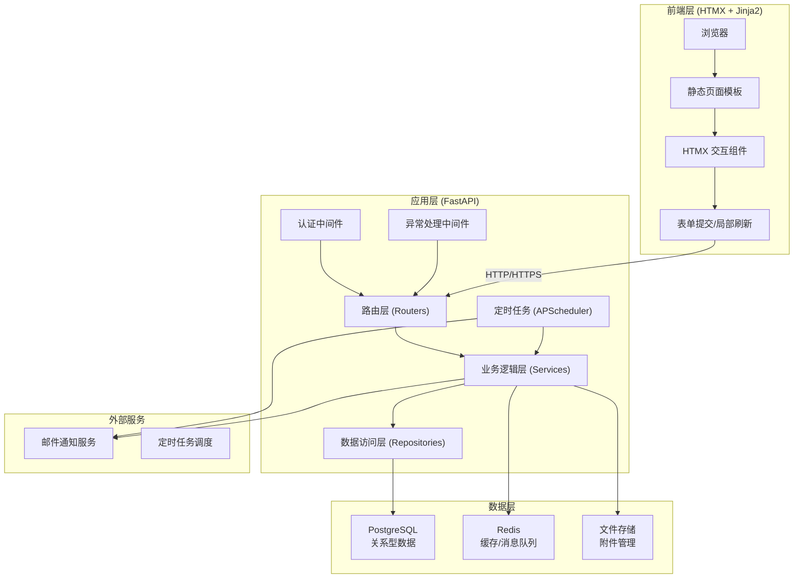
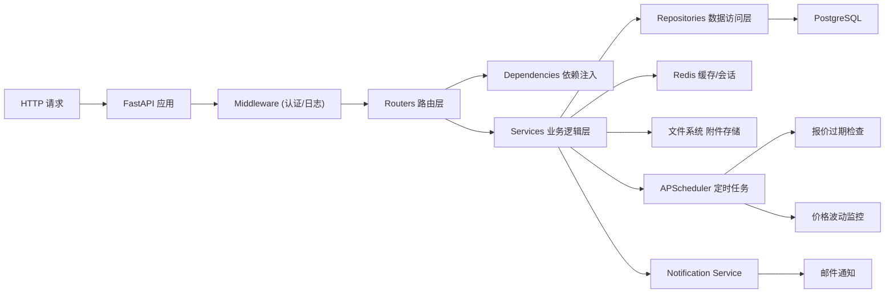
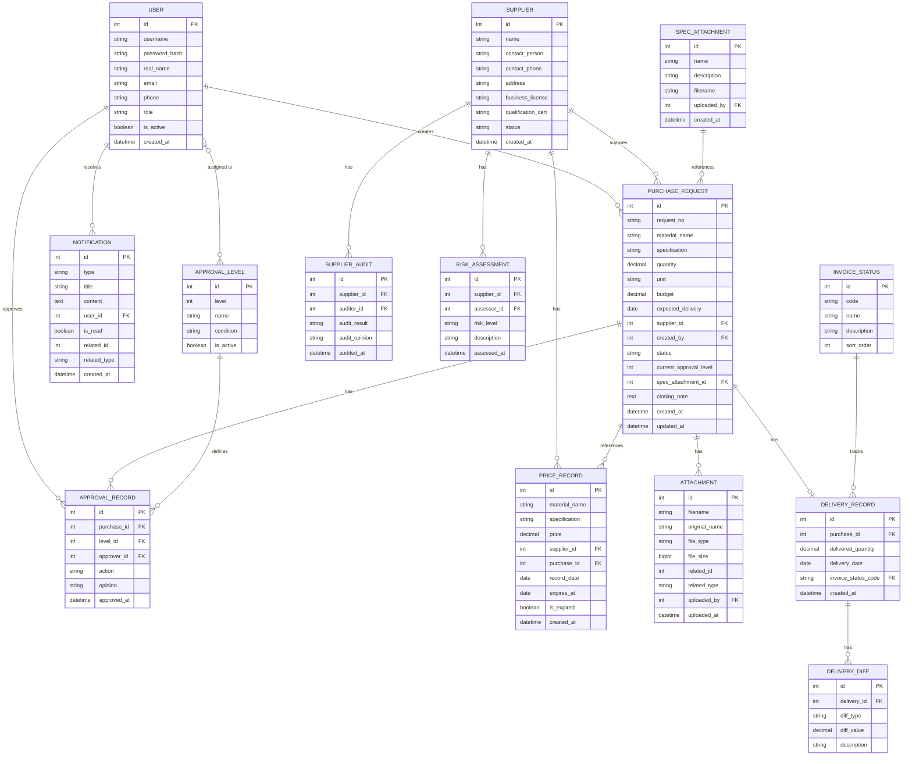

## 1. 架构设计



## 2. 技术描述

- **后端框架**: FastAPI 0.104.x + Python 3.11
- **模板引擎**: Jinja2 3.1.x
- **前端交互**: HTMX 1.9.x + 原生 JavaScript
- **ORM**: SQLAlchemy 2.0.x + Alembic
- **数据库**: PostgreSQL 15.x
- **缓存/消息**: Redis 7.x
- **定时任务**: APScheduler 3.10.x
- **认证**: OAuth2 + JWT + Passlib
- **文件上传**: python-multipart
- **样式**: TailwindCSS 3.x (CDN)
- **图表**: Chart.js (CDN)
- **图标**: Font Awesome (CDN)

## 3. 目录结构

```
project/
├── app/
│   ├── main.py              # FastAPI 应用入口
│   ├── config.py            # 配置管理
│   ├── database.py          # 数据库连接
│   ├── redis_client.py      # Redis 连接
│   ├── models/              # SQLAlchemy 模型
│   │   ├── __init__.py
│   │   ├── user.py
│   │   ├── purchase.py
│   │   ├── supplier.py
│   │   ├── approval.py
│   │   ├── price.py
│   │   ├── invoice.py
│   │   ├── delivery.py
│   │   └── attachment.py
│   ├── schemas/              # Pydantic 数据模型
│   │   ├── __init__.py
│   │   ├── user.py
│   │   ├── purchase.py
│   │   ├── supplier.py
│   │   ├── approval.py
│   │   ├── price.py
│   │   ├── invoice.py
│   │   ├── delivery.py
│   │   └── common.py
│   ├── services/             # 业务逻辑层
│   │   ├── __init__.py
│   │   ├── auth_service.py
│   │   ├── purchase_service.py
│   │   ├── supplier_service.py
│   │   ├── approval_service.py
│   │   ├── price_service.py
│   │   ├── notification_service.py
│   │   ├── delivery_service.py
│   │   └── admin_service.py
│   ├── repositories/         # 数据访问层
│   │   ├── __init__.py
│   │   ├── base.py
│   │   ├── user_repo.py
│   │   ├── purchase_repo.py
│   │   └── ...
│   ├── routers/              # API 路由
│   │   ├── __init__.py
│   │   ├── auth.py
│   │   ├── purchase.py
│   │   ├── supplier.py
│   │   ├── approval.py
│   │   ├── price.py
│   │   ├── admin.py
│   │   ├── notification.py
│   │   ├── delivery.py
│   │   └── pages.py         # 页面路由 (HTMX)
│   ├── templates/            # Jinja2 模板
│   │   ├── base.html
│   │   ├── components/
│   │   ├── purchase/
│   │   ├── supplier/
│   │   ├── approval/
│   │   ├── price/
│   │   ├── admin/
│   │   ├── notification/
│   │   └── delivery/
│   ├── static/               # 静态资源
│   │   ├── css/
│   │   ├── js/
│   │   └── uploads/
│   ├── middleware/           # 中间件
│   │   ├── auth.py
│   │   └── logging.py
│   ├── utils/                # 工具函数
│   │   ├── security.py
│   │   ├── file_handler.py
│   │   └── scheduler.py
│   └── dependencies.py       # 依赖注入
├── alembic/                  # 数据库迁移
├── requirements.txt
├── .env.example
└── start.sh
```

## 4. 路由定义

| 路由 | 方法 | 用途 | 权限 |
|------|------|------|------|
| / | GET | 首页/登录页 | 公开 |
| /login | POST | 用户登录 | 公开 |
| /logout | POST | 用户登出 | 已认证 |
| /dashboard | GET | 工作台 | 已认证 |
| /purchase | GET | 采购需求列表 | 采购员/审核员/负责人 |
| /purchase/new | GET | 采购需求提交页 | 采购员 |
| /purchase/new | POST | 提交采购需求 | 采购员 |
| /purchase/{id} | GET | 需求详情页 | 相关人员 |
| /purchase/{id}/close | POST | 关闭需求(补充说明) | 负责人 |
| /purchase/{id}/note | POST | 添加备注 | 相关人员 |
| /supplier | GET | 供应商列表 | 审核员/负责人 |
| /supplier/{id} | GET | 供应商详情 | 审核员/负责人 |
| /supplier/{id}/audit | POST | 资质审核 | 审核员 |
| /supplier/{id}/risk | POST | 风险评估 | 审核员 |
| /approval/level | GET | 审批层级配置 | 管理员 |
| /approval/level | POST | 保存审批层级 | 管理员 |
| /invoice/status | GET | 发票状态列表 | 管理员 |
| /invoice/status | POST | 新增/编辑发票状态 | 管理员 |
| /spec/attachment | GET | 规格附件列表 | 管理员 |
| /spec/attachment | POST | 上传规格附件 | 管理员 |
| /price/dashboard | GET | 价格波动看板 | 负责人/审核员 |
| /price/history/{material} | GET | 价格历史数据 | 负责人/审核员 |
| /notification | GET | 提醒中心 | 已认证 |
| /notification/{id}/read | POST | 标记已读 | 相关人员 |
| /delivery/dashboard | GET | 交付差异看板 | 负责人 |
| /delivery/sync | POST | 同步交付数据 | 审核员 |
| /attachment/upload | POST | 上传附件 | 已认证 |
| /attachment/{id}/download | GET | 下载附件 | 相关人员 |
| /api/v1/... | * | REST API 端点 | 按权限 |

## 5. API 数据模型

```python
# 用户模型
class UserBase(BaseModel):
    username: str
    real_name: str
    email: str
    phone: str | None = None
    role: str  # buyer, auditor, manager, admin

class UserCreate(UserBase):
    password: str

class UserResponse(UserBase):
    id: int
    is_active: bool
    created_at: datetime

# 采购需求模型
class PurchaseRequestBase(BaseModel):
    material_name: str
    specification: str
    quantity: float
    unit: str
    budget: Decimal
    expected_delivery: date
    remark: str | None = None

class PurchaseRequestCreate(PurchaseRequestBase):
    supplier_id: int | None = None

class PurchaseRequestResponse(PurchaseRequestBase):
    id: int
    request_no: str
    status: str  # draft, pending, approved, rejected, quoted, expired, delivered, closed
    current_approval_level: int
    created_by: int
    created_at: datetime
    updated_at: datetime

# 供应商模型
class SupplierBase(BaseModel):
    name: str
    contact_person: str
    contact_phone: str
    address: str
    business_license: str
    qualification_cert: str

class SupplierAudit(BaseModel):
    supplier_id: int
    audit_result: str  # pass, reject
    audit_opinion: str

class SupplierRisk(BaseModel):
    supplier_id: int
    risk_level: str  # low, medium, high
    risk_description: str

# 价格模型
class PriceRecord(BaseModel):
    id: int
    material_name: str
    specification: str
    price: Decimal
    supplier_id: int
    record_date: date
    is_expired: bool
    expires_at: date | None = None

# 审批层级模型
class ApprovalLevelConfig(BaseModel):
    id: int | None = None
    level: int
    name: str
    approver_ids: list[int]
    condition: str | None = None  # e.g., "budget > 100000"

# 发票状态模型
class InvoiceStatus(BaseModel):
    id: int | None = None
    code: str
    name: str
    description: str | None = None
    sort_order: int

# 提醒模型
class Notification(BaseModel):
    id: int
    type: str  # price_expiry, approval, delivery, risk
    title: str
    content: str
    user_id: int
    is_read: bool
    related_id: int | None = None
    related_type: str | None = None
    created_at: datetime

# 附件模型
class Attachment(BaseModel):
    id: int
    filename: str
    original_name: str
    file_type: str
    file_size: int
    related_id: int
    related_type: str  # purchase, supplier, spec
    uploaded_by: int
    uploaded_at: datetime
```

## 6. 服务器架构



## 7. 数据模型

### 7.1 ER 图



### 7.2 DDL 语句

```sql
-- 创建枚举类型
CREATE TYPE user_role AS ENUM ('buyer', 'auditor', 'manager', 'admin');
CREATE TYPE approval_action AS ENUM ('approve', 'reject', 'transfer');
CREATE TYPE risk_level AS ENUM ('low', 'medium', 'high');
CREATE TYPE notification_type AS ENUM ('price_expiry', 'approval', 'delivery', 'risk', 'system');
CREATE TYPE purchase_status AS ENUM ('draft', 'pending', 'approved', 'rejected', 'quoted', 'expired', 'delivered', 'closed');

-- 用户表
CREATE TABLE users (
    id SERIAL PRIMARY KEY,
    username VARCHAR(50) UNIQUE NOT NULL,
    password_hash VARCHAR(255) NOT NULL,
    real_name VARCHAR(100) NOT NULL,
    email VARCHAR(100) UNIQUE NOT NULL,
    phone VARCHAR(20),
    role user_role NOT NULL,
    is_active BOOLEAN DEFAULT true,
    created_at TIMESTAMP DEFAULT CURRENT_TIMESTAMP
);

-- 供应商表
CREATE TABLE suppliers (
    id SERIAL PRIMARY KEY,
    name VARCHAR(200) NOT NULL,
    contact_person VARCHAR(100) NOT NULL,
    contact_phone VARCHAR(20) NOT NULL,
    address TEXT,
    business_license VARCHAR(200),
    qualification_cert VARCHAR(200),
    status VARCHAR(20) DEFAULT 'pending',
    created_at TIMESTAMP DEFAULT CURRENT_TIMESTAMP
);

-- 供应商审核表
CREATE TABLE supplier_audits (
    id SERIAL PRIMARY KEY,
    supplier_id INTEGER REFERENCES suppliers(id) ON DELETE CASCADE,
    auditor_id INTEGER REFERENCES users(id),
    audit_result VARCHAR(20) NOT NULL,
    audit_opinion TEXT,
    audited_at TIMESTAMP DEFAULT CURRENT_TIMESTAMP
);

-- 风险评估表
CREATE TABLE risk_assessments (
    id SERIAL PRIMARY KEY,
    supplier_id INTEGER REFERENCES suppliers(id) ON DELETE CASCADE,
    assessor_id INTEGER REFERENCES users(id),
    risk_level risk_level NOT NULL,
    description TEXT,
    assessed_at TIMESTAMP DEFAULT CURRENT_TIMESTAMP
);

-- 采购需求表
CREATE TABLE purchase_requests (
    id SERIAL PRIMARY KEY,
    request_no VARCHAR(50) UNIQUE NOT NULL,
    material_name VARCHAR(200) NOT NULL,
    specification VARCHAR(500),
    quantity DECIMAL(12,2) NOT NULL,
    unit VARCHAR(20) NOT NULL,
    budget DECIMAL(12,2) NOT NULL,
    expected_delivery DATE NOT NULL,
    supplier_id INTEGER REFERENCES suppliers(id),
    created_by INTEGER REFERENCES users(id),
    status purchase_status DEFAULT 'draft',
    current_approval_level INTEGER DEFAULT 1,
    spec_attachment_id INTEGER,
    closing_note TEXT,
    created_at TIMESTAMP DEFAULT CURRENT_TIMESTAMP,
    updated_at TIMESTAMP DEFAULT CURRENT_TIMESTAMP
);

-- 审批层级配置表
CREATE TABLE approval_levels (
    id SERIAL PRIMARY KEY,
    level INTEGER NOT NULL,
    name VARCHAR(100) NOT NULL,
    condition TEXT,
    is_active BOOLEAN DEFAULT true
);

-- 审批层级-用户关联表
CREATE TABLE approval_level_users (
    id SERIAL PRIMARY KEY,
    level_id INTEGER REFERENCES approval_levels(id) ON DELETE CASCADE,
    user_id INTEGER REFERENCES users(id) ON DELETE CASCADE,
    UNIQUE(level_id, user_id)
);

-- 审批记录表
CREATE TABLE approval_records (
    id SERIAL PRIMARY KEY,
    purchase_id INTEGER REFERENCES purchase_requests(id) ON DELETE CASCADE,
    level_id INTEGER REFERENCES approval_levels(id),
    approver_id INTEGER REFERENCES users(id),
    action approval_action NOT NULL,
    opinion TEXT,
    approved_at TIMESTAMP DEFAULT CURRENT_TIMESTAMP
);

-- 价格记录表
CREATE TABLE price_records (
    id SERIAL PRIMARY KEY,
    material_name VARCHAR(200) NOT NULL,
    specification VARCHAR(500),
    price DECIMAL(12,2) NOT NULL,
    supplier_id INTEGER REFERENCES suppliers(id),
    purchase_id INTEGER REFERENCES purchase_requests(id),
    record_date DATE NOT NULL,
    expires_at DATE,
    is_expired BOOLEAN DEFAULT false,
    created_at TIMESTAMP DEFAULT CURRENT_TIMESTAMP
);

-- 提醒表
CREATE TABLE notifications (
    id SERIAL PRIMARY KEY,
    type notification_type NOT NULL,
    title VARCHAR(200) NOT NULL,
    content TEXT,
    user_id INTEGER REFERENCES users(id) ON DELETE CASCADE,
    is_read BOOLEAN DEFAULT false,
    related_id INTEGER,
    related_type VARCHAR(50),
    created_at TIMESTAMP DEFAULT CURRENT_TIMESTAMP
);

-- 附件表
CREATE TABLE attachments (
    id SERIAL PRIMARY KEY,
    filename VARCHAR(255) NOT NULL,
    original_name VARCHAR(255) NOT NULL,
    file_type VARCHAR(100),
    file_size BIGINT NOT NULL,
    related_id INTEGER NOT NULL,
    related_type VARCHAR(50) NOT NULL,
    uploaded_by INTEGER REFERENCES users(id),
    uploaded_at TIMESTAMP DEFAULT CURRENT_TIMESTAMP
);

-- 交付记录表
CREATE TABLE delivery_records (
    id SERIAL PRIMARY KEY,
    purchase_id INTEGER REFERENCES purchase_requests(id) ON DELETE CASCADE,
    delivered_quantity DECIMAL(12,2) NOT NULL,
    delivery_date DATE NOT NULL,
    invoice_status_code VARCHAR(50),
    created_at TIMESTAMP DEFAULT CURRENT_TIMESTAMP
);

-- 交付差异表
CREATE TABLE delivery_diffs (
    id SERIAL PRIMARY KEY,
    delivery_id INTEGER REFERENCES delivery_records(id) ON DELETE CASCADE,
    diff_type VARCHAR(50) NOT NULL,
    diff_value DECIMAL(12,2) NOT NULL,
    description TEXT,
    created_at TIMESTAMP DEFAULT CURRENT_TIMESTAMP
);

-- 发票状态表
CREATE TABLE invoice_status (
    id SERIAL PRIMARY KEY,
    code VARCHAR(50) UNIQUE NOT NULL,
    name VARCHAR(100) NOT NULL,
    description TEXT,
    sort_order INTEGER DEFAULT 0
);

-- 规格附件表
CREATE TABLE spec_attachments (
    id SERIAL PRIMARY KEY,
    name VARCHAR(200) NOT NULL,
    description TEXT,
    filename VARCHAR(255) NOT NULL,
    uploaded_by INTEGER REFERENCES users(id),
    created_at TIMESTAMP DEFAULT CURRENT_TIMESTAMP
);

-- 备注表
CREATE TABLE notes (
    id SERIAL PRIMARY KEY,
    related_id INTEGER NOT NULL,
    related_type VARCHAR(50) NOT NULL,
    content TEXT NOT NULL,
    created_by INTEGER REFERENCES users(id),
    created_at TIMESTAMP DEFAULT CURRENT_TIMESTAMP
);

-- 创建索引
CREATE INDEX idx_purchase_status ON purchase_requests(status);
CREATE INDEX idx_purchase_created_by ON purchase_requests(created_by);
CREATE INDEX idx_supplier_status ON suppliers(status);
CREATE INDEX idx_price_material ON price_records(material_name, specification);
CREATE INDEX idx_price_expiry ON price_records(expires_at) WHERE is_expired = false;
CREATE INDEX idx_notification_user ON notifications(user_id, is_read);
CREATE INDEX idx_attachment_related ON attachments(related_id, related_type);
CREATE INDEX idx_approval_purchase ON approval_records(purchase_id);

-- 插入初始数据
INSERT INTO users (username, password_hash, real_name, email, role) VALUES
('admin', '$2b$12$LQv3c1yqBWVHxkd0LHAkCOYz6TtxMQJqhN8/LewYGyJz3HxK5yXOi', '系统管理员', 'admin@example.com', 'admin'),
('buyer1', '$2b$12$LQv3c1yqBWVHxkd0LHAkCOYz6TtxMQJqhN8/LewYGyJz3HxK5yXOi', '采购员张三', 'buyer1@example.com', 'buyer'),
('auditor1', '$2b$12$LQv3c1yqBWVHxkd0LHAkCOYz6TtxMQJqhN8/LewYGyJz3HxK5yXOi', '审核员李四', 'auditor1@example.com', 'auditor'),
('manager1', '$2b$12$LQv3c1yqBWVHxkd0LHAkCOYz6TtxMQJqhN8/LewYGyJz3HxK5yXOi', '项目负责人王五', 'manager1@example.com', 'manager');

INSERT INTO approval_levels (level, name, condition) VALUES
(1, '一级审批', 'budget <= 50000'),
(2, '二级审批', 'budget > 50000 AND budget <= 200000'),
(3, '三级审批', 'budget > 200000');

INSERT INTO approval_level_users (level_id, user_id) VALUES
(1, 3), (2, 3), (2, 4), (3, 4);

INSERT INTO invoice_status (code, name, description, sort_order) VALUES
('not_issued', '未开票', '尚未开具发票', 1),
('issued', '已开票', '发票已开具', 2),
('received', '已收到', '发票已收到', 3),
('verified', '已认证', '发票已认证', 4),
('reimbursed', '已报销', '已完成报销', 5);
```
