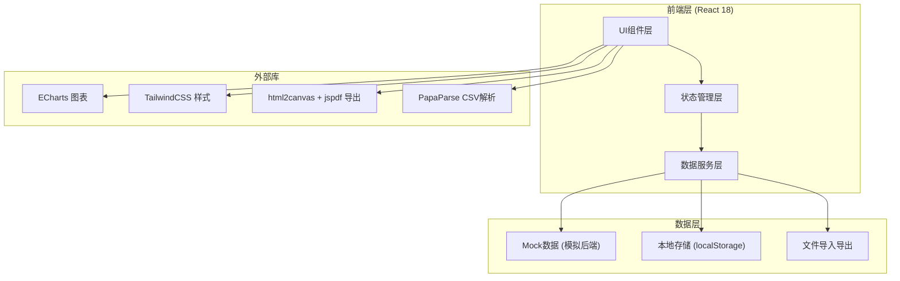
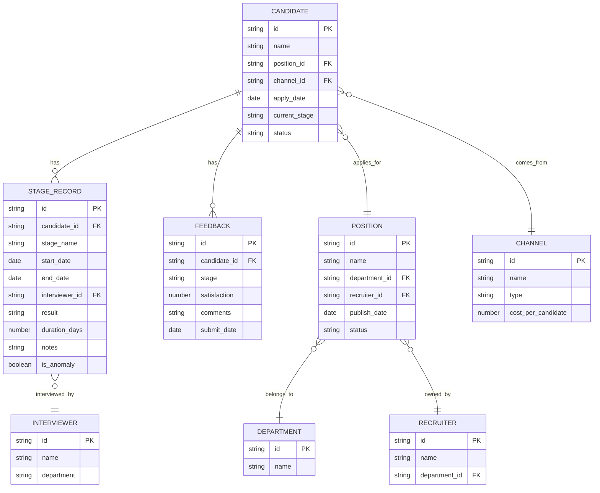

## 1. 架构设计



## 2. 技术描述

- **前端框架**: React 18 + TypeScript
- **构建工具**: Vite 5
- **样式方案**: TailwindCSS 3
- **图表库**: ECharts 5
- **状态管理**: React Context + useReducer (轻量级，避免过度设计)
- **路由**: React Router DOM 6
- **CSV处理**: PapaParse
- **PDF导出**: html2canvas + jspdf
- **日期处理**: date-fns
- **UI组件**: 自定义组件 + Headless UI (弹窗、下拉等无样式组件)
- **Mock数据**: 内置模拟数据，支持真实数据接入

## 3. 目录结构

```
src/
├── components/           # 通用组件
│   ├── charts/          # 图表组件（漏斗图、折线图等）
│   ├── layout/          # 布局组件
│   ├── filters/         # 筛选器组件
│   ├── cards/           # 指标卡片组件
│   ├── tables/          # 数据表格组件
│   └── modals/          # 弹窗组件
├── pages/               # 页面组件
│   ├── Dashboard/       # 仪表盘概览
│   ├── Efficiency/      # 流程效率分析
│   ├── Channel/         # 渠道质量分析
│   ├── Interviewer/     # 面试官负载
│   ├── Feedback/        # 候选人反馈
│   ├── DataManager/     # 数据管理
│   └── Records/         # 原始记录
├── context/             # 状态管理
│   ├── FilterContext.tsx   # 全局筛选状态
│   └── DataContext.tsx     # 数据状态
├── data/                # Mock数据和类型
│   ├── mockData.ts      # 模拟数据
│   └── types.ts         # TypeScript类型定义
├── hooks/               # 自定义Hooks
│   ├── useFilter.ts     # 筛选逻辑
│   ├── useExport.ts     # 导出功能
│   └── useChartData.ts  # 图表数据处理
├── utils/               # 工具函数
│   ├── dataProcess.ts   # 数据处理函数
│   ├── export.ts        # 导出工具
│   └── format.ts        # 格式化函数
└── App.tsx              # 应用入口
```

## 4. 路由定义

| 路由 | 页面 | 说明 |
|-------|---------|------|
| / | 仪表盘概览 | 核心KPI、趋势图、招聘漏斗 |
| /efficiency | 流程效率分析 | 阶段耗时、部门对比、招聘官排名 |
| /channel | 渠道质量分析 | 渠道漏斗对比、成本效益 |
| /interviewer | 面试官负载 | 工作量统计、日程分布 |
| /feedback | 候选人反馈 | 满意度统计、关键词云 |
| /data | 数据管理 | 数据导入、数据字典、数据质量 |
| /records | 原始记录 | 候选人明细、详情弹窗 |

## 5. 数据模型

### 5.1 数据模型ER图



### 5.2 核心数据类型定义

```typescript
// 候选人
interface Candidate {
  id: string;
  name: string;
  positionId: string;
  positionName: string;
  departmentId: string;
  departmentName: string;
  channelId: string;
  channelName: string;
  recruiterId: string;
  recruiterName: string;
  applyDate: Date;
  currentStage: string;
  status: 'in_progress' | 'hired' | 'rejected' | 'offer_declined';
  stages: StageRecord[];
  feedback?: Feedback;
}

// 阶段记录
interface StageRecord {
  id: string;
  candidateId: string;
  stage: 'resume' | 'screen' | 'interview_1' | 'interview_2' | 'interview_3' | 'offer' | 'onboard';
  stageName: string;
  startDate: Date;
  endDate?: Date;
  interviewerId?: string;
  interviewerName?: string;
  result?: 'pass' | 'fail' | 'pending';
  durationDays?: number;
  notes?: string;
  isAnomaly: boolean;
  anomalyReason?: string;
}

// 筛选状态
interface FilterState {
  dateRange: [Date, Date];
  departments: string[];
  positions: string[];
  recruiters: string[];
  channels: string[];
  stages: string[];
  status: string[];
}

// KPI指标
interface KPIData {
  positionCount: number;
  resumeCount: number;
  interviewCount: number;
  offerCount: number;
  onboardCount: number;
  avgCycleDays: number;
  conversionRate: number;
}
```

## 6. 关键技术决策

### 6.1 状态管理
- 使用 React Context + useReducer 管理全局筛选状态和数据状态
- 筛选状态变化时自动触发所有图表数据更新
- 支持筛选条件的持久化存储（localStorage）

### 6.2 图表实现
- 基于 ECharts 封装通用图表组件
- 支持图表点击事件，实现下钻联动
- 统一的配色方案和样式规范

### 6.3 数据导出
- CSV导出：使用 PapaParse 处理数据格式化
- PDF导出：使用 html2canvas 截图 + jspdf 生成PDF
- 截图导出：使用 html2canvas 直接下载图片

### 6.4 数据质量处理
- 缺失值统计和可视化展示
- 异常值检测算法（基于四分位距）
- 数据导入时的字段映射和验证
