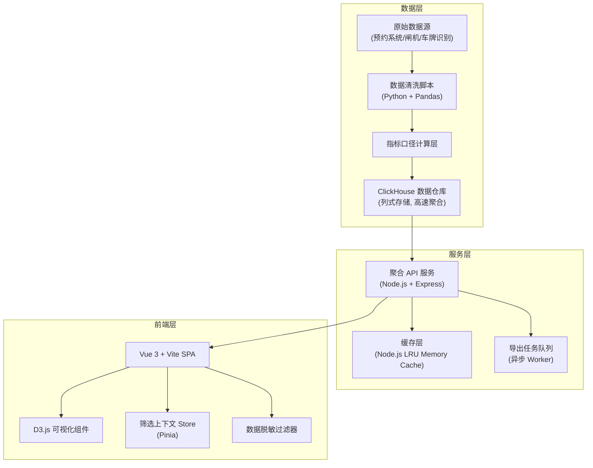
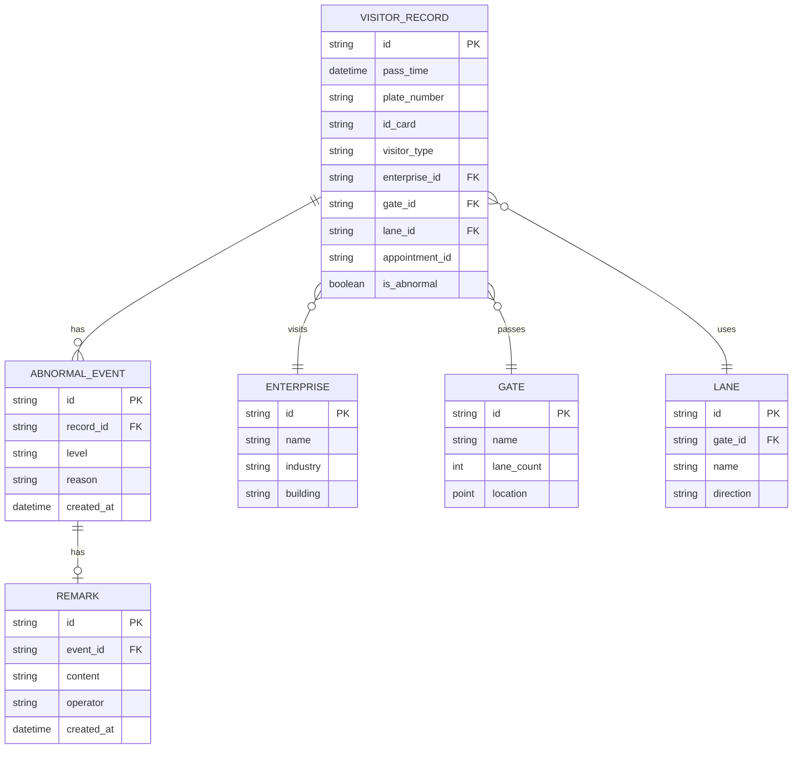

# 工业园区访客流量分析系统 - 技术架构文档

## 1. 整体架构设计



## 2. 技术栈说明

### 2.1 前端技术栈
- **框架**：Vue 3 (Composition API) + Vite 5
- **状态管理**：Pinia（管理筛选上下文，确保图表间联动）
- **可视化**：D3.js v7（热力图、趋势图、排行榜）
- **样式**：TailwindCSS 3 + CSS Variables 主题系统
- **UI 组件**：自定义组件（不引入 Element Plus 等重型库，保持轻量）
- **导出**：xlsx + file-saver（前端流式导出）

### 2.2 后端技术栈
- **服务端**：Node.js + Express
- **数据层模拟**：内存数据库模拟 ClickHouse 查询接口
- **缓存**：lru-cache（TTL 过期策略，按筛选条件哈希缓存）
- **导出任务**：异步队列 + Worker Threads
- **数据生成**：Python + Faker（生成演示数据）

### 2.3 数据处理
- **清洗脚本**：Python + Pandas
- **脱敏规则**：内置脱敏函数库
- **指标口径**：独立配置文件管理，避免硬编码

## 3. 目录结构与文件映射

### 3.1 前端目录
```
src/
├── main.js                    # 应用入口
├── App.vue                    # 根组件
├── assets/
│   └── styles/
│       └── theme.css          # 工业科技风主题变量
├── components/
│   ├── dashboard/
│   │   ├── ExceptionSummary.vue    # 异常摘要区
│   │   ├── FilterBar.vue           # 多维筛选栏
│   │   └── KpiCard.vue             # KPI 指标卡片
│   ├── charts/
│   │   ├── HeatmapChart.vue        # 入口热力图 (D3)
│   │   ├── TrendChart.vue          # 时段趋势图 (D3)
│   │   ├── RankBarChart.vue        # 企业排行榜 (D3)
│   │   └── ChartTooltip.vue        # 通用提示框
│   └── tables/
│       └── ExceptionTable.vue      # 异常明细表格
├── stores/
│   └── filterStore.js         # 筛选上下文 Pinia Store
├── utils/
│   ├── desensitize.js         # 脱敏工具函数
│   └── api.js                 # API 请求封装
├── mock/
│   └── data.js                # 前端演示数据（兜底用）
└── views/
    └── AnalysisDashboard.vue  # 分析主页面
```

### 3.2 后端/数据目录
```
server/
├── index.js                   # Express 服务入口
├── routes/
│   ├── aggregate.js           # 聚合数据 API
│   └── export.js              # 导出任务 API
├── services/
│   ├── cacheService.js        # 缓存服务
│   ├── clickhouse.js          # ClickHouse 模拟查询层
│   └── exportWorker.js        # 导出任务 Worker
├── data/
│   ├── raw/                   # 原始数据
│   ├── cleaned/               # 清洗后数据
│   └── metrics.json           # 指标口径定义
└── scripts/
    ├── data_cleaner.py        # 数据清洗脚本
    └── generate_demo.py       # 演示数据生成脚本
```

## 4. API 接口定义

### 4.1 聚合数据接口

**GET /api/aggregate/overview**
- 功能：获取异常摘要和 KPI 数据
- 请求参数：`{ startDate, endDate, enterpriseIds?, gateIds?, visitorTypes?, lanes? }`
- 响应类型：
```typescript
interface OverviewResponse {
  totalVisitors: number;
  totalAbnormal: number;
  peakHour: string;
  peakVisitorCount: number;
  abnormalEvents: Array<{
    id: string;
    level: 'critical' | 'warning' | 'info';
    time: string;
    description: string;
    hasRemark: boolean;
  }>;
  trend: Array<{ hour: string; count: number; abnormal: number }>;
}
```

**GET /api/aggregate/heatmap**
- 功能：获取入口热力图数据
- 参数：同 overview，额外 `granularity: 'hour' | 'day'`
- 响应：`Array<{ gateId: string; gateName: string; hour: number; count: number }>`

**GET /api/aggregate/rank**
- 功能：获取企业排行数据
- 参数：同 overview，额外 `sortBy: 'total' | 'abnormal'`, `limit: number`
- 响应：`Array<{ enterpriseId: string; enterpriseName: string; total: number; abnormal: number; rank: number }>`

**GET /api/aggregate/exceptions**
- 功能：异常放行明细（分页）
- 参数：同 overview + `page, pageSize`
- 响应：
```typescript
interface ExceptionListResponse {
  total: number;
  list: Array<{
    id: string;
    time: string;
    plateNumber: string;      // 已脱敏
    idCard: string;           // 已脱敏
    visitorType: string;
    gateName: string;
    lane: string;
    enterpriseName: string;
    reason: string;
    remark?: string;
    operator: string;
  }>;
}
```

**GET /api/aggregate/trend**
- 功能：时段趋势数据，包含缺失值标记
- 响应：`Array<{ time: string; count: number; isMissing: boolean; isPeak: boolean; remark?: string }>`

### 4.2 备注接口

**POST /api/exceptions/:id/remark**
- 功能：添加/更新异常事件备注
- 请求体：`{ remark: string }`

### 4.3 导出接口

**POST /api/export/create**
- 功能：创建导出任务
- 请求体：筛选条件 + `format: 'xlsx' | 'csv'`
- 响应：`{ taskId: string, status: 'pending' }`

**GET /api/export/:taskId/status**
- 功能：查询导出任务状态

**GET /api/export/:taskId/download**
- 功能：下载导出文件

## 5. 数据模型

### 5.1 ER 图



### 5.2 指标口径定义 (`metrics.json`)

```json
{
  "metrics": {
    "total_visitors": {
      "name": "访客总量",
      "definition": "统计周期内通过闸机的访客记录总数，去重以 pass_id 为准",
      "calculation": "COUNT(DISTINCT pass_id)",
      "timeGranularity": ["hour", "day", "week"]
    },
    "abnormal_rate": {
      "name": "异常放行率",
      "definition": "异常放行记录数 / 总访客记录数 * 100%",
      "calculation": "SUM(CASE WHEN is_abnormal = 1 THEN 1 ELSE 0 END) / COUNT(*)",
      "warningThreshold": 5,
      "criticalThreshold": 15
    },
    "peak_hour": {
      "name": "高峰时段",
      "definition": "访客量最高的小时区间",
      "calculation": "按小时分组取 MAX(count)"
    },
    "missing_data_flag": {
      "name": "缺失数据标记",
      "definition": "连续15分钟无闸机数据上传标记为数据缺失",
      "calculation": "时间差判断 + 插值标记"
    }
  },
  "dimensions": {
    "enterprise": { "label": "被访企业", "field": "enterprise_id" },
    "gate": { "label": "入口", "field": "gate_id" },
    "visitorType": { "label": "访客类型", "field": "visitor_type" },
    "timeRange": { "label": "时段", "field": "pass_time" },
    "lane": { "label": "车道", "field": "lane_id" }
  }
}
```

## 6. 缓存策略

### 6.1 缓存键设计
- 格式：`agg:{api_name}:{hash(filterParams)}`
- 示例：`agg:heatmap:a1b2c3d4e5f6`

### 6.2 缓存 TTL
- 概览数据：5 分钟
- 热力图/排行榜：10 分钟
- 明细数据：1 分钟
- 导出任务：永久存储至任务完成后 24 小时

### 6.3 缓存失效
- 备注更新时，主动失效该异常事件所在时间范围的相关缓存
- 每日凌晨清空所有日粒度缓存

## 7. 数据脱敏规则

| 字段 | 脱敏前 | 脱敏后 | 规则 |
|------|--------|--------|------|
| 车牌号码 | 粤B12345 | 粤B·12*** | 保留省份简称+首字母，后三位用*代替 |
| 身份证号 | 440301199001011234 | 440***********1234 | 前3位 + 11个* + 后4位 |
| 姓名 | 张三 | *三 | 姓用*代替，保留名 |
| 手机号 | 13800138000 | 138****8000 | 前3位 + 4个* + 后4位 |

## 8. 演示数据设计

### 8.1 数据场景
1. **正常趋势**：工作日早高峰 8:00-10:00，晚高峰 17:00-19:00，午间低谷
2. **缺失值**：模拟某一天 13:00-14:00 闸机系统维护，无数据上传
3. **异常峰值**：模拟某企业举办大型会议，访客量突增 300%，伴随多起异常放行
4. **人工备注**：对关键异常事件添加安保经理的分析备注

### 8.2 数据量
- 访客记录：约 50,000 条（30 天跨度）
- 企业：20 家
- 入口：6 个（东门、西门、南门、北门、人行A、人行B）
- 异常记录：约 1,500 条（3% 异常率）
- 备注：约 50 条人工备注
