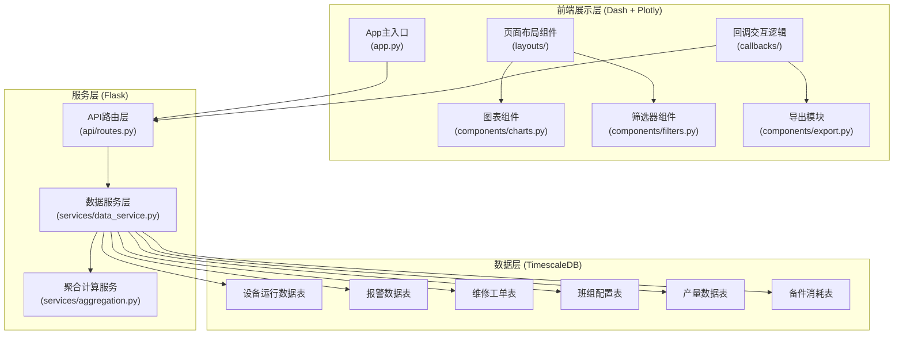
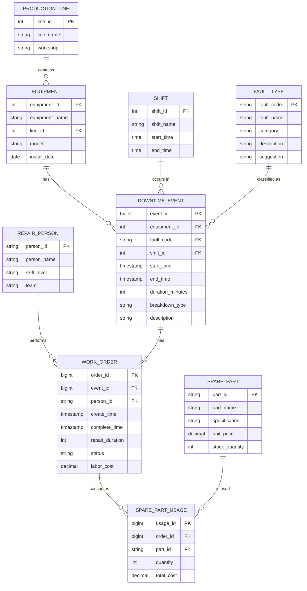

## 1. 架构设计



## 2. 技术描述
- **前端框架**: Dash@2.16 + Plotly@5.18 + Flask@2.3
- **样式方案**: Dash Bootstrap Components@1.5 + 自定义CSS
- **后端服务**: Flask RESTful API (集成在Dash中)
- **数据库**: TimescaleDB (PostgreSQL 15+ TimescaleDB 2.13扩展)
- **数据处理**: Pandas@2.1 + NumPy@1.26
- **报表导出**: ReportLab (PDF) + OpenPyXL (Excel)
- **初始化方式**: 虚拟环境 + pip + requirements.txt

## 3. 目录结构

```
/
├── app.py                      # Dash应用主入口
├── requirements.txt            # 依赖包列表
├── .env.example                # 环境变量示例
├── assets/
│   ├── css/
│   │   └── custom.css          # 自定义样式
│   └── img/                    # 静态图片资源
├── components/
│   ├── __init__.py
│   ├── filters.py              # 筛选器组件
│   ├── charts.py               # 图表组件
│   ├── kpi_cards.py            # KPI卡片组件
│   └── export.py               # 导出组件
├── layouts/
│   ├── __init__.py
│   ├── overview.py             # 总体概览页
│   ├── pareto.py               # Pareto分析页
│   ├── line_compare.py         # 产线对比页
│   ├── maintenance.py          # 维修效率页
│   └── spare_parts.py          # 备件关联页
├── callbacks/
│   ├── __init__.py
│   ├── filter_callbacks.py     # 筛选器回调
│   ├── chart_callbacks.py      # 图表更新回调
│   └── export_callbacks.py     # 导出回调
├── services/
│   ├── __init__.py
│   ├── data_service.py         # 数据查询服务
│   └── aggregation.py          # 数据聚合计算
├── api/
│   ├── __init__.py
│   └── routes.py               # API路由
├── database/
│   ├── __init__.py
│   ├── connection.py           # 数据库连接
│   ├── models.py               # 数据模型
│   └── sample_data.py          # 模拟数据生成
└── utils/
    ├── __init__.py
    ├── validators.py           # 数据校验
    └── helpers.py              # 辅助函数
```

## 4. API接口定义

### 4.1 维度聚合接口

**GET /api/aggregation/downtime**

请求参数：
```typescript
interface DowntimeQuery {
  dimensions: string[];        // 聚合维度: ['equipment', 'line', 'shift', 'fault_type', 'repair_person']
  start_date: string;          // ISO格式日期
  end_date: string;
  equipment_ids?: number[];    // 可选筛选
  line_ids?: number[];
  shift_ids?: number[];
  fault_types?: string[];
  repair_persons?: string[];
  breakdown_type?: 'planned' | 'unplanned' | 'all';  // 计划/突发/全部
}
```

响应数据：
```typescript
interface AggregationResult {
  data: Array<{
    [dimension: string]: string | number;
    total_duration: number;     // 总停机时长(分钟)
    count: number;              // 停机次数
    avg_duration: number;       // 平均时长
    planned_duration: number;   // 计划检修时长
    unplanned_duration: number; // 突发停机时长
  }>;
  metadata: {
    query: DowntimeQuery;
    data_source: string;
    update_time: string;
    caliber_note: string;       // 口径说明
  };
}
```

### 4.2 Pareto分析接口

**GET /api/pareto/fault-types**

响应数据：
```typescript
interface ParetoResult {
  items: Array<{
    fault_type: string;
    fault_name: string;
    duration: number;
    count: number;
    percentage: number;
    cumulative_percentage: number;
    description: string;        // 故障解释
    suggestion: string;         // 建议动作
  }>;
  total_duration: number;
  pareto_threshold: number;     // 80%阈值
  top_items: string[];          // 占80%的故障类型
}
```

### 4.3 维修效率接口

**GET /api/maintenance/efficiency**

响应数据：
```typescript
interface MaintenanceEfficiency {
  mttr: number;                 // 平均修复时间(分钟)
  mtbf: number;                 // 平均故障间隔(小时)
  by_person: Array<{
    person_id: string;
    person_name: string;
    mttr: number;
    completed_count: number;
    avg_cost: number;
  }>;
  duration_distribution: Array<{
    bucket: string;
    count: number;
  }>;
}
```

### 4.4 备件关联接口

**GET /api/spare-parts/correlation**

响应数据：
```typescript
interface SparePartCorrelation {
  matrix: Array<{
    fault_type: string;
    part_name: string;
    usage_count: number;
    total_cost: number;
    correlation_score: number;  // 关联度评分 0-1
  }>;
  top_correlations: Array<{
    fault_type: string;
    part_name: string;
    description: string;
  }>;
}
```

## 5. 数据模型

### 5.1 ER图



### 5.2 DDL语句

```sql
-- TimescaleDB 扩展
CREATE EXTENSION IF NOT EXISTS timescaledb;

-- 生产线表
CREATE TABLE production_line (
    line_id SERIAL PRIMARY KEY,
    line_name VARCHAR(50) NOT NULL,
    workshop VARCHAR(50),
    created_at TIMESTAMP DEFAULT CURRENT_TIMESTAMP
);

-- 设备表
CREATE TABLE equipment (
    equipment_id SERIAL PRIMARY KEY,
    equipment_name VARCHAR(100) NOT NULL,
    line_id INTEGER REFERENCES production_line(line_id),
    model VARCHAR(100),
    install_date DATE,
    status VARCHAR(20) DEFAULT 'active'
);

-- 班次表
CREATE TABLE shift (
    shift_id SERIAL PRIMARY KEY,
    shift_name VARCHAR(20) NOT NULL,
    start_time TIME NOT NULL,
    end_time TIME NOT NULL
);

-- 故障类型表
CREATE TABLE fault_type (
    fault_code VARCHAR(20) PRIMARY KEY,
    fault_name VARCHAR(100) NOT NULL,
    category VARCHAR(50),
    description TEXT,
    suggestion TEXT
);

-- 维修人员表
CREATE TABLE repair_person (
    person_id VARCHAR(20) PRIMARY KEY,
    person_name VARCHAR(50) NOT NULL,
    skill_level VARCHAR(20),
    team VARCHAR(50)
);

-- 备件表
CREATE TABLE spare_part (
    part_id VARCHAR(50) PRIMARY KEY,
    part_name VARCHAR(100) NOT NULL,
    specification VARCHAR(200),
    unit_price DECIMAL(10,2),
    stock_quantity INTEGER DEFAULT 0
);

-- 停机事件表 (使用TimescaleDB超表)
CREATE TABLE downtime_event (
    event_id BIGSERIAL,
    equipment_id INTEGER NOT NULL REFERENCES equipment(equipment_id),
    fault_code VARCHAR(20) REFERENCES fault_type(fault_code),
    shift_id INTEGER REFERENCES shift(shift_id),
    start_time TIMESTAMPTZ NOT NULL,
    end_time TIMESTAMPTZ,
    duration_minutes INTEGER,
    breakdown_type VARCHAR(20) NOT NULL, -- 'planned' 或 'unplanned'
    description TEXT,
    created_at TIMESTAMP DEFAULT CURRENT_TIMESTAMP
);

-- 创建超表
SELECT create_hypertable('downtime_event', 'start_time');

-- 索引
CREATE INDEX idx_downtime_equipment ON downtime_event(equipment_id);
CREATE INDEX idx_downtime_fault ON downtime_event(fault_code);
CREATE INDEX idx_downtime_breakdown_type ON downtime_event(breakdown_type);
CREATE INDEX idx_downtime_time ON downtime_event(start_time, end_time);

-- 维修工单表
CREATE TABLE work_order (
    order_id BIGSERIAL PRIMARY KEY,
    event_id BIGINT NOT NULL,
    person_id VARCHAR(20) REFERENCES repair_person(person_id),
    create_time TIMESTAMPTZ NOT NULL,
    complete_time TIMESTAMPTZ,
    repair_duration INTEGER,
    status VARCHAR(20) DEFAULT 'pending',
    labor_cost DECIMAL(10,2) DEFAULT 0,
    created_at TIMESTAMP DEFAULT CURRENT_TIMESTAMP
);

-- 备件使用记录表
CREATE TABLE spare_part_usage (
    usage_id BIGSERIAL PRIMARY KEY,
    order_id BIGINT NOT NULL REFERENCES work_order(order_id),
    part_id VARCHAR(50) NOT NULL REFERENCES spare_part(part_id),
    quantity INTEGER NOT NULL,
    total_cost DECIMAL(10,2),
    created_at TIMESTAMP DEFAULT CURRENT_TIMESTAMP
);

-- 初始化基础数据
INSERT INTO production_line (line_name, workshop) VALUES
('1号线', '装配车间'),
('2号线', '装配车间'),
('3号线', '机加工车间'),
('4号线', '机加工车间');

INSERT INTO shift (shift_name, start_time, end_time) VALUES
('早班', '08:00:00', '16:00:00'),
('中班', '16:00:00', '00:00:00'),
('晚班', '00:00:00', '08:00:00');

INSERT INTO fault_type (fault_code, fault_name, category, description, suggestion) VALUES
('MECH-001', '机械磨损', '机械故障', '运动部件长期使用导致磨损，精度下降', '制定预防性更换计划，增加润滑频次'),
('ELEC-001', '电气故障', '电气故障', '传感器、电机或控制系统故障', '定期检查电气连接，备关键备件'),
('HYD-001', '液压泄漏', '液压系统', '液压管路或密封件老化导致泄漏', '定期更换密封件，建立液压油检测制度'),
('PNEU-001', '气动故障', '气动系统', '气源不足或气缸密封不良', '检查气源压力，更换密封圈'),
('SOFT-001', '程序异常', '软件系统', 'PLC程序错误或通讯中断', '更新程序版本，检查通讯线路'),
('LUB-001', '润滑不足', '维护不当', '润滑点缺油导致摩擦增大', '完善润滑计划，安装自动润滑系统'),
('OPER-001', '操作失误', '人为因素', '操作人员不规范操作导致设备损坏', '加强操作培训，完善SOP'),
('PREV-001', '定期检修', '计划检修', '按计划进行的预防性维护', '优化检修周期，减少过度维修');
```

## 6. 关键技术实现要点

### 6.1 筛选状态管理
- 使用Dash的`dcc.Store`组件在客户端保存筛选状态
- 所有图表回调共享同一个筛选器状态
- URL参数支持深链接，可分享当前视图

### 6.2 计划检修与突发停机分离
- 数据模型中`breakdown_type`字段严格区分
- 所有聚合接口支持按`breakdown_type`过滤
- KPI和图表默认分离展示，可切换合并视图

### 6.3 口径说明管理
- 每个指标的口径定义存储在配置文件中
- 导出报告时自动附加口径说明
- 图表hover或info图标显示口径提示

### 6.4 数据校验
- 空值处理：维度字段为空时归入"未分类"
- 异常值检测：维修时长超过3倍标准差时标记
- 数据完整性检查：导出前校验数据时间范围连续性
